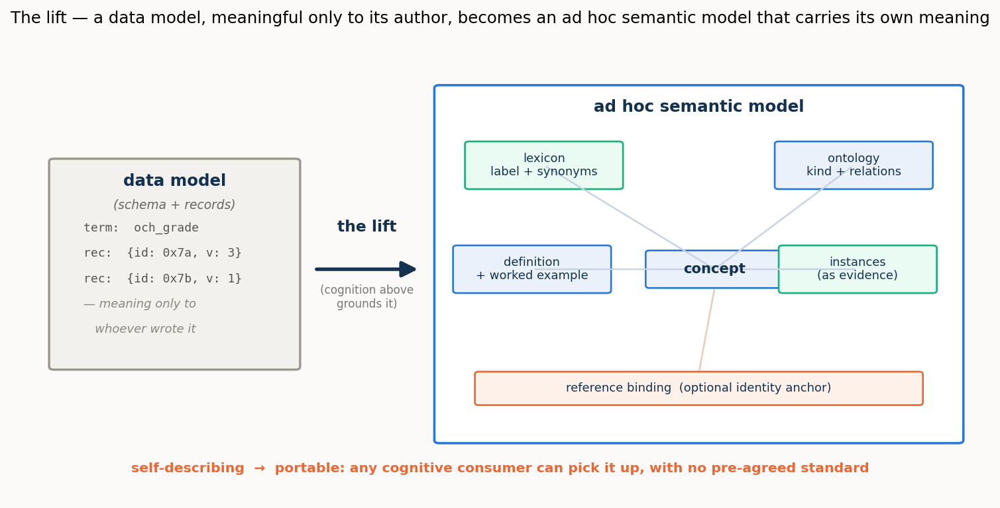
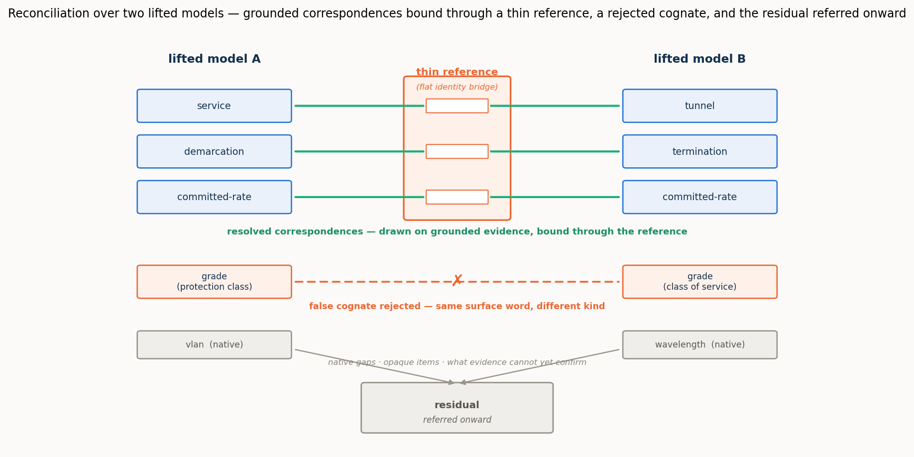

# Ad hoc semantic reconciliation by cognitive agents

> *Programme status — **complete**. Four operational settings — configuration, intent,
> cross-domain, and observability — are built, run, and reported, and a **master report** draws
> them into one synthesis. This repository holds the harness, the benchmark, the per-run data, and
> the reports.*

Two software systems that must exchange information rarely share a model of the world — of the same
domain, or of adjacent domains that must connect. The classical remedy is a standard agreed in
advance. This programme investigates the alternative that opens up once the systems on each side can
**reason**: they reconcile their divergent models **ad hoc**, for the occasion, machine-to-machine,
with no standard settled beforehand. It builds a measured harness in which the reconciling parties are
language-model agents, scores every reconciliation against a validated gold standard, and varies one
master control — **where the cognition sits**, from two live reasoning agents through one inert to
both inert.

The central finding, established across all four settings: **it is cognition that completes a
reconciliation.** Descriptor methods — matching names, then names plus a gloss — carry it to a ceiling
and stop, historically leaving the rest to a standard or a person. Where both systems can reason, the
remainder is closed **autonomously**, with no model agreed in advance and no human in the loop, and
only as cognition recedes does a residual have to be referred onward. A thin, published **reference**
can substitute for cognition or supply an inert side the information it lacks — but it reaches
information and stops at authority. And the **pragmatic** layer — what a reconciled thing is *for*,
whether it matters, who decides — is the frontier the descriptor methods never reach: decisive for
meaning, and itself bounded by the agent's capability.

## Start here — the master report

**[reports/MASTER_REPORT.md](reports/MASTER_REPORT.md)** — the synthesis that sits atop the four
settings: the idea (the lift, portable semantic models, the cognition spectrum, the thin reference),
each setting distilled to its essentials, and the findings gathered so they can be read as one result,
with two tables mapping every finding to the process stage it acts on.





## The four settings

Each setting takes the same frame to a new operation. The full evidence for each is in its report; the
master report distils all four.

**1/4 · [reports/REPORT_1of4_configuration.md](reports/REPORT_1of4_configuration.md) — Configuration:
two standard models of one network.** The founding setting. ONF **TAPI** ↔ IETF **TEAS/ACTN** describe
one optical transport network in different vocabularies, seeded with false cognates and opaque items.
It establishes the concept and the frame, and shows the thin reference **substituting for cognition**
(deliberation collapses one-to-two orders of magnitude for a capable agent, the reconciliation perfect
and verified), the benefit **capability-dependent**, verification catching the traps, and work scaling
**linearly** with a reference against quadratically without. Its four schema/instance/verification
sub-studies are folded into the report and preserved as method notes under `notes/studies/`.

**2/4 · [reports/REPORT_2of4_intent.md](reports/REPORT_2of4_intent.md) — Intent: refinement,
negotiation, and a service that renegotiates itself.** A customer's intent (bounds on bandwidth,
latency, availability, protection) reconciled against an operator's catalogue by **refinement**, not
equivalence. Verification becomes a **satisfaction** check; a two-sided **negotiation** appears; the
**pragmatic** operation enters as a portable **movable policy**; and the exchange **recurs across a
service's life**. With both agents live the negotiation completes autonomously; a **pre-placed policy**
pushes the hand-off boundary outward; and the reference is shown to reach **information but not
authority**. Grounded in the IRTF NMRG draft *draft-janz-nmrg-naas-agentic-negotiation*.

**3/4 · [reports/REPORT_3of4_cross_domain.md](reports/REPORT_3of4_cross_domain.md) — Cross-domain:
reconciling with no public standard.** Two **home-grown, private** models — a transport OSS (Meridian)
and an IP/VPN controller (Cascade) — meet at one seam, with no standard beneath either. The central
result is a **mirror**: without the constructed reference the strong agent **under-commits** (defers at
perfect precision) and the weak agent **mis-commits** (binds wrongly). A single descriptive field
unlocks a capable agent; a bare shared pointer is worse than nothing. Building the shared ground is the
work.

**4/4 · [reports/REPORT_4of4_observability.md](reports/REPORT_4of4_observability.md) — Observability:
an alarm is not an anomaly.** A legacy fault manager and an IETF **NMOP** agent (RFC 9940) reconcile
two observability worlds, carrying the programme's deepest false cognate (alarm↔anomaly) and a
one-to-many decomposition. The ontological cognate is a three-rung **capability gradient** the RFC 9940
reference rescues for the mid agent; the **pragmatics carry the operative verdict** (act/watch/suppress)
but only for an agent able to carry them; and **correlation** — a structural pragmatic — is robust
across the whole ladder. Meaning and significance are separable, both necessary, each gated in its own
way.

The reconciling agents are one **model ladder** for the whole programme: `gpt-5.6-sol` (**strong**),
`gpt-5-mini` (**mid**), `gpt-5-nano` (**weak**) — "sol / mini / nano" — chosen so the ladder isolates
model strength rather than provider or architecture.

## How it works

The **lift** is the move from a *data model* — a schema and its records, meaningful only to whoever
wrote it — to a *semantic model*: the same elements given grounded meaning, so each concept carries a
lexicon (labels and synonyms), an ontology (its kind and relations), definitions and worked examples,
and concrete instances as evidence, with an optional binding to a shared reference. Being
self-describing, a lifted model is **portable** — any cognitive consumer can pick it up with no
pre-agreed standard. A cognitive side lifts and explains itself; an inert side is lifted by the agent
that reads it. Reconciliation runs over these lifted models, not over labels.

A **case** is two lifted semantic models plus a gold standard *derived from the models and validated*,
so it cannot drift. A **reasoning stack** reconciles them — deterministic controls (a reference-blind
matcher, a reference-aware reconciler) and a language-model agent run at each point on the **cognition
spectrum** (both live, one inert, both inert). The **harness** scores the output against the gold and
records quality — *precision* (of what it proposes, the fraction correct), *resolved fraction* (of the
true correspondences, the fraction committed), *surviving false cognates* (traps taken), and the
*residual* (what it refers onward) — and, for the agent, cognitive effort (reasoning tokens, latency).
A resolved fraction below one is deferral, not error: the residual is the shortfall from full
cognition's reach, and it grows as cognition recedes.

## Repository layout

```
README.md                     this file
reports/                      the deliverables
    MASTER_REPORT.md              the synthesis — start here
    REPORT_1of4_configuration.md  setting 1 · configuration (TAPI ↔ TEAS)
    REPORT_2of4_intent.md         setting 2 · intent (refinement, negotiation, lifecycle)
    REPORT_3of4_cross_domain.md   setting 3 · cross-domain (standard-free)
    REPORT_4of4_observability.md  setting 4 · observability (alarm ≠ anomaly)
notes/
    studies/                  setting-1 method notes (lift baseline, reference anatomy,
                              instance disambiguation, verification modes)
    design/                   design notes of record, per setting
    archive/                  superseded working notes
    SETUP_OPENAI.md           how to supply the API key (kept out of the repo)
figures/                      all report figures (regenerated by pipeline/figures*.py)
src/reconcile/                the harness: models, reference, metrics, stacks, oracles
benchmark/                    case builders and cases/ (two lifted models, reference, traps, gold)
results/                      the exact per-run data behind every figure and table
pipeline/                     all runner, figure, and build scripts
tests/                        offline tests of the stacks and scoring (no API)
pyproject.toml
```

## Quick start

The controls, gold derivations, offline tests, figures, and PDF build run with no model access
(standard-library Python plus `matplotlib`/`markdown`/`wkhtmltopdf` for figures and PDFs). The
language-model runs need `openai` and an API key — see [notes/SETUP_OPENAI.md](notes/SETUP_OPENAI.md) —
and reach `api.openai.com`, so they are run where that is available (not the study's cloud sandbox).

```bash
# deterministic, no API:
python pipeline/run.py --case config_big_hard --no-write     # controls only
python pipeline/scaling.py --max-n 12                         # the scaling result
python -m pytest tests/                                       # offline tests
python pipeline/figures_master.py                             # regenerate the master figures
python pipeline/build_pdfs.py                                 # rebuild every report PDF

# the language-model studies (need OpenAI; run where api.openai.com is reachable):
python pipeline/run.py --case config_big_hard --agent --trials 4 \
  --placement both_cognitive,one_inert,both_inert \
  --model gpt-5.6-sol,gpt-5-mini,gpt-5-nano
python pipeline/intent_study.py     --model gpt-5.6-sol,gpt-5-mini,gpt-5-nano
python pipeline/pragmatics_study.py --model gpt-5.6-sol,gpt-5-mini,gpt-5-nano
python pipeline/observability_study.py --model gpt-5.6-sol,gpt-5-mini,gpt-5-nano
```

Per-setting run commands are in each report's Reproducibility section, and the method notes under
`notes/studies/` carry the schema/instance/verification sub-study commands.

## Grounding and scope

The programme operationalizes and empirically tests ideas from the IRTF NMRG work on agentic
network-as-a-service negotiation (*draft-janz-nmrg-naas-agentic-negotiation*), the cross-domain
provisioning demonstration, and the IETF NMOP anomaly/alarm model (RFC 9940). The claims are
**existential and mechanistic** — *this is how ad hoc reconciliation works, and here it is working* —
established on single, seeded cases built to exercise each mechanism and prove each trap, across the
model ladder; they are not population estimates. Natural next steps are larger and more varied cases,
more rungs on the ladder, and the end-to-end construct-then-bind protocol in the standard-free setting.

*Choose a license before publishing.*
