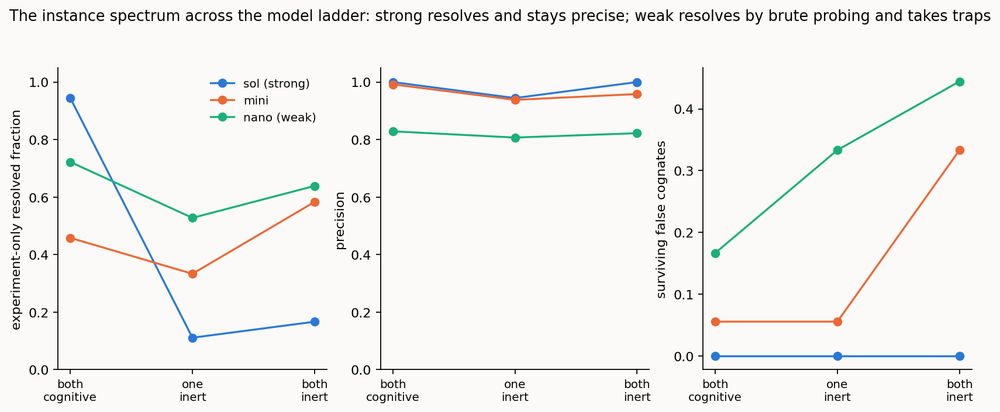

# Instance disambiguation across the cognition spectrum: interrogation, virtual manipulation, and the resolvability shortfall made structural

> *Repo-only **method note** behind setting 1 (configuration). Its essential findings are folded into the setting report [../REPORT_1of4_configuration.md](../../reports/REPORT_1of4_configuration.md); this note carries the full method, per-condition results, and reproduction commands. It is not one of the four setting reports.*

> **Status: complete.** Results and discussion below. Reuses the framework, harness
> architecture, and metrics of [../REPORT_1of4_configuration.md](../../reports/REPORT_1of4_configuration.md); read that first for the
> semantic-model definition, the cognition spectrum, and the resolvability argument this
> study sharpens. It executes the design in
> [DESIGN_instance_disambiguation.md](../design/DESIGN_instance_disambiguation.md).

## Summary

The schema-term studies ([../REPORT_1of4_configuration.md](../../reports/REPORT_1of4_configuration.md), [reference-anatomy.md](reference-anatomy.md),
[lift-baseline.md](lift-baseline.md)) reconcile the *vocabulary* of two models —
which type denotes the same type as which. This study turns to the **instance level**:
co-reference of *individuals* across two populated graphs — is this ROADM the same device as that
te-node, this ODU2 service the same as that te-tunnel. It is a different problem on a different
path: entity resolution over keys, attributes, and topology, and — for the genuinely hard cases —
over evidence that exists *only* by acting on the live system.

Two things make it worth its own study, and both are demonstrated here. First, **the cognition
spectrum bites harder** at the instance level: some individuals are distinguishable only by an
authoritative probe or a decisive experiment, and that class of evidence is gated by live
cognition, so the residual-as-shortfall pattern of the schema study becomes *structural* — a
definable subset of individuals is unresolvable the moment a side goes inert, at any effort.
Second, the paper's collective machinery is exercised *together*: static evidence for the easy
merges, **interrogation** for individuals whose static records are identical, and a **virtual
manipulation** (provision-and-read-back against semantic invariants) to confirm service
correspondences and to refute look-alikes. This report is as much a demonstration of those means
working in concert as it is a measurement of them.

The findings. **A capable agent reconciles the populated graphs correctly and works the oracle to
do it** — at full cognition it interrogates the ambiguous individuals, provisions to confirm and
to refute, resolves every planted trap, and leaves only the true native gaps residual (precision
1.00, experiment-only resolved fraction 0.94, zero surviving false cognates). **Resolution-complete-in-
principle becomes a measured curve**: give the agent more probe budget at full cognition and the
experiment-only cases resolve monotonically (0.00 → 0.38 → 1.00, residual → 0); take one side
inert and the *same unbounded budget* barely moves it (→ 0.08), because the inert side cannot be
interrogated. The shortfall stops being a matter of effort and becomes structural exactly when
cognition recedes. **Capability governs how the shortfall is paid**: the strong agent
resolves what it can and defers the rest at perfect precision and no traps; the weaker agents
trade precision for reach — taking the planted traps as the oracle is lost and, tellingly, no less
confident on a wrong merge than on a right one — with the weakest probing hardest of all yet paying
for it in precision and surviving false cognates. As at the schema level, the live-cognition
machinery's correctness value concentrates where cognition is weakest, and how the residual is *closed* tracks the
placement: more deliberation and probing between two live agents, human effort or external
verification once a side is inert. That the residual reaches zero at full cognition by the
machine's own probing - not by agreement and not by a human - is the instance-level evidence
for the programme's central claim: where the cognition is present to complete it, ad hoc
reconciliation completes autonomously.



---

## 1. The question, and why the instance level is different

The main study established that the *placement* of cognition governs what reconciliation can
resolve — complete in principle between two fully-cognitive agents, with a growing residual as
cognition recedes. Those results are about the schema. Real interoperation also requires aligning
the **individuals** the schemas classify, and that is a different failure surface. A schema type
can usually be reconstructed from what is statically on the page — its structure and its instances
— so for schema terms the virtual experiment is a confirmation, not the only route. Instance
co-reference is not like that. Two structurally identical devices, or an individual with no shared
key, are separable *only* by an active query against the live system (an authoritative serial) or
a decisive experiment (provision a service and read which real object lights up). That evidence is
available only under live cognition, so the shortfall from full cognition is not merely present at
the instance level — it is **structural and unavoidable** for a definable subset of individuals.
That is the sharper claim this study is built to test.

## 2. The case

A purpose-built populated OTN-over-optical network — 12 individuals on the TAPI side, 13 on the
TEAS side — laid over the *already-reconciled* TAPI/TEAS types of the first case, so the "schema
already reconciled" premise holds and continuity with the programme's setting is preserved
([benchmark/cases/instance_hard](../../benchmark/cases/instance_hard)). Ground truth is a hidden
`_truth` entity id on each individual, never shown to the agent, so the gold cannot drift and the
opaque **key** stays a piece of *evidence* rather than the answer. The case comes to 11 true
correspondences, 3 native gaps, and 2 instance false cognates, with 4 of the 11 correspondences
flagged **experiment-only** — genuinely unresolvable from static evidence, as the derivation
proves (a same-type, same-attributes, same-topology, keyless twin exists on both sides, and the
oracle holds the one authoritative fact that separates them). The five trap classes:

- **Merge targets** — the same device under different local names (`R1`/`roadm-1`, keyed);
  resolvable statically.
- **Structurally-symmetric pair** — `R2`,`R3` vs `nodeB`,`nodeC`: identical type, attributes, and
  neighbour set, no key; separable only by an interrogated **serial**. Experiment-only.
- **Keyless-ambiguous pair** — two OMS sections, static twins separable only by an interrogated
  **fibre-id**. Experiment-only.
- **Instance false cognates** — two devices both named `R1` (different real devices); two services
  both named `svc-100` with different endpoints and capacity, so a virtual provision *refutes* the
  merge on the capacity/endpoint invariant.
- **Native gaps** — one-sided individuals, correctly residual.

The oracle's ground truth — the serials, the fibre-ids, and the per-service **semantic-invariant
signatures** (endpoint identity, capacity, layering, multiplexing, switching, protection) — lives
outside the individuals, so a static agent cannot read what only a live probe or manipulation
should reveal. The derivation validates all of this and refuses an inconsistent case (it rejects,
for instance, an experiment-only entity handed a key, or a false cognate that secretly shares a
truth).

## 3. Method

**The agent acts on the graph.** Unlike the schema stack (one prompt in, an alignment out),
instance co-reference runs as a **bounded tool-use loop**: the agent proposes, and where a side is
live it may call the oracle, until it submits an alignment. The oracle is a deterministic function
over the case — never an LLM — and offers the paper's two live-cognition acts, each call counted:

- **interrogate(individual, attribute)** — one authoritative fact about a live individual (a
  serial, a fibre-id). Evidence-gathering; it is what separates two individuals whose static
  records are identical.
- **virtual_provision(a, b)** — exercise a candidate correspondence by provisioning a service
  through it and reading the objects back, **confirming or refuting it against the semantic
  invariants**. The correctness-by-construction step; it settles service correspondences and
  catches same-name-different-service look-alikes.

Availability follows the placement (the oracle enforces it): at **both_cognitive** both sides are
live; at **one_inert** only the live side answers; at **both_inert** the oracle is unavailable and
the agent proposes from static evidence alone. Every decision carries a **confidence**, and an
individual whose identity cannot be settled is **referred onward** (left residual) rather than
guessed — the propose→verify→refer discipline, mirroring the schema study's proposal-then-
verification. The evidence each individual exposes (name, key, attributes, topology) is masked in
a factorial to measure which static evidence carries the weight, and the reference is run in three
variants (none / instance-key / invariant). Correctness is the currency — instance precision and
resolved fraction, surviving instance false cognates, the residual broken out by cause (native gap vs
experiment-only), and, uniquely to this task, the **interrogation and manipulation counts** as
effort. Reasoning tokens are recorded but not used to rank.

A methodological note kept in view throughout: the weak model, handed the oracle, is prone to
long probe sprees, and an early version of the loop capped turns too tightly, so it sometimes ran
out of turns before submitting — biasing precisely the both_cognitive cell where the oracle story
lives. The cap was raised and the affected runs re-run; the comparison below is on a matched
ladder (identical evidence cells, identical generous oracle budget, identical turn cap) so no
placement or capability contrast is confounded by run mechanics.

## 4. A worked reconciliation: the means in concert

Before the aggregates, one run shown in full — the strong agent at both_cognitive, which is the
cleanest picture of the machinery working together. From the transcript
([results/instance_transcripts](../../results/instance_transcripts)):

1. It **interrogates the four symmetric-node serials** — `R2`→SN-0022, `R3`→SN-0033, `nodeB`→
   SN-0022, `nodeC`→SN-0033 — and matches by serial: `R2`↔`nodeB`, `R3`↔`nodeC`. The static
   records were identical; the authoritative fact separates them.
2. It **interrogates the four OMS fibre-ids** and breaks the keyless pair the same way.
3. It runs **virtual provisions to confirm** the two real services (`cs-a1a3-odu2`↔`tunnel-1`,
   `cs-a2a3-odu0`↔`tunnel-2`) — invariants preserved in place.
4. It runs a **virtual provision on the `svc-100` look-alike and it is refuted** — the read-back
   shows diverging capacity (ODU1 vs ODU0) and endpoints, so the two are not the same service.
5. It **submits 11 correct correspondences** and leaves exactly the three native gaps residual
   (the two `svc-100`s and the second `R1`), never proposing the `R1` name-collision.

Eight interrogations and three provisions, precision 1.00, resolved fraction 1.00, experiment-only resolved fraction
1.00, zero surviving false cognates. Nothing in that result comes from a single mechanism: the
easy merges are static, the symmetric and keyless pairs are interrogation, the services are
virtual manipulation, and the name traps are caught by manipulation and by structure. The same
run at **one_inert** makes three probe calls and then stops short — it interrogates the live side
but the inert side cannot answer, so the symmetric and keyless pairs cannot be *compared*, and the
agent correctly refers them onward (experiment-only resolved fraction 0.00). At **both_inert** it makes no
probe calls at all. The mechanism is the same across the spectrum; what changes is how much can be
confirmed, and by whom.

## 5. Results

### 5.1 The spectrum across the model ladder

On the matched ladder (six evidence conditions × three placements × three-to-six trials, generous
bounded oracle budget), the three models trace the same spectrum with sharply different fidelity.
Mean over the ladder, by placement:

| model | placement | precision | resolved frac. | exp-only resolved frac. | surv. FC | conf(wrong) |
|-------|-----------|:---:|:---:|:---:|:---:|:---:|
| `gpt-5.6-sol` | both_cognitive | 1.00 | 0.94 | **0.94** | 0.00 | — |
| | one_inert | 0.94 | 0.61 | 0.11 | 0.00 | — |
| | both_inert | 1.00 | 0.67 | 0.17 | 0.00 | — |
| `gpt-5-mini` | both_cognitive | 0.99 | 0.70 | 0.46 | 0.06 | 0.95 |
| | one_inert | 0.94 | 0.69 | 0.33 | 0.06 | 0.95 |
| | both_inert | 0.96 | 0.80 | 0.58 | 0.33 | 0.93 |
| `gpt-5-nano` | both_cognitive | 0.83 | 0.76 | 0.72 | 0.17 | 0.93 |
| | one_inert | 0.81 | 0.59 | 0.53 | 0.33 | 0.89 |
| | both_inert | 0.82 | 0.76 | 0.64 | 0.44 | 0.93 |

**Capability is the whole story.** Handed the same oracle at both_cognitive, `gpt-5.6-sol` wrings
full resolution from it (experiment-only resolved fraction 0.94) at perfect precision and zero traps;
`gpt-5-mini` gets about half (0.46), lets a trap through occasionally, and — the sharpest number —
is **confident on its wrong merges** (mean confidence 0.95 on incorrect correspondences, against
its correct ones). `gpt-5-nano` completes the ladder, but not by a clean continuation of the same
line: it probes hardest of the three (≈8.7 interrogations at both_cognitive) and so resolves a
*larger* share of the experiment-only cases than mini (0.72), yet it pays for that reach in
precision (0.83) and in the highest surviving-false-cognate rate on the ladder (0.17 at
both_cognitive, rising to 0.44 at both_inert once the oracle is gone), and it too is as confident on
a wrong merge as on a right one (0.93 either way). The gradient is monotone where it matters most —
in **precision and trap-avoidance** (1.00/0.00, 0.99/0.06, 0.83/0.17 down the ladder at
both_cognitive); it is *not* monotone in experiment-only resolved fraction, because the weak model compensates
for weaker judgement with heavier probing, buying resolution back at a precision cost the strong
model never pays.

Two qualitative contrasts hold across the ladder and matter more than any single number. First,
**the strong agent defers where it cannot resolve; the weaker agents guess.** sol keeps precision
1.00 and simply leaves the experiment-only cases residual when it cannot compare them; mini's
experiment-only resolved fraction is *nonzero* at the inert placements (0.33–0.58) but bought with lower
precision and more traps — it proposes and sometimes lands by luck. The strong model's shortfall
is honest deferral; the weaker model's is confident error. Second, **the virtual manipulation is a
trap-guard whose value grows as cognition weakens.** Surviving false cognates rise as the oracle
is lost — mini 0.06 → 0.06 → 0.33 across the spectrum — because with the oracle available the
agent provisions the `svc-100` look-alike and refutes it, and without it takes the bait. The
error-prevention value of live cognition concentrates exactly where it is scarcest.

### 5.2 The resolvability curve: budget-limited versus structural

The clearest statement of the sharper claim comes from sweeping the oracle budget for the strong
agent. At **both_cognitive** the residual is *budget-limited* and drives to zero; at **one_inert**
it is *structurally* limited and no budget helps:

| oracle budget | both_cognitive exp-only resolved frac. | one_inert exp-only resolved frac. |
|---------------|:---:|:---:|
| 0 (no oracle) | 0.00 | 0.00 |
| 3 (bounded) | 0.38 | 0.00 |
| unbounded | **1.00** | **0.08** |

At both_cognitive, "resolution complete in principle with full cognition" is a *measured curve*:
give the agent more probes and the experiment-only cases resolve monotonically (0.00 → 0.38 →
1.00), residual → 0. At one_inert, the same unbounded budget barely moves it (→ 0.08) — because
you can interrogate the live side but the inert side cannot answer, so the symmetric and keyless
pairs cannot be compared at any budget. The shortfall stops being a matter of effort and becomes
structural the moment a side goes inert. Precision stays 1.00 and surviving false cognates 0
across every cell — it never buys resolution with error.


### 5.3 Which evidence, and which reference

Two supporting results, from the full evidence factorial (sol, mini) and the reference-variant arm.
On the static side, **topology and the key carry the easy merges**; masking the name (the trap
surface) removes the false-cognate risk but not the correspondences, and the surviving-false-cognate
rate rises in the masked, low-evidence cells — the same "names are the trap, structure is the
signal" pattern the schema studies found, now at the A-box. On the reference, both `instance` (a
published key table) and `invariant` (published service-invariant signatures) leave a capable
agent essentially unchanged, and — by construction — neither recovers the experiment-only cases in
this case, because those are keyless devices and sections, resolvable only by interrogation, which
no published anchor supplies. The invariant reference's *checking* role — provision on the live
side and confirm against a published invariant when the other side is inert — is the province of
the verification study ([verification-modes.md](verification-modes.md)), where it is exercised
directly; here it is noted and deferred.

### 5.4 Honest notes on method

Three, in the spirit of the earlier reports' integrity checks. (i) The weak model's tendency to
over-probe exposed a turn-cap that was too tight; it was found, raised, and the affected runs
re-run, so the reported numbers are not depressed by runs that never submitted — but the
*tendency itself* (a weak agent, handed tools, thrashing rather than converging) is a real
capability signal worth naming. (ii) The full evidence factorial was run at both_inert but a
reduced ladder at the live placements; all cross-placement and cross-model comparisons here are on
the common ladder, so the mix of evidence cells never confounds a spectrum claim. (iii) nano was
run at three trials and a generous bounded oracle budget for tractability; the sol and mini
comparisons it is set against use the identical matched conditions.

## 6. Discussion

The instance level sharpens the programme's central law and shows its machinery whole. Where the
schema study found a residual that *grows* as cognition recedes, the instance study finds a
residual that becomes *structural*: for the experiment-only individuals, no amount of effort at
one_inert or both_inert will close the gap, because the decisive evidence exists only by acting on
a side that has gone silent. The resolvability curve makes the two regimes concrete side by side —
budget-limited under full cognition, structural under partial — and that distinction is the
instance-level form of the paper's residual-as-shortfall.

Two threads tie back to the rest of the programme. First, **the division of labour between static
evidence and live cognition is visible in the probe counts**: the interrogation count is not
overhead but a readout of where static evidence ran out and live cognition took over — heavy at
both_cognitive on exactly the symmetric and keyless individuals the case was built around, zero
where no live side can be asked. Second, **how the residual is closed tracks the placement of
cognition**, exactly as in the reconciliation studies: between two live agents the residual closes
with more cognition — more deliberation and probing; once a side is inert it can only close through
human effort or external verification. The residual does not vanish as cognition recedes; its cost
shifts from machine deliberation to human adjudication.

And the capability gradient carries the same lesson the reference and lift studies did, now for the
oracle: the live-cognition machinery is most valuable where cognition is weakest, and hardest to
use well there. A strong agent barely needs a trap-guard and defers cleanly when it must; a weak
agent needs the guard most, uses it least effectively, and — most cautionary — cannot be trusted by
its own confidence, since it is as sure of its wrong merges as of its right ones. What a capable
agent leaves as an honest residual, a weak one submits as a confident error.

This study assumed the schema already reconciled and scored *concept-consistent* individual
correspondences; the joint problem — reconciling schema and instances together, each tentatively
informing the other — is the natural next step. And verification, exercised here only as the
oracle's confirm/refute, is taken as its own object in the companion study
([verification-modes.md](verification-modes.md)).

## 7. Reproducibility

The case, its gold, and the oracle are built and validated deterministically; only the agent runs
call a model.

```bash
python benchmark/build_instance_case.py          # the populated A-boxes, traps, references
python benchmark/derive_instance_gold.py          # derive + validate the gold from hidden truth
python tests/test_instance_loop.py                # offline test of the tool-use loop (no API)

# the study (needs OpenAI; runs where api.openai.com is reachable):
python pipeline/instance_reconcile.py --stage 1lite --model gpt-5.6-sol,gpt-5-mini,gpt-5-nano \
  --trials 3 --budget 12 --save-transcripts       # the matched spectrum ladder
python pipeline/instance_reconcile.py --stage 1  --model gpt-5.6-sol,gpt-5-mini   # the full evidence factorial
python pipeline/instance_reconcile.py --stage 2  --model gpt-5.6-sol,gpt-5-mini   # reference variants
python pipeline/instance_reconcile.py --stage 3  --model gpt-5.6-sol              # the oracle-budget sweep
python pipeline/figures_instance.py                        # the figures
```

Each run writes a per-model CSV under `results/` with en-route row-by-row capture and resumes by
default; a representative transcript per placement is saved under `results/instance_transcripts/`.
