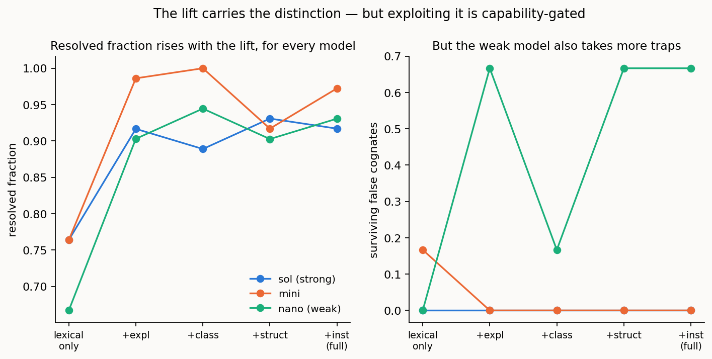

# The pre-lift lexical baseline: what the lift buys over matching lexica

> *Repo-only **method note** behind setting 1 (configuration). Its essential findings are folded into the setting report [../REPORT_1of4_configuration.md](../../reports/REPORT_1of4_configuration.md); this note carries the full method, per-condition results, and reproduction commands. It is not one of the four setting reports.*

> **Status: complete.** Results and discussion below. Reuses the harness, the hard TAPI/TEAS
> case, and the metrics of [../REPORT_1of4_configuration.md](../../reports/REPORT_1of4_configuration.md); the motivating observation comes from the
> reference-anatomy study ([reference-anatomy.md](reference-anatomy.md) §2.2).

## Summary

The main study reconciles two *lifted semantic models*; a classical matcher reconciles two
*lexica*. This study measures the gap between them by stripping each concept back to its lexical
surface — its label and synonyms — and restoring the lift's knowledge one layer at a time: the
concept's own explanation, its shallow class, its structural relations, and its instances. It is
the mirror of the reference-field ablation, one layer down: there we masked the *reference
entry's* fields; here we mask the *model concept's* own fields. Because it includes the
label-only versus label-plus-gloss contrast that lexical-match evaluations report, it also makes
this work directly comparable to that literature — and then adds the dimension those evaluations
do not vary: the structure and instances of the lift.

**What "lift" means.** A *data model* is a schema and its data — terms, structure, and records
as they sit in a system, meaningful to whoever wrote the schema but carrying no explicit meaning
of their own. The **lift** is the move from that to a *semantic model*: the same elements given
grounded meaning — a lexicon (preferred labels and synonyms), an ontology (each term's kind and
its relations to the others), definitions and worked examples, and the concrete instances read as
evidence of meaning rather than as mere records. In this harness a lifted concept therefore
carries its label + synonyms, a shallow class, structural relations, instances, and — where a
side is cognitive — its own gloss and worked example; a cognitive side lifts and explains itself,
while an inert side is lifted by the agent that reads it (the framing of [../REPORT_1of4_configuration.md](../../reports/REPORT_1of4_configuration.md)
§2.2). This study runs that process in reverse: it begins at the **pre-lift lexical surface** —
labels and synonyms only, the terms as a classical matcher would see them — and restores the
lift's layers one at a time, so each layer's contribution can be read off directly.

**The clean result is that the lift is the lever.** Matching on the lexical surface alone leaves
a quarter to a third of the correct correspondences on the table (*resolved fraction* — the fraction of the
true correspondences the agent actually finds — 0.66–0.76), and restoring the lifted content
recovers them (resolved fraction 0.92–0.97) for every model on the ladder. (Resolved fraction short of 1.0 is not a
failure; the unresolved remainder is the *residual*, deferred rather than mismatched — see §3.) The
single largest step is the first one — giving a concept its own explanation — with class,
structure, and instances adding smaller increments on top. Pure lexical matching, however much
explanatory gloss is bolted on, is not enough; the reasoning happens over the lifted model.

**But the same content that recovers the resolved fraction can cost precision at the weak end — and this is
worth stating plainly, not burying.** The weakest model looks *safest* on the bare lexical
surface (it takes no false cognates at all there) — but only because it is too conservative to
propose much, and that apparent safety is an artifact of its low resolved fraction. As the lift is restored the weak
model resolves more *and* takes more traps: its instances, in particular, are toxic to it
(instance content doubles its trap survival, and instances-alone drives surviving false cognates
to 1.0 at 0.77 precision), because it over-trusts a shared instance token as evidence of
identity. For the capable and mid models the very same instances are safe or protective. So the
lift is unambiguously the lever for *resolved fraction*, and unambiguously good for the strong agent on
every axis; but feeding a weak agent the richer content it needs to find correspondences also
hands it more surface to misfire on. The lift is necessary; exploiting it safely is
capability-gated.

---

## 1. The question

Two questions, one nested in the other:

1. **What does the lift buy?** How much of correct reconciliation — and, sharply, how much of
   *defeating the planted false cognates* — comes from the lift's non-lexical content (class,
   relations, instances) as opposed to the lexical surface a classical matcher would use?
2. **Where does explanatory support sit?** A gloss attached to a term is the "explanatory
   support" that lexical-match studies toggle. Does it help, and does it help *as much* as the
   lift's structure and instances?

The answer bears on a practical caution: one should not attempt to reconcile by matching lexica
in isolation, however much explanatory text is bolted on.

## 2. Design

The same hard TAPI/TEAS reconciliation and gold as the main study, but the **content of each
concept** is masked to a chosen subset of its lifted fields before the agent sees it. The
always-present base is the concept's lexical identity (label + synonyms) — a term must at least
be nameable, and the label is also the trap surface. The layers added on top are the factors:

| factor | concept fields it turns on |
|--------|-----------------------------|
| explanation | the concept's own gloss + worked example (its self-explanation) |
| class | the shallow kind |
| structure | the structural relations to other concepts |
| instances | the concrete instances (A-box data) |

The full $2^4 = 16$ subsets give each layer's main effect and the interactions. Two readings
fall out: the **cumulative ladder** (lexical-only → +explanation → +class → +structure →
+instances), which shows where the false cognate is defeated and how large each step is; and the
**lexical-match slice** (lexical-only versus lexical+explanation), the direct analogue of a
with/without-explanatory-support evaluation.

Content-masking and inertness are separate axes, so the runs are at **both-cognitive** — the
clean lexical-match analogue, where the concept's own explanation is available to be masked. The
reference is held **off** in the core runs, isolating the lift's own contribution (an external
reference definition is a different source of explanatory support, studied in
[reference-anatomy.md](reference-anatomy.md); an optional `--reference` arm turns it
on). The model ladder is `gpt-5.6-sol`, `gpt-5-mini`, `gpt-5-nano`, six trials per condition.
Correctness is the currency (length-independent); reasoning tokens are recorded for description
only.

## 3. Results

**Reading the metrics.** Correspondences are scored against the gold standard (see
[../REPORT_1of4_configuration.md](../../reports/REPORT_1of4_configuration.md) §2.3). *Resolved fraction* is the fraction of the true correspondences that the agent
actually finds and commits to; *precision* is the fraction of the correspondences it proposes
that are correct; *surviving false cognates* counts the planted traps it wrongly accepts as
matches (false positives, lower is better). The correspondences it does *not* commit to make up
the *residual*.

One point must be made explicit, because resolved fraction well below 1.0 is the headline number here and
looks like a shortfall. **It is not a failure.** A resolved fraction of 0.92 does not mean 8% of the work is
wrong — it means the agent confidently resolved 92% and left the rest in the **residual**, to be
*referred onward*: settled by further exchange between the systems, by a human, or by probing the
live system, exactly as the cognition-spectrum framing intends (a reconciliation resolves what it
can and defers the rest, rather than asserting matches it cannot justify — [../REPORT_1of4_configuration.md](../../reports/REPORT_1of4_configuration.md)
§1). How that closure happens tracks the placement of cognition: between two live agents (the
fully automated case, as here) the residual closes with more *cognitive* effort — further
deliberation and exchange — whereas where a side is inert it must close through *human* effort or
external verification, since a mute side cannot be queried. The residual does not disappear as
cognition recedes; its cost shifts from machine deliberation to human adjudication. In an ad hoc reconciliation the costly error is a *wrong* commitment — a low precision or a
surviving false cognate, a silent mismatch that propagates downstream — whereas a *withheld* one
merely costs a follow-up. So the safe operating point is high precision with resolved fraction as high as the
evidence honestly supports, and the lift's contribution is read as **moving correspondences out
of the residual and into confident resolution** (resolved fraction ≈0.67 → ≈0.92) *without* giving up
precision — not as chasing a nominal 100%. A residual is expected on principle, not merely
tolerated: at the schema-term level scored here, some correspondences are resolvable only with
the instance-level or pragmatic evidence held out of scope ([../REPORT_1of4_configuration.md](../../reports/REPORT_1of4_configuration.md) §5), so full
resolved fraction was never the target.

288 runs (three models × 16 content cells × six trials, both-cognitive, reference off). Reading
the cumulative ladder — resolved fraction (higher is better) and surviving false cognates (lower is better),
mean per run:

| model | | lexical only | +explanation | +class | +structure | +instances (full) |
|-------|---|:---:|:---:|:---:|:---:|:---:|
| `gpt-5.6-sol` | resolved frac. | 0.76 | 0.92 | 0.89 | 0.93 | 0.92 |
| | surv. fc | 0.00 | 0.00 | 0.00 | 0.00 | 0.00 |
| `gpt-5-mini` | resolved frac. | 0.76 | 0.99 | 1.00 | 0.92 | 0.97 |
| | surv. fc | 0.17 | 0.00 | 0.00 | 0.00 | 0.00 |
| `gpt-5-nano` | resolved frac. | 0.67 | 0.90 | 0.95 | 0.90 | 0.93 |
| | surv. fc | 0.00 | 0.67 | 0.17 | 0.67 | 0.67 |



**Resolved fraction rises with the lift, for every model — the clean result.** At the lexical surface alone
the agents recover only two-thirds to three-quarters of the correct correspondences (resolved fraction
0.76 / 0.76 / 0.67 down the ladder). Restoring the lifted content lifts them to 0.92 / 0.97 /
0.93. The largest single step is the first — giving a concept its own **explanation** (its gloss
and worked example) — which alone carries resolved fraction most of the way; class, structure, and instances
then add smaller increments. Pure lexical matching leaves roughly a quarter of the alignment
undiscovered, and no amount of the label alone fills that in. This is the baseline confirmation
of the whole programme's premise: the reasoning runs on the lifted model, not on the lexicon.

**Lexical-only "safety" at the weak end is an artifact.** Precision at the lexical surface is
deceptively high (sol 0.99, mini 0.89, nano 0.95) and nano takes *no* false cognates there — but
only because low resolved fraction means it barely proposes the risky pairs. The lexical-only failure mode
is **missing** correspondences, not false ones (except mini, which takes the same-type trap 1/6
of the time even here). Read alone, "lexical-only, zero false cognates" would flatter lexical
matching; read with its resolved fraction of 0.67 it is plainly conservatism, not competence.

**The honest twist: the content that recovers the resolved fraction can cost the weak model precision.** As the
lift is restored, nano's resolved fraction climbs from 0.67 to ~0.93 — and its surviving false cognates
climb with it, from 0.00 to 0.67. The mechanism is the **instances**: instance content is the
single most damaging layer for nano (its main effect on surviving false cognates runs 0.35 →
0.71, a doubling), and the instances-alone cell (lexical + instances, no explanation, class, or
structure) is the worst condition in the study for nano at surviving false cognates **1.00** and
precision **0.77**. The weak model reads a shared instance token as evidence *for* identity — the
opposite of what the instance is meant to establish. Crucially, this is capability-specific: for
mini the same instances *help* (surviving false cognates 0.08 → 0.02, resolved fraction 0.92 → 0.97), and
for sol they are neutral. So the lift is the lever for resolved fraction universally and is safe-to-helpful
for capable agents, but for a weak agent the richer content is a double-edged instrument — it
finds more and misfires more.

**The lexical-match slice.** The direct with/without-explanatory-support contrast
(lexical-only versus lexical+explanation) shows explanation to be a large **resolved fraction** lever for
every model (+0.15 sol, +0.22 mini, +0.24 nano) and a precision help for the two stronger models,
but *not* a trap-defeater for the weak model (nano's surviving false cognates rise, because
explanation buys resolved fraction that exposes it to traps its conservatism had been hiding it from). An
evaluation that stopped at this slice — as classical lexical-match studies do — would see the
resolved fraction gain and miss both the further contribution of structure and instances and the weak-model
precision cost. That added dimension is the contribution here.

Predictions, in hindsight: (1) lexical-only takes the traps — **partly**: only the mid model
takes them at the surface; the weak model's low resolved fraction masks its exposure, which the lift then
unmasks. (2) explanation helps modestly — **wrong on magnitude**: explanation is the *largest*
single resolved fraction step, not a modest one. (3) the lift is the lever — **held** for resolved fraction. (4)
structure and instances partly substitute — **held** for the strong/mid models; for the weak
model instances are not a benign substitute but a hazard. (5) capability-dependent throughout —
**strongly held**, and the direction of the instance effect flips with capability.

## 4. Discussion

The baseline settles the premise the rest of the programme rests on: reconciliation is not
lexical matching. On the bare lexical surface the agents miss a quarter to a third of the correct
correspondences, and it is the lifted content — a concept's own explanation first, then its class,
structure, and instances — that recovers them. Explanatory gloss, the one extra signal classical
lexical-match evaluations toggle, turns out to be a large resolved fraction lever; but stopping there would
miss that the structural and instance layers of the lift contribute further, and would miss the
weak-model precision cost entirely.

That cost is the finding to carry forward. The lift is necessary and, for a capable agent,
strictly good; but the same content that lets a weak agent *find* correspondences also lets it
*fabricate* them, and the instances — the most concrete, most grounding layer for a strong
reasoner — are precisely where a weak reasoner is most easily fooled by a shared token. This
rhymes with the reference-anatomy result, where the shallow **class** field helped the mid model
and hurt the weak one: in both studies, more evidence is not monotonically safer as cognition
weakens, because a weak agent cannot always tell grounding from coincidence. The practical
reading is the same across both: match the evidence you supply — lift content here, reference
fields there — to the capability of the agent consuming it, and do not assume that richer input
is safer input at the weak end.

Two threads open onward. The **reference arm** (`--reference`) asks whether an external anchor can
stand in for a missing lift; and the deepest version runs the model-content mask and the
reference-field mask together, charting the whole evidence surface — the lift's own content and
the reference on top — in one design.

## 5. Reproducibility

The baseline reuses the main study's harness and the primary case; only concept content is
masked (the model-content mask in the driver), so no case files or gold standards change.

```bash
python pipeline/lift_baseline.py --trials 6                    # reference off (the core runs)
python pipeline/lift_baseline.py --trials 6 --reference        # optional reference-on arm
#   writes results/lift_baseline_config_big_hard.csv (and _ref.csv for the arm)
```

Each run prints, per model, the cumulative lift ladder and the main effect of each content
factor on surviving false cognates and precision; the per-run data are the CSV named above.
