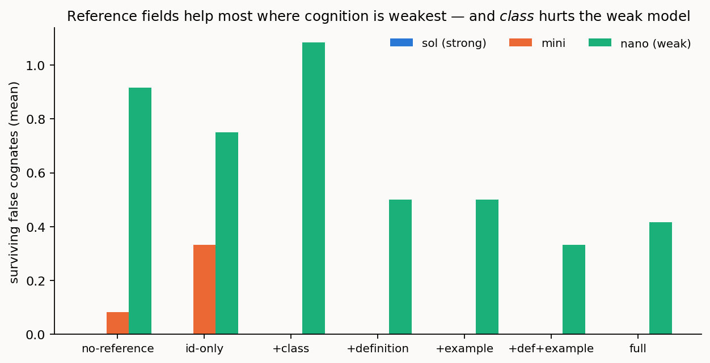

# Which parts of the reference matter? A factorial ablation of the shared reference's fields

> *Repo-only **method note** behind setting 1 (configuration). Its essential findings are folded into the setting report [../REPORT_1of4_configuration.md](../../reports/REPORT_1of4_configuration.md); this note carries the full method, per-condition results, and reproduction commands. It is not one of the four setting reports.*

> **Status: complete.** Results and discussion below.

## Summary

The companion study [../REPORT_1of4_configuration.md](../../reports/REPORT_1of4_configuration.md) treats the shared reference as one thing,
switched on or off. But the lexical reference has parts — an identity anchor (its id) plus
four descriptive elements: a preferred label and synonyms, a shallow class, a disambiguating
definition, and one canonical example. This study asks which of those parts carries the
weight, by ablating them in a full factorial and reading a correctness metric that is immune
to prompt length. It reuses the hard TAPI/TEAS case, harness, and metrics of the main study;
only the reference is manipulated.

One design subtlety shapes everything and is worth stating up front: the reference must be
anchored by an **opaque** identifier. The ids the benchmark ships are human-readable slugs
(`link-termination`, `connection-service`), and a slug *names* the concept — so with readable
ids in place, stripping the descriptive fields down to the bare id changes nothing, because
the id already says what the fields would. (That is a real if small result on its own — for a
capable agent a naming anchor makes the descriptive prose redundant — and a caution for anyone
running such an ablation: an informative identifier silently defeats it.) To measure what the
fields actually contribute, the anchor must carry no meaning, so we replace every id with an
opaque token and run across a model-strength ladder where weaker agents have the error
headroom for a field to matter.

**What the ablation finds is that there is no capability-free answer — which field matters is
set by the agent.** For the strong model the descriptive fields are moot: it lets no planted
cognate survive with the full reference, the bare id-only anchor, or no reference at all (the
fields only edge precision from 0.94 to 1.00). For the mid model any *single* descriptive field
is a clean fix — class, definition, or example each drives same-type trap survival from 0.33 to
zero, near-perfect substitutes for one another. For the weak model the fields become a
distractor: the **lexical** field (label + synonyms) helps most, definition and example help
partially, and the shallow **class** field does not help but actively *hurts* — the single worst
condition in the study (surviving false cognates 1.08, above the id-only floor), because a
class surface like `quality` versus `class` reads to a weak model as evidence for the very
cognate it was meant to block. Almost all of that danger is one same-type trap
(`signal-grade`↔`service-grade`); cross-type traps are defeated by the lift's own structure
before any reference field is consulted. The publishing lesson: a reference is a safety rail for
weaker cognition, not a semantic payload — author the lexical field and a definition/example
first, and be wary of shallow class tags, which can mislead exactly the consumers who most need
help.

---

## 1. Question

The main study establishes the framework and shows that a thin shared reference, present
versus absent, changes what reconciliation costs and gets right (see [../REPORT_1of4_configuration.md](../../reports/REPORT_1of4_configuration.md)
for the semantic-model definition, the cognition spectrum, the harness, the metrics, and the
primary results). It does not ask what *inside* the reference does the work. The reference
entry, as defined there, is:

> an identity-only anchor per concept — a stable **id**, a preferred **label** and
> **synonyms**, a shallow **class**, a disambiguating **definition**, and one canonical
> **example**.

Are all of these pulling weight, or is the reference carried by one or two of them, with the
rest redundant? That is the question. The answer bears directly on how a reference should be
authored and published: if the definition does most of the work and the example is redundant,
a publisher can spend effort accordingly.

## 2. Design

### 2.1 The factors and the full factorial

The **id** is the coreference anchor, not descriptive evidence — it is the token both sides
point at, the thing that *makes* two concepts one. So it is always present (opaque; see §2.3),
and the empty cell (no descriptive fields) is the id-only **floor**. The descriptive content
is grouped into four factors:

| factor | reference-entry fields it turns on |
|--------|-------------------------------------|
| lexical | label + synonyms |
| class | the shallow class |
| definition | the disambiguating gloss |
| example | one canonical example |

We run the full $2^4 = 16$ subsets. A full factorial (rather than a one-at-a-time sweep) buys
two things at once: each factor's **main effect** — averaged over all settings of the others —
and every **interaction**, so we can see whether, for instance, definition and example are
*substitutes* (either alone suffices; together redundant) or *complements* (neither alone
suffices; together decisive). A separate **no-reference** anchor (the reference withheld
entirely) sits below the id-only floor.

### 2.2 The evidence the agent already has: the lift, and the reference on top

A caution that turns out to be central to reading this study. The agent does **not** align two
*lexica*; it reconciles two *lifted semantic models*, and the reference is only one of the
evidence channels in play. Everything the ablation varies lives on the **reference**; the two
models' own content is always present and is never touched.

(The **lift**, in brief, is the move from a *data model* — a schema and its data, terms and
records carrying no explicit meaning — to a *semantic model*: the same elements given grounded
meaning, so that each concept carries a lexicon of labels and synonyms, a shallow class,
structural relations, and concrete instances, with a gloss and example added where a side is
cognitive; see [../REPORT_1of4_configuration.md](../../reports/REPORT_1of4_configuration.md) §2.2. It is that lifted content, not the labels, that the
ablation's fields sit *on top of*.)

Per concept, the lifted model carries — and the agent sees it even when a side is inert, since
inertness removes only the concept's *self-explanation* (its gloss, synonyms, example, and
volunteered binding) — the fields below. They are shown here on the planted false-cognate pair
`signal-grade` (TAPI) versus `service-grade` (TEAS), which share the token "grade":

- **label** (lexicon): `signal-grade` / `service-grade`. The trap surface. Always present.
- **class** (shallow kind): `quality` / `class`. Already different. Always present.
- **relations** (ontology structure): `of → optical-channel` / `of → tunnel`. Different
  attachment. Always present.
- **instances** (A-box data): `grade-A (high OSNR) on lambda1` / `gold for tunnel-a1a3-odu2`.
  Concretely different — an optical measurement versus an SLA tier. Always present.

On top of that sits the **reference entry**, whose descriptive fields are what the ablation
switches on and off: the **lexical** (its label and synonyms), the **class**, the
**definition** (a gloss the inert concept does not itself carry), and the **example** — a
second, pre-aligned statement of the same identity, external to both models.

So the two "grades" are distinguished, *in the models themselves*, by class, structure, and
instances — everything except the shared token. A reasoning agent can keep them apart from
that alone; a lexical aligner keying on the label cannot. The reference's fields are therefore
a **marginal, supplementary channel**, measured *on top of* models that already contain the
distinction — which is exactly why a capable agent needs none of them and a weak one leans on
them. Every result here must be read in that light: it is not "how much lexical support is
needed to match terms," but "how much extra anchoring a reasoning agent needs beyond what the
lift already gave it."

That consequence — reconciliation runs on the lifted models, not on lexica — is worth measuring
directly, by stripping the lift back to the lexical surface and adding its knowledge back a
layer at a time. That is a study in its own right; its design (which also reproduces the classic
lexical-match, with/without-explanation comparison and adds the structure-and-instances layer
those omit) is set out in [DESIGN_prelift_lexical_baseline.md](../design/DESIGN_prelift_lexical_baseline.md).

### 2.3 Opaque identifiers

The identifier is the anchor, not evidence — but only if it carries no meaning. A readable slug
*names* the concept, so with the benchmark's ids in place the id-only floor is not
information-free: an agent binds an inert concept to the right entry from the id string alone,
and the descriptive fields are redundant because the id already says what they would. To
measure what the fields contribute, we replace every reference id with an **opaque token**
(`e01`, `e02`, …) and remap each concept's binding to match. Now the anchor says nothing, the
id-only cell is genuinely information-free (≈ no reference), and any field that carries binding
evidence has to earn its keep. Concept ids are never touched, so the gold standard scores
identically.

### 2.4 Placements, models, trials

The descriptive fields can only matter where meaning must be *reconstructed* — the inert
placements, where the silent side carries no binding and the agent must decide which reference
entry each mute concept denotes. At *both-cognitive* the binding is pre-given (each concept
carries its ref), so the fields are expected to be inert there; a small both-cognitive control
(full, id-only, no-reference) confirms that flatness. The core runs are **one-inert** and
**both-inert**. The agent is run across the model-strength ladder — `gpt-5.6-sol`,
`gpt-5-mini`, `gpt-5-nano` — since the main study showed the strong model rarely errs even with
no reference, so a field's effect is likeliest to surface on the weaker models, which have
error headroom. Six trials per condition.

### 2.5 Measuring importance by correctness, not effort

Importance is read from **correctness** — precision (of the correspondences the agent proposes,
the fraction that are correct), resolved fraction (of the true correspondences, the fraction it finds and
commits to), surviving false cognates (planted traps it wrongly accepts, lower is better), and
the residual (the correspondences it declines to commit, deferred rather than mismatched; see
[../REPORT_1of4_configuration.md](../../reports/REPORT_1of4_configuration.md) §2.3) — and not from cognitive effort. This is deliberate. Removing a field's *information*
and removing its *text* are the same act, so a change in reasoning tokens cannot be attributed
to the field's information content rather than to the prompt simply being shorter; no
correction (filler text, a length covariate) cleanly separates the two, because a field's
length and its information arrive together. Correctness has no such problem: a field that
carries no disambiguating information cannot change precision or resolved fraction however long its text.
So importance is measured where it can be measured cleanly. Reasoning tokens are recorded, but
only as description.

Because the case is seeded with false cognates, the sharpest correctness signal is per-trap:
for each planted trap we record *which* one survived, so field importance can be attributed
mechanistically — the field whose removal lets a specific trap bind is the field that was
preventing it.

### 2.6 Pre-registered predictions

Committing before the run:

1. Definition is the workhorse — its removal most increases trap survival, especially the
   same-type trap (signal-grade vs service-grade).
2. Class blocks the cross-type trap (protection group vs role) but not the same-type ones.
3. Lexical alone (id + label + synonyms) reproduces roughly the no-reference trap problem —
   lexical surface is what the traps exploit.
4. Definition and example are partial substitutes: small individual leave-one-out effect,
   high individual sufficiency, negative interaction.
5. The id-only floor ≈ no-reference for the inert side; both-cognitive stays flat and
   near-perfect across cells.

## 3. Results

The answer is not a ranking of fields. It is that **which field matters is set by the agent's
capability**, and at the weak end one field is not merely useless but actively harmful. Across
612 inert-placement runs (three models × 17 anchor conditions × two inert placements × six
trials) the fields' effect goes from nil, to a clean fix, to a distractor, as the reconciling
agent weakens.

The picture, per model, reading surviving false cognates (mean per run; lower is better) at
four anchor conditions — the reference withheld, the id-only floor, definition+example, and the
full reference:

| model | no reference | id-only floor | def + example | full reference |
|-------|:---:|:---:|:---:|:---:|
| `gpt-5.6-sol` (strong) | 0.00 | 0.00 | 0.00 | 0.00 |
| `gpt-5-mini` | 0.08 | 0.33 | 0.00 | 0.00 |
| `gpt-5-nano` (weak) | 0.92 | 0.75 | 0.33 | 0.42 |



**The strong model makes the fields moot.** `gpt-5.6-sol` lets no planted cognate survive in
any of the 204 inert runs — not with the full reference, not at the id-only floor, not with the
reference withheld entirely. Its precision does edge up as fields are added (0.94 no-reference →
0.96 id-only → 1.00 full), so the fields are not *nothing*: they clean up a few spurious
proposals. But the disambiguation itself is carried by the lift, and the reference's descriptive
fields are, for a capable agent, a rounding error. This is the anatomy-study echo of the main
result: cognition does the job.

**For the mid model, any one descriptive field is a clean fix.** `gpt-5-mini` at the id-only
floor takes the same-type trap a third of the time (fc 0.33, driven entirely by
`signal-grade`↔`service-grade`). Turning on *any single* descriptive field drives that to zero —
class alone, definition alone, and example alone each land fc 0.00; example is the most reliable
(main effect 0.073 → 0.000). The fields are near-perfect **substitutes** here: the mid model
needs one external nudge to separate the "grades," and it does not much matter which one it gets.
Definition+example together (fc 0.00) is no better than either alone — redundant, not
synergistic.

**For the weak model, the fields are a distractor — and one of them backfires.** `gpt-5-nano`
without a reference is swamped (fc 0.92). Two facts stand out. First, the field that helps most
is the **lexical** one — label and synonyms — which cuts trap survival roughly in half (main
effect 0.66 → 0.33); definition and example each help modestly (to ≈0.5 alone, 0.33 together —
mildly complementary, not decisive), and the full reference lands at 0.42, *worse* than
definition+example alone because the extra fields add noise the weak model cannot filter.
Second, and sharper: the reference **class** field does not help nano — it *hurts*. The class
cell is the single worst condition in the whole study at fc **1.08**, above even the id-only
floor (0.75), and class is the only field whose main effect runs the wrong way (0.42 → 0.57).
A shallow class label like `quality` versus `class` is close enough on the surface that the weak
model reads it as evidence *for* the very cognate the field was meant to block. The instrument
that anchors the mid model misleads the weak one.

**Per-trap attribution confirms the mechanism.** The seeded traps are not equally dangerous.
Essentially all trap survival, at every model and condition, is the one same-type pair
`signal-grade`↔`service-grade` (104 of 106 survivals at nano; 8 of 8 at mini). The cross-type
trap `protection-group`↔`role` survives only twice in the entire study, and never at the strong
or mid model. The traps that share a class-like surface are the ones that bite; the traps that
differ in kind are defeated by the lift's structure before the reference is ever consulted. This
is why the reference **class** field is double-edged: it speaks to exactly the axis on which the
dangerous trap is *already* confusable.

**The floor behaves as designed.** With opaque identifiers the id-only cell tracks the
no-reference anchor closely (nano 0.75 vs 0.92; mini 0.33 vs 0.08; sol 0.00 vs 0.00) rather than
collapsing to it — the opaque token is information-free, so the id-only floor is genuinely the
"anchor present but says nothing" condition, and the descriptive fields are the only thing that
moves from there. Reasoning effort rises steeply down the ladder and is reported for
completeness only (mean reasoning tokens per inert run: sol ≈400, mini ≈2,400, nano ≈9,700);
per the design it is not used to rank fields.

Predictions, in hindsight: (1) definition-as-workhorse was **wrong** — no single field is the
workhorse; capability is. (2) class-blocks-the-cross-type-trap was **wrong and backwards** —
the cross-type trap barely survives at all, and class *hurts* the weak model on the same-type
trap. (3) lexical-alone ≈ no-reference was **wrong** — lexical is the *most* helpful field for
nano. (4) definition/example as partial substitutes held for the **mid** model (either alone
suffices) but not the weak one (both are only partial). (5) the id-only-floor ≈ no-reference and
flat-both-cognitive predictions **held**.

## 4. Discussion

The headline is a shift in the question. "Which field matters?" has no capability-free answer,
because the fields are not carrying meaning in their own right — they are **proxies for
grounding the models already supply**, and how much proxy a reconciliation needs depends on how
much of that grounding the agent can read for itself. A strong agent reads the lift's class,
structure, and instances directly and needs no proxy; a mid agent needs one external anchor and
any field will serve; a weak agent needs the anchor but cannot tell a *helpful* proxy from a
*misleading* one, so a badly chosen field lands as a distractor. This is the anatomy-level view
of the reference as an **ontology-free identity bridge** (see [../REPORT_1of4_configuration.md](../../reports/REPORT_1of4_configuration.md) §4): its
fields are graded stand-ins for grounding, and their value is set by the gap between what the
agent can ground on its own and what the task demands.

For **authoring and publishing a reference**, the practical guidance follows the capability of
the agents expected to consume it. If they are capable, spend little on descriptive prose —
a stable opaque identity anchor is most of the value, and the fields mainly tidy precision. If
they are weak, the ranking is: author the **lexical** field first (label and rich synonyms — the
highest-value field for the weak model), then a **definition** and **example** as complements;
be cautious with a shallow **class**, which can hurt more than it helps when the class surface
resembles the distinction being drawn. The intuition that a taxonomy tag is "free structure" is
exactly wrong for weak consumers on same-class traps. Across the board there is no field the
strong model *requires* and no field that is uniformly best — which is itself the finding a
publisher should internalize: the reference is a safety rail for weaker cognition, not a
semantic payload, and it should be authored as one.

Finally, this study varied only what sits *on top of* the lift. It leaves open how much of the
work the **lift itself** is doing — the class, structure, and instances the two models carry
natively, which defeated the cross-type traps here before any reference field was read. The
[pre-lift lexical baseline](lift-baseline.md) isolates that contribution by stripping
the lift back to the lexical surface and restoring it a layer at a time.

## 5. Reproducibility

The ablation reuses the main study's harness and the primary case; only the reference is
manipulated (the opaque-id transform and the field mask are applied in the driver), so no case
files or gold standards change.

```bash
python pipeline/field_ablation.py --opaque-ids --trials 6 \
  --model gpt-5.6-sol,gpt-5-mini,gpt-5-nano
#   writes results/ablation_config_big_hard_opaque.csv
```

Running the same command without `--opaque-ids` reproduces the readable-identifier control (the
descriptive fields show no effect, because the id names the concept). Each run prints, per
model, the main effect of each field, the per-trap survival by field, and the anchor cells; the
per-run data are the CSV named above.
