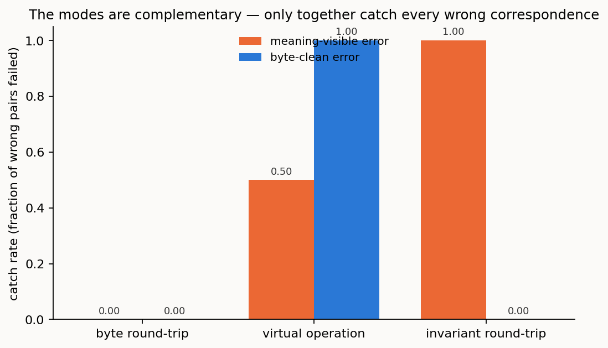
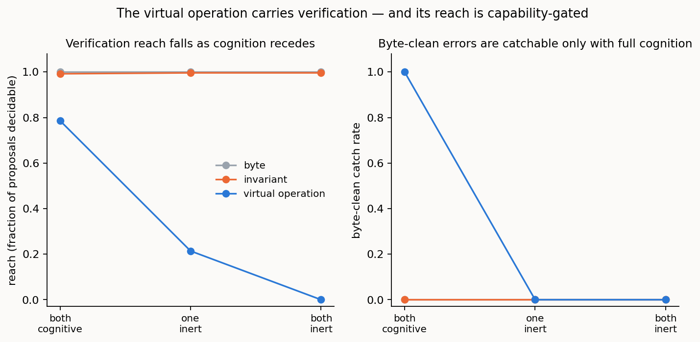

# Verification across the cognition spectrum: what catches a wrong correspondence, and how far each mode reaches

> *Repo-only **method note** behind setting 1 (configuration). Its essential findings are folded into the setting report [../REPORT_1of4_configuration.md](../../reports/REPORT_1of4_configuration.md); this note carries the full method, per-condition results, and reproduction commands. It is not one of the four setting reports.*

> **Status: complete.** Results and discussion below. Reuses the framework, harness, invariants,
> and the instance oracle of [../REPORT_1of4_configuration.md](../../reports/REPORT_1of4_configuration.md) and
> [instance-disambiguation.md](instance-disambiguation.md); it executes the design in
> [DESIGN_verification.md](../design/DESIGN_verification.md).

## Summary

The first four studies measure *reconciliation* — whether the agents propose the right
correspondences, and what the reference and the lift contribute. This study takes the step that
makes reconciliation trustworthy as its own object: **verification**, which the MAGIC paper treats
as intrinsic, so that a correct translator is produced by construction rather than checked after
the fact. The question here is not whether the agent aligns the models, but whether a *verifier*
does its own job — passes what is correct, fails what is wrong — and how far each verification
mode can reach as cognition recedes.

The paper is precise about what verification is and is not, and this study makes each part
measurable. It is **not** round-trip equality: a forward-and-reverse translator built from the
same mistaken correspondence passes a byte round-trip and is still wrong. Round-trip fidelity
means agreement on **semantic invariants** — endpoint identity, connectivity, capacity, layer
relationships, switching, multiplexing — not byte equality; and a proposed correspondence is
finally settled by a **virtual operation on the knowledge graph**: provision a service through it
and confirm the resulting objects in place. Against a seeded set of correct and wrong
correspondences — the wrong ones split into *meaning-visible* (an invariant differs in the static
records) and *byte-clean* (the two records are identical, so only a live probe separates them) —
three modes are scored: byte round-trip, invariant round-trip, and the virtual operation.

Three findings. **Byte round-trip is beaten**, exactly as the paper claims: it catches nothing and
passes every wrong pair, including the four byte-clean crossed mappings that round-trip perfectly.
**The modes are complementary**: the invariant round-trip catches the meaning-visible errors and
is blind to the byte-clean ones; the virtual operation catches the byte-clean ones (and confirms
services) but needs a live side; and only together, at full cognition, is every wrong pair caught.
**Verification reach collapses as cognition recedes**: the virtual operation's reach falls 0.79 →
0.21 → 0.00 across the spectrum, and the byte-clean errors — the ones that most need catching —
become uncatchable the moment a side goes inert. This is the verification-side echo of the
instance study's resolvability shortfall: the errors hardest to catch are exactly the ones
cognition can no longer reach. One honest result runs against the pre-registration, and is
reported as such: on these visibly-stark traps the invariant verifier is *not* capability-dependent
— every model on the ladder catches the meaning-visible errors and every model misses the
byte-clean ones.



---

## 1. Verification as the object

The main study's verify-and-repair step already used verification as a *means* — a second pass
that drove surviving false cognates toward zero and separated the reference's effort role from its
correctness role ([../REPORT_1of4_configuration.md](../../reports/REPORT_1of4_configuration.md)). Here verification is the *object*: the verifier has its
own precision (of what it passes, the fraction truly correct), its own catch rate (of the wrong,
the fraction it fails), and its own **reach** (the fraction of proposals it can decide at all
rather than refer onward). The three outcomes — pass what is correct, fail what is wrong, refer
what cannot be decided — mirror reconciliation's propose / confirm / refer, one level up.

## 2. The three modes

- **Byte round-trip** — translate A→B→A and compare surface form. The naive baseline the paper
  warns against: it cannot see meaning, so it passes any type-compatible pair, including a wrong
  one that round-trips. Deterministic; included to be beaten.
- **Invariant round-trip** — a language-model verifier that judges whether the correspondence
  preserves the semantic invariants, reading the two sides' static records. It catches a wrong
  pair whose records differ in an invariant-relevant way; it is blind to a byte-clean pair whose
  records are identical.
- **Virtual operation** — the correctness-by-construction step: exercise the correspondence on the
  graph. For services, a provision-and-read-back against the invariants (the instance oracle); for
  devices and sections, interrogate an authoritative fact on both sides and compare. It catches
  the byte-clean errors the other modes miss — where a live side is available. Deterministic given
  the oracle.

## 3. The seeded set

Fourteen proposed correspondences over the populated `instance_hard` network
([benchmark/cases/verify_hard](../../benchmark/cases/verify_hard)) — 8 correct, and 6 wrong of two
kinds. The **meaning-visible** wrong pairs are the two instance false cognates: the two `svc-100`
services (different endpoints and capacity) and the two `R1` devices (different topology); an
invariant round-trip can catch these from the records. The **byte-clean** wrong pairs are the four
*crossed* mappings of the structurally-symmetric and keyless pairs (`R2`↔`nodeC`, `R3`↔`nodeB`,
and the two crossed OMS sections): their static records are identical, so a byte round-trip passes
them and an invariant round-trip is blind — only interrogating the authoritative serial or fibre-id
separates them. This is the demonstration the paper calls for, and it is *latent in the instance
case itself*: the crossed symmetric mapping is a wrong correspondence with identical records that
round-trips perfectly. The gold records, per proposal, the expected verdict, the error category,
and whether a probe can decide it; it is derived from the same hidden ground truth as the instance
case and validated (a byte-clean pair with no available probe would be uncatchable and is refused).

## 4. Method

For each proposed correspondence, each mode renders a verdict — pass, fail, or referred. The
deterministic modes (byte, virtual) are scored once per placement; the invariant round-trip is a
single model call per placement and model, returning a verdict for every proposal at once. Scoring
is correctness-first: **catch rate** (of the wrong, the fraction failed), **false-pass rate** (of
the wrong, the fraction passed), **verification precision** (of what is passed, the fraction truly
correct), and **reach** (the fraction decided rather than referred), each also split by error
category (meaning-visible versus byte-clean). Availability of the virtual operation follows the
cognition placement, since an inert side cannot be interrogated or provisioned on. Six trials of
the invariant mode per model and placement; the deterministic modes are exact.

## 5. Results

### 5.1 Byte round-trip is beaten

At every placement the byte round-trip catches nothing (catch rate 0.00) and passes every wrong
pair (false-pass 1.00), including the four byte-clean crossed mappings that round-trip perfectly.
A forward-and-reverse translator built on any of these wrong correspondences would reproduce the
input and pass. This is the paper's insufficiency, made a measured number: round-trip equality is
not verification.

### 5.2 The modes are complementary

At full cognition, where every mode has its full reach, the catch rates split cleanly by error
category:

| mode | meaning-visible catch | byte-clean catch |
|------|:---:|:---:|
| byte round-trip | 0.00 | 0.00 |
| invariant round-trip | **1.00** | 0.00 |
| virtual operation | 0.50 | **1.00** |

The invariant round-trip catches the meaning-visible errors (both `svc-100` and `R1`) and is blind
to the byte-clean ones. The virtual operation is the mirror image: it catches every byte-clean
crossed mapping (by interrogation) and confirms or refutes services (catching `svc-100` by
provision), but it cannot touch the `R1` device pair, which carries no authoritative probe, and it
needs a live side. Byte catches nothing. So no single mode catches all six wrong pairs; the
invariant round-trip and the virtual operation *together*, at full cognition, catch every one. The
practical reading is that verification is intrinsic and multi-modal, not a round-trip check: the
mode that catches a meaning-visible swap is not the mode that catches an identical-looking
crossed identity, and a trustworthy verifier runs both.

### 5.3 Verification reach collapses across the spectrum

The virtual operation is the mode that carries verification of the hard cases, and its reach is
gated by live cognition. Across the spectrum its reach falls 0.79 → 0.21 → 0.00, and its catch of
byte-clean errors falls 1.00 → 0.00 → 0.00:

| placement | virtual-operation reach | byte-clean catch |
|-----------|:---:|:---:|
| both_cognitive | 0.79 | 1.00 |
| one_inert | 0.21 | 0.00 |
| both_inert | 0.00 | 0.00 |

At one_inert the live side can still be interrogated, but a byte-clean error is a *cross-side*
comparison — it needs the fact the inert side can no longer give — so those errors become
undecidable and are referred onward; at both_inert the virtual operation is unavailable entirely.
This is the verification-side echo of the instance study's resolvability shortfall: the errors that
most need catching — the byte-clean identity swaps, invisible to any static check — become
uncatchable exactly where cognition is weakest. Verification does not simply get less accurate as
cognition recedes; the mode that would catch the error can no longer be *run*.



### 5.4 An honest result against the pre-registration

The design predicted that a weaker verifier would miss meaning-visible violations a stronger one
catches. It does not. Across the model ladder — `gpt-5.6-sol`, `gpt-5-mini`, `gpt-5-nano` — the
invariant round-trip catches the meaning-visible errors identically (catch rate 1.00 for each) and
misses the byte-clean ones identically (0.00 for each), and none ever wrongly fails a correct pair.
The likely reason is that the seeded meaning-visible traps are *visibly* stark — a capacity of ODU1
against ODU0, a degree-three topology against degree-one — so even the weakest model's reasoning
suffices to see the invariant break. The finding is reported straight rather than dressed as a
capability gradient it is not: on this set, invariant verification is robust across the ladder, and
separating the models would need a subtler invariant violation. It is also a caution against
over-generalizing — "verification is capability-robust" holds here only because the violations are
stark, and a quieter one is exactly where a weak verifier would be expected to fail.

## 6. Discussion

Verification, taken as its own object, comes out multi-modal and spectrum-gated. Byte round-trip —
the check that equates translation fidelity with surface equality — catches nothing, and the
byte-clean crossed mappings are the clean counterexample the paper describes: wrong correspondences
that round-trip. The invariant round-trip and the virtual operation each catch a different class of
error and are complementary; a verifier that runs only one has a blind spot, and only the pair, at
full cognition, is complete. And reach — not just accuracy — is the spectrum variable: which mode
can still be *run* changes as cognition recedes, so the byte-clean errors, catchable in principle
by a virtual operation, become uncatchable once the side that would answer the probe goes inert.

That last point ties verification back to the programme's central law. The instance study found a
resolvability shortfall that becomes structural as cognition recedes; verification inherits it
exactly, because the act that verifies the hard cases is the same live-cognition act that resolves
them. Where reconciliation cannot resolve an identity without acting on a live side, verification
cannot confirm it either, and the residual it leaves — the correspondences it can neither pass nor
fail — is referred onward on the same terms: closed by more deliberation between two live agents,
and by human effort or an external test once a side is inert. Verification is intrinsic to the
method, but its reach is only as long as cognition's.

Read the other way, this is the verification-side of the programme's central claim, and it is the
assurance that matters. At the fully-cognitive end the check is **complete**: the invariant
round-trip and the virtual operation together catch every wrong correspondence in the set, so the
machine that reconciles also verifies its own result — no agreed standard, no human. The reach
shortens only as cognition recedes, and where it shortens the undecidable cases are *referred*
onward, not passed in error. So the same result the instance study proves for reconciliation holds
for verification: where the cognition is present to carry it, the machine both settles the
correspondences and confirms them, and the cognition spectrum marks how far that assurance extends
before a person is needed.

## 7. Reproducibility

The seeded set, its gold, and the deterministic modes are built and validated without a model; only
the invariant round-trip calls one.

```bash
python benchmark/build_verify_set.py       # the seeded proposals + gold (from instance_hard truth)
python tests/test_verify_modes.py          # offline test of all three modes (no API)
python pipeline/verify_study.py --model gpt-5.6-sol,gpt-5-mini,gpt-5-nano --trials 6
python pipeline/figures_verify.py                   # the figures
```
