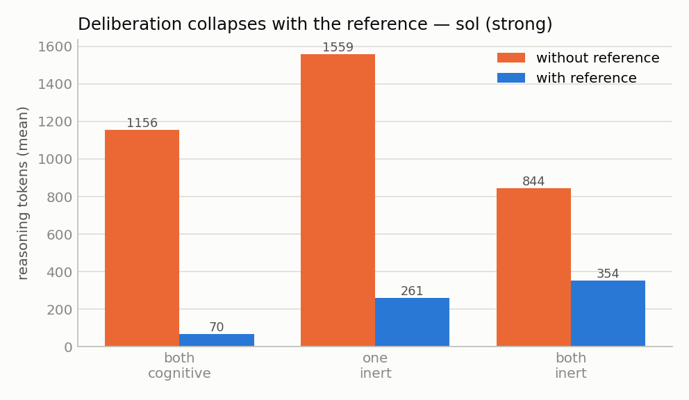
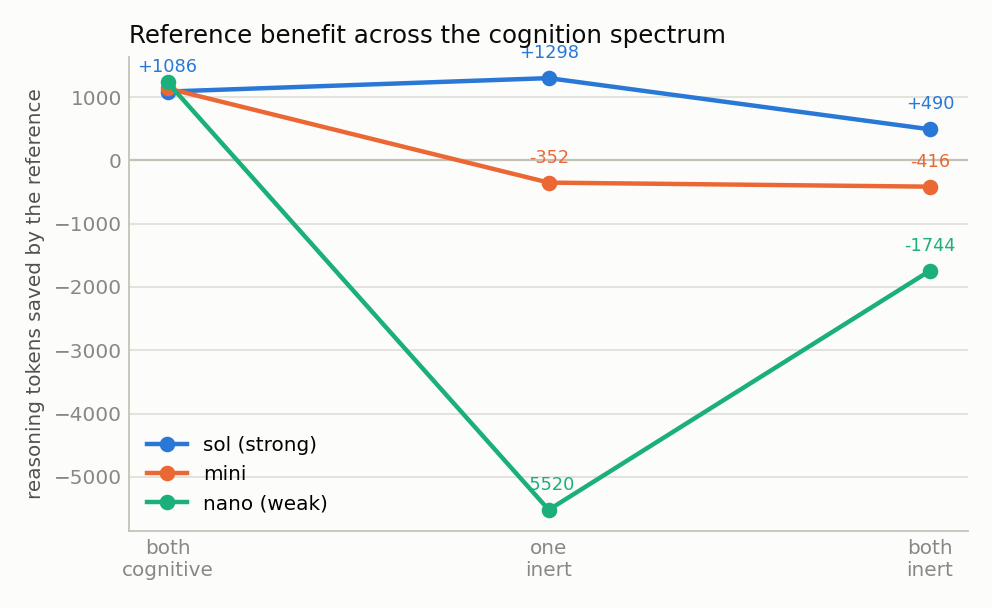
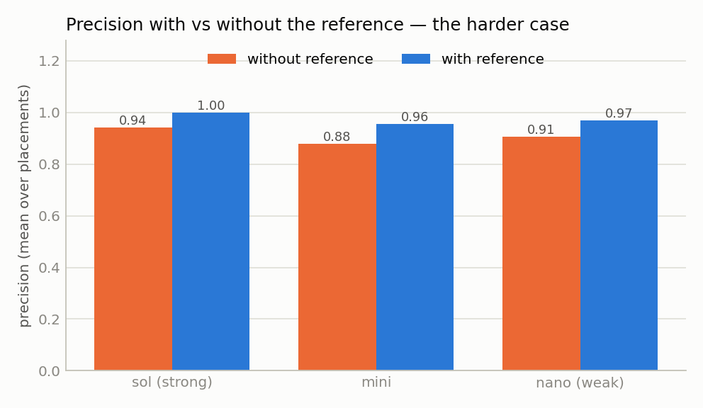
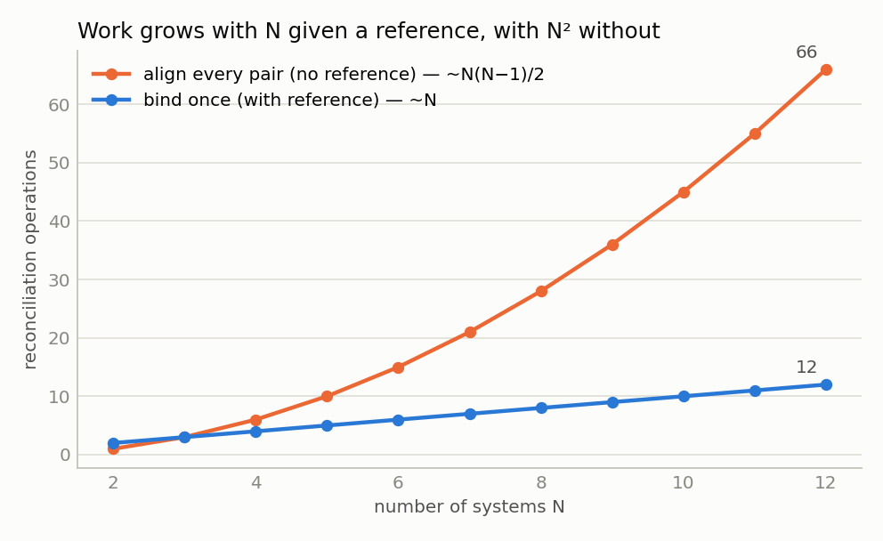
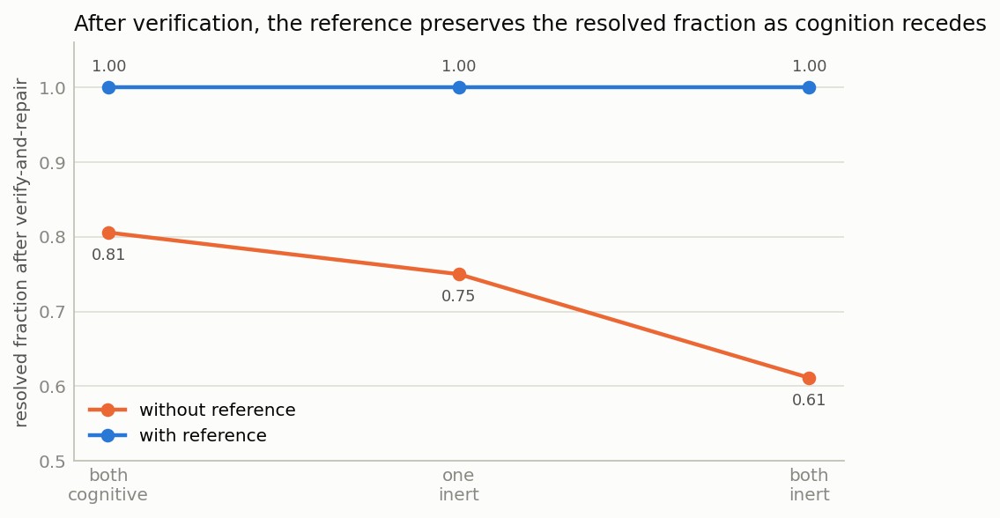
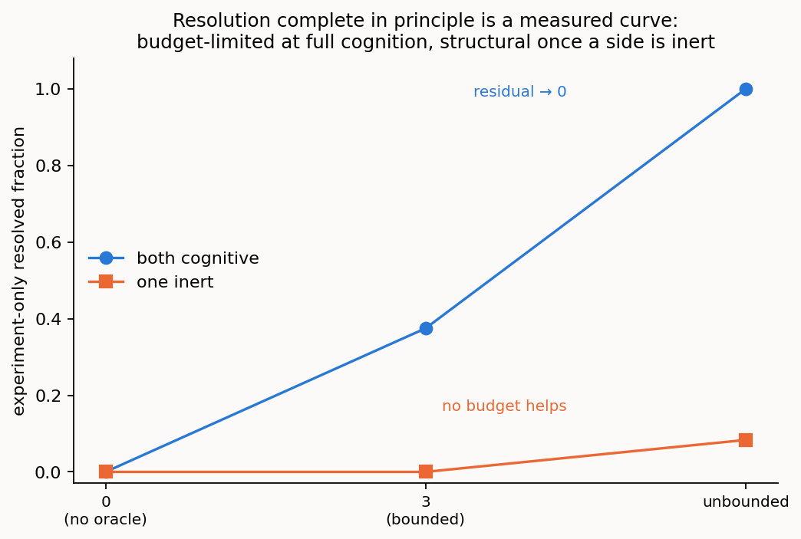

# 1/4 · Reconciling two standard models of one network: cognition across the spectrum, and what a thin reference adds

> *Programme status — a complete analytical arc through the **first of the programme's four
> operational settings** (transport-network service provisioning). It establishes the concept,
> characterizes how the **cognition spectrum** governs it, and validates **one thin-reference
> variant** (the lexical). Across the components of reconciliation it works the lexical,
> ontological/structural, and instance-level, together with **verification**; only the
> **pragmatic** component is held fixed — deferred, with the remaining three settings, to the
> work that follows.*

## Summary

*This is the **first of the programme's four settings**, and the one that establishes the concept;
it is also the setting written most as a foundation, opening with background and hypotheses (§1)
before it turns, like the other three, to a concrete case and its results.* The case is concrete.
Two independently authored **standard** models of one optical transport network — ONF **TAPI** on
one side, IETF **TEAS/ACTN** on the other — describe the same nodes, links, and services, each in
its own vocabulary. A TAPI *connectivity-service* is a TEAS *tunnel*; a TAPI *link-termination-point*
looks like a TEAS *tunnel-termination-point* but is a different thing — a link end, not a trail head.
Two language-model agents must reconcile these two models, *ad hoc*, with no third model agreed in
advance, getting the real correspondences right while refusing the look-alikes. What that takes, and
what a thin shared reference adds to it, is what this setting measures — and what the other three
settings build on.

When two software systems must exchange information but hold different models — of
the same domain, or of different domains that must connect — someone has to reconcile
those models. This study asks whether the
systems can do it *themselves* — reasoning, *ad hoc*, with no model agreed in
advance — and puts the whole idea to an empirical test. We build a harness in which
two language-model agents reconcile two independently authored semantic models of
one network; it scores the result against a validated gold standard and measures
both the quality of the outcome and the cognitive effort the agents spend. The
governing variable is where cognition sits: a **cognition spectrum** running from
both systems live and interrogable, through one *inert*, to both inert. A thin,
published **shared reference** is switched on and off at each point — as much a
probe of what cognition was doing as an object of study in its own right — and the
whole is run across a ladder of model strengths and a growing number of systems.

Two things fall out that, as far as we know, have not been set out this way before.
First, the concept holds: cognitive agents *do* reconcile divergent models
correctly and for the occasion — not in a single hand-worked demonstration but
measured across conditions. Second, **the placement of cognition governs what
a reconciliation can achieve, what it costs, and what can be verified.** Between two fully-cognitive agents
resolution is complete *in principle* — they can interrogate each other without
bound and run decisive experiments in virtual space, so any question is confirmed,
refuted, or authoritatively decided, and nothing need be left unresolved. As
cognition recedes that resolving power falls away, and a growing **residual** must
be referred onward: the residual is precisely the *shortfall* from full cognition's
reach. Everything else, the reference included, sits inside this frame.

The consequence is the study's central point, and it is easily missed inside the
machinery: **it is cognition that completes a reconciliation.** Lexical and descriptor
methods carry it most of the way - matching on names, then on names plus a short gloss,
reaches roughly ninety percent - and there such methods have historically stopped, the
remainder left to an agreed standard or to human judgement. What the spectrum shows is
that the remainder need not wait for either. Where both systems can reason - the
fully-cognitive end - the reconciliation completes *autonomously*, with no model agreed
in advance and no person in the loop; as cognition recedes, and only then, does closing
the gap fall back to human effort or external verification. Full, ad hoc,
machine-to-machine semantic reconciliation is therefore possible where the cognition is
present to complete it, and the cognition spectrum is the measure of how far that
automation reaches before it must hand off to a person. That the residual past the
lexical ceiling can be closed by machine cognition, rather than only by a human or a
prior agreement, is the shift this work rests on.

Within that frame, four findings concern the reference. First, for a capable agent a
thin reference **substitutes for cognition**: it collapses the model's hidden
deliberation by one to two orders of magnitude and yields a perfect reconciliation,
across the whole spectrum. Second, the effect is **capability-dependent**: a weak
agent cannot always exploit the reference, and when one or both sides are inert it
can become a cognitive *burden* rather than an aid — its cheaper effort buys error,
not savings. Third, on a hard case seeded with false cognates and opaque items, the
reference **prevents errors**, raising precision and pre-empting traps, and it helps
the weaker agents most. Fourth, reconciliation work grows **linearly** in the number
of systems given a shared reference, against **quadratically** without one. The naive
hypothesis that the reference's benefit grows monotonically as cognition recedes is
*not* supported; the more careful, capability-dependent claim is.

A fifth result runs the framework's verification step and separates two claims the
first four leave joined. Verification catches the false cognates that slip through the
proposal, driving precision to near one across the whole spectrum. But without the
reference this catching lowers the resolved fraction — correct correspondences the verifier can no
longer *confirm* are referred onward to the residual rather than asserted — and that
cost grows as cognition recedes, because the confirming mechanisms (interrogation, joint
experiment) recede with it. The reference restores the confirmation the inert sides
cannot give, holding the resolved fraction at one. So the reference's value in *effort* peaks with live
cognition, while its value in *correctness* concentrates where cognition, and therefore
verification, is weakest — the two halves of a single substitution.

---

## 1. Background and hypotheses

Network and service management increasingly places software agents that reason on
the management plane. Two such systems rarely share a data model: the scope a
model must cover is not fixed, the useful level of abstraction depends on the task,
and capable engineers produce different but defensible models. Rather than agree a
universal model in advance, two systems that reason can **reconcile** their models
for the occasion.

We treat the meaning a system must consume as a **semantic model**: an ontology,
including its lexicon, together with pragmatics, over a base of provenance. A system
usually holds its content as a **data model** — a schema and its data as they stand,
meaningful to whoever wrote the schema but carrying no explicit meaning of their own; the
move from that to a semantic model, attaching the ontology, lexicon, and grounding that
make the content mean something a reasoner can use, is the **lift**. Who performs the lift
is itself a variable of this study (§2.2): a live system lifts and explains itself, whereas
an inert one is lifted by the agent that reads it. Reconciliation aligns two lifted semantic
models to yield one reconciled model, and it is interesting only because models diverge. Divergence — and so the disambiguation a
reconciliation must perform — falls into distinct components, each a different thing
to resolve:

- **Lexical** — the terms concepts go by. Two models may name the same thing
  differently (synonyms: *owned-node-edge-point* and *termination-point*) or give one
  label to different things (a *false cognate*: a *link* termination versus a *trail*
  termination). This is the surface a name-matcher keys on, and where this study's
  planted traps live.
- **Ontological and structural** — which concepts (types) exist and how they decompose
  the domain: granularity (one multi-layer topology versus per-layer networks), scope
  (what each model chooses to cover), abstraction, and the structural relations among
  concepts (a link terminates at a node; a service rides a tunnel). Reconciling here
  aligns the *types* and reconciles their structure, for instance by an
  explode-then-collapse transform between a single topology and stacked per-layer ones.
- **Instance-level** — co-reference of individuals across two populated graphs: is
  *this* ROADM the same device as *that* te-node, this ODU2 service the same as that
  te-tunnel? This is a *separate exercise that follows* schema-term reconciliation —
  once the types are aligned, one can compare like with like — and it runs on a
  different path: entity resolution over the data (the A-box) rather than
  meaning-comprehension over the vocabulary. The evidence differs accordingly — a shared
  key, then matching attributes, then relational/topological position — weighed and held
  with a confidence rather than assumed, and, where a reference helps, anchored by shared
  *instance* identifiers rather than concept definitions.
- **Pragmatic** — how content is used: whether it describes what was asked or what is
  operationally the case, the context that changes a signal's meaning (a rising
  bit-error-rate is a page, a benign maintenance-window event, or a low-confidence
  matter to watch), and which side is the authority for a value.

Underlying all four is provenance, the base the semantic model sits over. This report's
primary experiments (§3.1–3.5) work the first two components — the **schema-term** level;
two companion studies carry the same framework to the **instance-level** component and to
verification taken as its own object, summarized in §3.6. The **pragmatic** component is
held fixed; §5 makes the scope precise.

Against that divergence we study a thin **shared reference**: an identity-only
anchor per concept — a stable id, a preferred label and synonyms, a shallow class,
a disambiguating definition, and one canonical example. Each side binds its terms
to the reference. It is deliberately small and is not a model of the domain. This is
the **lexical** reference, one of a possible family (instance, unit, value-set,
structural, pragmatic, and other variants); it is the variant we exercise here (see
scope, §5).

The placement of cognition relative to the systems being reconciled is a variable
we call the **cognition spectrum**: both systems live and interrogable
(*both-cognitive*), one live and one *inert* (present and running, with all its
data, but unable to explain itself), or *both inert*, reconciled by a third party
that can only propose candidates. An inert system is not absent; it still exposes
its structure and its instances, so its meaning must be *reconstructed* rather than
volunteered — which is work.

The study has two aims. The first is to establish the method itself — that two
cognitive agents can reconcile divergent models ad hoc, correctly and for the
occasion — and to characterize how the *placement* of cognition along the spectrum
governs what reconciliation can achieve, what it costs, and what can be verified: in
the fully-cognitive case resolution is complete in principle, and the residual a
reconciliation must refer onward grows as cognition recedes, as the shortfall from
its reach (developed in §2.2). The second aim is to measure what the thin shared
reference contributes within that frame. The reference, switched on and off at each
placement, is the instrument that makes cognition's own contribution legible — so the
four hypotheses below, though stated about the reference, double as the probe by
which the first aim is met.

We test four hypotheses.

- **H1 (substitution).** A thin shared reference substitutes for cognition: it
  reduces the reasoning a reconciliation requires and improves its reliability.
- **H2 (spectrum).** The reference's benefit grows as cognition recedes — as one
  and then both systems go inert.
- **H3 (capability).** The reference's benefit depends on the reconciling agent's
  own capability.
- **H4 (scaling).** With a shared reference, reconciliation work grows with the
  number of systems N; without one, it grows with the number of pairs, N(N−1)/2.

---

## 2. Method

### 2.1 The task and the harness

A **case** is two lifted semantic models of one network plus a gold-standard
reconciliation. Each concept carries a label and synonyms, a shallow kind, a
disambiguating gloss and canonical example, its binding to the shared reference,
and — so that an inert side has something to be reconstructed from — its structural
relations to other concepts and a few concrete instances. The **gold standard**
gives the correct cross-model correspondences, the planted false cognates that must
*not* be proposed, the native gaps and opaque items expected to remain residual,
the invariants a correct translation preserves, and the verification method each
placement admits. Gold is *derived from the models' bindings by a script and
validated*, so it cannot drift from the models it scores.

A **reasoning stack** is the harness's stand-in for the reconciling cognition: it
consumes the two models (and, if it uses one, the reference) and returns the correspondences
it proposes and the concepts it leaves residual. Implementing it as one process is a
measurement convenience, not a claim about who reasons. What it stands for is, in the
fully-cognitive case, an exchange *between two live agents* — each the authority on its own
model, trading explanations and running joint experiments in virtual space, as in the worked
demonstration; with one side inert, the live agent reconstructs the mute side from what it can
read off it; with both inert, a third party reconstructs both. The single stack measures the
*outcome* of that reconciliation against the gold; it does not collapse the concept into one
reasoner that privately owns both models. How many sides are live is the **placement** (§2.2).
Three stacks share one interface: a reference-blind classical matcher and a
reference-aware reconciler (both deterministic controls), and a language-model
agent. The **evaluation harness** scores a stack's output against the gold
standard and records the metric families below.

### 2.2 The cognition spectrum, concretely

The agent is run at each placement. Under *both-cognitive*, each concept is
presented in full and, with the reference, carries its binding. Under *one-inert*,
the inert side is presented as label, kind, relations, and instances only — no
gloss, synonyms, example, or binding — and the live agent must reconstruct its
meaning; with the reference, it does so by matching each inert concept to the
reference entry whose definition and example fit. Under *both-inert*, neither side
can explain itself; the agent is a third party that reconstructs both sides from
structure and data and can only *propose* candidates for external adjudication.

To be precise about what *inert* means: an inert side is **passive** — it cannot reason,
answer a question, or run anything. The reconciling cognition works only with what can be
*read off* it — its schema and structure, its identifiers and labels, its instance data —
together with whatever the agent independently knows when that schema is a recognised public
standard. The semantic model, the *lift*, is then built by the cognition **above**: a live
side lifts and explains itself, whereas an inert side is lifted by the agent that reads it.
(In this harness an inert side is supplied already organised into concepts with their
relations and instances, with only the self-explanation withheld; extracting concepts from
wholly raw data would be a further step, not exercised here.)

What the agent reconciles, at every placement, is two **lifted semantic models, not two
lexica**. Per concept it is given the label, a shallow class, structural relations, and
concrete instances — and, on a live side, a gloss and worked example — and it decides
correspondence by meaning over all of this, not by lexical similarity over labels alone.
This is worth stressing because the both-inert case is easily misread as string-matching
two static term lists. It is not: *inert* means a side cannot explain itself (no gloss,
synonyms, example, or volunteered binding), but it still exposes its structure and its
instances, from which a cognitive third party reconstructs meaning. The planted false
cognates are defeated on exactly this non-lexical evidence — a *signal-grade* and a
*service-grade* share the token "grade" but differ in class (a *quality* versus a
*class*), in what they attach to (an optical channel versus a tunnel), and in their
instances (an OSNR grade versus a gold/silver service tier) — which a purely lexical
aligner, keying on the shared label, could not do. The reference, when present, is a
further anchor layered on top of this; it is not the only, nor the primary, source of
meaning.

That the lift — not the lexicon — is what reconciliation runs on is measured directly, not
merely asserted. Stripping every concept back to its lexical surface (label and synonyms, the
terms as a classical matcher would see them) and then restoring the lifted layers one at a
time — the concept's own explanation, its class, its relations, its instances — leaves the
lexical surface alone with a quarter to a third of the correct correspondences unfound
(resolved fraction 0.66–0.76), and the restored lift recovers them (0.92–0.97) for every model
on the ladder; the single largest step is the first, giving a concept its own explanation.
This is the axis the ontology-matching literature's label-only-versus-label-plus-gloss
comparisons do not vary, and it is where the reasoning happens — pure lexical matching, however
much gloss is bolted onto the labels, is not enough. It is also capability-gated in a way worth
flagging early: the same restored content that lets a weak agent find more correspondences also
hands it more surface to misfire on — its instances, in particular, turn toxic, over-read as
evidence of identity — so the lift is unambiguously the lever, unambiguously safe for a strong
agent, and a double-edged one for a weak agent. That pattern — the richer content that raises
reach also raises exposure for the weakest cognition — recurs throughout the study. (Reported
in full in the pre-lift baseline note; see §6.)

A structural fact about the spectrum organises the results that follow. In the
fully-cognitive case, resolution of any reconciliation question is total *in
principle*, for two reasons that are themselves functions of live cognition on each
side. First, the agents can exchange **unbounded further information**: each is the
live authority on its own model, so whatever is ambiguous about one side's concept
the other can ask about and get an authoritative answer. Second, because
reconciliation operates on the knowledge graph rather than the live network, the
agents can **design and run decisive experiments in virtual space** — provision a
candidate service through a proposed correspondence, operate it, read it back, and
check the invariants — resolving any specific doubt against a determinate outcome.
Any issue is therefore confirmed, refuted, or, in the one case of a source model its
own designers left underspecified, *decided* by the authoritative agent. This is a
claim about what is possible within this setting — operational semantics a virtual
provisioning-and-readback can adjudicate — not about cost or step count. Both
resolving mechanisms are functions of live cognition, so as cognition recedes they
become unavailable: with one side inert the live agent can probe but not interrogate
or co-design an experiment, and with both inert there is no one to ask and no joint
experiment to run. The **residual** a reconciliation must leave unresolved and refer
onward is, in this sense, the *shortfall* from full cognition's resolving power, and
it grows as that power recedes. It is not a fixed floor the fully-cognitive case
merely reaches; between two fully-cognitive agents there is, in principle, none.

### 2.3 Metrics

Quality is scored against the gold standard. **Precision** is, of the correspondences a
stack proposes, the fraction that are correct; the **resolved fraction** is the share of the
true correspondences (those in the gold) that the stack actually resolves — finds and commits
to — with the rest referred to the residual. **Surviving false cognates** counts
the planted traps that slip through as false positives, and the **residual** is the
correspondences the stack does not commit — the native gaps and opaque items that should
remain residual, together with any pairing it declines to assert. Resolved fraction below one is
therefore not, by itself, an error: an unresolved correspondence is one the stack *referred
onward* rather than asserted, and — the point that governs §3.5 — the honest response to
evidence that cannot confirm a pairing is to leave it in the residual, not to guess. So
precision and surviving false cognates measure *committed error*, while resolved fraction measures
*reach*, and the two must be read together. Cognitive effort is measured,
for a language-model stack, as the **reasoning tokens** it spends (its hidden
deliberation), the total tokens, and latency — the effort signals the model
exposes. Reasoning tokens are the cleanest single measure of how hard the agent
worked.

The scores in §3.1–3.4 are of the reconciliation the agents *propose*, before any
correction. A surviving false cognate there is one the proposal stage let through —
an error the framework's verification step would then have to catch. §3.5 runs that
step (reconcile, verify, repair) and scores its effect separately, which is where the
placement-dependent strength of verification — complete in the fully-cognitive case,
weaker as cognition recedes (§2.2) — becomes visible in the numbers.

### 2.4 Experimental design

The primary case is a transport-network reconciliation between an ONF TAPI model
and an IETF TEAS model — the same network decomposed differently, from the deeply
structural (one multi-layer topology versus per-layer networks) down to the lexical
— seeded with three false cognates (a link versus a trail termination, an optical
*signal-grade* versus a commercial *service-grade*, a protection *group* versus a
protection *role*) and two opaque, vendor-coded items with no public meaning. Each
model has fifteen or sixteen concepts. The agent is run over a ladder of three
models spanning a capability range — `gpt-5.6-sol` (strong), `gpt-5-mini` (mid),
and `gpt-5-nano` (weak), referred to throughout as **sol**, **mini**, and **nano** —
at all three placements, with and without the reference, four trials each — 72 agent
runs. The three are one provider's capability tiers, chosen so the ladder isolates
model strength rather than provider or architecture.
Scaling (H4) is studied separately with four independently authored models of one
network in different dialects — TAPI, TEAS, a TM Forum/MEF service model, and a
legacy SNMP model — differing in vocabulary and decomposition, extended by
construction to N = 12.

### 2.5 Controls

Two deterministic, model-free stacks bracket the space and do not vary by model. A
reference-blind label matcher reaches precision 0.50 and resolved fraction 0.67 on the primary
case and lets a false cognate through. A reference-aware reconciler, binding each
side once and corresponding by shared entry, reaches precision 1.00 and resolved fraction 1.00
with every trap pre-empted and the seven native-gap and opaque items correctly left
residual.

---

## 3. Results

### 3.1 The reference substitutes for cognition (H1)

For the capable agent, the reference collapses deliberation and perfects the
outcome. Across the three placements the strong model's reasoning tokens fall from
1156, 1559, and 844 (without the reference) to 70, 261, and 354 (with it) — a one-
to two-order-of-magnitude reduction — and with the reference it reaches precision
1.00 and resolved fraction 1.00 at every placement (Fig. 1, Table 1). The reference does the
reasoning's work: given the anchor, the capable agent barely has to deliberate, and
it does not err.



*Figure 1. Mean reasoning tokens the strong agent spends with and without the
reference, at each placement. The reference reduces the capable agent's hidden
deliberation by roughly 5–20×, in every placement.*

| placement | reference | precision | resolved fraction | reasoning tokens | latency |
|-----------|-----------|-----------|--------|------------------|---------|
| both cognitive | without | 0.94 | 0.94 | 1156 | 29.2 s |
| both cognitive | **with** | 1.00 | 1.00 | **70** | 5.8 s |
| one inert | without | 0.96 | 0.98 | 1559 | 36.1 s |
| one inert | **with** | 1.00 | 1.00 | **261** | 12.0 s |
| both inert | without | 0.92 | 1.00 | 844 | 23.3 s |
| both inert | **with** | 1.00 | 1.00 | **354** | 13.6 s |

*Table 1. The strong agent (gpt-5.6-sol) on the primary case, n = 4 per row.*

### 3.2 The benefit is capability-dependent, and not monotone in placement (H2, H3)

H2 predicted the reference's benefit would grow as cognition recedes. It does not,
and the reason is instructive (Fig. 2). For the capable agent the reference saves
effort at *every* placement — the benefit is always positive — but it peaks at
one-inert rather than climbing monotonically to both-inert. For the weaker models
the benefit *inverts* once a side goes inert: the reference becomes extra material
they cannot exploit while straining to reconstruct meaning, so it *adds* effort. At
one-inert the weak model spends 5,520 *more* reasoning tokens with the reference
than without.



*Figure 2. Reasoning tokens saved by the reference (positive = the reference helps)
at each placement, per model. The capable agent (blue) stays above zero throughout;
the weaker models fall below zero under inert load, where the reference becomes a
burden.*

So H2 in its simple form is refuted *for effort*, and H3 is supported: whether a
reference helps, and by how much, depends on the reconciling agent's own capability.
A reference is a shortcut a capable agent exploits; it is not a free substitute for
cognition that a weak agent can cash in under load. H2 for *correctness* is a
separate question, which the placement-dependent verification structure treats
differently; §4 takes it up.

### 3.3 On a hard case, the reference prevents errors (H1, quality)

Seeding the case with three false cognates and opaque items makes quality separate,
and it separates in **precision** — a trap that is accepted is a false positive
(Fig. 3, Table 2). Without the reference every model's precision falls below one
(0.94, 0.88, 0.91 for strong, mid, weak, averaged over placements), and traps
survive — the weak model accepted a false cognate on every trial at one-inert. With
the reference, precision rises (1.00, 0.96, 0.97) and the traps are pre-empted,
because two labels that look alike bind to different reference entries. The opaque,
vendor-coded items, which the reference deliberately does not cover, are correctly
left residual rather than matched.



*Figure 3. Mean precision (over placements) with and without the reference. The
reference lifts precision for every model, and most for the weaker ones, by
pre-empting the planted false cognates.*

| model | precision (no ref) | precision (ref) | surviving false cognates (no ref) |
|-------|--------------------|-----------------|-----------------------------------|
| strong (sol) | 0.94 | 1.00 | ~0 |
| mid (mini) | 0.88 | 0.96 | occasional |
| weak (nano) | 0.91 | 0.97 | up to 1 per trial (one-inert) |

*Table 2. Quality separation on the hard case, averaged over placements.*

### 3.4 Reconciliation scales with N given a reference, with N² without (H4)

If N systems each bind once to the shared reference, any pair's correspondences
compose from those N bindings; authoring an alignment for every pair instead grows
with the number of pairs. We verify this on four independent models of one network
— TAPI, TEAS, a TM Forum/MEF service model, and a legacy SNMP model — and extend it
by construction to N = 12, checking at every N that composing the bindings
reproduces the correct pairwise correspondences (Fig. 4). Binding grows as N;
pairwise alignment grows as N(N−1)/2. The two break even at N = 3 and diverge
after: at N = 12 the reference does 12 units of work against 66, and the ratio,
(N−1)/2, keeps widening.



*Figure 4. With a shared reference, work grows linearly in the number of systems;
without one, quadratically. Composition was verified correct at every N.*

### 3.5 Verification, run: what survives, and what gets referred onward (H2, correctness)

The quality results so far are of the reconciliation the agents *propose*, before the
framework's verification step. That leaves the correctness form of H2 argued rather
than measured. Here we run the step: reconcile, then **verify-and-repair** — a second
agent pass that judges each proposed correspondence against the semantic invariants
(endpoint identity, connectivity, capacity, layer relationships, switching
constraints, multiplexing), using only the placement-appropriate evidence and never
the gold. A correspondence it refutes is removed from the asserted set; its endpoints
revert to the **residual**, the channel the framework refers onward for external
resolution. We score the proposal (pre) and the repaired result (post) at each
placement, with and without the reference.

Two things happen, and they pull in opposite directions.

**Verification removes false positives across the whole spectrum.** The planted false
cognates that slip through the proposal are caught by the invariant round-trip, and
precision is driven to ~1.00 everywhere (Table 3). The effect is starkest for the
weak agent, which is the one that bites: without the reference the weak model's
surviving false cognates fall from about one per trial to near zero once verification
runs. This is the framework behaving as designed — and in the both-cognitive case it
is a *lower bound* on what verification can do, since our single pass can only refute,
where two live agents are guaranteed the exchange and virtual-experiment rounds that
resolve any remaining doubt (§2.2).

| placement | surviving false cognates, no ref (pre → post) | with ref (pre → post) |
|-----------|-----------------------------------------------|------------------------|
| both cognitive | 0.67 → **0.00** | 0.00 → 0.00 |
| one inert | 1.00 → **0.33** | 0.33 → **0.00** |
| both inert | 1.00 → **0.00** | 0.00 → 0.00 |

*Table 3. Surviving false cognates for the weak agent (gpt-5-nano), proposal vs after
verify-and-repair, n = 3 per cell. Verification clears the traps; the reference
pre-empts them, so with it there is little left to clear. The strong agent never
accepts a trap, with or without the reference, so its counts are zero throughout.*

**Without the reference, that cleaning lowers the resolved fraction, and the cost grows as cognition
recedes** (Fig. 5). This is the shortfall of §2.2 made empirical, and it is worth
saying precisely what it is and is not. As a side goes inert, the verifier — reasoning
from structure and instances alone, with no self-explanation to lean on and no
reference to anchor to — can no longer *confirm* some correct correspondences. It does
not silently discard them: it refuses them, and they fall from the asserted set into
the residual, referred onward for whatever resolving power remains. Resolved fraction counts them
as no longer asserted, so it drops; but the correspondences are not thrown away and not
declared false, they are handed off.

Read the numbers as a count of what was *confirmed and asserted* versus *referred
onward*, not as reconciliation quality lost — the correspondences are all present, on
one side of that line or the other. Two cautions follow, and both matter for reading
Fig. 5 correctly. The signal is the **decline**, not the absolute level: the strong
agent's post-verification resolved fraction without the reference falls 0.81 → 0.75 → 0.61 across
both-cognitive, one-inert, and both-inert, and it is that fall that tracks the shortfall,
because the mechanisms that would confirm these pairs — interrogation and joint
experiment — recede with the cognition that powers them. The both-cognitive *level*
itself (0.81) is **not** evidence of shortfall there; by §2.2 there is, in principle,
none between two fully-cognitive agents. It is an artifact of our verifier running a
single pass that can refute but not re-confirm: two live agents are guaranteed the
further rounds that would carry it back to 1.00, and our harness simply does not run
them. So the without-reference curve understates full cognition's resolving power at
the left, and measures a genuinely growing shortfall toward the right.



*Figure 5. Resolved fraction after verify-and-repair for the strong agent, with and without the
reference. Without it, the resolved fraction falls as cognition recedes — the correspondences the
verifier cannot confirm are referred to the residual rather than asserted. With it,
resolved fraction holds at 1.00: the reference supplies the confirmation the inert sides cannot.*

**The reference supplies the confirmation that inert sides cannot.** With it, resolved fraction
holds at 1.00 at every placement (Fig. 5): the anchor lets the verifier confirm a
correspondence rather than only fail to refute it, so almost nothing is referred
onward, and the traps are pre-empted before verification even runs. The reference's
value therefore *concentrates where verification is weakest* — it does its most
distinctive work in the inert cases, exactly where cognition can no longer resolve on
its own. This is the correctness form of H2, now measured rather than argued: not that
the reference saves more *effort* as cognition recedes (it does not — §3.2), but that
it prevents more *irrecoverable error*, because the safety net it substitutes for is
by construction weakest there.

Two honesty notes on the mechanism. Our verifier is a single pass that drops on an
active refutation and keeps an unjudged pair, so the resolved fraction it loses without the
reference is the verifier *wrongly refusing* correct pairs under thinning evidence — a
false negative — not a graceful abstention; either way the destination is the residual,
not an assertion of falsehood. And the harness collapses "unconfirmed, refer onward"
into the same residual pool as "genuinely no counterpart"; a fuller implementation
would tag the two distinctly, but the metric already captures the *size* of the
shortfall, which is the quantity the spectrum is about.

### 3.6 Beyond the schema terms: instance co-reference and verification

The experiments above are the core of this report, and they work the schema-term level. Two
companion studies carry the same framework past it — one to the **instance level**, one to
**verification as its own object** — and their results belong here because they extend the
report's central point to the other levels at which reconciliation must be shown to hold.
Each is reported in full separately; the essentials follow.

**Instance co-reference** (method note, `notes/studies/instance-disambiguation.md`). Once the
types are aligned the individuals must be too — is *this* ROADM the same device as *that*
te-node. This runs on a different path (entity resolution over keys, attributes, and
topology) and, decisively, the cognition spectrum bites *harder*: some individuals are
separable only by acting on the live system — an authoritative interrogation, or a
provision-and-read-back — so that class of evidence is gated by live cognition. On a
populated case seeded with structurally-identical devices and same-named-but-distinct
services, an agent running a tool-use loop over a live-cognition oracle resolves the
individuals in full at both-cognitive, at perfect precision, and the resolvability shortfall
becomes *structural* as a side goes inert. The sharpest result is a measured curve: at
both-cognitive, more probe budget drives the hardest ("experiment-only") residual
monotonically to zero (experiment-only resolved fraction 0.00 → 0.38 → 1.00); with one side inert the
same unbounded budget barely moves it (→ 0.08), because the inert side cannot be interrogated
at any budget (Fig. 6). Capability governs how the shortfall is paid, exactly as at the
schema level — the strong agent resolves and defers cleanly at perfect precision, the weaker
agents trade precision for reach, take the traps as the oracle is lost, and are no less
confident on a wrong merge than on a right one. This is the instance-level proof of the
report's central point: where the cognition is present to complete it, the machine resolves
the individuals itself, and the shortfall is a limit not of effort but of cognition's
placement.



*Figure 6. Experiment-only resolved fraction against oracle budget, strong agent. At both-cognitive the
residual is budget-limited and drives to zero; at one-inert it is structural and no budget
helps.*

**Verification as its own object** (method note, `notes/studies/verification-modes.md`). §3.5 ran
verification as a *step* in the pipeline; the companion study makes the verifier itself the
object and asks which checking method catches which error, across three modes: a **byte
round-trip** (translate and compare surface form), an **invariant round-trip** (a model
judging, from the static records, whether a correspondence preserves the semantic
invariants), and the **virtual operation** (provision-and-read-back on the knowledge graph).
The methods are not of equal weight, and the ordering is instructive even though it is partly
a property of the seeded error mix. The byte round-trip is dominated: it catches nothing on
its own, passing every wrong correspondence, including ones that round-trip perfectly — it is
the check to beat, not to use. The invariant round-trip and the virtual operation are
complementary but not co-equal. The invariant round-trip catches errors whose invariant break
is *visible in the records* and is available at every placement, but it is blind to a
"byte-clean" error whose two records are identical — a crossed identity between two look-alike
devices. The virtual operation is strictly more powerful where it can run: it alone catches
those byte-clean errors, by acting on the graph rather than reading it, but its reach is gated
by live cognition and falls away as sides go inert. So the practical ranking is: never rely on
a byte round-trip alone; use the invariant round-trip as the portable static check; and reserve
the virtual operation — the most powerful mode — for the hard identity cases and the
fully-cognitive end where it can be run. That the virtual operation is *indispensable* rather
than merely strongest is a consequence of the case containing byte-clean errors at all; a case
without them would be fully served by the invariant check, and the relative importance of the
modes is in that sense a function of the error mix a deployment expects. The assurance is the
same one the instance study proves for reconciliation: at the fully-cognitive end the modes
together catch every seeded wrong correspondence, so the machine both settles the
correspondences and confirms them.

---

## 4. Discussion

The first thing the study establishes is the concept itself. Two cognitive agents
reconcile independently-authored, divergent models correctly and ad hoc, with no
standard agreed in advance — measured against a validated gold across the whole
cognition spectrum, not shown once by hand. And the placement of cognition is the
variable that governs the setting: between two fully-cognitive agents resolution is
complete in principle — unbounded interrogation and decisive virtual experiment — so
nothing need be left unresolved; as cognition recedes that power falls away and a
residual must be referred onward, the shortfall from full cognition's reach (§2.2,
§3.5). That is the frame, and to our knowledge it has not been laid out this way
before. The reference's role, to which the rest of this section turns, sits inside
it.

**A thin shared reference substitutes for cognition — for a capable agent, and in
both dimensions at once.** Given the anchor, the strong model's hidden deliberation
collapses by one to two orders of magnitude and its reconciliation is perfect and
verified: precision and resolved fraction of one, every planted false cognate pre-empted, at
every point on the spectrum (§3.1). The reference does the reasoning's work, and it
does so robustly. That is the headline.

**It is a substitute a capable agent exploits, though, not a free one a weak agent
can cash in.** The benefit is capability-dependent (§3.2), and the dependence is easy
to misread. For the weaker models the reference can *add* effort once a side goes
inert — extra material to process while straining to reconstruct an inert side's
meaning — so on raw effort a weak model can look like the economical choice. That
reading mistakes what the effort buys. The comparison is only meaningful at equal
quality, and the weak models do not hold quality: they accept the planted false
cognates (precision 0.88 and 0.91 against the strong model's 1.00), and even after
verification, without the reference, a trap can still survive when a side is inert. A
weak model's lower effort is not a saving but a *purchase of error*; what the strong
model restores is reliability — a trap-free reconciliation that needs no human to
catch its mistakes. So the naive spectrum hypothesis (H2) is refuted *for effort*: the
reference's effort benefit peaks with live cognition and is gated by the agent's own
capability (H3).

**In its *correctness* role — as opposed to the effort role just discussed, which is where
the extra material can burden a weak agent — the reference is most valuable exactly where
cognition is weakest.** The two roles must be kept apart precisely because they run in
opposite directions along the spectrum: the effort benefit peaks with strong, live cognition
and can invert to a burden for a weak or inert agent (above), whereas the error-prevention
benefit, the subject of this paragraph, grows as cognition recedes. The spectrum carries a
structural fact (§2.2): in the fully-cognitive case
verification — and hence error correction — is complete in principle, because two live
agents can interrogate each other without bound and run decisive virtual experiments,
so any issue is confirmed, refuted, or authoritatively decided. There the reference is
least necessary; cognition can resolve everything itself. As a side goes inert that
resolving power recedes — the verifier can still *refute* a bad correspondence but can
no longer *confirm* every good one — and the correspondences it cannot confirm are
referred onward to the residual, unasserted (§3.5). This is where the reference earns
its keep: it supplies the confirmation the inert sides cannot, holding the resolved fraction at one
where cognition alone would leave correct correspondences unconfirmed. So for
*correctness* the same spectrum hypothesis holds: the reference's correctness value
concentrates where verification is weakest — the mirror image of its effort value,
which peaks where cognition is strongest. One anchor, two roles, distributed
oppositely along the spectrum.

Seen this way, the reference is not what supplants prior agreement — cognition is. Two
reasoning systems can reconcile divergent models with no standard settled in advance;
the thin reference is a cheap, published *aid* to that reconciliation, not a
precondition for it. It is least needed under full cognition and most useful as
cognition thins — which is precisely the regime, inert or weaker systems, that a real
deployment will often be in.

There is a subtlety worth stating, because it explains why the reference can be so thin.
The meaning that reconciliation runs on lives in each side's own **ontology and instances**
— that is what defeats a false cognate such as *signal-grade* versus *service-grade*, which
differ in class, in what they attach to, and in their data despite the shared label. The
reference carries none of that structure; it is an **identity bridge**, a flat, structure-free
anchor the two systems point at so that binding to the same entry means denoting the same
thing. Its power is coordination, not content: it can be thin precisely because it is
parasitic on the two grounded ontologies it connects, and giving it an ontology of its own
would turn it back into the universal standard the approach exists to avoid. Its descriptive
fields are best read as compressed *proxies* for the grounding a full ontology supplies — a
canonical example is a single instance, a definition a compressed gloss, a shallow class one
type — cues a weaker agent leans on to make the binding when it cannot extract the distinction
from its own structure and data, and which a capable agent, already grounded, does without.
This is why the descriptive fields matter only as cognition thins — and a factorial ablation
of the fields themselves shows there is no capability-free answer to *which* field carries the
weight. For the strong agent the descriptive fields are moot: it lets no planted cognate
through with the full reference, a bare opaque anchor, or none at all. For the mid agent any
*single* field — class, definition, or example — is a clean fix, the three near-perfect
substitutes for one another. For the weak agent the lexical field (label and synonyms) helps
most, a definition or example helps partially, and a shallow *class* tag does not help but
actively *hurts* — the single worst condition in the study, because a class surface like
`quality` versus `class` reads to a weak agent as evidence for the very cognate it was meant
to block. The publishing lesson: a reference is a safety rail for weaker cognition, not a
semantic payload — author the lexical field and a definition or example first, and be wary of
shallow class tags, which can mislead exactly the consumers who most need help. (The ablation
also carries a methodological caution: the anchor must be an *opaque* identifier, because a
human-readable id already names the concept and silently defeats the test. Reported in full in
the reference-anatomy note; see §6.)

**Two practical implications.** First, the reference is most valuable exactly where
the motivating problem is sharpest: pre-empting the silent, precision-eroding errors —
false cognates, mismatched opaque items — that a matcher accepts and a human would
otherwise have to catch, largest on hard, realistic cases and for the smaller models
most likely to be deployed at scale for cost reasons. Second, because binding scales
linearly while pairwise alignment scales quadratically (§3.4), the reference's
advantage compounds with the number of systems, independent of any per-reconciliation
effect.

---

## 5. Threats to validity

The primary case, though seeded to be hard, is a single pair of models of one
network; the effect sizes are specific to it, and the sample is four trials per
condition, so the numbers are indicative rather than tight. Language-model behaviour
varies run to run and is model-dependent; results are reported per model and
compared under fixed conditions, so effort is read as a relative signal across
treatments rather than an absolute cost. Public standards may have been seen by a
model in training, which could flatter the no-reference conditions; the effect we
rely on is the *difference* the reference makes under identical inputs. The scaling
result is exact by construction and verified by composition, but it counts
binding-versus-alignment operations, not wall-clock effort; combined with the
per-reconciliation effort measured here, the two advantages compound. The gold
standards are derived from the models and validated, which removes drift but does
not make the modelling choices themselves beyond dispute.

A note on scope, in terms of the components of §1. This study reconciles at the
**schema-term** level: it exercises the **lexical** and **ontological/structural**
components, and its scored output is *concept* correspondences (which type in one model
denotes the same type as which in the other), with the planted false cognates riding on
the lexical surface. **Instance-level co-reference** — a separate
exercise that *follows* schema alignment and runs on a different path (entity resolution
over the data, from keys, attributes, and topology), deciding that this individual ROADM is
that te-node — is taken up in the companion study summarized in §3.6, where individuals are
scored against a validated instance gold; within the schema-term experiments of §3.1–3.5
themselves, instances enter only as *evidence* (the concrete data that grounds what a concept
means, and against which a verification round-trip provisions and reads back), not as
alignment targets. The **pragmatic** component is not varied: the two models differ in
vocabulary and structure, not in use or context. And the reference varied in the primary
experiments is the **lexical** one of the possible family; the companion studies add the
**instance** and **invariant** variants.

All of this is deliberate, on grounds of necessity and focus: reconciliation had to be
pinned to its clearest, most separable mechanism first — lexical and structural
identity, and the false cognates that ride on it — before the harder components are
brought in. Each such component is a natural axis for the work, and each
pairs with machinery beyond the schema-term core: instance co-reference with the *instance*
and *invariant* reference variants and evidence-weighted individual matching — now taken up
in the companion study of §3.6 — and pragmatic reconciliation with the *pragmatic* reference
variant and settings where meaning turns on context (observability, where the same
measurement is a page, a benign event, or a matter to watch), which remains for the settings
to follow.

## 6. Reproducibility

The harness is standard-library Python for everything except the language-model
stack, which uses the OpenAI API. The controls and the whole pipeline run with no
model access.

```bash
python pipeline/run.py --case config_big_hard \
  --agent --trials 4 \
  --placement both_cognitive,one_inert,both_inert \
  --model gpt-5.6-sol,gpt-5-mini,gpt-5-nano
python pipeline/verify_experiment.py --case config_big_hard --trials 3 \
  --placement both_cognitive,one_inert,both_inert \
  --model gpt-5.6-sol,gpt-5-nano                # reconcile -> verify -> repair (§3.5)
python pipeline/summarize.py --case config_big_hard    # per-condition means and the benefit matrix
python pipeline/figures.py  --case config_big_hard     # regenerate the figures
python pipeline/scaling.py  --max-n 12 --write          # the scaling result

# the companion studies of §3.6:
python pipeline/instance_reconcile.py --stage 1lite \
  --model gpt-5.6-sol,gpt-5-mini,gpt-5-nano --trials 3 --budget 12   # instance co-reference
python pipeline/verify_study.py --model gpt-5.6-sol,gpt-5-mini,gpt-5-nano --trials 6   # verification modes
```

Cases live under `benchmark/cases/<case>/` as plain JSON (two models, the
reference, the traps, and the derived gold); `benchmark/schema.md` documents the
format and `benchmark/derive_gold.py` derives and validates the gold. The exact
per-run data behind the reported figures and tables are in `results/`, one CSV per
experiment (`config_big_hard.csv`, `verify_config_big_hard.csv`,
`scaling_scaling_otn.csv`).

The four sub-studies whose essentials are folded into this report above — the pre-lift
lexical baseline (§2.2), the reference-field anatomy (§4), and the instance-co-reference and
verification studies (§3.6) — are written up in full, with their per-condition tables, seeds,
and exact commands, as repo-only method notes under `notes/studies/`:
`notes/studies/lift-baseline.md`, `notes/studies/reference-anatomy.md`,
`notes/studies/instance-disambiguation.md`, and `notes/studies/verification-modes.md`. They are method
detail behind this setting's report, not separate reports in the four-setting set.

---

## Appendix: the metric families

- **Reliability.** Precision and resolved fraction against the gold standard; surviving false
  cognates; the residual, which should equal the native gaps plus opaque items.
- **Cognitive effort.** Reasoning tokens (hidden deliberation), total tokens, and
  latency — recorded only for a language-model stack.
- **Scaling.** Reconciliation operations as a function of the number of systems:
  bindings (with a reference) against pairwise alignments (without).
