# Ad hoc semantic reconciliation by cognitive agents: a four-setting synthesis

> *Programme abstract — Two software systems that must exchange information rarely share a
> model of the world. The classical answer is to agree a common standard in advance; this
> programme asks whether two systems that can **reason** can instead reconcile their divergent
> models **for the occasion** — ad hoc, machine-to-machine, with no standard settled beforehand.
> Across **four operational settings** in network and service management — configuration, intent,
> cross-domain provisioning, and observability — it builds a measured harness, scores every
> reconciliation against a validated gold standard, and varies one master control: **where the
> cognition sits**, from two live reasoning agents through one inert to both inert. The
> through-line the four settings establish is a single thesis. **It is cognition that completes a
> reconciliation.** Descriptor methods — matching names, then names plus a gloss — carry it to a
> ceiling and stop; where both systems can reason, the remainder is closed autonomously, with no
> agreed model and no human in the loop. A thin, published **reference** can substitute for
> cognition, or supply an inert side the facts it lacks — but its reach ends there: it hands over
> information, never the **authority** to decide, whose value governs or whether a trade-off is
> acceptable. And the **pragmatic** layer — what a reconciled thing is *for*, whether it
> matters, who decides — is the frontier the descriptor methods never reach, decisive for meaning
> and itself bounded by the agent's capability. This document is the synthesis that sits atop the
> four setting reports: it introduces the concepts once, distils each setting to its essentials,
> and gathers the findings so they can be read as one result. The full evidence for any setting
> lives in its own report (1/4–4/4), to which this one points throughout.*

---

# Part I — The idea

## 1. The problem: two models, and no time to standardise

When two software systems must work together but hold different models — of the same domain, or
of adjacent domains that must connect — someone has to reconcile those models. The scope a model
must cover is not fixed, the useful level of abstraction depends on the task, and capable
engineers, working independently, produce different but defensible models of the same network.
The classical remedy is a universal standard agreed ahead of time: everyone adopts one vocabulary,
and the reconciliation is done once, by committee, before the systems ever meet. That remedy is
expensive, slow, and permanently behind the systems it tries to govern.

This programme investigates the alternative that becomes available once the systems on each side
can **reason**. Two such systems need not wait for a standard; they can reconcile their models
**ad hoc** — between themselves, for the task at hand, machine-to-machine. The question is whether
that actually works, how far it reaches, and what — if anything — a small published aid adds to it.
The answer is built empirically, in a harness where the reconciling parties are language-model
agents and every outcome is scored against a validated gold standard, so that the claims rest on
measurement across conditions rather than a single worked demonstration.

## 2. The lift: from a data model to a portable semantic model

The move the whole programme turns on is the **lift**, and it is worth drawing before anything else
(Figure 1).

A system usually holds its content as a **data model** — a schema and its records as they sit in a
database or a controller. That content is already a partial semantic picture, but a fixed one, frozen by the format it uses: a field
named `och_grade` with values `1`, `2`, `3` is legible to the software and engineers built around its
schema, yet says nothing, on its own, to a consumer that was not told what it means — the meaning
lives in a specification and in shared convention, outside the data itself. The **lift** is the move
from that to a **semantic model**: the same content given grounded, explicit meaning, structured as
three parts. First, an **ontology**, which includes its **lexicon** — a schematic layer (the concepts,
their kinds and relations, and the preferred labels and synonyms that name them) and a concrete layer
(the individual instances that populate those concepts). Second, **pragmatics**: the contextual
information a consumer needs — what a thing is for, whose authority governs it, in what context it
holds. Third, **provenance**: who asserted each part, by what method, and how firmly. The lift itself
is a **cognitive act**, helped along by a few **supports** that are aids to that cognition rather than
parts of the model — definitions, worked examples, a canonical example, and an optional link to a
shared reference. Who performs the lift is itself a variable of the study: a live system lifts and
explains itself; an inert one is lifted by whatever cognition reads it.

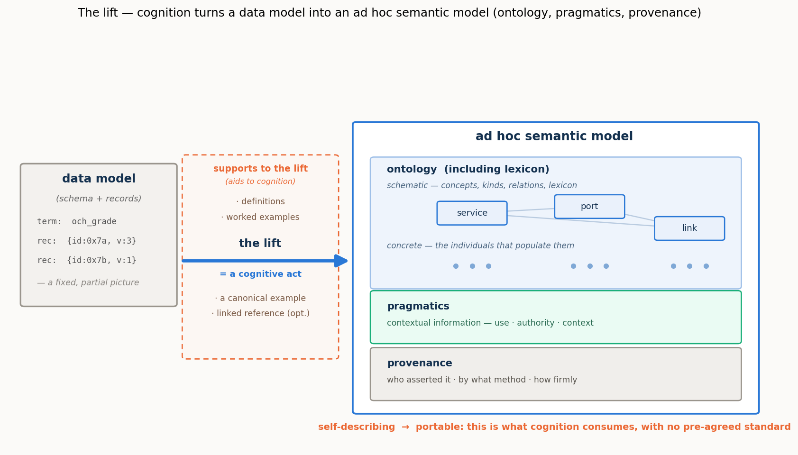

*Figure 1. The lift. A data model (schema plus records) is a partial semantic picture, fixed by its format, with much of its meaning left implicit —
in specifications, convention, and the engineers who built around it. The lift is a cognitive act,
aided by a few supports (definitions, worked examples, a canonical example, an optional linked
reference), that turns the data model into an ad hoc semantic model built from three parts: an
ontology including its lexicon (schematic concepts and the concrete instances that populate them),
pragmatics (use, authority, context), and provenance. Being self-describing, the result is
**portable**: any cognitive consumer can pick it up and understand it, with no pre-agreed standard.*

The payload of the picture is the word **portable**. A lifted semantic model is **self-describing**,
and being self-describing is exactly what lets *any* cognitive consumer — this agent, another agent,
a human — pick it up and understand it without a prior agreement. That portability is not a
convenience; it is the precondition for the whole approach. Cognitive consumption of a model — using
it, reasoning over it, reconciling it with another — requires meaning made explicit, and the lift is
how meaning is made explicit on demand rather than by standardisation. Reconciliation is one instance
of cognitive consumption; the settings that follow will also refine an intent against a catalogue,
and read an anomaly for its significance, over the same lifted substrate. Get the lift, and the rest
of the programme is operations over portable semantic models.

## 3. Reconciliation over lifted models: the operations

Given two lifted models, **reconciliation** aligns them: it works out which concept on one side
denotes the same thing as which concept on the other, fixes the shared attributes so they cannot be
misread, aligns the individuals, and confirms the result (Figure 2). It is not one act but a small
family of **operations**, and naming them once is what lets the findings later be mapped to a precise
*where*:

- **Lift** — data model → semantic model, per side (§2).
- **Reference construction** — find or build the thin shared ground the two sides bind through.
- **Schema binding** — align the concepts themselves: the **lexical** operation (names and synonyms)
  and the **ontological/structural** one (kinds, relations, decomposition).
- **Attribute pinning** — fix the meaning of a shared field, so a *committed payload* rate is not
  read as a *line* rate, a *bound* not as a measured value.
- **Instance co-reference** — decide which individual on one side is which on the other (entity
  resolution over keys, attributes, and topology, sometimes only settled by probing the live system).
- **Verification** — confirm a proposed correspondence, by round-trip, by invariant, by a virtual
  provision-and-read-back, or — where the relation is a refinement — by a satisfaction check.
- **Pragmatic resolution** — settle what the reconciled thing is *for*: whether a degraded offer is
  acceptable, whose realm governs a shared field, whether an anomaly warrants a **page** (an alert
  raised to an on-call human operator).
- **Composition (correlation)** — assemble separately reconciled parts into a composite whole: in
  setting 4, correlating several symptoms into a single incident by following the resource-dependency
  structure.
- **Lifecycle recurrence** — re-reconcile as the live situation changes over time.

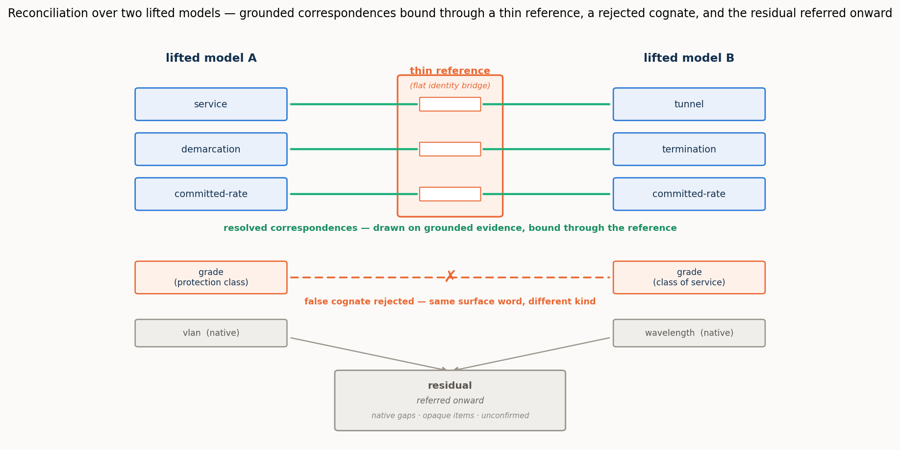

*Figure 2. Reconciliation over two lifted models. Correspondences are drawn on grounded evidence and
bound through a thin reference that acts as a flat identity bridge; a look-alike that shares only a
surface word is **rejected** as a false cognate on its kind, attachment, and instances; and what
evidence cannot yet confirm — native gaps, opaque items — is left in the **residual**, referred
onward. The reference carries no structure of its own; it is parasitic on the two grounded models it
connects.*

Two features of Figure 2 recur in every setting. The first is the **false cognate**: two concepts
that share a surface word but denote different things — an optical *signal-grade* and a commercial
*service-grade*, a transport *grade* and an IP *grade*, a legacy *alarm* and an NMOP *anomaly*.
Reconciliation must draw the true correspondences *and* refuse the look-alikes, and it refuses them
on grounded, non-lexical evidence — kind, attachment, instances — which a purely lexical matcher,
keying on the shared label, cannot do. The second is the **residual**: the correspondences a pass
does not close. A residual is not an error; it is what a reconciliation honestly *refers onward*
rather than guessing — to further machine cognition where the agents are live to continue, or to a
person where they are not. How large the residual is, and what drives it, is one of the programme's
central measurements.

## 4. The cognition spectrum, and the residual as a shortfall

The master control across all four settings is **where the cognition sits** — the **cognition
spectrum**. It runs from both sides live and interrogable, through one side inert, to both inert:

- **both-cognitive** — each side is a live reasoner, the authority on its own model, able to
  explain itself and answer questions;
- **one-inert** — one side is a mute snapshot exposing only its structure and instances; the live
  side must reconstruct its meaning;
- **both-inert** — neither side can explain itself; a third party reconstructs both from structure
  and data, and can only *propose* candidates for external adjudication.

A structural fact about this spectrum organises every result that follows. In the fully-cognitive
case, resolution of any reconciliation question is total *in principle*, for two reasons that are
themselves functions of live cognition on each side. First, the agents can exchange **unbounded
further information** — each is the live authority on its own model, so whatever is ambiguous the
other can ask about and get an authoritative answer. Second, because reconciliation operates on the
models rather than the live network, the agents can **run decisive experiments in virtual space** —
provision a candidate through a proposed correspondence, operate it, read it back, and check the
invariants. Any question is therefore confirmed, refuted, or authoritatively decided, and nothing
need be left unresolved. Both mechanisms are functions of live cognition, so as cognition recedes
they fall away: with one side inert the live agent can probe but not interrogate or co-design an
experiment; with both inert there is no one to ask and no joint experiment to run. The **residual** a
reconciliation must leave and refer onward is, in exactly this sense, the **shortfall from full
cognition's reach** — and it grows as that reach recedes. It is not a fixed floor the fully-cognitive
case merely reaches; between two fully-cognitive agents there is, in principle, none.

This is the frame inside which every finding sits, and it carries the programme's central claim.
Lexical and descriptor methods carry a reconciliation to roughly ninety percent — names, then names
plus a gloss — and there such methods have historically stopped, the remainder left to an agreed
standard or to human judgement. What the spectrum shows is that the remainder need not wait for
either: where both systems can reason, the reconciliation completes **autonomously**, and only as
cognition recedes does closing the gap fall back to a reference or a person. **It is cognition that
completes a reconciliation**, and the cognition spectrum is the measure of how far the automation
reaches before it must hand off.

## 5. The thin reference: substitute, supply, and the limit at authority

Against that frame, a thin, published **shared reference** is switched on and off at each point on
the spectrum — as much a probe of what cognition was doing as an object of study in its own right.
The reference is deliberately small: a flat set of entries, each an identity anchor plus a few
descriptive fields (a label and synonyms, a shallow class, a one-line definition, a canonical
example). It has no ontology of its own — giving it one would turn it back into the universal
standard the approach exists to avoid — and its power is coordination, not content: two systems that
bind to the same entry thereby denote the same thing. It is **parasitic** on the two grounded models
it connects, which is precisely why it can be so thin.

What such a reference does, across the settings, resolves into three distinct roles, and keeping
them apart is essential:

- It can **partly substitute for cognition**. For a capable agent on a lexical/structural task, the
  reference does the reasoning's work — collapsing the agent's hidden deliberation by one to two
  orders of magnitude and yielding a perfect, verified reconciliation.
- It can **supply missing information**. Where a side is inert, the reference can hand the reading
  agent facts it can no longer obtain by interrogation — a committed guarantee, a unit, a categorical
  definition — restoring the verification the missing probe would otherwise have done.
- It **cannot supply authority**. Where what is missing is not a fact but a *judgement* — whether a
  degraded offer is acceptable, whose realm governs a contested field — no reference substitutes. A
  reference can tell you what a service guarantees; it cannot tell you whether this customer will
  accept it. Where the gap is information, a thin reference closes it; where the gap is authority,
  only cognition — live, or pre-placed as a policy — closes it.

The reference's value is also **capability-gated** and distributed unevenly along the spectrum. Its
effort benefit peaks with strong, live cognition — a weak agent may not be able to exploit it, and an
inert side can turn the extra material into a burden. Its error-prevention benefit runs the other
way, concentrating where cognition, and therefore verification, is weakest. One anchor, opposite
roles, and — a finding the settings sharpen — a definite **internal structure**: a reference's fields
are not of equal value, and the cheapest useful one is not the cheapest possible one.

## 6. The instrument

Every setting is measured in the same harness. A **case** is two lifted semantic models plus a
gold-standard reconciliation *derived from the models by a script and validated* before any run, so
the gold cannot drift from the models it scores. A **reasoning stack** stands in for the reconciling
cognition — in the fully-cognitive case, an exchange between two live agents; with a side inert, the
live agent reconstructing the mute one; with both inert, a third party — and the harness scores the
stack's output against the gold and records both quality and cognitive effort. Quality is measured by
**precision** (of what it proposes, the fraction correct), the **resolved fraction** (of the true
correspondences, the fraction it actually commits, the rest referred to the residual), **surviving
false cognates** (planted traps taken), and the **residual** itself; effort, for a language-model
stack, by **reasoning tokens** (hidden deliberation), total tokens, and latency. Throughout, a
resolved fraction below one is not by itself a failure — it is reach deliberately traded for honesty,
the unconfirmed correspondences referred onward rather than guessed.

The reconciling agents are run over one **model ladder** for the whole programme — three models
spanning a capability range, `gpt-5.6-sol` (**strong**), `gpt-5-mini` (**mid**), and `gpt-5-nano`
(**weak**), referred to as **sol**, **mini**, and **nano** — chosen so the ladder isolates model
strength rather than provider or architecture. The programme's hypotheses are the ones the first
setting states and the others inherit: that cognitive agents can reconcile divergent models ad hoc
(the concept holds); that the placement of cognition governs what a reconciliation achieves, costs,
and can verify; that a thin reference partly substitutes for cognition, capability-dependently, and prevents
errors where cognition is weakest; and that reconciliation work scales linearly with a shared
reference against quadratically without one. What each setting adds is a new operation brought under
test — verification and instances, then pragmatics as a movable policy, then the standard-free bind,
then pragmatics as significance, whether an observation matters at all — against the same frame and
the same instrument.

---

# Part II — The four settings

Each setting takes the same frame to a new operation. The sections below are distilled to a common
rhythm — what is new against the first setting, the case in one paragraph, the operations put under
test, what was proven, and what it means — and each points to its own report for the full evidence.

## 7. Setting 1 — Configuration: two standard models of one network

*Full report: [1/4 · Configuration](REPORT_1of4_configuration.md).*

**What it establishes.** This is the founding setting: it puts the whole idea to its first empirical
test and fixes the frame the others inherit. Two independently authored **public standard** models of
one optical transport network — ONF **TAPI** on one side, IETF **TEAS/ACTN** on the other — describe
the same nodes, links, and services, each in its own vocabulary. A TAPI *connectivity-service* is a
TEAS *tunnel*; a TAPI *link-termination-point* looks like a TEAS *tunnel-termination-point* but is a
different thing — a link end, not a trail head. Because both models are public standards the agents
recognise, cognition can lean on that recognition to bridge them, which makes this the cleanest place
to isolate the mechanism.

**Operations under test.** The reconciliation as an **equivalence** (this term *is* that term): the
**lexical** and **ontological/structural** binding, **verification** run as its own step, and
**instance co-reference** — with the **pragmatic** operation left untouched here, deferred to the
later settings. The thin **reference** is the lexical one, switched on and off across the spectrum.

**What was proven.** The concept holds, measured across conditions rather than shown once: cognitive
agents reconcile the two models correctly and ad hoc. Within that, the reference **substitutes for
cognition** — for the strong agent it collapses hidden deliberation by one to two orders of magnitude
and yields a perfect, verified reconciliation (precision and resolved fraction of one) across the
whole spectrum. The benefit is **capability-dependent** and not monotonic: for a weak agent the
reference can *add* effort when a side is inert, and the naive "reference helps more as cognition
recedes" hypothesis is refuted *for effort* even as it holds *for correctness* — precision separates
the models on the hard case (strong 0.94→1.00, mid 0.88→0.96, weak 0.91→0.97 with the reference) and
the reference prevents the errors a weak agent otherwise commits. **Verification** runs as its own
step, keeping only the correspondences it can confirm and referring the rest onward. It rejects the
false cognates that slipped into the proposal, so precision climbs toward one across the spectrum. But
confirming a correspondence draws on live cognition, which the spectrum removes. Without the reference,
as a side goes inert, the verifier can still reject a wrong pairing yet can no longer confirm every
correct one; those unconfirmable-but-correct pairings are deferred to the residual rather than
asserted, so the resolved fraction falls. The reference supplies the missing confirmation, holding the
resolved fraction at one. Reconciliation work scales **linearly** with a shared reference against
**quadratically** without one (verified by construction to N = 12). And two folded sub-studies carry
the point past the schema terms: at the **instance** level the resolvability of same-looking
individuals is budget-limited at full cognition (driven to a full resolve with more probing) but
becomes **structural** once a side goes inert (no budget helps, because the inert side cannot be
interrogated); and a **pre-lift baseline** confirms the lift itself is the lever — matching on the
bare lexical surface leaves a quarter to a third of the correspondences unfound (resolved fraction
0.66–0.76), and restoring the lifted content recovers them (0.92–0.97).

**What it means.** The founding claim is in hand: cognition completes the reconciliation, a
reference partly substitutes for it, saving cognitive effort and preventing errors, and the spectrum
governs both. Everything after this builds on that frame; setting 1 does not touch pragmatics at all —
that is the thread the remaining three settings pick up.

## 8. Setting 2 — Intent: refinement, negotiation, and a service that renegotiates itself

*Full report: [2/4 · Intent](REPORT_2of4_intent.md).*

**What is new.** The first setting reconciled by **equivalence**; this one reconciles a declarative
**intent** against a concrete **realisation** by **refinement**. "Latency below 5 ms" is not equal to
any service on offer — it is a *bound* that a service either clears or does not, and many services may
clear it. Once the relation is refinement, everything the first setting left untouched comes into play at
once.

**The case.** A customer's agent **O** holds an intent — a New York–Frankfurt connection, ≥ 8 Gbit/s,
≤ 5 ms, four-nines, protection not required — every clause a bound. An operator's agent **N** holds a
catalogue of concrete optical services, each with a real bandwidth, latency, availability, protection
scheme, and cost. Neither speaks the other's language; they must work out which realisation
*satisfies* the wish.

**Operations under test.** Verification becomes a **satisfaction** check (you cannot round-trip a
lossy refinement, so you test the chosen realisation against every bound); a genuine two-sided
**negotiation** appears when no service meets every bound (N computes a best-achievable offer, O must
decide accept or reject); the **pragmatic** operation enters for the first time, carried in a small,
portable **movable policy** the customer holds — a priority ordering, hard bounds, an affordability
floor, a flow-class rule; and the whole exchange **recurs across the service's life**.

**What was proven.** The central insight, now measured on a real negotiation: with both agents live,
the reconciliation — negotiation included — completes autonomously (decision accuracy 1.0 for sol and
mini), with no human in the loop. The spectrum gains a new rung that turns out to be the sharpest
result: remove the customer's live judgement, and a **pre-placed movable policy** still closes the
decisions it was authorised for (1.0), while a **mute** customer with no policy cannot — accuracy
falls to zero and the agents correctly **refer all three** decisions onward rather than guess. The
pre-placed policy is a concrete mechanism for **pushing the hand-off boundary**: the customer's
cognition, placed in a portable artefact ahead of time, closes autonomously what a mute description
must refer. The second finding draws the reference's limit: where a side is inert, a published
reference *supplies information* (the strong agent, blind at both-inert, refuses to affirm
satisfaction and scores 0.29; publish the invariant guarantee floor and it has an anchor to check
against, rising to 0.71) — but it *cannot supply authority*: at both-inert no reference moves the
negotiation, because what is missing is the customer's judgement itself. The capability gradient is
steep (to reach its decisions the strong agent spent ~150 reasoning tokens, the mid ~860, the weak
~5,400 — thirty-five times the strong agent's effort, for lower accuracy), and a four-hop
**lifecycle** — bought, self-healed, referred, restored — is walked correctly end to end by the
strong model (hop accuracy sol 1.0, mini 0.88, nano 0.62).

**What it means.** Cognition completes a negotiation, and the pragmatic operation is now a
measured axis rather than a fixed backdrop. A thin published reference can stand in for the information
an inert side would otherwise supply, but not for the authority to decide. A pre-placed policy is shown
able to carry a party's authority to where a person or live cognitive system would otherwise have to
stand.

## 9. Setting 3 — Cross-domain: reconciling with no public standard

*Full report: [3/4 · Cross-domain](REPORT_3of4_cross_domain.md).*

**What is new.** The deliberate complement to the first setting. There, two *different* models faced
each other — but both were **public standards** the agents already knew, so cognition could lean on
recognition. Here that crutch is gone: both models are **home-grown and private**, recognisable to no
one in advance. The operations are the first setting's — lift, bind, a thin reference — but with the
standard removed, the *execution* diverges, and that divergence is the subject.

**The case (Figure 3).** **Meridian**, a home-grown transport OSS, thinks in circuits, bearers,
wavelengths, protection grades. **Cascade**, a home-grown IP/VPN controller, thinks in services,
attachments, VLANs, classes of service. Their worlds touch at exactly one seam: a Cascade service
must ride a Meridian circuit as its underlay. One order across that seam needs five bindings —
circuit↔underlay and hand-off↔attachment (the same object under two names), and three requirements
pinned (a *committed* rate not a line rate, a latency *bound*, protection against a *path* failure) —
and one look-alike refused: both models carry a **grade**, but Meridian's is a transport protection
class and Cascade's an IP class of service. Same word, unrelated meanings, and no standard to consult.

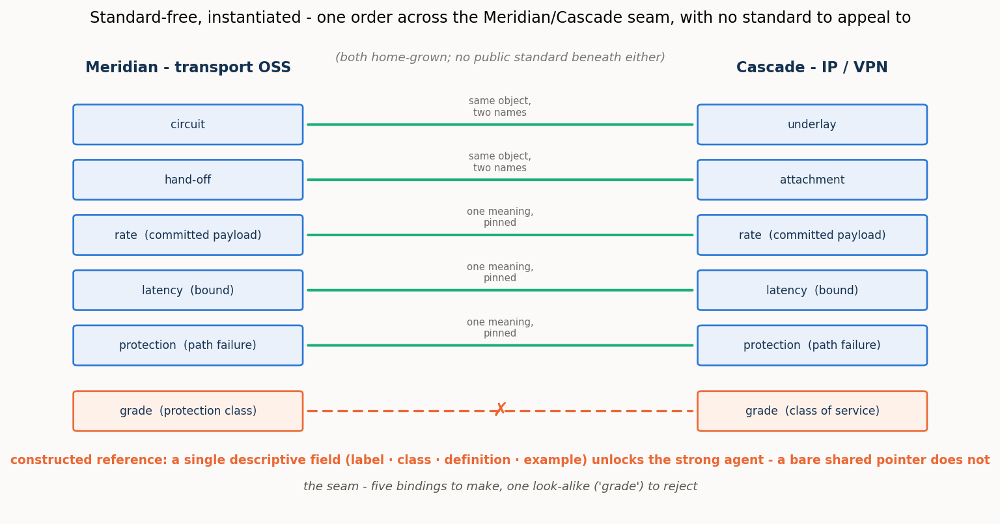

*Figure 3. One order across the Meridian/Cascade seam. Five bindings to make — two renamings and
three pins — and one false cognate, "grade", to reject, across two private vocabularies with nothing
public beneath them. A constructed reference supplies the shared ground; a single descriptive field
in it is enough to unlock a capable agent.*

**Operations under test.** A single, early **schema-binding** pass — deliberately isolated from the
rest of the process — measured across the spectrum with and without the reference the two agents
would themselves **construct**; plus a **reference-field ablation** and the **pragmatic** operation of
authority attribution (whose realm owns each shared field). The instance operation is bracketed, on
the argued grounds that it reproduces the first setting's result.

**What was proven.** The central result is a pair of **mirror-image failures** — the strong and weak
agents breaking in opposite, symmetric ways. With the constructed reference absent, the **strong agent
under-commits and the weak agent mis-commits**. The strong agent will not guess across
two foreign vocabularies — it binds only the names that already coincide (resolved fraction ~0.5 at
both-cognitive, ~0.4 once a side is inert) but at perfect precision and with no false cognate taken:
this is **omission**, deferral, not error. The weak agent does the opposite — it binds freely
(resolved fraction 0.8–1.0) at a precision that never clears 0.83 and falls to 0.57 inert, taking the
cross-domain "grade" trap: **commission**, confident error. A single thin reference remedies both:
constructed, it lifts the strong agent to a full close and lifts the weak agent's precision
toward one. Stripping the reference's fields one at a time shows what it must carry: any *single* descriptive field —
a shared label, a class, a definition, or an example — is enough to unlock the strong agent's
commitment (each drives it to a near-perfect close), while a **bare shared identifier with no
description is worse than nothing** (precision 0.50, below the no-reference floor), because the agent
binds by an opaque token and binds wrongly. The reference does not work through the shared *pointer*;
it works through the shared *description*, and even the thinnest description suffices. On the
**pragmatic** axis, the same boundary the intent setting found appears again: the reference reaches
*meaning* but not *authority* — it can pin that a rate is a committed payload, but not whose realm
governs it — and a characteristic "transport owns everything it carries" bias marks the weaker models.

**What it means.** With no public standard beneath two models, cognition still closes — but only once
it has built the shared ground, and **building that ground is the work**. The strong agent's low
reference-absent numbers are not a limit of cognition; they measure the worth of the one step the
study held back — constructing the shared reference — by running the binding pass without it. Even a
very thin ground suffices for a capable agent, provided it carries meaning and not merely a pointer.

## 10. Setting 4 — Observability: an alarm is not an anomaly

*Full report: [4/4 · Observability](REPORT_4of4_observability.md).*

**What is new.** The setting where the pragmatic operation moves from the wings to the centre. The
descriptor level — what a thing *is* — is settled by a standard, and the entire operational question
is one of **significance**: whether an observed deviation matters, and how observations compose. It
also carries the programme's deepest false cognate, an **ontological** one.

**The case (Figure 4).** **Agent F**, a legacy fault manager, emits an **alarm**: one object bundling
an event, an undesirable state, a fixed severity, and a static probable-cause. **Agent G**, an IETF
**NMOP** agent, speaks the RFC 9940 ladder, which separates what legacy conflates — event, anomaly,
symptom, fault, alarm, problem, cause, incident — and annotates each anomaly with anomaly-semantics
metadata (a concern score, a confidence score, a plane, a pattern, a lifecycle stage, a season). The
worked example is one live anomaly: a pre-FEC bit-error-rate reading on a wavelength begins to rise.
In the legacy world it fires an alarm and a page; in the NMOP world nothing is decided yet — whether
it warrants a page depends on its concern and confidence and its
context (a maintenance window makes the same deviation expected), and whether it is one incident or
many depends on correlating it, across layers, with the symptoms it causes.

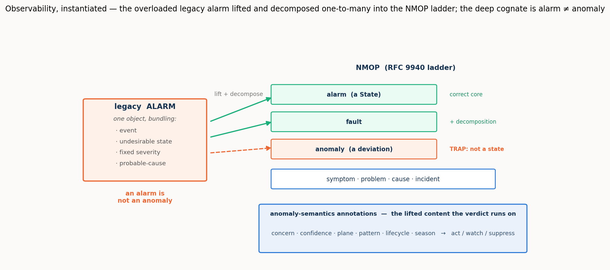

*Figure 4. The overloaded legacy alarm is lifted and **decomposed** one-to-many into the NMOP ladder:
its correct core is the NMOP alarm-State (and the fault it implies), while the trap is the **anomaly**
— an alarm is a State, an anomaly is a deviation, and conflating them is a category error, not a
mislabel. The anomaly-semantics annotations are the lifted content the significance verdict runs on.*

**Operations under test.** Two acts. **Act 1** is a **schema binding** carrying the ontological false
cognate (alarm↔anomaly, which no structural cue separates) and a **one-to-many decomposition** (the
legacy alarm maps to both the NMOP alarm-State and the fault). **Act 2** is pure **pragmatic
resolution and composition**, each run with the anomaly-semantics **ON** and **OFF**: a **verdict**
task (act / watch / suppress for each anomaly under a context) and a **correlation** task (group
cross-layer symptoms into incidents and name each cause).

**What was proven.** Three results complete the arc. First, the **ontological cognate is a clean
three-rung capability gradient**: the strong agent never conflates alarm with anomaly (with or without
the reference); the mid agent conflates them once a side is inert, and the RFC 9940-anchored reference
**rescues it completely** (the cognate vanishes, precision returns to 1.0); the weak agent conflates
them with or without the reference — beyond rescue. The lexicon pins the ontology for the middle of
the ladder, not the bottom. (The honest hard edge of Act 1 is the decomposition: even the strong
agent tends to map the alarm to the alarm-State but miss the fault constituent, so the resolved
fraction sits near 0.75.) Second, in the verdict task the **pragmatics carry the operative meaning** —
with the semantics ON the strong and mid agents suppress correctly during maintenance and the
false-page storm disappears (verdict accuracy 1.0 and 0.83, essentially no false pages); with them OFF
the legacy pipeline pages nearly everything (accuracy 0.17 and 0.08, roughly four and three-and-a-half
false pages) — **but the payoff is capability-gated**: handed the identical annotations, the weak
agent barely moves (ON 0.53 vs OFF 0.50). Third, **correlation behaves differently**: given the
resource-dependency map, *every* model — the weak one included — folds an optical degradation and the
IP loss it causes into one correctly rooted incident (perfect partition ON), and without that map
every model fails. The difference is the lesson: correlation's pragmatic is a **structural input** and
even a weak agent applies it; the verdict's pragmatic demands **judgement**, and there capability
decides.

**What it means.** Meaning (what an anomaly *is*, pinned by the reference) and significance (whether it
warrants a page and how it composes, carried by the pragmatics) are **separable, both necessary, and
each gated in its own way**. The pragmatic layer the descriptor methods never reach is real and
decisive — and itself bounded by the agent's capability. The through-line reaches its end: cognition
completes the reconciliation; a thin reference supplies the information it needs and stops at what it
does not; and the pragmatic layer is the frontier, decisive for meaning and gated by capability.

---

# Part III — Synthesis

## 11. What works, and how far

Read as one result, our detailed exploration of the four settings says first the plain thing: **ad hoc reconciliation works** —
largely as laid out, barring a few surprises. Two cognitive agents reconcile independently authored,
divergent models correctly and with no standard agreed in advance — completing an equivalence between
two standard models (setting 1), refining
and negotiating an intent against a catalogue (setting 2), binding across a private domain boundary
once they have built the shared ground (setting 3), and reading an observability world for what its
signals mean (setting 4) — measured against a validated gold across the cognition spectrum, not shown
once by hand.

The same exploration says, more sharply, **where the reconciliation needs no help**. At the
fully-cognitive end of the spectrum it completes **autonomously in every setting** — no standard
agreed in advance, no human in the loop — including the two operations that look least automatable: a two-sided
negotiation (setting 2, decision accuracy 1.0 with both sides live) and deciding, for each anomaly,
whether to act on it, watch it, or suppress it — the significance verdict, judging whether an observed
deviation actually matters (setting 4, accuracy 1.0 with the pragmatics on). The fully-cognitive end is, across all four
settings, the automatable end. That is the headline, and everything else in this synthesis is a
qualification of it: how the automation degrades as cognition recedes, what a thin reference buys
back, and where an agent too weak for the task cuts the whole thing off.

## 12. The findings, as six theses — and mapped to where they act

The results gather into six theses. Each is stated once here; §13 then reads the evidence behind them
along four cross-cutting axes, drawing the setting reports' own figures and numbers; and §14 lays the
whole out in two tables — so that when a finding says cognition (or a reference, or a pragmatic)
matters "here," the *here* is a named stage of the process, not a vague gesture.

**Thesis 1 — It is cognition that completes a reconciliation: descriptor methods carry it most of the way, then reach a ceiling and stop.**
Lexical and descriptor matching carry a reconciliation to roughly ninety percent (setting 1's
baseline: lexical surface 0.66–0.76, the lift recovering it to the mid-nineties); the remainder,
historically left to a standard or a person, is closed by live cognition instead. This is the
programme's spine, and it holds at every operation the settings put under test.

**Thesis 2 — The placement of cognition is the master variable: the further it recedes, the more the reconciliation leaves unresolved.**
What a reconciliation can achieve, cost, and verify is governed by where the cognition sits. Between
two live agents, resolution is complete in principle — unbounded interrogation and decisive virtual
experiment — so the residual is, in principle, none; as a side goes inert those mechanisms fall away
and a residual appears, precisely the shortfall from full cognition's reach. The same story holds at
the schema level (setting 1), the instance level (setting 1's budget-limited-becomes-structural
curve), the negotiation (setting 2), and the standard-free bind (setting 3). And it governs one thing
that cuts across all four settings: whether a reconciliation can be **verified to completion**. This is the crux of
the spectrum. With full cognition on both sides, the very mechanisms that close the residual — mutual
interrogation and decisive virtual experiment — also confirm the close, so the agents verify their own
result rather than assert it; as a side goes inert those mechanisms fall away, verification degrades to
a check by satisfaction, and the assurance that the reconciliation is correct weakens with it. Full cognition is therefore not
merely more accurate: it is what makes an ad hoc reconciliation **self-verifying**, and that — not
accuracy alone — is what makes it safe to automate with no standard and no person in the loop.

**Thesis 3 — A thin reference partly substitutes for cognition and supplies information, but never provides
the authority to decide.** For a capable agent on a lexical/structural task it substitutes for the reasoning
(setting 1, effort down one-to-two orders, a perfect verified close); where a side is inert it
supplies the facts interrogation no longer can (setting 2, sol 0.29→0.71 with the invariant floor;
setting 4, the RFC 9940 reference rescuing the mid agent's ontology); but where the missing ingredient
is judgement rather than fact, no reference moves it (setting 2's authority gap, setting 3's authority
attribution). Information has a published stand-in; authority does not.

**Thesis 4 — Strong and weak agents fail in opposite directions: strong agents omit, weak agents commit.** Denied
the ground it needs, a strong agent **defers** — it leaves the unresolved in the residual at perfect
precision (setting 3's under-commitment; setting 2's strong agent refusing to affirm what it cannot
verify). A weak agent **commits** — it binds freely and wrongly, takes the false cognate, and is no
less confident on a wrong answer than a right one (setting 3's mis-commitment; setting 1's traps
surviving for the weak agent). The strong agent's error is a larger residual; the weak agent's is
lower precision. This is why a reference does two different things at the two ends of the spectrum. Its
**correctness value** — pulling right the bindings that would otherwise go wrong — concentrates where
cognition is weakest: the weak agent is the one that commits false cognates, and the reference is what
disciplines it out of them. Its **effort value** — the reasoning it saves — peaks where cognition is
strongest: a capable agent that would have reasoned its own way to the answer can instead lean on the
reference and spend one-to-two orders less to get there. The strong agent needed the economy, not the
correction; the weak agent needed the correction, and could not always use it. One thin artifact,
a different benefit at each end of the spectrum.

**Thesis 5 — The pragmatic layer — what a thing means in context and whether it matters — is the frontier the descriptor methods never reach: decisive and itself gated by cognitive power.** What a reconciled thing is *for* — whether a degraded offer
is acceptable (setting 2), whose realm owns a field (setting 3), whether an anomaly warrants a page
(setting 4) — is where the operative meaning lives, and it is beyond the reach of names, glosses, and
references. It is carried by cognition (or by cognition pre-placed as a policy), and its payoff is
realised only by an agent strong enough to carry it — a matter of the agent's power, not of where
cognition is placed: handed identical annotations, the weak agent still cannot produce the verdict
(setting 4). The one exception proves the rule — where a pragmatic is
delivered as a **structural input** rather than a judgement (setting 4's correlation dependency map),
even a weak agent applies it.

**Thesis 6 — With a shared reference, reconciliation scales; and its potential fields are not of equal value.** Work
grows linearly in the number of systems with a shared reference against quadratically without one
(setting 1, to N = 12), so the reference's advantage compounds with scale independent of any
per-reconciliation effect. And not every thin reference is equal: a single descriptive field unlocks a
capable agent, but a bare identifier with no description is worse than nothing (setting 3), and a
shallow class tag can actively mislead the weak agent it was meant to help (setting 1's field-by-field
result). A reference is a safety rail carrying *meaning*, not a pointer and not a payload.

## 13. The findings in depth: four readings across the settings

The six theses state *what* was found. This section shows the evidence behind them, drawn from the
setting reports' own figures and numbers, and reads that evidence along four cross-cutting axes: the
**cognitive load** an operation costs, the **model power** the gradient demands, what the **reference**
buys, and what changes with **position on the cognition spectrum**. Each axis cuts across all four settings, and
together they are the detail the one-line theses compress.

### 13.1 Cognitive load — what each operation costs, and who pays

The most consistent number in the programme is what a weak agent costs. To reach the *same* decisions the
weak agent spends one to two orders of magnitude more reasoning than the strong one, in every setting
that measures effort (Figure 5): about **36×** in the intent negotiation (sol ~150 tokens, mini ~860,
nano ~5,400) and about **20×** in the observability verdict (sol ~60, mini ~520, nano ~1,200).
Capability buys economy as much as correctness — a weak agent does not merely make more mistakes, it
burns far more cognition making them.

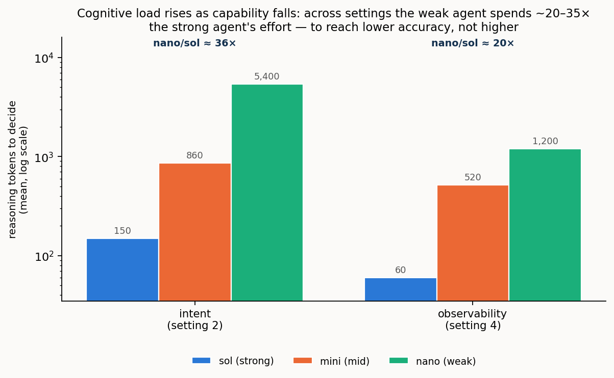

*Figure 5. Reasoning tokens to reach a decision, per model, in the two settings that measure effort
directly (log scale). The gradient is steep and consistent: the weak agent spends ~20–35× the strong
agent's effort — and, as §11 noted, to reach lower accuracy, not higher.*

The load also depends on the **operation** and on **reference support**. Where the operation is a
lookup and cognition is fully present it is cheap; where it demands search — interrogating a live
oracle to separate look-alike individuals (setting 1's instance study) — or judgement — weighing a
degraded offer, or an anomaly's concern against its context — it is dear. And for a strong agent a
thin reference is an effort *substitute*: given the anchor, sol's hidden deliberation collapses by one
to two orders of magnitude (Figure 6). But that effort saving is capability- and placement-dependent, and it
can invert: for the weak agent with a side inert, the reference *adds* effort — nano spends roughly
5,500 tokens **more** with the reference than without, straining to reconcile an inert side's meaning
against the extra material. The reference's effort benefit peaks with strong, live cognition and turns
to a burden at the weak, inert corner.

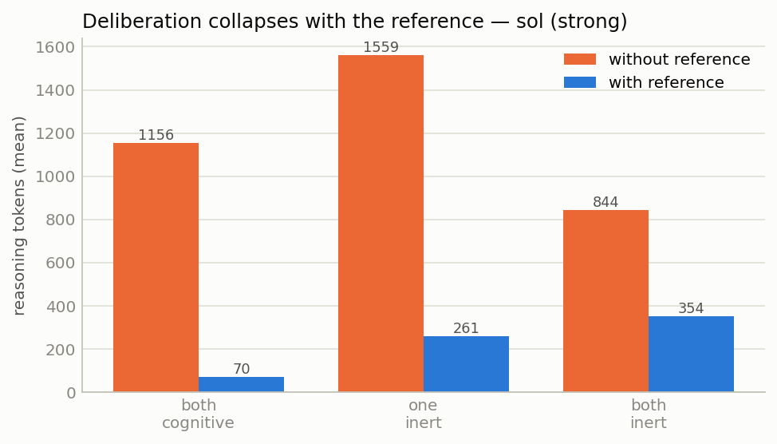

*Figure 6 (setting 1). The strong agent's reasoning tokens with and without the reference, across the
spectrum. Given the anchor, deliberation collapses by one to two orders of magnitude — the reference
doing the reasoning's work.*

### 13.2 Model power — the shape of the capability gradient

Capability does not turn a single dial; it changes the *kind* of failure. The cleanest place to watch
this is **setting 3, the cross-domain bind** (Figure 7): Meridian, a transport OSS, and Cascade, an
IP/VPN controller, are two independently authored private models with **no public standard between
them**, so no ready-made reference exists — the agents must construct the shared ground themselves.
Run that bind with the reference withheld and capability alone decides the outcome. Denied the shared
ground it needs, the strong agent **omits** and the weak agent **commits** — a mirror. Facing the two
foreign vocabularies with no constructed reference, sol binds only the names that already coincide and
leaves the rest in the residual: a low resolved fraction, but perfect precision and no trap taken. nano
does the opposite, binding freely and wrongly at a precision that never clears 0.83. The strong agent's
shortfall is a larger residual (deferral); the weak agent's is lower precision (error); and a single
thin reference remedies both, pulling each toward the top-right corner.

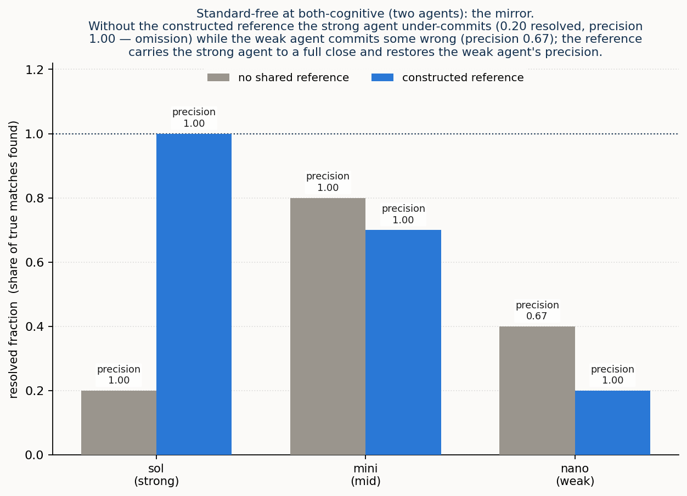

*Figure 7 (setting 3). Precision against resolved fraction, reference off (hollow) to on (filled).
Without the constructed reference sol sits top-left — commits little, all of it right — and nano
lower-right — commits much of it wrongly; the reference pulls both to the corner.*

Where a standard *can* pin the distinction, capability decides who can use it — a clean three-rung
gradient (Figure 8). On the programme's deepest false cognate, alarm↔anomaly, the strong agent never
conflates the two, with or without the reference (intrinsic mastery); the mid agent conflates them once
a side is inert, and the RFC 9940-anchored reference **rescues it completely** (the cognate's survival
goes 1.00 → 0.00); the weak agent conflates them either way (0.75 with or without — beyond rescue). The
lexicon pins the ontology for the middle of the ladder, not the bottom.

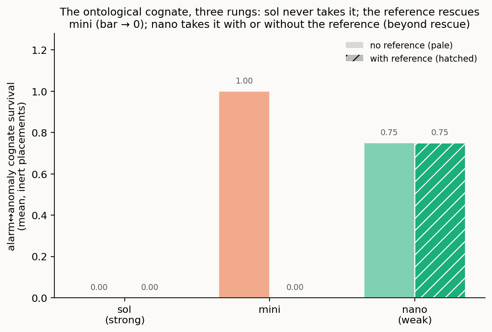

*Figure 8 (setting 4). Survival of the alarm↔anomaly cognate at the inert placements, without and with
the reference. sol never takes it; the reference drives mini to zero; nano barely moves.*

### 13.3 The reference — what it buys, by component and by placement

Not every thin reference is equal, and the difference is measurable. Ablating the reference's
descriptive fields (setting 3, strong agent, opaque identifiers) shows that any *single* field — a
shared label, a class, a definition, or an example — is enough to unlock a full close, while a **bare
shared identifier with no description is worse than nothing** (precision 0.50, below the no-reference
floor): the reference works through shared *description*, never through the pointer. And the same field
can *harm* the agent it was meant to help. This shows up in **setting 1**, the configuration
reconciliation whose look-alike terms are the programme's richest source of false cognates: there a
shallow **class** tag is, for the weak agent, the single worst condition in the programme (Figure 9),
driving cognate survival *above* even the no-reference floor — because a class surface reads as
evidence for the very cognate it should block.

*Figure 9 (setting 1). Surviving false cognates by reference content, per model. The strong agent is
immune (no bar); for the weak agent the lexical field helps most and the shallow class tag actively
hurts — the tallest bar, above the id-only floor.*

The reference's two roles run in opposite directions along the spectrum: its **effort** benefit peaks
with strong, live cognition (§13.1), while its **correctness** benefit concentrates where cognition —
and so verification — is weakest, disciplining the committing agent exactly where it would otherwise
err. And independent of any per-reconciliation effect, a shared reference changes how the work
**scales** with the number of systems. The unit here is one **reconciliation operation**: a single act
of aligning two semantic models, the same operation whose effort §13.1 meters. The question Figure 10
asks is how many such operations it takes to give *N* systems mutual semantic interoperability.
Reconciled pairwise, every system must be aligned with every other, which is N(N−1)/2 operations,
growing as N². Bound instead to one shared reference, each system is reconciled once against the anchor
and any two then interoperate *through* it: N operations, growing linearly. This is a structural count,
not an experimental average: the number of pairings needed to connect N nodes is a property of the
interoperability graph (a full mesh versus a hub-and-spoke), fixed by the topology and exact at every
N, which is why the figure is established by construction to N = 12 rather than sampled. Its standing as
a measure of *real* work rests on two things. The unit is the very operation the programme meters
everywhere else; and the linear branch is licensed by setting 1's own finding that binding to a shared
reference is *correct and composes*, so that reconciling A and B each to the anchor genuinely yields an
A↔B alignment and the mesh can be collapsed to the hub without loss. Per-operation effort (Figures 5 and 6) is then a roughly constant multiplier, so total cognitive load inherits the N-versus-N² split
directly: the count is what decides whether the whole workload grows linearly or quadratically.

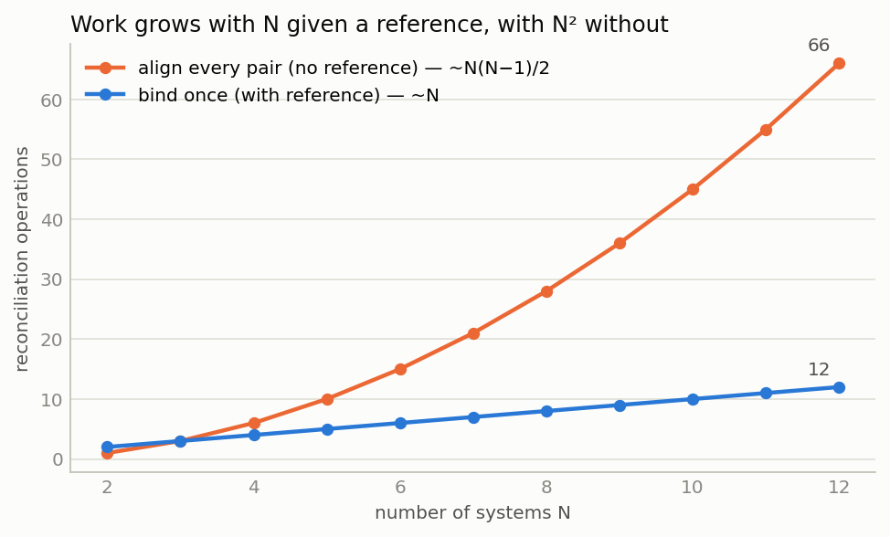

*Figure 10 (setting 1, constructed). A **count of reconciliation operations** (the pairings that must be
made) against the number of systems N: bind-once-to-a-shared-reference (~N) versus align-every-pair
(~N²). A structural count established by construction to N = 12, not a measurement of reasoning effort;
contrast Figures 5 and 6, which measure cognitive load directly.*

### 13.4 Position on the cognition spectrum — what degrades, and how

Position on the cognition spectrum is the master variable, and moving along it degrades a reconciliation
in a specific, measured way. This is sharpest in **setting 2**, the intent setting, where a consumer and a provider negotiate an
intent to a workable deal, and the crux is a pragmatic judgement: whether a degraded counter-offer is
acceptable to the customer. Across the cognition spectrum (Figure 11) that decision closes autonomously
while the customer's judgement is present — live at both-cognitive, or **pre-placed as a portable
policy** — and falls to the floor at the mute and both-inert placements, where the correct behaviour is
to refer the decision to a person. The pre-placed policy is the mechanism that holds the line where a mute customer
cannot: cognition placed in a portable artefact ahead of time closes autonomously what a mute
description must hand off.

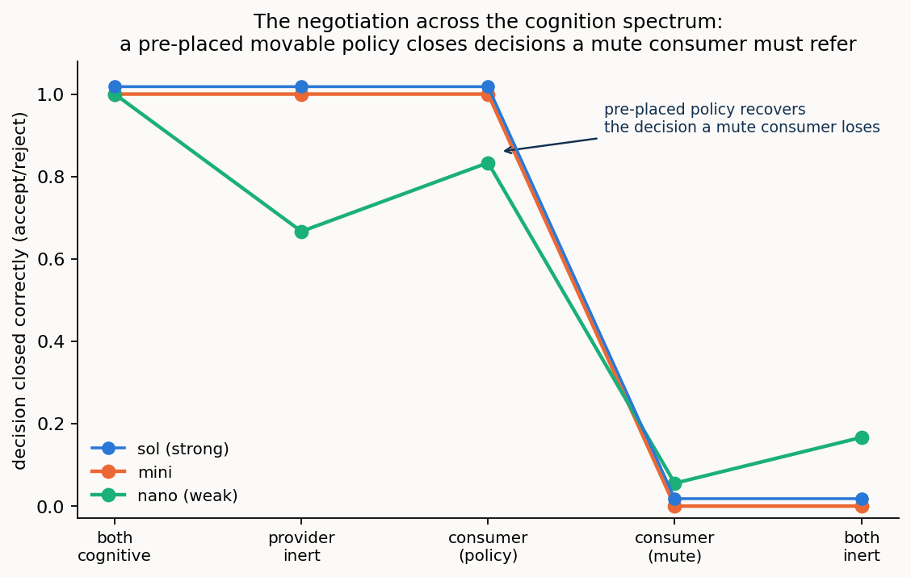

*Figure 11 (setting 2). Decision accuracy across the cognition spectrum. It holds high while the
customer's judgement is present — live, or pre-placed in a movable policy — and collapses to referral
at consumer-mute and both-inert.*

The same logic reaches down to the **instance** level in **setting 1**. Instance co-reference is
deciding which individual on one side is the same as which on the other. Most pairs are settled from the
models alone, but some are genuine look-alikes — structurally identical devices, or same-named but
distinct services — that the static descriptions simply cannot separate. Telling those apart means
*acting on the live system*: interrogating it, or provisioning something and reading it back. The number
of such live probes the agent is permitted is its **probe budget**.

Whether spending that budget actually resolves the hard cases depends on placement, and Figure 12 shows
why by crossing the two: it sweeps the probe budget (none, bounded, unbounded) at each of two spectrum
placements. At **both-cognitive** the live side is there to be interrogated, so more budget resolves
more — the residual falls to zero at unbounded budget. This is what **budget-limited** means: enough
probing closes it. At **one-inert** the inert side is a static description with nothing live to
interrogate, so the same unbounded budget barely moves the residual (it reaches only 0.08). This is what
**structural** means: no budget can close it.

The two are crossed, not confounded — the identical budget sweep is run at both placements — so the
curves isolate their *interaction*: probing pays off only where cognition is placed to be interrogated.
That is Thesis 2 made concrete on a measured curve. The residual is fixed not by how hard the agent
works but by where the cognition sits: at both-cognitive, effort (budget) buys a complete close; at
one-inert, no effort can, because the thing that would answer the probe is not there to answer it.

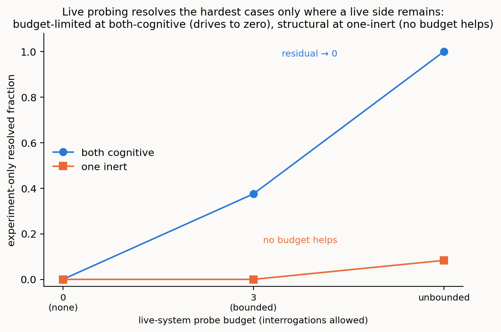

*Figure 12 (setting 1). The hardest look-alike individuals, for the strong agent: what fraction gets
resolved as the live-system probe budget is swept from none through bounded to unbounded, at two spectrum
placements. Budget (the x-axis) and placement (the two lines) are crossed, so the curves isolate their
interaction. At **both-cognitive** a live side can be interrogated and the residual is budget-limited —
it drives to zero as probes are spent. At **one-inert** there is nothing live to probe and it is
structural — no budget helps. Same sweep, opposite outcomes, decided by placement, not by effort.*

## 14. The maps

The four readings above are the evidence; the two tables below are the index to it. The first locates
every finding on the **cognition spectrum** — the master variable — and the second on the **operation**
it acts on, so that "cognition matters here" always resolves to a named row.

**Table 1 — the cognition spectrum, and what happens at each placement.** The rows are the master
variable; the columns say what the reconciliation can do, what it leaves in the residual, and what a
reference can buy — consolidated across all four settings.

| placement | what the reconciliation can do | the residual | what a reference buys |
|---|---|---|---|
| **both-cognitive** | completes **autonomously** in every setting — bind, negotiate, verdict | none, in principle | partly substitutes for cognition (effort ↓ 1–2 orders); little correctness room left |
| **one-inert** | live side reconstructs the mute side; probes gone, so some resolutions turn **structural** | grows — the shortfall appears | supplies missing **information**; rescues the mid agent (ontology, satisfaction) |
| **both-inert** | third party can only **propose** for adjudication; no interrogation, no experiment | largest; every judgement referred onward | supplies information, **not authority** — cannot move a judgement |
| **pre-placed policy** (intent) | closes the decisions the policy was **authorised** for — pushes the hand-off boundary outward | only the un-authorised judgements | policy carries the **authority**; a reference still cannot |

**Table 2 — the operations of a reconciliation, and where each was put under test.** The rows are the
process stages of §3; a cell says how the setting exercised that operation, or "—" where it did not.
This is the map for locating any finding on the process: the *here* of "cognition matters here" is a row.

| operation (the *where*) | 1 · Configuration | 2 · Intent | 3 · Cross-domain | 4 · Observability |
|---|---|---|---|---|
| **Lift** | founds it; the lift is the lever (0.66–0.76 → 0.92–0.97) | reused | reused; both sides private | alarm lifted and **decomposed** |
| **Reference construction** | given (lexical) | given (unit / invariant) | **constructed** — the pivotal act | given (RFC 9940-anchored) |
| **Schema binding** (lexical, ontological) | equivalence; reference **substitutes** | shared ground for satisfaction | **the measured stage**: omission vs commission | **ontological** cognate; 3-rung gradient |
| **Attribute pinning** | — | bound vs measured metric | committed vs line rate | severity / scores |
| **Instance co-reference** | budget-limited → **structural** | same gradient (endpoints) | bracketed (reproduces s.1) | bracketed (reproduces s.1) |
| **Verification** | own step; catches cognates, holds resolved fraction | by **satisfaction** | downstream of the isolated pass | verdict stands in |
| **Pragmatic resolution** | left untouched (deferred) | movable **policy**; authority ≠ information | **authority** attribution; reference pins meaning, not authority | **verdict** carries operative meaning; capability-gated |
| **Composition / correlation** | — | — | — | robust with the dependency map (all models) |
| **Lifecycle recurrence** | — | four-hop loop (self-heal, refer, restore) | — | — |
| **Scaling** | linear vs quadratic (N = 12) | — | — | — |

## 15. The surprises

Four results ran against the naive expectation, and they are worth stating as findings rather than
smoothing away.

**A strong agent scoring *lower* is often a strong agent behaving *better*.** Blind at both-inert, the
strong agent refuses to affirm what it cannot verify and scores below the mid agent (setting 2's
satisfaction 0.29 vs 0.71; setting 3's under-commitment). This is not weakness; it is the honest
deferral of Thesis 4, and it is exactly the behaviour a published reference or a live probe converts
into a confident, correct close. A raw accuracy number, read without the precision beside it,
misjudges it.

**A bare shared pointer is worse than no reference at all.** One might expect any shared anchor to
help; setting 3's ablation shows an opaque identifier with no description dropping precision below the
no-reference floor (0.50), because the agent binds by the token and binds wrongly. The reference works
through shared *description*, never through the pointer — and the corollary (setting 1) is that a
shallow *class* tag, the thinnest description, can mislead the weak agent it was meant to help.

**The richer content that raises a weak agent's reach also raises its exposure.** The lifted content
and instances that let an agent find more correspondences also hand a weak agent more surface to
misfire on — its instances turn toxic, over-read as evidence of identity (setting 1's baseline). The
lift is unambiguously the lever and unambiguously safe for the strong agent; for the weak agent it is
double-edged.

**Two operations in the same setting place opposite demands on the agent.** In observability, the
verdict (a judgement over concern, confidence, and context) is sharply capability-gated, while the
correlation (an application of a dependency graph) is robust across the whole ladder. Both resolve
significance from the same pragmatic information and both are decisive, but one demands judgement and
one is a structural input, and that distinction, not the label "pragmatic," predicts whether a weak
agent can do it.

## 16. Scope, threats, and what remains

The claims here are **existential and mechanistic** — *this is how ad hoc reconciliation works, and
here it is working* — not population estimates. Each setting rests on a single seeded case, built to
exercise each mechanism and prove each trap rather than sampled from a distribution, with a small
number of trials; the reported patterns are the ones stable across the model ladder and the treatment
toggles, and the numbers are indicative rather than tight. The model ladder is three points spanning a
capability range, so the *shape* of the gradient between the points is not resolved. Golds are derived
from the models and validated, which removes drift but leaves the modelling choices — including
setting 4's verdict thresholds, stated openly — as authored rather than found. Public standards may
have been seen in training, which could flatter the no-reference conditions; the effect relied on
throughout is the *difference* a treatment makes under identical inputs.

Two scoping decisions bound the reading of specific settings. Setting 3 measures a **single-pass schema
binding** with the reference-construction step bracketed, so its reference-absent numbers measure the
worth of that one step, not a limit of cognition; a direct test of the full **construct-then-bind**
protocol — the agents building the reference themselves and then closing, with none pre-given — is the
clean way to confirm the thesis in the hardest setting, and is left to further work. And
**instance-level co-reference** is measured in full only in setting 1; the later settings bracket it on
the argued grounds that it reproduces that result. Larger and more varied cases, more rungs on the
ladder, and the end-to-end construct-then-bind run are the natural next steps.

## 17. In one paragraph

Two systems that can reason do not need a standard agreed in advance to work together; they can lift
their data into portable, self-describing semantic models and reconcile those models ad hoc, for the
occasion. Across four settings — configuration, intent, cross-domain, and observability — that is what
happens: at the fully-cognitive end the reconciliation completes autonomously in every case, negotiations
and significance verdicts included, with no standard and no human. Cognition is what completes it;
descriptor methods carry it most of the way, then stop, and the placement of cognition governs how much
of the remainder is closed by machine and how much is honestly referred onward. A thin published
reference earns its place inside this frame — partly substituting for a capable agent's reasoning,
supplying a live agent the facts it can no longer get from an inert side, and, across many systems,
making the work grow linearly instead of quadratically — but its reach ends at information: it never
provides the authority to decide (whose value governs, whether a trade-off is acceptable), and it must
carry meaning rather than a bare pointer to help at all. And the
pragmatic layer — what a reconciled thing is for, whether it matters, who decides — is the frontier the
descriptor methods never reach: decisive for meaning, carried by cognition or by cognition pre-placed
as a policy, and realised only by an agent capable enough to carry it. That pragmatic layer, and the
question of how capable an agent must be to work in it, are where the next work lies.
