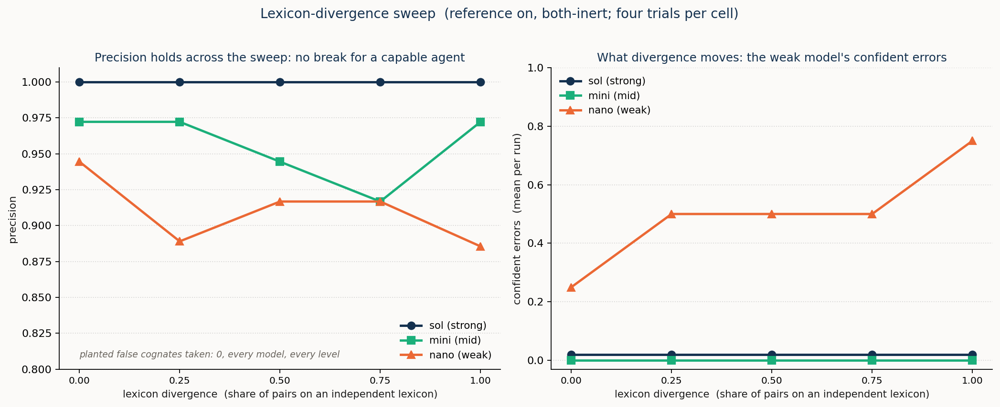
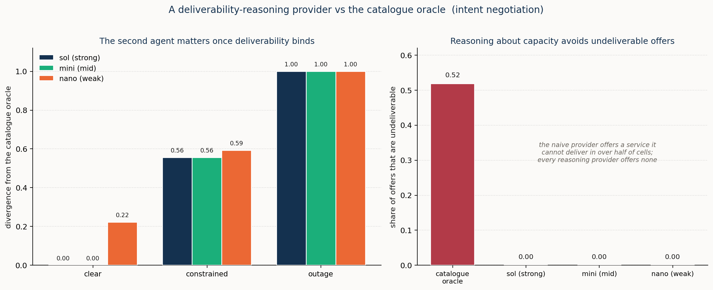

# Portable semantic models and ad hoc reconciliation by cognitive agents

> *Programme abstract: Two software systems that must exchange information rarely fully share a model of
> the world, and the classical answer, to agree a common standard in advance, is expensive, slow, and
> permanently behind the systems it governs. This programme asks what changes once the systems can
> **reason**. Its central object is the **portable semantic model**: a model lifted from a system's data
> so that any sufficiently-reasoning agent can pick it up and use it from the package alone, with no
> pre-agreed standard. **Part 1** defines portability and shows how a **lift** produces it. How well that
> production succeeds depends on where the cognition sits: a live source that describes itself, an inert
> one reconstructed by an agent, or a human. Part 1 also treats the **reference** as a common-ground
> anchoring device on two independent axes: how critical it is, and where it comes from. It then measures
> portability directly. A solid lift is comprehensible to strong, middle, and even weak reasoners, across
> six cases and across model families, softening only for the weakest reasoner on the hardest material. A
> meaning-poor surface is the one thing that breaks it; a reference used in the lift is the repair.
> **Part 2** takes up **reconciliation**: aligning two independently-built models of an overlapping domain
> so the systems can interoperate. It is a flagship use of portable models, and bridging the divergence
> between the two is the work. Its difficulty is set by two independent things: the divergence between the
> two models, which only cognition bridges; and any shortfall in either lift's portability, which adds
> burden by leaving meaning for the other side to reconstruct. It maps the space of divergences, then
> measures reconciliation in **four operational scenarios** of network and service management
> (configuration, intent, cross-domain provisioning, observability), scoring every outcome against a
> validated gold standard while varying the live cognition on the two sides from both, through one, to
> neither. The through-line the scenarios establish is one thesis: **cognition is what closes a
> reconciliation**. It bridges the divergence that matching on names and descriptions alone cannot. A thin
> reference can partly stand in for that cognition, and can supply the facts an inert side can no longer
> provide, but never the authority to decide whose value governs when two sides conflict — the one
> decision that stays with a human.*


---

# Part 1: The lift, and the portable model it produces


## 1. The burden, and a question worth asking

Two software systems that must exchange information rarely fully share a model of the world. The scope a
model must cover is not fixed, the useful level of abstraction depends on the task, and capable
engineers, working independently, produce different but defensible models of the same network. The
classical remedy is a standard model agreed ahead of time: everyone adopts one vocabulary, and the
reconciliation is done once, by committee, before the systems ever meet. That remedy is expensive,
slow, and permanently behind the systems it tries to govern — a standards quest that never quite ends,
because the world it models keeps moving.

So it is worth asking a question that, until recently, would have sounded absurd: **do two sufficiently
capable systems need a data model agreed in advance at all — or can they produce a suitable one
themselves, for the occasion?** The question is not whether models stop mattering. It is whether the
*pre-agreement* — the part that is slow and expensive — is still required if the systems on each
side can **reason**.

This has to be asked with both feet on the floor. The installed base is enormous and mostly inert:
decades of systems that cannot explain themselves, data of mixed and often poor quality, and
high-reliability operations that must keep working in all circumstances. Nothing here proposes ignoring
that. The claim this programme investigates is narrower and, we will argue, more useful: that
production of a shared understanding, and agreement upon it, can increasingly be done **ad hoc** —
between the systems, for the task at hand, machine-to-machine — lifting the pre-agreement burden while
coexisting with the legacy it cannot replace. The answer we reach is *yes, with real
qualifications* — and those qualifications are the substance of what follows, not a hedge on it.

Everything in Part 1 is about the object that makes an affirmative answer possible: a semantic model
that can stand on its own. We first say precisely what "stand on its own" means, then how such a model
is produced, then whether it actually holds up when handed to a cold reader. Part 2 takes up the hard
case — two such models that must be made to work together — the flagship use of the object Part 1
produces.

## 2. What would it mean for a model to stand on its own? Portability

The concept at the centre of the programme is **portability**, and it is worth defining before
anything else, because everything downstream is either its production, its measurement, or its use.

> **A lifted model is *portable* when any agent of sufficient reasoning power, but without prior domain
> knowledge of the system, can make arbitrary use of it without seeking clarification that does not lie
> within the package. The package is what the model features directly, together with any reference it
> resolvably points to; live parts (current values, present state) may need refreshing.**

Four things in that definition carry weight, and each draws a boundary that recurs throughout the programme.

Portability is **monadic** — a term we use in its strict sense, a property that belongs to *one* thing
on its own (as opposed to a *dyadic* property, a relation between two things). Portability is a property of one
lifted model, produced by one lift. Model A is portable if an arbitrary cognitive agent can comprehend
and use it; that is true or false about A on its own, before any second system exists. Testing it needs a consumer, but the consumer is any
*separate* agent brought in only to probe A — a planner, an auditor, a human — not a peer that also
carries a model. This matters because it locates the primary object. The two-system dance of *reconciliation* is a
downstream operation; portability is what each side brings to it.

"Reasoning, not knowledge" is what keeps the definition from collapsing into circularity. A
sufficiently-reasoning agent *derives* the model's meaning from the package; it does not check the
model against pre-held concepts of *this* system, because it holds none. The bar is a reasoning
*threshold*, universal above it, not a store of insider familiarity. This is what *ad hoc* means — an
understanding built to purpose, for the case at hand — restated as a property: no pre-shared standard is
required, only a competent reader.

The bar on clarification from outside the package carves off what portability does not cover, and there are
two such things — both matters of *decision*, not of *meaning*. Updating a value the package already
declares — reading a live counter, refreshing present state — is not external clarification; a portable
model can have live parts. But two kinds of question lie outside any package. One is an **authority
fact** — *whose right it is* to set a contested value — a matter of governance, not of what the model
means, which stays where the owning authority lives. The other is a **genuine underdetermination** — a
question no fact anywhere settles, whose answer must be *stipulated* rather than recovered. Neither is a
meaning a sufficient reasoner can derive. The frame has a clean edge: self-sufficient for what a model
*means* and how to *use* it, and rightly not self-sufficient for what must be *decided* — who governs a
value, or what no fact determines.

The payoff of defining portability this way is that it changes what *capability* means. Whether a reader
can use a model stops being a fixed fact about the reader and becomes something the **lift** can move: a
good lift makes each concept self-describing, which adds no knowledge to the reader but lowers the
reasoning it must bring to use the model. A self-describing package is usable by a modest reasoner; a
bare one demands a strong reasoner to reconstruct the meaning — and, as the measurements will show, a
middling reasoner will confabulate it. The better the lift, the less reasoning the consumer must supply.

Much of that lowering is done by one mechanism, and because it recurs from here on it is worth naming now: a
**reference**. A reference is a small, shared vocabulary of common ground — a flat set of entries a lift
can tie its local terms to, *anchoring* each term to something a competent reader already holds. That
anchoring is how a lift lowers the reasoning threshold without adding knowledge: the reader recognises
the common ground rather than reconstructing the meaning. A reference is deliberately thin, and it
anchors rather than *standardises* — it is not the universal model-agreed-in-advance the approach exists
to avoid. §5 develops how critical it is and where it comes from; its role is already in play in the
examples that follow.

## 3. How is a portable model produced? The lift

Portability is produced by the **lift** (Figure 1).

A system usually holds its content as a **data model**: a schema and its records as they sit in a
database or a controller. That content is already a partial semantic picture, but a fixed one, frozen
by the format it uses: a field named `och_grade` with values `1`, `2`, `3` is legible to the software
and engineers built around its schema, yet says nothing, on its own, to a consumer that was not told
what it means; the meaning lives in a specification and in shared convention, outside the data itself.
The **lift** is the move from that to a **semantic model**: the same content given grounded, explicit
meaning, structured as three parts. First, an **ontology**, which includes its **lexicon**: a
schematic layer (the concepts, their kinds and relations, and their preferred labels and any synonyms) and a concrete layer (the individual instances that populate those concepts). Second,
**pragmatics**: the contextual information a consumer needs (what a thing is for, whose authority
governs it, in what context it holds). Third, **provenance**: who asserted each part, by what method,
and how firmly. The lift itself is a **cognitive act**, helped along by a few **supports** that are
aids to that cognition rather than parts of the model: definitions, worked examples, a canonical
example, and an optional link to a shared reference. Who performs that cognitive act — and what
happens to the lift as the available cognition shifts — is a spectrum in its own right, taken up in §4.


*Figure 1. The lift. A data model (schema plus records) is a partial semantic picture, fixed by its
format, with much of its meaning left implicit: in specifications, convention, and the engineers who
built around it. The lift is a cognitive act, aided by a few supports (definitions, worked examples, a
canonical example, an optional linked reference), that turns the data model into an ad hoc semantic
model built from three parts: an ontology including its lexicon (a schematic layer of concepts, kinds
and relations, the TBox, and the concrete instances that populate them, the ABox), pragmatics (use,
authority, context), and provenance. Being self-describing, the result is portable: any cognitive
consumer can pick it up and understand it, with no pre-agreed standard.*

A lifted semantic model is **self-describing**, and being self-describing is exactly what makes it
**portable**: it lets any cognitive consumer — this agent, another agent, a human — pick it up and
understand it without a prior agreement. That is not a convenience; it is the
precondition for the whole approach. Every cognitive use of a model — reasoning over it, planning with
it, auditing it, reconciling it with another — requires meaning made explicit, and the lift is how
meaning is made explicit on demand rather than by standardisation. Reconciliation, the subject of Part
2, is one such use; the scenarios that follow also refine an intent against a catalogue and read an
anomaly for its significance, all over the same lifted substrate. Get the lift right, and the rest is
operations over portable semantic models.

To make this concrete, here is one of a lifted model's concepts, the TAPI connectivity-service from the
flagship configuration case (a model is the list of such concepts under a short header):

```json
{ "id": "t.cs", "label": "connectivity-service", "kind": "service",
  "synonyms": ["service"], "ref": "connection-service",
  "gloss": "an end-to-end connectivity service across the network",
  "example": "the A1-A3 ODU2 service",
  "relations": [ {"rel": "uses", "target": "t.sip"},
                 {"rel": "realized-by", "target": "t.cep"},
                 {"rel": "over", "target": "t.topo"} ],
  "instances": ["cs-a1a3-odu2 (ODU2, A1 to A3)"],
  "pragmatics": { "use": "the billable, SLA-bearing unit of connectivity",
                  "authority": "owned by the service layer; the transport side may not redefine its grade" },
  "provenance": { "asserted-by": "the ONF TAPI controller", "method": "context export", "firmness": "authoritative" } }
```

The fields carry the lexicon (label, synonyms), the ontology (kind, relations), the concrete layer
(instances), the **pragmatics** (use, authority), the **provenance** (who asserted it, by what method,
how firmly), the explanation supports (gloss, example), and the binding to a shared reference (ref). A
live side volunteers the meaning-bearing fields — gloss, example, and pragmatics; an inert side exposes
only the structural ones, and its provenance and authority must be supplied from outside. The **structural** content
is independent of its serialisation: the lexicon, ontology, and instances shown here as JSON emit just
as readily as OWL/RDF, which is also how a deterministic pipeline that compiles a formal schema (such as
YANG) to an ontology carries them. The meaning-bearing content our JSON concepts also carry — the
pragmatics and provenance, and the glosses and examples that make even the ontology readable by a
stranger — is what such a compiler cannot supply, because a formal schema does not contain it; and, as
§8 shows, even a full ontology format holds the pragmatic layer only as inert annotation, not as
something a reasoner can act on.

One framing connects this work to a fast-growing body of practice. The ontology and the individuals
that populate it are, together, a **knowledge graph**: the ontology is its schema (the typed concepts
and the relations permitted among them) and the instances are its assertions. This is why the
community's knowledge-graph work for network operations, and the AI-facing modelling interfaces now
emerging, meet this approach squarely: a lifted semantic model **contains** a knowledge graph a machine
can consume — its ontology and instances — and a thin shared reference is exactly the kind of
interoperable anchor such graphs can bind to. What the semantic model adds beyond the bare graph is the pragmatic layer and the provenance base —
and, as the findings will show, exactly the facets a thin reference cannot supply on its own.

## 4. The lift is a cognitive act — where that cognition lies, and what limits it

Calling the lift a cognitive act forces the question of *whose* cognition performs it, and what
happens to the lift as that cognition thins. This is a spectrum on the **production** side — the
**lift-cognition spectrum**, distinct from the cognition spectrum that governs reconciliation in Part 2 —
and it decides both how the lift is done and how far it reaches.

At the richest end, the source system is itself live and cognitive and **lifts itself**. It authors
its own meaning — volunteering glosses, worked examples, the intent behind a field — because it is the
authority on what it holds. A self-lift depends least on anything outside it: the meaning is put in at
the source, by the party that knows it.

Where the source is **inert** — a mute schema and its records, unable to explain itself — the cognition
must come from **a machine agent that reads it**, reconstructing meaning from the surface: labels,
kinds, structural relations, and instances. This is not hypothetical. §7 has an agent produce the
lift from the schema surface alone, and a capable reader recovers a portable model from an inert source;
the downstream reconciliation results are unaffected by who performs the lift (§19.8). But this reading is **bounded by what
the surface carries**, and §6 measures that bound directly — as the surface goes meaning-poor, the
portability of the recovered model falls, and, in the sharpest form of the finding, a surface that
keeps a concept's *name* but not its meaning is no safer than an anonymous one, because a bare name
invites the reader to confabulate a sense for it.

At the far end — wherever machine cognition is absent, insufficient, or facing a question it cannot
settle — **a human** performs or completes the lift, as engineers have always modelled systems by hand.
That human-completed part is the same residue §2's definition carved off, now seen on the production
side, and it has two natures. Most of it is a **capability** gap: work a given agent cannot do that a
stronger one could, so it shrinks as the cognition performing the lift grows. The rest is
**irreducible** — it never leaves the human at any capability — and it is exactly what §2 set outside the
package: the **authority** to set a contested value, and any **genuine underdetermination** no fact can
settle. Those are not meanings to be recovered, so no lift, however capable, reaches them.

The through-line is a single limit: **the lift recovers as much meaning as the cognition performing it
can bring to bear on the material in front of it** — abundant when a live source explains itself, ample
when a strong agent reads a rich surface, thinning as the source goes inert, the surface goes
meaning-poor, or the agent goes weak. Where the recovery falls short, the shortfall must be supplied
from somewhere. Ideally that somewhere is the **reference** — and wherever a reference cannot supply it
and a human must, the automation of the lift is to that extent incomplete.

## 5. The reference: how critical it is, and where it comes from

A reference, introduced in §2, helps supply the meaning a lift cannot recover on its own. What it
*is* matters: not a **reconciliation device** but a **common-ground anchoring device** — it ties a
model's local terms to ground a competent reader already holds, useful to *any* consumer, not only to a
second model. It is deliberately "thin": a flat set of entries, each an identity anchor plus a
few descriptive fields (a label and synonyms, a shallow class, a one-line definition, a canonical
example). It has no ontology of its own — giving it one would turn it back into the universal standard the
approach exists to avoid — and it carries no meaning by itself: it works only by tying a model's terms to common ground the reader already understands, borrowing that meaning rather than restating it. That is exactly why it can be thin. Two independent things about it then matter, and conflating them invites confusion: *how critical*
it is, and *where it comes from*. The figures this section cites are results established by the
measurements that follow — portability in §6, the reconciliation cases in Part 2 — pointed forward as
they arise.

**How critical it is — and this tracks the lift-cognition spectrum of §4.** The reference is not
uniformly important; its criticality is highest exactly where cognition is weakest. When a strong agent
lifts a rich source, the model comes out self-describing and the reference is nearly redundant — the
baseline in §6 shows a solid lift staying portable with the reference *not available* at consumption. When
the source is inert or its surface is meaning-poor, the reference becomes the thing that makes the lift
portable at all — §6's degradation result has a reference used *in the lift* pulling a broken lift's **meaning score** (§6's comprehensibility measure) from 0.64–0.74 back up to 0.79–0.85, against a solid-lift baseline of 0.94. The same shape appears on the consumption side across the reasoning
ladder: a strong reader needs no glossary, a weak one is rescued by it. One anchor, its value
concentrated wherever the cognition around it runs thin.

**Where it comes from — a second, independent spectrum.** A reference may be *pre-existing* — an
authored standard taken off the shelf — or *constructed by cognition as part of the lift itself*, where
no standard exists (the construct-then-bind result, §19.6), with a possible middle ground of adapting or
extending an existing reference to fit. That cognition can manufacture common ground at all is not
mysterious once portability is the frame: common ground is not a formal shared ontology but what
competent agents already hold in common — both sides reconciling transport-network models, for instance, already share the notions of a **bearer**, a **committed rate**, and a **protection scheme**, even when their own models name them differently. This is also why anchoring is
**capability-independent** where *live elicitation* — drawing meaning out of a party by questioning it
in real time — is not: anchoring meets a reader where it already stands, while elicitation demands the
cognition to ask the right questions and read the answers. And it is why the constructed reference is
load-bearing precisely in the standard-free scenarios, where there is nothing on the shelf to reach for.

**When it acts** brings the two spectra together, and here one apparently natural case drops out. A
reference can act at *production* (used by the lifter, while the model is built) or at *consumption*
(handed to the reader alongside the finished model), giving three meaningful conditions — no reference
at all; a reference used *in the lift only* and not available at consumption; and a reference *in the
lift and at consumption*. The fourth (a reference handed to the reader at consumption but never used in the lift) adds nothing where
it matters. Using it means the reader must work out for itself how the raw, unimproved model maps onto the
reference, and only a strong reader can do that. But that reader could already read the raw model with no
reference at all, so a consumption-only reference helps only those who did not need help. A reference earns
its keep at **production**. This sharpens the portability criterion into something testable. A good lift makes each
concept's meaning recoverable without reaching outside for it — it can **dissolve** the reference into
each concept's own description, or point to a reference that is itself accessible; either way nothing
needed goes missing. A poor lift leaves **dangling pointers** — bare tokens with no meaning recoverable
behind them — that go slack the moment the reference is absent. The middle condition — the model
comprehensible with the reference used in the lift but *not available* at consumption — is the clean
test of the self-contained form: proof that meaning was baked in rather than left hanging. It is the
measurement Part 1 takes up next.

The reference plays two roles, not one. To a single consumer it **supplies meaning** — the monadic,
portability role, the one a good lift can dissolve away. To a *pair* of models being reconciled it is
also **shared common ground**: when both anchor to the same entry, their correspondence becomes directly
derivable — a dyadic role, on the divergence axis of §10, that good lifting does *not* dissolve and that
matters most where cognition is weak or the models diverge sharply. Because of this, dissolving the
reference away is an option, not an obligation: a self-contained model and a model that points to an
accessible reference are equally portable, the portability criterion requiring only that nothing a consumer needs is out
of reach. So a producer who could fully dissolve the reference for a strong solitary reader may still
ship or point to it deliberately, to serve downstream uses it cannot foresee — a weaker consumer it
rescues, a reconciliation it makes cheap. Portability is achieved either way; the shared reference
simply buys more.

## 6. Does it actually work? Assessing comprehensibility

A claim that lifts produce portable models is empty unless portability can be measured directly,
decoupled from any downstream use. It can, and the rest of this section is the evidence.

**The instrument.** We turn the definition into a measurement by assessing **comprehensibility**: the
share of a model's concepts that an independent agent can correctly explain *from the package alone*.
One lifted model is handed to a **consumer agent** of a specified reasoning tier that did not author
it and holds no insider knowledge of the system. The consumer explains each probed concept in its own
words; it is explicitly permitted to answer that it *cannot determine* the meaning from what it was
given, because an honest abstention is a desired response, not a forced guess. A fixed strong **judge**,
one model held constant across the study, grades each explanation by *meaning, not wording* against an
authored answer key. It returns one of four verdicts: **faithful** (captures the true meaning),
**partial** (right direction, hedged), **abstained** (the consumer declared it could not be determined
from the package, a virtue when the meaning is absent), or **invented** (asserts a meaning the key does
not support, for instance by taking a planted cognate — the confabulation hazard the measure exists to
catch). From the
per-concept verdicts we report three fractions: **meaning_score** (fraction faithful — the
comprehensibility measure), **abstention_rate** (honest deferral), and **confabulation_rate** (the
hazard). The consumer runs across a **reasoning ladder** — a strong (`gpt-5.6-sol`, **sol**), a mid (`gpt-5-mini`, **mini**), and a
weak (`gpt-5-nano`, **nano**) model, three tiers of a single family (OpenAI's `gpt-5.x` line) — chosen
to isolate reasoning strength rather than provider or architecture. The
full protocol, ground-truth authoring, and worked examples are in the methods section.

The findings below are stated once as headlines, then supported. Read the headlines for the story; the
paragraphs beneath carry the evidence.

> **A solidly lifted model is almost always fully comprehensible from the package alone. Comprehension is
> perfect for a strong reader everywhere, and for every reader on routine material; it softens only for
> weaker readers on the hardest material, and even there it never collapses.**

On a solid lift with no reference at consumption, meaning_score across the ladder is near the ceiling
and softens only on the hardest material: on the cross-domain seam (concepts from two unrelated domains, with no shared vocabulary to lean on), `sol` 1.00 / `mini` 0.87 / `nano`
0.73; on the large, deliberately hard case, 1.00 / 0.94 / 0.89; on the routine case, 1.00 / 1.00 /
1.00. Even the weak reasoner comprehends a good lift from the package alone — perfectly on routine
material, around 0.9 on hard material, softening to 0.73 only on the very hardest. Portability holds
nearly capability-independently, a soft gradient on hard material rather than a cliff. The consumption-
time reference, added on top, is a small and capability-dependent top-up exactly where the bare lift
fell short (cross-domain `mini` 0.87→1.00, `nano` 0.73→0.93) and does nothing where the lift already
sufficed. The reference did its real work at lift time.

> **The result holds across six independent cases, not one.**

The same assessment run over three further scenarios — carrier-Ethernet service, fault/observability,
and L3VPN — returns bare meaning_score 0.98 and anchored 1.00 in every one, with confabulation near
zero, matching the original three. "Solid lifts are portable" rests on six cases spanning
configuration, cross-domain, and observability, not on a single worked case.

> **Portability is not an artefact of one model family — it tracks reasoning, not lineage.**

The most direct objection to a within-family result is that a model is simply reading its own kind of
output. To close it, we held the *judge* fixed on the original family and varied only the *consumer's*
family. A **strong consumer from another family** (DeepSeek) comprehends the same lift cold — bare 0.98,
anchored 0.96, confabulation near zero — matching the in-family strong tier and beating the in-family
weak tier's bare 0.87. An open weak model (Qwen-2.5-7B) does markedly worse — bare 0.56, anchored 0.69
— and confabulates: its per-trial scores are bimodal, either nailing a case or missing it entirely. That
contrast is the point, not an embarrassment. Portability is **capability-banded** — and the capability
that sets the band is the **consumer's**: the reasoning power of whatever model reads the lifted
package. The band is set by that reasoning, not by family — a *strong* consumer from another family
comprehends a lift as well as the home strong one, while a *weak* consumer is unreliable whatever its
lineage — exactly what the operational definition predicts, and the honest floor beneath the claim.

> **Portability is a property of the lift: a meaning-poor surface breaks it, and a reference used in
> the lift repairs it.**

Holding the lifter fixed (so any change is the surface, not the lifter), we lift from progressively
poorer surfaces and re-assess. Against a solid-lift baseline of 0.94, stripping the meaning-bearing
surface and lifting without a reference drops comprehensibility to 0.64–0.74 — the negative control
that keeps the claim honest: lifts *can* fail to be portable, and we can say when. Lifting the same
poor surface *with* a reference restores it to 0.79–0.85 at every level of degradation, and having the
reference again at consumption adds almost nothing beyond that — the reference does its work at
production, once more. This is portability repair on the production side: where the surface is too thin
to carry meaning, cognition rebuilds the common ground from the reference during the lift and bakes it
into the result.

One degradation finding is sharp enough to keep visible, because it corrects an intuition:

> **A bare name is a trap. It is not the *amount* of surface that makes a lift portable, but whether
> the surface carries meaning.**

The degradation is *not* monotonic in how thin the surface is. A surface that keeps concept *names*
but strips their glosses is no safer than a fully opaque surface of anonymous identifiers and raw
instances — if anything slightly worse (0.64 versus 0.74), consistently across all three reasoning
tiers. The reason is clean: a bare name with no meaning behind it *invites confabulation* — the lifter
reads a plausible-but-wrong sense off the label — whereas opaque identifiers with concrete instances
give the lifter grounding and no misleading name to over-read. A name is not meaning; a name without
meaning behind it is a hazard.

Finally, the measure itself must not be a house artefact:

> **The comprehensibility metric is judge-independent.**

Freezing each consumer answer and grading it with *two* judges — the home strong model (**sol**) and a
cross-family model (**DeepSeek**) — leaves the reported meaning_score identical (0.900 versus 0.900). The judges agree
on 90% of individual faithful/not-faithful calls and never once disagree on the clear cases (no answer
one judge calls faithful the other calls a fabrication); the residual disagreement falls entirely on
the weakest consumer's hedged, borderline answers and cancels in aggregate. (A raw four-label Cohen's
κ of 0.27 looks low but is the well-known κ-paradox of a 90%-prevalent label; the binary κ is 0.44,
and the identical scores and absence of clear-case disagreement are the load-bearing evidence.) The
metric is not lenient toward its own family — neither on the consumer side nor on the judge side.

Taken together, portability is real (the baseline), broad (six cases), family-independent (a strong reader from
another family), capability-banded with an honest floor (the weak open model) and an honest failure mode (the
meaning-poor surface), repairable by a reference baked into the lift, and measured by a
judge-independent metric. Every limit doubles as a credibility signal: cognition here is powerful and
bounded, and knowing exactly where it is bounded is what makes the powerful part usable.

## 7. Lifting from structure alone

§6 already sat an agent in the lifter's seat, varying the surface to show that surface quality, not the
lifter, is what makes a lift portable. The question it left open is whether an agent, given a full
surface, reproduces the authored fixtures the rest of the study relies on — and does so by reasoning from
structure, not by recognising familiar names. Given one side's surface alone — its labels, synonyms,
kinds, relations, and instances, with the explanation layer, any reference, and the other model withheld —
an agent produces each concept's gloss and worked example.

It does. Across all eleven schema cases (the full lift corpus, broader than the six comprehensibility
cases of §6) and the full capability ladder — a strong, a mid, and a deliberately weak model — every
agent-produced lift came back **complete** (a gloss and worked example for every concept) and
**structurally identical to its fixture**, with the false-cognate traps caught at every rung: even the
weak model, in a relabelled-identity control where the recognisable names are stripped away, told the
concept that *originates* a conduit from the one that *terminates* a span, reasoning from the relations
alone (the box below). What capability moved was not correctness but verbosity: the weak model wrote about fifteen words
of gloss per concept, the strong twenty-two, the mid twenty-six, and, against first intuition, the
tersest model tracked the (terse) fixture wording most closely. This is a lift-only spot-check, one trial
per case, but across eleven cases the reading is steady: the structural layers of the lift are recovered
well at every capability, and the one thing recovered at no capability is the pragmatic layer. That is
not a shortcoming of the lift; it is the more important half of the story, and §8 takes it up.

The box below is the lift caught in the act, on the relabelled-identity control, where the recognisable
names are replaced by invented ones so that nothing but the structure is left to reason from. Asked to
record, per concept, the surface signals it used and the look-alike it ruled out, the strong agent
reports (its own stated reasoning, with concept ids rendered as their names):

> **The lift in the act (relabelled control, strong agent).**
>
> **`flux-span`**, kind *link*; `between` two vertices, `terminated-by` a cap-point; instance
> `fluxspan-R1-R2`. *"A topology link; ruled out the flux-conduit, which is a service over the wider fabric
> rather than a single inter-vertex link."* → **a direct link between two vertices.**
>
> **`cap-point`**, kind *termination*; `on-vertex`, `terminates` the flux-span; instance `cp-R1-R2`. *"A
> span termination; ruled out the conduit-cap-point, which originates a conduit rather than terminating a
> span."* → **the point where a span ends at a vertex.**
>
> **`conduit-cap-point`**, kind *termination*; `on-vertex`, `originates` the flux-conduit; instance
> `ccp-A1 (conduit head)`. *"A conduit-origin termination; ruled out the cap-point, which terminates spans,
> and the conduit-circuit-endpoint, which is an endpoint belonging to a conduit."* → **the head from which
> a conduit originates.**
>
> **`flux-conduit`**, kind *service*; `from` the conduit-cap-point, `over` the fabric; instance
> `conduit-a1a3-grd2`. *"A network service; ruled out the flux-span, a single link rather than an end-to-end
> service."* → **a service that originates at the conduit head and is carried across the fabric.**
>
> *The two look-alike terminations are told apart by a single relation: the cap-point **terminates** a
> span, the conduit-cap-point **originates** a conduit. The reading of the conduit then leans on the head
> that originates it, so a lift is relational, not concept-by-concept in isolation. Nothing here is
> recognition: the names are invented, and the readings are built from kinds, relations, and instances
> alone. The evidence is the agent's own stated reasoning, shown as such.*

Two things in the box are worth drawing out. The reading is genuinely structural, not a memory of a known
standard, which is what the relabelling was built to test: with `span` and `conduit` and `cap-point`
carrying no public meaning, the only thing separating the two terminations is that one `terminates` and
the other `originates`, and that is exactly the distinction the agent names. And the lift is relational:
to read the conduit the agent leans on the head that originates it, and to read the span it leans on the
termination that anchors it, so the flow of a lift runs along the model's own relations rather than
concept by concept. This is the schematic layer being recovered by reasoning, and it is the counterpart,
for the lift, of the negotiation and the decisive experiment that Part 2 shows inside reconciliation
itself.

One further check belongs with the reconciliation evidence rather than here: because the agent-produced
lift is this faithful, reconciling over it lands where reconciling over the authored one does, so none of
the reconciliation results rest on the lifts being authored in advance (§19.8).

## 8. Pragmatics across the lifecycle: what the lift holds, and what only a live operation can supply

The result just seen, that an agent lifting from the bare schema recovers the structure but never the
pragmatic layer, is easy to read as a limitation and is not one. It points instead to a distinction
inside the semantic model that is worth drawing precisely, because it is the distinction a modelling
tradition centred on the schema most easily misses: pragmatics are not a harder part of the ontology,
they are a different kind of thing.

The cleanest way to tell a lifted model's parts apart is not by what each contains but by how a consumer
obtains it, and doing so separates the ontology's schematic and concrete layers (§3) and sets the
pragmatics clearly apart from both. The **schematic layer** is the concepts, their kinds, and their
relations, the TBox: a standing structure that changes only when the model is re-lifted. The **concrete
layer** is the instances that populate it now, the ABox: dynamic, but obtained by **observation**, a
determinate re-reading of the live source that even a non-cognitive consumer can perform. The
**pragmatics** are neither a schema axiom nor a recorded fact. They are the interpretation over both:
whether a state matters, whether a degraded offer is acceptable, whose authority governs a contested
field, what a correct translation must preserve. They are obtained not by lookup but by **judgement**,
inferred from the schema and the instances and the current context, defeasible, and context-relative. So
the pragmatic layer is not the dynamic cousin of the ABox. An alarm's current state is *read*; whether it
warrants action here and now is *judged*. The ABox is observed; pragmatics are resolved.

That distinction fixes exactly what a lift can hold. It holds the schematic layer in full, because that
is structure, and structure is what the agent-lift recovers from the surface at every capability, even
with the names stripped. It holds the concrete layer as a **snapshot**, which goes stale, but staleness
is cheap: anyone can refresh it by re-observing the source. The pragmatic layer it can only **describe**.
An owner that knows its context can write down the rule and its dependency, "the concern score is
recomputed from the current context, and is lower during a maintenance window," but it cannot freeze the
resolved value, because that value is a judgement against a context not fixed at lift time. A stranger
lifting from the bare surface cannot even describe it, because the rule is not in the structure, which is
precisely what the eleven cases show: the pragmatic nuance absent at every rung, and rightly so, since to
invent it would be to fabricate it. The lift, then, holds the schematic layer fully, the concrete layer
as a refreshable snapshot, and the pragmatic layer only as a standing description of a situated thing.

This is not an artefact of our JSON encoding; a standard ontology has the same limit. The **structural** fields of a
lifted concept map cleanly to OWL:

| lifted-model field | OWL / RDF |
|---|---|
| concept | `owl:Class` |
| label | `rdfs:label` |
| synonyms | `skos:altLabel` |
| kind | a class annotation |
| gloss | `skos:definition` |
| example | `skos:example` |
| ref | `skos:closeMatch` to a reference entry |
| relations | typed object properties |
| instances | `owl:NamedIndividual`, typed to the concept |

*Table 1. A lifted concept's **structural** fields, mapped to OWL/RDF.*

**Pragmatics and provenance have no such home**: OWL can record them only as inert annotation text. The
observability concern score, a pragmatic, becomes a class carrying a definition string:

```turtle
:concern-score a owl:Class ;
  rdfs:label "concern-score" ;
  skos:definition "a dynamic concern score, recomputed from the current
                   context, lower during a maintenance window" ;
  rdfs:subClassOf [ a owl:Restriction ; owl:onProperty :annotates ;
                    owl:someValuesFrom :anomaly ] .
:concern-78 a :concern-score .
```

A description-logic reasoner can act on the class and on the individual `concern-78`, but not on
"recomputed from the current context": there is no TBox axiom and no ABox assertion for a defeasible,
context-relative judgement. OWL holds the schema, the data, and a description of the pragmatics; the
pragmatic judgement itself has no native representation in it. The limit belongs to the pragmatic layer,
not to the format: any static artefact, our JSON, an OWL graph, or a YANG module, can carry a description
of a pragmatic rule but not its resolution.

If no lift can hold the resolved pragmatic layer, then something must supply the resolution, and that something is a
**live operation** over the model — reconciliation, in this study, but the mechanisms are general. There
are four. An operation can **pull in** a pragmatic fact the lift never carried, by interrogating a live
peer with the open question *what facts do you have?* It can **refresh** a dynamic value, by re-observing
the current context and re-resolving against it: the concern is low because the maintenance window is open
*now*. It can **create certainty** where description leaves a candidate uncertain, by a decisive virtual
experiment: provision the candidate, operate it, and read back whether the invariants a correct result
must preserve still hold. And it can **resolve** the pragmatic verdict itself — the significance, the
acceptability, the authority call — by judgement against the current context, the one place where
judgement, not lookup, decides. These are operations over any lifted model, not tricks of reconciliation particularly;
reconciliation is only where this study instruments them most fully (Part 2).

Seen this way, the static artefacts are not rivals to the live operation but **frozen outputs** of it. A
published reference or lexicon is a frozen *pull-in*: a description someone interrogated out of a system
earlier. A snapshot — the ABox the lift holds — is a frozen *refresh*: an observation taken at lift time.
And a pre-placed policy is a frozen *resolve*: a verdict judged once and carried forward. Each stands in
for its live mechanism, and each holds only until the context it assumed drifts, exactly the point at
which the live mechanism would have had to run again. You can freeze a past judgement, but not the
judgement for a context not yet met — the irreducible reason a static model can describe pragmatics but
never carry them resolved for an unforeseen case. Two things gate the mechanisms. The first is
**liveness**: pulling in needs a live peer, refreshing a live source, creating certainty a live substrate,
so as liveness is withdrawn these fall away in order, until only the frozen description survives and every
verdict must be referred onward. The second is **capability**: even with a live source present, pulling in
and refreshing are close to mechanical, while judging significance, acceptability, or authority is
capability-gated. The framework does not merely extend to operations beyond the lift; it predicts their
signatures — which Part 2 then measures.

Part 2 puts three pragmatic operations individually under test, and each bears the prediction out with its
own regime: pragmatic resolution (a significance verdict) is sharply capability-gated, attribute pinning
(fixing a shared field's operative meaning) acts as a weak-model compensator, and correlation — the one
structural operation — holds across the whole capability ladder, with the numbers and the cross-scenario
checks in §19.9.

The whole picture, then, is this. The lift is powerful and, as the eleven cases show, robustly performable
by an agent for the layers that are structural, at every capability. But the pragmatic layer is not
something a lift, however careful, or an ontology, however standard, ever holds resolved. It is pulled in,
refreshed, made certain, and resolved by a live cognitive operation reading the current context. That is
why performing the operation live is not an overhead to be optimised away but the very mechanism by
which meaning that no artefact can hold is supplied on demand; it is why the pragmatic layer is the
frontier the descriptor methods never reach; and it is the half of the semantic model that a
schema-centred tradition most easily overlooks, because it does not live in the schema at all.

## 9. When is a portable model hard to reuse? The bridge to reconciliation

If a single lift can be made portable, the sharpest test of the idea is what happens when *two* portable
models must be made to work together across a seam — the same product modelled commercially on one side
and technically on the other, a circuit that underlies a service, an alarm that is not quite an anomaly.
That is **reconciliation**, a flagship use of a portable model, and the subject of Part 2.

It belongs in the same document rather than a separate theory for a reason Part 2 makes precise:
reconciliation is an operation performed *on* portable models — it consumes them — and how portable each
lift is governs part of how hard the operation gets. The measurements of this Part are therefore the
foundation the next one builds on. Part 2 opens with the landscape of where models diverge, then works
through the operations and the evidence, over the same instrument and reasoning ladder established here.


---

# Part 2: Reconciliation as a use of portable models


## 10. What is reconciliation, once the models are portable?

Part 1 ended on a claim it is now time to cash out: the portable model a lift produces has many possible
consumers, and **reconciliation** is a demanding one — a flagship use, and a hard one.
Seeing it as a *use*, rather than as the purpose the lift exists to serve, changes what the rest of this
report is doing. It is no longer cataloguing a bespoke procedure; it is studying what happens when the
portable models of Part 1 are put to their flagship job.

Reconciliation aligns two lifted models: it works out which concept on one side denotes the same thing,
or stands in a definite relation to, which concept on the other; fixes the shared attributes so they
cannot be misread; aligns the individuals; and confirms the result. Structurally it is a **dyadic
operation** — one holding between two parties, as against the *monadic* (single-model, stands-on-its-own)
property that Part 1 defined portability to be — with a specific shape. Each system is at once a
**consumer** of the other's model — reading
it exactly as the independent consumer of Part 1 read a single lift — and the **authority** over its
own, the only party entitled to ratify what the other proposes about its concepts. A correspondence
closes only when the owner accepts it: by **declaration** (the owner says "yes, that is what I mean") or
by **evidence** (a decisive virtual experiment — provision the candidate through the proposed
correspondence, operate it, read it back, check the invariants).

The reading each side does ties Part 2 back to Part 1, and it is worth stating plainly:

> **To reconcile, each system must first *consume* the other's model — the same monadic portability
> measured in Part 1, now exercised across the seam. Reconciliation rests on two such reads, but it is
> not reduced to them.**

What it adds to the two reads is the actual work: bridging the places where the two models genuinely
*differ*, and ratifying, on the authority of each owner, that a proposed correspondence is accepted. That
work does not disappear when the models are portable. Two *fully* portable models are each perfectly
understandable and still diverge — one calls a thing a circuit, the other a bearer; one carries a *grade*
that is a false cognate of the other's — and bridging that divergence is exactly what reconciliation is
for. Portability removes one obstacle, a model too meaning-poor to read at all; it does not remove the
difference between two well-formed models.

So the difficulty of reconciliation has two **independent** sources. One is how far the two models
genuinely diverge — the intrinsic distance a correspondence must span, present even at full portability,
and closed only by cognition. The other is how far either lift fell short of portability — a burden
*layered on top*, because a poor lift forces the consumer to reconstruct meaning the lift left implicit
before it can even attempt the bridge. A shared reference bears on both: it supplies common ground and
external fact for the first, and it stands in for the meaning a thin lift failed to carry for the second.
What no reference reaches — the authority residue Part 1's definition already carved off — reappears here
as the irreducible human or authoritative act at the end of an otherwise autonomous process. The next
section maps the first of these two sources — the divergence itself, charting where two models differ and
what each kind of difference needs — with the portability shortfall the burden that rides on top of it.

## 11. Where do models diverge, and what does each kind of divergence need?

Reconciliation is not one problem. The temptation is to meet that variety with a list of tricks; the
better move is a **map**, because the ways two models can diverge fall along two axes that
tie directly to the lifted-model architecture of Part 1 — and, laid out, the map does three jobs at
once: it **predicts** what each kind of divergence needs, it **places** the study's scenarios as
samples of a space rather than a grab-bag, and it doubles as a **coverage map** that shows what has been
tested and what has not.

**The first axis: identity ↔ relation.** At one end, the two models hold the *same thing in different
representations*, and a correspondence is an **identity** — this term simply *is* that term. At the
other end, the two models hold *different but related things* that meet at a seam, and a correspondence
is a **relation**: one concept *realises*, *governs*, *abstracts*, or *intends* another. This axis
matters because it sets what "getting it right" even means. An identity can be checked by round-trip; a
relation cannot, and must be confirmed against the specific relation that holds (a bound is *satisfied*,
not equalled; an underlay is *ridden*, not renamed). The study's easy corner is pure identity; its hard
cases all live at the relation end.

**The second axis: where the divergence sits.** A divergence is of one of two kinds. It lies either in
**how the two models represent the same world** — their vocabulary and structure — or in **the modelled
system itself**, in facts about the world the two sides must come to agree on. Each kind, and each place
within it, calls for its own way of bridging, and this is the axis that turns the map into a prediction:

*In how the models represent the world:*

- **Schematic** (labels, synonyms, concepts, kinds, relations). Bridged by a shared-category reference,
  taken off the shelf where a standard exists or constructed where none does.

*In the modelled system itself:*

- **Instance** (which live individual is which). Bridged by entity resolution over keys, attributes, and
  topology, with the hardest look-alikes settled only by probing the live system or by a decisive virtual
  experiment on the models — provisioning a candidate co-reference, operating it, and reading back whether
  the invariants hold.
- **Provenance** (which authority is the source of record for a shared value). Bridged by authority
  ratification — a declaration, or a derivation from an interconnect artefact.
- **Pragmatic** (what a reconciled thing is *for*, whether a trade-off is acceptable, whether a signal
  *matters*). Bridged by live elicitation or a pre-placed policy that carries a party's judgement to where
  it is needed — and the one layer no reference can reach, because what is missing is judgement, not
  information.
- **Cross-layer** (a property of the modelled system, not the model — the same situation at different
  levels of its real stack: an optical-layer fault and the IP-service symptom it causes). Bridged by a
  structural dependency map along which separately reconciled parts compose (scenario 4).

Cutting across both axes is the **cardinality** of a correspondence — whether one concept maps to one, or to *many*. A **granularity** (one-to-many) mismatch, where one side bundles what the other separates, is bridged by a three-step path: **decompose** the coarse concept into its constituents, **co-refer** each constituent to its counterpart, then **compose** the parts back along a structural dependency map. Scenario 4 is the worked case — a legacy alarm decomposes one-to-many into the NMOP alarm-State *and* the fault it implies, and separately reconciled symptoms compose into one incident along the dependency map.

The payoff of drawing it this way is that the study's four scenarios stop looking like four topics and
start looking like a deliberate traverse of the space (Table 2):

| Scenario | Identity ↔ relation | Layer(s) foregrounded | What the case exercises |
|---|---|---|---|
| **1 · Configuration** (TAPI ↔ TEAS) | identity (equivalence) | schematic | shared reference substitutes for cognition; instance co-reference |
| **2 · Intent** (intent ↔ realisation) | relation (refinement / satisfaction) | pragmatic + provenance | pre-placed movable policy; the limit at authority |
| **3 · Cross-domain** (Meridian ↔ Cascade) | relation (underlay) | schematic + provenance | **constructed** reference (no standard); authority attribution |
| **4 · Observability** (alarm ↔ anomaly) | relation (ontological; one-to-many) | instance + pragmatic + cross-layer | reference pins meaning; pragmatics carry significance; dependency map composes |

*Table 2. The four scenarios placed on the landscape's two axes — identity↔relation, and the layer(s)
each scenario is chosen to foreground, not the only one present. Each is worked in full, one section
apiece, in §15–18.*

Two folded studies extend the reach past the scenarios' headline corners. Authority derivation and
conflict (§19.8) exercise the **provenance** layer directly — deriving which realm is the source of
record for a contested field from an interconnect artefact, and deferring when it is co-owned —
which is why pure provenance-divergence, easy to mistake for a gap in the map, is in fact sampled. And
active verification (§19.7) is the worked case of the **relation/schematic corner bridged by
evidence**: where a constructed correspondence is a plausible cognate that description alone cannot
settle, the decisive virtual experiment closes it.

Read as a coverage map, the traverse is broad: both ends of the identity–relation axis, and every layer
of divergence, appear at least once, with the hard relation-end cases carrying the weight. The honest
edges are the ones the map makes visible rather than hides — the pure abstraction/layer corner is
touched only through observability's correlation task, and the pragmatic layer's authority residue is,
by construction, the place the work stops and hands to a person.

> **Every reconciliation is two portable models meeting under a relationship, and its difficulty is set
> by two independent things: how far the two models diverge — the layer of that divergence is what this
> map charts — and how far either lift fell short of portability. That is what makes Part 2 one argument
> rather than four case studies, and it is why Part 2 builds on Part 1.**

The rest of Part 2 works down from this map. It first names the **operations** a reconciliation is built
from (the bridging steps, made concrete), then takes each scenario in turn as a measured sample of the
space — configuration and the identity corner, intent and the pragmatic layer, cross-domain and the
constructed reference, observability and significance — and closes with the conclusions: what works, how
far, and exactly where the automation hands off.

## 12. Reconciliation over lifted models: the operations

The alignment §10 described — deciding which concept denotes which, pinning the shared attributes,
aligning the individuals, confirming the result (Figure 2) — is not one act but a small family of
**operations** over the inputs each side brings. The inputs are the two **lifted models** (§3, §7) and, where the two sides need shared ground to bind through, a **reference** — constructed by the agents where no standard exists (§5, §17), taken off the shelf where one does, or not needed at all where a good lift has already dissolved it. Given those inputs, the operations, named once so the findings can later be mapped to a precise *where*, are:

- **Schema binding**: align the concepts themselves, the **lexical** operation (names and synonyms)
  and the **ontological/structural** one (kinds, relations, decomposition).
- **Attribute pinning**: fix the meaning of a shared field, so a *committed payload* rate is not
  read as a *line* rate, a *bound* not as a measured value.
- **Instance co-reference**: decide which individual on one side is which on the other (entity
  resolution over keys, attributes, and topology, sometimes only settled by probing the live system).
- **Verification**: confirm a proposed correspondence, by round-trip, by invariant, by a virtual
  provision-and-read-back, or, where the relation is a refinement, by a satisfaction check.
- **Pragmatic resolution**: settle what the reconciled thing is *for*, whether a degraded offer is
  acceptable, whose realm governs a shared field, whether an anomaly warrants a **page** (an alert
  raised to an on-call human operator).
- **Composition (correlation)**: assemble separately reconciled parts into a composite whole, in
  scenario 4, correlating several symptoms into a single incident by following the resource-dependency
  structure.
- **Lifecycle recurrence**: re-reconcile as the live situation changes over time.


*Figure 2. Reconciliation over two lifted models. Correspondences are drawn on grounded evidence and
bound through a thin reference that anchors the shared common ground; a look-alike that shares only a
surface word is **rejected** as a false cognate on its kind, attachment, and instances; a concept
with no counterpart in the other model is **correctly returned as unmatched**, a resolved
outcome, not a gap; and a correspondence the evidence cannot *yet* confirm is left in the **residual**,
referred onward. The reference carries no meaning of its own; it works only by tying into the two grounded models it
connects.*

Two features of Figure 2 recur in every scenario. The first is the **false cognate**: two concepts
that share a surface word but denote different things, an optical *signal-grade* and a commercial
*service-grade*, a transport *grade* and an IP *grade*, a legacy *alarm* and an NMOP *anomaly*.
Reconciliation must draw the true correspondences *and* refuse the look-alikes, and it refuses them
on grounded, non-lexical evidence (kind, attachment, instances) which a purely lexical matcher,
keying on the shared label, cannot do. The second is the **residual**: the correspondences a pass
does not close. A residual is not an error; it is what a reconciliation honestly *refers onward*
rather than guessing: to further machine cognition where the agents are live to continue, or to a
person where they are not. How large the residual is, and what drives it, is one of the programme's
central measurements.

## 13. The cognition spectrum, and the two faces of the residual

The master control across all four scenarios is where the cognition sits: the **cognition
spectrum**. It runs from both sides live and interrogable, through one side inert, to both inert:

- **both-cognitive**: each side is a live reasoner, the authority on its own model, able to
  explain itself and answer questions;
- **one-inert**: one side is a mute snapshot exposing only its structure and instances; the live
  side must reconstruct its meaning;
- **both-inert**: neither side can explain itself; a third party reconstructs both from structure
  and data, and can only *propose* candidates for external adjudication.

A structural fact about this spectrum organises every result that follows. In the fully-cognitive
case, resolution of any reconciliation question is total *in principle*, for two reasons that are
themselves functions of live cognition on each side. First, the agents can exchange unbounded
further information: each is the live authority on its own model, so whatever is ambiguous the
other can ask about and get an authoritative answer. Second, because reconciliation operates on the
models rather than the live network, the agents can run decisive experiments in virtual space:
provision a candidate through a proposed correspondence, operate it, read it back, and check the
invariants. Any question is therefore confirmed, refuted, or authoritatively decided, and nothing
need be left unresolved. Both mechanisms are functions of live cognition, so as cognition recedes
they fall away: with one side inert the live agent can probe but not interrogate or co-design an
experiment; with both inert there is no one to ask and no joint experiment to run. The residual a
reconciliation must leave and refer onward has, in this sense, a part that is the shortfall from full
cognition's reach, and *that* part grows as the reach recedes — not a fixed floor the fully-cognitive
case merely reaches, but a gap that, between two fully-cognitive agents, is in principle none. What does
*not* close with cognition is the irreducible pair §2 and §9 set aside — the **authority** to set a
contested value, and any **genuine underdetermination** no fact can settle — which remains to be referred
onward at any capability.

This is worth stating as a finding in its own right. Across the four scenarios we found no semantic gap
that a sufficiently capable, sufficiently reaching cognition could not close. What remains once two
fully-cognitive agents have exchanged everything they can and run every decisive virtual experiment is
never an *unbridgeable* correspondence: it is a concept with no counterpart (correctly
returned as unmatched), a fact not yet realised in the running network (an absence in the world, not in
meaning), or one of the two irreducible residues — a question of *authority* rather than of fact, or a
genuine underdetermination no fact can settle (§2, §5). None of these is a gap cognition is
stuck on, and the first two a human reasoner would leave exactly where a machine does. What varies from
one agent to the next is therefore not the *kind* of cognition but its power and reach, which is
precisely what the capability gradient (§19.2) and the probe-reach study (§19.5) measure.

The claim the scenarios test is simple to state.
Lexical and descriptor methods carry a reconciliation to roughly ninety percent (names, then names
plus a gloss) and there such methods have historically stopped, the remainder left to an agreed
standard or to human judgement. What the spectrum shows is that the remainder need not wait for
either: where both systems can reason, the reconciliation completes autonomously, and only as
cognition recedes does closing the gap fall back to a reference or a person. **It is cognition that
completes a reconciliation**, and the cognition spectrum is the measure of how far the automation
reaches before it must hand off.

## 14. The instrument

Every scenario is measured in the same harness. A **case** is two lifted semantic models plus a
gold-standard reconciliation *derived from the models by a script and validated* before any run, so
the gold cannot drift from the models it scores. The lifted models in each case are the **materialised lifts** of §7 — each concept's gloss and worked example, the self-explanation a cognitive side would volunteer — authored and validated as adequate before any run. Fixing them is deliberate: it holds lift quality constant, so that what the four scenarios measure is the *reconciliation* and not the lift, with §19.8 the check that this fixing hides no work — a live agent that performs the lift itself reconciles as the fixture does. The one qualification is that the self-lift is held fixed only on the *cognitive* sides: where a side is inert (§13), the live or third party reconstructs its meaning inside the run, and that reconstruction is itself part of what reconciliation is tested on. Producing these inputs — the lift itself, and aligning, reusing, and deriving the rest — is studied directly in §19.8. In the fully-cognitive case the reconciliation is an
**exchange between two live agents**: each holds only its own lifted model and a surface catalogue of
the other's, and they alternate turns: advertising, asking and answering, proposing correspondences,
and **ratifying** the other's proposals about their own concepts (a correspondence is confirmed only
when one side proposes it and the owner accepts it, or both propose it independently), and may run
joint decisive experiments in virtual space. With a side inert the live agent reconstructs the mute
one; with both inert a third party reconstructs both. The harness scores the outcome against the gold
and records both quality and cognitive effort. Quality is measured by
**precision** (of what it proposes, the fraction correct), the **resolved fraction** (of the true
correspondences, the fraction it actually commits, the rest referred to the residual), **surviving
false cognates** (planted traps taken), and the **residual** itself; effort, for a language-model
stack, by **reasoning tokens** (hidden deliberation), total tokens, and latency. Throughout, a
resolved fraction below one is not by itself a failure; it is reach deliberately traded for honesty,
the unconfirmed correspondences referred onward rather than guessed.

The reconciling agents are run over the same **model ladder** (§6) — **sol**, **mini**, **nano** — now applied across all four scenarios. The four scenarios test the same hypotheses, stated by the first and inherited by the rest:

- cognitive agents can reconcile divergent models ad hoc — the concept holds;
- the placement of cognition governs what a reconciliation achieves, costs, and can verify;
- a thin reference partly substitutes for cognition, capability-dependently, and prevents errors where cognition is weakest;
- reconciliation work scales linearly with a shared reference, quadratically without one.

What each scenario adds is a new operation brought under
test (verification and instances, then pragmatics as a movable policy, then the standard-free bind,
then pragmatics as significance, whether an observation matters at all) against the same frame and
the same instrument.


The four scenarios that follow each take this frame to a new operation, and each is a sample of
the landscape of §11. They are distilled to a common rhythm — what is new against the first scenario,
the case in one paragraph, the operations put under test, what was proven, and what it means — and
each points to its own report for the full evidence.

## 15. Scenario 1, Configuration: two standard models of one network

*Full report: [1/4 · Configuration](REPORT_1of4_configuration.md).*

*In the landscape of §11: the **identity** corner at the **schematic** layer — two vocabularies for the same network, the clean place where a reference can substitute for cognition.*

**What it establishes.** This is the founding scenario: it puts the whole idea to its first empirical
test and fixes the frame the others inherit. Two independently authored **public standard** models of
one optical transport network (ONF **TAPI** on one side, IETF **TEAS/ACTN** on the other) describe
the same nodes, links, and services, each in its own vocabulary. A TAPI *connectivity-service* is a
TEAS *tunnel*; a TAPI *link-termination-point* looks like a TEAS *tunnel-termination-point* but is a
different thing: a link end, not a trail head. Because both models are public standards the agents
recognise, cognition can lean on that recognition to bridge them, which makes this the cleanest place
to isolate the mechanism.

**Operations under test.** The reconciliation as an **equivalence** (this term *is* that term): the
**lexical** and **ontological/structural** binding, **verification** run as its own step, and
**instance co-reference**, with the **pragmatic** operation left untouched here, deferred to the
later scenarios. The thin reference is a lexical one, switched on and off across the spectrum.

**What was proven.** The concept holds, measured across conditions rather than shown once: cognitive
agents reconcile the two models correctly and ad hoc. Within that, the reference **substitutes for
cognition**: for the strong agent it yields a perfect, verified reconciliation (precision and
resolved fraction of one) at both-cognitive and holds it as a side goes inert, collapsing the hidden
deliberation a single reconstructing agent would otherwise spend severalfold. The
benefit is **capability-dependent** and not monotonic: for a weak agent the reference can *add* effort
when a side is inert, and the naive "reference helps more as cognition recedes" hypothesis is refuted
*for effort* even as it holds *for correctness*. At both-cognitive the two-agent negotiation itself
holds precision at one and refuses the planted traps through bilateral ratification; the reference's
error-prevention value shows where a single agent must reconstruct an inert side, raising the weaker
agents' precision and pre-empting the cognates they otherwise commit. **Verification** runs as its own
step, keeping only the correspondences it can confirm and referring the rest onward. It rejects the
false cognates that slipped into the proposal, so precision climbs toward one across the spectrum. But
confirming a correspondence draws on live cognition, which recedes along the spectrum. Without the reference,
as a side goes inert, the verifier can still reject a wrong pairing yet can no longer confirm every
correct one; those unconfirmable-but-correct pairings are deferred to the residual rather than
asserted, so the resolved fraction falls. The reference supplies the missing confirmation, holding the
resolved fraction at one. Reconciliation work scales **linearly** with a shared reference against
**quadratically** without one (verified by construction to N = 12). And two folded sub-studies carry
the point past the schema terms: at the **instance** level the resolvability of same-looking
individuals is budget-limited at full cognition (driven to a full resolve with more probing) but
becomes **structural** once a side goes inert (no budget helps, because the inert side cannot be
interrogated); and the deterministic controls confirm the lift itself is the lever: a reference-blind
matcher seeing only the bare lexical surface resolves about two-thirds of the correspondences and takes
a trap, and it is cognition over the lifted models that closes the rest and refuses the look-alikes.

**What it means.** The founding claim is in hand: cognition completes the reconciliation, a
reference partly substitutes for it, saving cognitive effort and preventing errors, and the spectrum
governs both. Everything after this builds on that frame; scenario 1 does not touch pragmatics at all;
that is the thread the remaining three scenarios pick up.

## 16. Scenario 2, Intent: refinement, negotiation, and a service that renegotiates itself

*Full report: [2/4 · Intent](REPORT_2of4_intent.md).*

*In the landscape of §11: a **relation** (refinement) at the **pragmatic** layer, reaching into **provenance** — where a reference reaches information but not the authority to decide, and a pre-placed policy carries that judgement.*

**What is new.** The first scenario reconciled by **equivalence**; this one reconciles a declarative
**intent** against a concrete **realisation** by **refinement**. "Latency below 5 ms" is not equal to
any service on offer; it is a *bound* that a service either clears or does not, and many services may
clear it. Once the relation is refinement, everything the first scenario left untouched comes into play at
once.

**The case.** A customer's agent **O** holds an intent (a New York–Frankfurt connection, ≥ 8 Gbit/s,
≤ 5 ms, four-nines, protection not required), every clause a bound. An operator's agent **N** holds a
catalogue of concrete optical services, each with a real bandwidth, latency, availability, protection
scheme, and cost. Neither speaks the other's language; they must work out which realisation
*satisfies* the wish.

**Operations under test.** Verification becomes a **satisfaction** check (you cannot round-trip a
lossy refinement, so you test the chosen realisation against every bound); a
**negotiation** appears when no service meets every bound (N offers a best-achievable alternative, O must
decide accept or reject); the **pragmatic** operation enters for the first time, carried in a small,
portable **movable policy** the customer holds: a priority ordering, hard bounds, an affordability
floor, a flow-class rule; and the whole exchange **recurs across the service's life**.

**What was proven.** The central insight, now measured on a real negotiation: with both agents live,
the reconciliation (negotiation included) completes autonomously (decision accuracy 1.0 for sol and
mini), with no human in the loop. The spectrum gains a new rung that turns out to be a striking
result: remove the customer's live judgement, and a **pre-placed movable policy** still closes the
decisions it was authorised for (1.0), while a **mute** customer with no policy cannot: accuracy
falls to zero and the agents correctly **refer all three** decisions onward rather than guess. The
pre-placed policy is a concrete mechanism for **pushing the hand-off boundary**: the customer's
cognition, placed in a portable artefact ahead of time, closes autonomously what a mute description
must refer. The second finding draws the reference's limit: where a side is inert, a published
reference *supplies information* (the strong agent, blind at both-inert, refuses to affirm
satisfaction and scores 0.29; publish the invariant guarantee floor and it has an anchor to check
against, rising to 0.71); but it *cannot supply authority*: at both-inert no reference moves the
negotiation, because what is missing is the customer's judgement itself. The capability gradient is
steep (to reach its decisions the strong agent spent ~150 reasoning tokens, the mid ~860, the weak
~5,400, thirty-six times the strong agent's effort, for lower accuracy), and a four-hop
**lifecycle** (bought, self-healed, referred, restored) is walked correctly end to end by the
strong model (hop accuracy sol 1.0, mini 0.88, nano 0.62).

One further result makes the negotiation genuinely two-sided. With the provider N modelled as a catalogue oracle, replacing it with a live reasoning agent changes almost nothing — the exchange is one-sided refinement against a checkable menu. But give N its own **deliverability** to judge against a live capacity state, and it diverges from the oracle exactly where capacity binds (near zero while paths are clear, rising to 1.0 as they saturate): the naive oracle offers a service it cannot deliver in 52% of saturated cases, while every reasoning provider across the ladder offers **none** (§19.7).

**What it means.** Cognition completes a negotiation, and the pragmatic operation is now a
measured axis rather than a fixed backdrop. A thin published reference can stand in for the information
an inert side would otherwise supply, but not for the authority to decide. A pre-placed policy is shown
able to carry a party's authority to where a person or live cognitive system would otherwise have to
stand.

## 17. Scenario 3, Cross-domain: reconciling with no public standard

*Full report: [3/4 · Cross-domain](REPORT_3of4_cross_domain.md).*

*In the landscape of §11: a **relation** (underlay) at the **schematic** layer with no standard beneath it — the constructed-reference corner, where building the shared ground is the work — reaching into **provenance** (whose realm governs a shared field).*

**What is new.** The deliberate complement to the first scenario. There, two *different* models faced
each other, but both were **public standards** the agents already knew, so cognition could lean on
recognition. Here that crutch is gone: both models are **home-grown and private**, recognisable to no
one in advance. The operations are the first scenario's (lift, bind, a thin reference) but with the
standard removed, the *execution* diverges, and that divergence is the subject.

**The case (Figure 3).** **Meridian**, a home-grown transport OSS, thinks in circuits, bearers,
wavelengths, protection grades. **Cascade**, a home-grown IP/VPN controller, thinks in services,
attachments, VLANs, classes of service. Their worlds touch at exactly one seam: a Cascade service
must ride a Meridian circuit as its underlay. One order across that seam needs five bindings:
circuit↔underlay and hand-off↔attachment (the same object under two names), and three requirements
pinned (a *committed* rate not a line rate, a latency *bound*, protection against a *path* failure).
And one look-alike is refused: both models carry a **grade**, but Meridian's is a transport protection
class and Cascade's an IP class of service. Same word, unrelated meanings, and no standard to consult.


*Figure 3. One order across the Meridian/Cascade seam. Five bindings to make (two renamings and
three pins) and one false cognate, "grade", to reject, across two private vocabularies with nothing
public beneath them. A constructed reference supplies the shared ground; a single descriptive field
in it is enough to unlock a capable agent.*

**Operations under test.** A single, early **schema-binding** pass (deliberately isolated from the
rest of the process) measured across the spectrum with and without the reference the two agents
would themselves **construct**; plus a **reference-field ablation** and the **pragmatic** operation of
authority attribution (whose realm owns each shared field). The instance operation is bracketed, on
the argued grounds that it reproduces the first scenario's result.

**What was proven.** The central result is a pair of mirror-image failures: the strong and weak
agents failing in opposite ways, and *where* each failure shows depends on how the cognition is
placed. The strong agent will not guess across two private vocabularies; it binds only the names that
already coincide (resolved fraction 0.20 at both-cognitive, around 0.4 once a side is inert), at
perfect precision and with no false cognate taken: this is **omission**, deferral not error,
throughout the spectrum. The weak agent's error is **commission** (binding freely and taking the
cross-domain "grade" trap) but it emerges where a *single* agent must reconstruct a side: at the inert
placements its precision never clears 0.83 and falls to 0.57. At both-cognitive the weak agent cannot
bind unilaterally (its partner must ratify) so the negotiation refuses its over-commitments: it
under-resolves (0.40) rather than mis-commits, and the trap does not survive. Commission is real, but
it is a property of a single reconstructing agent, not of two agents negotiating. A single thin
reference remedies the omission: constructed, it lifts the strong agent to a full close and disciplines
the weak agent's precision at the inert placements. Stripping the reference's fields one at a time shows what it must carry: any *single* descriptive field
(a shared label, a class, a definition, or an example) is enough to unlock the strong agent's
commitment (each drives it to a near-perfect close), while a **bare shared identifier with no
description is worse than nothing** (precision 0.50, below the no-reference floor), because the agent
binds by an opaque token and binds wrongly. The reference does not work through the shared *pointer*;
it works through the shared *description*, and even the thinnest description suffices. On the
**pragmatic** axis, the same boundary the intent scenario found appears again: the reference reaches
*meaning* but not *authority* (it can pin that a rate is a committed payload, but not whose realm
governs it) and a characteristic "transport owns everything it carries" bias marks the weaker models.

**What it means.** With no public standard beneath two models, cognition still closes, but only once
it has built the shared ground, and building that ground is the work. The strong agent's low
reference-absent numbers are not a limit of cognition; they measure the worth of the one step the
study held back (constructing the shared reference) by running the binding without it. Run end
to end (the two agents constructing the shared reference themselves from their models and then binding
through it, with none pre-given) the protocol confirms the reading: the strong agent lifts from a
no-reference resolved fraction of 0.20 to a constructed-reference 0.80, and to 0.90 when the
agents also run a decisive virtual experiment on the candidates, approaching the reference-given 1.00,
at perfect precision and with no false cognate, so constructing the ground is the work and a capable
agent does it. Even a very thin ground suffices for a capable agent, provided it carries meaning and not
merely a pointer.

## 18. Scenario 4, Observability: an alarm is not an anomaly

*Full report: [4/4 · Observability](REPORT_4of4_observability.md).*

*In the landscape of §11: a **relation** (an alarm is not an anomaly) spanning the **instance** and **pragmatic** layers, with a **cross-layer** divergence — meaning pinned by the reference, significance carried by the pragmatics and gated by capability, and cross-layer symptoms composed into incidents.*

**What is new.** The scenario where the pragmatic operation moves from the wings to the centre. The
descriptor level (what a thing *is*) is settled by a standard, and the entire operational question
is one of **significance**: whether an observed deviation matters, and how observations compose. It
also carries a deep **ontological** false cognate.

**The case (Figure 4).** **Agent F**, a legacy fault manager, emits an **alarm**: one object bundling
an event, an undesirable state, a fixed severity, and a static probable-cause. **Agent G**, an IETF
**NMOP** agent, speaks the RFC 9940 ladder, which separates what legacy conflates (event, anomaly,
symptom, fault, alarm, problem, cause, incident) and annotates each anomaly with anomaly-semantics
metadata (a concern score, a confidence score, a plane, a pattern, a lifecycle stage, a season). The
worked example is one live anomaly: a pre-FEC bit-error-rate reading on a wavelength begins to rise.
In the legacy world it fires an alarm and a page; in the NMOP world nothing is decided yet: whether
it warrants a page depends on its concern and confidence and its
context (a maintenance window makes the same deviation expected), and whether it is one incident or
many depends on correlating it, across layers, with the symptoms it causes.


*Figure 4. The overloaded legacy alarm is lifted and **decomposed** one-to-many into the NMOP ladder:
its correct core is the NMOP alarm-State (and the fault it implies), while the trap is the **anomaly**:
an alarm is a State, an anomaly is a deviation, and conflating them is a category error, not a
mislabel. The anomaly-semantics annotations are the lifted content the significance verdict runs on.*

**Operations under test.** Two acts. **Act 1** is a **schema binding** carrying the ontological false
cognate (alarm↔anomaly, which no structural cue separates) and a **granularity (one-to-many) decomposition** (the
legacy alarm maps to both the NMOP alarm-State and the fault). **Act 2** is pure **pragmatic
resolution and composition**, each run with the anomaly-semantics **ON** and **OFF**: a **verdict**
task (act / watch / suppress for each anomaly under a context) and a **correlation** task (group
cross-layer symptoms into incidents and name each cause).

**What was proven.** Three results complete the arc. First, the **ontological cognate is a clean
three-rung capability gradient**: the strong agent never conflates alarm with anomaly (with or without
the reference); the mid agent conflates them once a side is inert, and the RFC 9940-anchored reference
**rescues it completely** (the cognate vanishes, precision returns to 1.0); the weak agent conflates
them with or without the reference, beyond rescue. The lexicon pins the ontology for the middle of
the ladder, not the bottom. (The honest hard edge of Act 1 is the decomposition: even the strong
agent tends to map the alarm to the alarm-State but miss the fault constituent, so the resolved
fraction sits near 0.75.) Second, in the verdict task the **pragmatics carry the operative meaning**:
with the semantics ON the strong and mid agents suppress correctly during maintenance and the
false-page storm disappears (verdict accuracy 1.0 and 0.83, essentially no false pages); with them OFF
the legacy pipeline pages nearly everything (accuracy 0.17 and 0.08, roughly four and three-and-a-half
false pages); **but the payoff is capability-gated**: handed the identical annotations, the weak
agent barely moves (ON 0.53 vs OFF 0.50). Third, **correlation behaves differently**: given the
resource-dependency map, *every* model (the weak one included) folds an optical degradation and the
IP loss it causes into one correctly rooted incident (perfect partition ON), and without that map
every model fails. The difference is the lesson: correlation's pragmatic is a **structural input** and
even a weak agent applies it; the verdict's pragmatic demands **judgement**, and there capability
decides.

**What it means.** Meaning (what an anomaly *is*, pinned by the reference) and significance (whether it
warrants a page and how it composes, carried by the pragmatics) are **separable, both necessary, and
each gated in its own way**. The pragmatic layer the descriptor methods never reach is real and
decisive, and itself bounded by the agent's capability. The through-line reaches its end: cognition
completes the reconciliation; a thin reference supplies the information it needs and stops at what it
does not; and the pragmatic layer is the frontier, decisive for meaning and gated by capability.

## 19. The findings in depth: readings across the scenarios

The four scenarios above are the evidence, case by case; this section reads *across* them. It takes the
cutting axes the scenarios share — the **cognitive load** an operation costs, the **model power** the
gradient demands, what the **reference** buys, and what changes with **position on the cognition
spectrum** — and then follows the mechanisms into their particulars: reach, the economics of the
reference, the negotiation and the decisive experiment, and what it takes to produce the inputs a
reconciliation runs on. Each reading cuts across all four scenarios; together they are the detail that the
Part 3 theses compress into single lines. Two of these readings — the lift check within §19.8, and §19.9 — also read *back* to Part 1, supplying the reconciliation-side evidence for the lift's reach (§7) and its pragmatic limit (§8).

### 19.1 Cognitive load: what each operation costs, and who pays

The most consistent number in the programme is what a weak agent costs. A **decision** here is a single judgement within a reconciliation — one accept-or-reject of a degraded offer in the intent negotiation, or one act/watch/suppress verdict on an anomaly in observability — not a whole reconciliation. To reach the *same* decisions the
weak agent spends one to two orders of magnitude more reasoning than the strong one, in every scenario
that measures effort (Figure 5): about 36× in the intent negotiation (sol ~150 tokens, mini ~860,
nano ~5,400) and about 20× in the observability verdict (sol ~60, mini ~520, nano ~1,200).
Capability buys economy as much as correctness: a weak agent does not merely make more mistakes, it
burns far more cognition making them.


*Figure 5. What you are looking at is the **reasoning tokens** (a model's hidden deliberation) each model spends to reach one such decision — one accept-or-reject of a degraded offer in the intent negotiation, or one act/watch/suppress verdict on an anomaly in observability — in the two scenarios that measure effort directly (log scale). The gradient is steep and consistent: the weak agent spends ~20–35× the strong agent's effort, and, as the scenarios showed, to reach lower accuracy, not higher.*

The load also depends on the **operation** and on **reference support**. Where the operation is a
lookup and cognition is fully present it is cheap; where it demands search (interrogating a live
oracle to separate look-alike individuals, as in scenario 1's instance study) or judgement (weighing a
degraded offer, or an anomaly's concern against its context) it is dear. And for a strong agent a
thin reference is an effort *substitute*: given the anchor, sol's hidden deliberation collapses
severalfold (Figure 6: about 3.7× at both-cognitive, 6× at one-inert, 2.4× at both-inert). But that
effort saving is capability- and placement-dependent, and it
can invert: for the weak agent with a side inert, the reference *adds* effort; nano spends roughly
5,500 tokens more with the reference than without, straining to reconcile an inert side's meaning
against the extra material. The reference's effort benefit peaks with strong, live cognition and turns
to a burden at the weak, inert corner.


*Figure 6 (scenario 1). The bars show the **reasoning tokens** (a strong agent's hidden deliberation) spent binding two standard schemas (configuration), with and without a shared reference, at each point on the cognition spectrum — both sides live (a two-agent negotiation), one side inert, then both inert (a single reconstructing agent). Given the anchor, deliberation collapses severalfold — about 3.7× at both-cognitive, 6× at one-inert, and 2.4× at both-inert: the reference doing the reasoning's work.*

One feature of Figure 6 looks paradoxical and is worth reading carefully. The strong agent spends *more* reasoning at both-cognitive (2,345 tokens without the reference) than at both-inert (844), the count falling monotonically as sides go inert. This is not because reconciling live sides is intrinsically harder — the placements are not like-for-like. The both-cognitive point is a two-agent negotiation (two agents, several rounds each of interrogating, proposing, and ratifying; the count is their total deliberation), reaching a complete, verified close. The both-inert point is a single agent making one reconstructive pass that can only *propose* candidates for external adjudication (§13). So the tokens measure how much deliberation a placement can *productively spend* — greatest where cognition is fully live and can be used — not the difficulty of a task held fixed across the spectrum; the cheaper inert end comes with a weaker close, not a free saving. This does not contradict Figure 5, which varies a different thing: Figure 5 holds the task fixed and varies **capability** — a weaker agent burns far more reasoning to reach the *same*, lower-accuracy decision, so there more tokens mark inefficiency; Figure 6 holds capability fixed and varies **placement**, where more tokens mark a placement that can spend deliberation productively and reach a fuller close. Reasoning tokens are not a fixed good or bad — whether more means worse (a weak agent grinding) or better (a live placement doing more) depends on what is held fixed.

### 19.2 Model power: the shape of the capability gradient

Capability does not turn a single dial; it changes the *kind* of failure. The cleanest place to watch
this is **scenario 3, the cross-domain bind** (Figure 7): Meridian, a transport OSS, and Cascade, an
IP/VPN controller, are two independently authored private models with **no public standard between
them**, so no ready-made reference exists; the agents must construct the shared ground themselves.
Run that bind with the reference withheld and capability alone decides the outcome. The strong agent
**defers**. Facing two private vocabularies with no constructed ground, sol binds only the names that
already coincide and leaves the rest in the residual: a low resolved fraction (0.20 at both-cognitive),
perfect precision, no trap taken. The weak agent's failure is **commission** (binding freely and
wrongly) and it shows where a *single* agent must reconstruct a side: at the inert placements nano's
precision never clears 0.83 and it takes the trap. At both-cognitive the two-agent loop checks it: nano
cannot bind without its partner's ratification, so it under-resolves rather than mis-commits and the trap
does not survive. A single thin constructed reference then lifts the strong agent to a full close and
disciplines the weak agent's precision where it is a lone reconstructor.


*Figure 7 (scenario 3). Each point plots the **precision** (the share of what an agent commits that is correct) against the **resolved fraction** (the share of the true correspondences it finds and commits) of agents binding two private schemas across the cross-domain seam, at both-cognitive, with the constructed reference off (hollow) and on (filled). Without the reference sol sits top-left (commits little, all of it right) and nano lower-right (commits much of it wrongly); the reference pulls both to the corner.*

Swept across a six-model ladder on the schema cases at both-cognitive (Figure 8), two-agent negotiation
**compresses** the gradient a lone reconstructing agent would show. Precision does not fall as capability
drops: bilateral ratification holds it high across the whole ladder (roughly 0.9 to 1.0), and surviving
false cognates are driven to zero for every model but the weakest, where about a quarter of the traps
survive. What the negotiation costs is resolution: the resolved fraction is uniformly lower (about 0.4
to 0.7) and rises then dips rather than climbing, because the weakest agents fail by non-convergence,
grinding to the round limit without closing, rather than by confident over-commitment. The structure
itself (each proposal ratified by the concept's owner) supplies the discipline that a reference, or a
stronger cognition, would otherwise have to.


*Figure 8. Across a six-model capability ladder, this tracks the **precision**, **resolved fraction**, and **surviving false cognates** of two agents negotiating schema correspondences by bilateral propose-and-ratify (both sides live, no reference, mean over the four schema cases). Bilateral ratification holds precision high and suppresses false cognates across almost the whole ladder; resolution is uniformly lower and non-monotonic, the weakest models failing by non-convergence rather than by taking the traps.*

Where a standard *can* pin the distinction, capability decides who can use it, a clean three-rung
gradient (Figure 9). On the ontological false cognate, alarm↔anomaly, the strong agent never
conflates the two, with or without the reference (intrinsic mastery); the mid agent conflates them once
a side is inert, and the RFC 9940-anchored reference **rescues it completely** (the cognate's survival
goes 1.00 → 0.00); the weak agent conflates them either way (0.75 with or without, beyond rescue). The
lexicon pins the ontology for the middle of the ladder, not the bottom.


*Figure 9 (scenario 4). This is the **survival of the alarm↔anomaly false cognate** (the share of runs in which it is wrongly taken) as agents bind schemas at the inert placements, without and with the reference. sol never takes it; the reference drives mini to zero; nano barely moves.*

The gradient has a second reading, in the currency that governs whether a result is safe to act on
unsupervised: **the confidence a wrong answer is asserted with.** Scoring every proposal by the agent's
own per-correspondence confidence, across all the cases and rungs, gives a clean confidence-sensitive
picture. The rate of *confident errors* — wrong merges asserted at or above a high threshold (τ = 0.8) —
rises about elevenfold down the ladder, from 0.004 at the strong agent through 0.031 at the mid to 0.046
at the weak one, and rises again as cognition recedes (the weak agent goes from 0.015 at both-cognitive
to 0.075 at one-inert). Calibration degrades in step: the Brier score worsens monotonically, 0.009 →
0.049 → 0.067. So the dangerous failure is not spread evenly; it concentrates at the weak end and the
inert placements, exactly where the reference and verification are meant to matter most. And crucially,
**confidence is a real but weak guard.** Every agent is somewhat less sure when wrong than when right,
but only somewhat: the confidence on *wrong* merges sits at 0.73–0.85 everywhere, well above any
threshold a consumer could use to filter them, and only about 0.12–0.21 below the confidence on right
ones. A downstream system cannot separate right merges from wrong ones by the confidence number alone —
the agents assert their mistakes almost as surely as their correct answers. This is the quantitative
form of the same failure the qualitative results keep meeting (the confident false cognate, the
verifier's over-pass), and it is the argument for an explicit **abstain path** — a scored
"insufficient evidence" outcome, reported apart from honest deferral — rather than a confidence cut, as
the discipline a weak or inert-facing reconciliation needs. The harness now carries both the
confidence-sensitive metrics and that abstain path.

### 19.3 The reference: what it buys, by component and by placement

Two things a reference might do are easy to conflate — *carry meaning* the agent can bind by, and *share an identity* both sides point at. What binds correctly is meaning, supplied either by the reference or by the agent's own cognition; a bare pointer never does.

Not every thin reference is equal, and the difference is measurable. Ablating the reference's
descriptive fields (scenario 3, strong agent, opaque identifiers) shows that any *single* field (a
shared label, a class, a definition, or an example) is enough to unlock a full close, while a **bare
shared identifier with no description is worse than nothing** (precision 0.50, below the no-reference
floor): the reference works through shared *description*, never through the pointer. And the same field
can *harm* the agent it was meant to help. This shows up in **scenario 1**, the configuration
reconciliation whose look-alike terms are the programme's richest source of false cognates: there a
shallow **class** tag is, for the weak agent, the single worst condition in the programme (Figure 10),
driving cognate survival *above* even the no-reference floor, because a class surface reads as
evidence for the very cognate it should block.


*Figure 10 (scenario 1). The bars are the **surviving false cognates** (traps wrongly taken) as an agent binds two schemas with a shared reference of varying content, per model. The strong agent is immune (no bar); for the weak agent the lexical field helps most and the shallow class tag actively hurts: the tallest bar, above the id-only floor.*

There is a sharper way to see *what part of a shared reference is doing the work*, and it separates two
jobs the reference had been doing at once. On the benchmark's shared reference both sides bind to the
**same** entry, so a planted false cognate is pre-empted by shared identity alone: every model, strong
to weak, reaches precision 1.00 and the traps do not survive. Re-represent the same two models with two
**independently authored lexicons** — the same concepts and the same true correspondences, but no
reference id shared across sides — and that mechanical pre-emption evaporates. The agent must first
*align* the two lexicons by meaning, and only a capable agent does: the strong agent holds precision
1.00 with zero confident errors, doing the harder task as cleanly as it used the shared one, while the
weaker agents fall to about 0.88–0.89 precision *with the reference still present*, mis-aligning and
committing a wrong correspondence. So a shared reference was supplying two things — meaning (the monadic meaning-supply role of §5), and a
mechanical guard against false cognates by shared identity — and the second is exactly what independence
removes, turning it back into a capability-gated cognitive act.

That raises the obvious question of how *thin* such a reference can be before it stops protecting, and
the answer relocates the axis. A full factorial ablation of the reference's descriptive fields, run on
the independent-lexicon case, shows the capable agent's precision is **independent of the reference's
descriptive text altogether** — not because description is useless, but because a capable agent supplies the meaning itself, reasoning the alignment from the concepts rather than reading it off the reference. The description still carries that meaning where an agent is too weak to reconstruct it, and it buys resolved fraction; a capable agent simply does not depend on it. It holds at 1.00 from the full reference down to a label-less, id-only
entry and even to no reference at all, while those fields buy only a little **resolved fraction** (1.00
with them present, easing to 0.94 at id-only and 0.90 with none). Field-richness, then, is *not* the reference-
quality axis one might fear — a reference can be stripped almost to the bone without a capable agent
losing its discrimination. What governs whether independence defeats the guard is not how thin the
reference is but how far the two vocabularies have **diverged** — the gap the agent must cross to align
them — which is the axis a divergence sweep is built to trace. So the two ablations agree rather than conflict: a bare shared *pointer* is a trap, and the *meaning* that avoids it can come from the reference or from the agent — the more capable the agent, the less the reference must spell out.

Sweeping exactly that axis — progressively independently lexicalising the two sides, from one fully
shared reference through to two fully independent lexicons, with everything else fixed — the result is,
for a capable agent, a robustness one: its precision holds at **1.00 across the whole sweep**, with the
reference and without it, and it takes no planted false cognate at any level (Figure 11). Nor does any model take a
planted cross-lexicon cognate at any point on the sweep: the guard holds throughout, and the mid and weak
agents' residual precision gap is spurious over-proposal, not trap-taking. What divergence *does* move is
confined to the weak end and shows up in the confidence signature rather than in the guard: the weak
agent's confident-error count roughly triples across the sweep even as its trap-taking stays at zero. So
lexicon divergence, at least on this case, is not an axis that defeats a capable agent's alignment; its
cost is a graded rise in the weak agent's confident, spurious assertion — the pathology §19.2 measured,
now shown to grow with divergence rather than to open a hole in the guard. The threshold the field
ablation redirected us to look for is, within a full sweep here, not reached for a capable agent at all;
locating one, if it exists, is now a question for more divergent domains, not for this one.



*Figure 11. The two panels show the **precision** (left) and **confident-error count** (right) of agents aligning two independently-lexicalised schemas as their divergence grows, at both-inert (reference on, four trials per cell). Left: precision is flat at 1.00 for the strong agent, and no model takes a planted cross-lexicon false cognate at any level, so the guard never fails; the mid and weak agents vary in a narrow high band (spurious over-proposal, not trap-taking). Right: the one quantity divergence moves is the weak model's confident-error count, which roughly triples across the sweep while the stronger two stay at zero.*

The reference's two roles run in opposite directions along the spectrum: its **effort** benefit peaks
with strong, live cognition (§19.1), while its **correctness** benefit concentrates where cognition
(and so verification) is weakest, disciplining the committing agent exactly where it would otherwise
err. And independent of any per-reconciliation effect, a shared reference changes how the work **scales** with the number of systems: reconciled pairwise, every system must be aligned with every other (N(N−1)/2 operations, growing as N²); bound instead to one shared reference, each system is reconciled once against the anchor and any two then interoperate *through* it (N operations, linear). This is verified by construction to N = 12 (§15), and §19.8 puts it on real effort rather than a graph count.

### 19.4 Position on the cognition spectrum: what degrades, and how

Position on the cognition spectrum is the master variable, and moving along it degrades a reconciliation
in a specific, measured way. This is sharpest in **scenario 2**, the intent scenario, where a consumer and a provider negotiate an
intent to a workable deal, and the crux is a pragmatic judgement: whether a degraded counter-offer is
acceptable to the customer. Across the cognition spectrum (Figure 12) that decision closes autonomously
while the customer's judgement is present (live at both-cognitive, or **pre-placed as a portable
policy**) and falls to the floor at the mute and both-inert placements, where the correct behaviour is
to refer the decision to a person. The pre-placed policy is the mechanism that holds the line where a mute customer
cannot: cognition placed in a portable artefact ahead of time closes autonomously what a mute
description must hand off.


*Figure 12 (scenario 2). This traces the **decision accuracy** of the customer side deciding whether to accept or refer a negotiated offer, across the cognition spectrum. It holds high while the customer's judgement is present (live, or pre-placed in a movable policy) and collapses to referral at consumer-mute and both-inert, where the correct behaviour is to hand the decision to a person.*

The same logic reaches down to the **instance** level in **scenario 1**. Instance co-reference is
deciding which individual on one side is the same as which on the other. Most pairs are settled from the
models alone, but some are genuine look-alikes (structurally identical devices, or same-named but
distinct services) that the static descriptions simply cannot separate. Telling those apart means
*acting on the live system*: interrogating it, or provisioning something and reading it back. The number
of such live probes the agent is permitted is its **probe budget**.

Whether spending that budget actually resolves the hard cases depends on placement, and Figure 13 shows
why by crossing the two: it sweeps the probe budget (none, bounded, unbounded) at each of two spectrum
placements. At **both-cognitive** the live side is there to be interrogated, so more budget resolves
more: the residual falls to zero at unbounded budget. This is what **budget-limited** means: enough
probing closes it. At **one-inert** the inert side is a static description with nothing live to
interrogate, so the same unbounded budget barely moves the residual (it reaches only 0.08). This is what
**structural** means: no budget can close it.

The two are crossed, not confounded (the identical budget sweep is run at both placements) so the
curves isolate their *interaction*: probing pays off only where cognition is placed to be interrogated.
That is the master-variable claim made concrete on a measured curve: the residual is fixed not by how hard the agent
works but by where the cognition sits: at both-cognitive, effort (budget) buys a complete close; at
one-inert, no effort can, because the thing that would answer the probe is not there to answer it.


*Figure 13 (scenario 1). The curves show the **resolved fraction of the hardest look-alike individuals** for the strong agent doing instance co-reference — deciding which individual on one side is which on the other — as the live-side probe budget is swept from none through bounded to unbounded, at two spectrum placements. Budget (the x-axis) and placement (the two lines) are crossed, so the curves isolate their interaction. At **both-cognitive** a live side can be interrogated and the residual is budget-limited: it drives to zero as probes are spent. At **one-inert** there is nothing live to probe and it is structural: no budget helps. Same sweep, opposite outcomes, decided by placement, not by effort.*

### 19.5 Probe reach: how far an agent can question the live system

The instance result above raises a question worth separating out. When an agent must *act on the live
system* to settle the hardest cases, what limits how far it gets: how *capable* the agent is, or how much
it is *allowed to see and to ask*? These are not the same thing. A brilliant investigator handed only a
one-line summary cannot do much; a modest one who may interview the witnesses can do a great deal. To
tell the two apart, this reading holds the agent at its strongest and holds liveness at the top (both
systems reasoning), and varies only what the agent is given to work with, along two axes.

The two axes separate a passive channel from an active one. The first, **what it can see**, is the passive floor: how much of each individual's record is exposed to it, from just an opaque identifier, to that plus a name, plus its attributes, up to the full record including how it connects to its neighbours (its topology) — all of it static, read as given. The second, **probe reach** — *what it can ask* of the live system — is the active dimension: from nothing at all (decide from the record as given), to asking about a *named* attribute (where the agent must already know the field name to ask for it), to **discovery** (where it may ask the open question "what facts do you have?" and be told), up to running a small live experiment. As before, the
measure is the share of the hardest cases settled correctly (the look-alike pairs that are identical on
paper and can be told apart only by questioning the live system, which the study calls the
*experiment-only* cases) reported alongside precision, the share of what the agent commits that is
right.

The result (Figure 14, left panel) is clean, and because precision stays at 1.00 across the whole grid it
is a real gradient, not an artefact of guessing. Seeing more helps, but only up to a point: given no
ability to ask, the agent settles none of the hardest cases when it sees only an identifier, and rises to
just half of them (0.50) even when it can see the entire static record. Static evidence, however
complete, cannot separate twins that differ only in a fact the record does not carry. Being allowed to
ask about a *named* attribute barely improves this: the agent has to know in advance which field to ask
for. The jump is at **discovery**: the moment the agent may ask the open question "what do you have?",
every level of visibility goes straight to a full close (1.00). The decisive reach is not seeing more,
and not even asking more, but being able to ask the question you did not know in advance to ask.

The same access lands differently depending on the agent's power (Figure 14, right panel). Handed
identical access, the strong agent converts it into a perfect close at perfect precision. The mid agent
uses it but plateaus part-way, around 0.67 to 0.75. The weak agent posts high numbers that are not the
same achievement: its precision slips (to 0.97–0.98) and it begins committing look-alikes, so its
apparent resolution is partly indiscriminate binding rather than genuine settlement; read its resolved fraction
without its precision beside it and you would misjudge it — a caution worth keeping in view. Power sets the ceiling that probe reach cannot exceed.

Two further probes sharpen the *what it can ask* axis by restoring the capability dimension the probe-reach
study held fixed, and both land the same way. The first asks whether an agent that has noticed a record
underdetermines a match can issue a **targeted request** for exactly the attribute that would settle it —
the deliberate form of the discovery move above. Recognising the shortfall is easy for everyone: every
agent asks rather than guesses, against a surface control pinned at the 0.50 guessing floor. Targeting it
is not. The strong agent asks for the one disambiguating attribute and resolves every item (request
accuracy 1.00); the mid agent usually finds it (0.89 of the time, resolving 0.94); the weak agent asks
but cannot aim, requesting the wrong or a superfluous field and landing back at the guessing floor
(0.50). Knowing a question is needed is not the same as knowing which question to ask. The second probe
concerns the **decision to escalate**: when the cheap evidence a match needs is withheld, will the agent
spend a probe — run the decisive experiment — to recover it? Denied the key, the strong agent roughly
triples its probing and recovers essentially all the lost ground (resolved fraction 0.97); the weak agent barely
escalates, probing about as much with the key gone as with it present, and its resolved fraction collapses by a
third, to 0.46. And the escalation is reach-gated as well as capability-gated: a probe budget lifts the
strong agent from a resolved fraction of 0.64 to a perfect close where a side is live to be interrogated, but buys almost
nothing where the side has gone inert and there is nothing to ask. Both probes carry the caution the
surprises below make general — the weak agent's apparent restraint is not judgement but an inability to
aim or to escalate, conservatism rather than competence.

The lesson is as much a design one as a scientific one. How far ad hoc reconciliation carries is not
fixed by the agents alone; it is set jointly by how capable they are and by how *interrogable* the thing
they meet is: whether the interface on the other side lets a capable agent ask the open questions it
needs to.


*Figure 14 (probe reach). This is the **share of the hardest (experiment-only) look-alike individuals settled correctly** by the strong agent doing instance co-reference at both-cognitive, as its probe reach widens. Left: liveness held at the top; each line is one level of visibility (how much of the record it can see), and moving left to right widens what it may ask, from nothing, through asking a named attribute, to discovery (asking what exists), to a live experiment. Seeing more (higher lines at the left) caps at one-half; discovery collapses that spread to a full close, at precision 1.00 throughout. Right: the same left-to-right axis, now one line per agent at full visibility. The strong agent reaches a perfect close; the mid agent plateaus; the weak agent's high values come with slipping precision (noted in the text), so they are not the same achievement.*

### 19.6 The economics of the reference: when constructing it is worth the cognition cost

The reference weighed here is the **dyadic shared common ground** two models bind *through* to be reconciled (§5's second role) — not the meaning-supply reference a single lift may absorb. The cross-domain scenario (§17) showed that where no standard exists, the two reconciling agents can jointly *build* the thin
shared reference themselves and then bind through it, lifting a stalled reconciliation to a near-complete
close. Building a reference is, however, itself an act of cognition, and that cognition is not free. So a
sharper question follows, and it is the one an operator would actually ask: is it worth building a
reference every time, or only sometimes? To answer it we ran the same reconciliation three ways on each
of the three schema scenarios, and (this is the new measurement) recorded not just the **close** each
reached but the **cognition each spent**, counting the cost of *constructing* the reference separately
from the cost of *binding* through it. The three ways are: **no reference** (the agents bind with nothing
shared to lean on, the floor); **constructed** (the agents build the reference themselves, then bind,
the standard-free protocol, whose cost we are weighing); and **given reference** (the agents bind through
a small, already-published reference, a standard, the cheap upper bound). Two plain reminders, since they
carry the result: *resolved fraction* is, of the true correspondences that exist, the share the agent finds and
commits, the completeness of the close; and *reasoning tokens* are the model's hidden deliberation, a
direct measure of how hard it worked.

The answer is a rule, not a blanket habit, and it has three parts (Figure 15). **Constructing the
reference is load-bearing only where no standard exists and the agent is capable.** In the cross-domain scenario (two
private models, no shared standard) the two agents with no shared reference reach only a fifth of the
true matches (resolved fraction 0.20, because they honestly refuse to guess a seam they cannot be sure
of) and constructing the reference themselves carries them to 0.80, and to 0.90 when they also run a
decisive experiment on the candidates, for a few thousand reasoning tokens of construction. There is no
cheaper route, because there is no standard to bind through; the construction spend is what buys the
close. **Where an effective reference already exists, constructing one is redundant.** In the
configuration and observability scenarios, binding through the *given* reference reaches the same close
for a fraction of the cognition: the strong agent binds through the given reference to a full close for a
few hundred reasoning tokens, where *constructing* one spends several thousand for no better result.
Building what you already have is wasted effort. **And construction is capability-gated.** A weak agent
cannot build a good reference cheaply: the same non-convergence that makes weak two-agent negotiation
expensive, grinding to the round limit at tens of thousands of tokens, makes weak construction expensive
too, and for a worse close. Handing construction to a weak agent is maximum spend for minimum return.

Two things this sharpens. First, it puts a number on how cheap a *given* reference is for a capable agent
(tens to low hundreds of reasoning tokens to bind through) which is exactly why a pre-agreed standard
is worth so much: someone paid the construction cost once, and everyone binds through it cheaply
thereafter. Second, it keeps one honest caveat in view. "Redundant for this one close" is not
"worthless": a constructed reference is a durable, reusable, auditable artifact, and a standard is simply
a constructed reference that has been *amortised* across everyone who binds through it. So the rule has
two regimes: for a one-off reconciliation between capable live agents, build the reference only where no
standard exists; but at scale, or over time, building it once and keeping it pays even where any single
close did not need it. That, in the end, is the argument for lightweight shared references (constructed
ad hoc when none exists, reused when they do) over either a heavy universal standard agreed in advance or
paying the construction cost afresh on every exchange.


*Figure 15 (the economics of constructing a reference). The bars give the strong agent's **resolved fraction** when the two live agents construct a shared reference and bind through it, under three conditions — no shared reference (grey), a reference the agents construct themselves (orange), and a given, already-published reference (blue) — across the schema scenarios, with the reasoning each condition spent noted on each bar. In scenario 3, where no standard exists, constructing the reference lifts the two agents from 0.20 to 0.80 (0.90 with a decisive experiment on the candidates) and is the realistic path; in scenarios 1 and 4 a given reference reaches the same close for a fraction of the cognition, so constructing one is redundant. Construction is capability-gated: a weak agent pays far more to build a worse reference, as the six-model ladder's non-convergence at the weak end shows.*

### 19.7 The negotiation in the act, and the decisive experiment

The numbers above are outcomes; the process that produces them is itself a result, because it is a window
into machine cognition reconciling. The box below is a verbatim excerpt, lightly trimmed, of two live
agents reconciling the cross-domain seam: Agent A holding only the transport model (the `m.*` concepts),
Agent B only the IP-service model (the `c.*` concepts), each seeing the other only through a surface
catalogue and the answers it volunteers.

> **Without a shared reference — interrogate, then defer.**
> **A → B:** "Is `rate` the guaranteed end-to-end client payload rate, a physical bearer line rate, or an
> IP-service commitment?" … (eight questions, one per concept).
> **B → A:** `m.rate` = "the committed client payload rate guaranteed end to end by the transport
> circuit"; `c.rate` = "the committed information rate guaranteed to customer traffic by the IP service".
> **A proposes, B ratifies — one correspondence:** `c.underlay ↔ m.circuit`, "both denote the transport
> circuit itself." **Accepted.** Everything else — rate, latency, protection, the attachment point — is a
> transport-domain view set against a service-domain view; neither side asserts the pairing without more
> ground, so all are referred onward. *Confirmed 1 of 5; precision 1.00, resolved fraction 0.20.*
>
> **With a thin shared reference — bind through it.** Same interrogation; then, each concept now carrying
> its binding to a shared entry, A proposes five correspondences at confidence 1.00 and B ratifies all
> five: `m.rate ↔ c.rate`, `m.latency ↔ c.latency`, `m.protection ↔ c.protection`,
> `m.handoff ↔ c.attachment`, `m.circuit ↔ c.underlay`. The stated rationale names exactly what the
> reference settled: "Although A represents a measured propagation value and B represents its SLA tier,
> they correspond." *Confirmed 5; precision 1.00, resolved fraction 1.00.*
>
> **Refused in both conditions.** `m.grade ↔ c.grade` is never proposed: a transport quality grade
> (protection and restoration class) is not an IP class of service (scheduling and drop priority). The
> planted false cognate is declined with or without the reference.
>
> *One illustrative run of one case; the rationales are the agents' own stated reasons, presented as such.*

Two things in the box are the programme's claims caught in the act. The interrogation is real, not
asserted: the agents ask and answer about each concept before deciding, and because each is the authority
on its own side a correspondence is confirmed only when one proposes it and the other ratifies. And the
behaviour is honestly conservative: without a shared reference two careful agents confirm only the one
identity they are sure of and defer the rest rather than guess across the transport/service divide, and a
thin shared reference is exactly what lets them bind the pairs they otherwise defer.

Where the agents are unsure, though, they need not defer. At both-cognitive they can run a **decisive
virtual experiment**: provision a candidate correspondence in virtual space, operate it, and read back
whether the invariants a correct translation must preserve still hold, so the question is settled by
operation rather than by argument. The box below is that experiment firing, verbatim, on the
configuration case with no reference.

> **The decisive experiment settles what dialogue defers (configuration, no reference).** Two agents
> reconcile TAPI (`t.*`) with TEAS (`i.*`). Where a candidate is uncertain, an agent provisions it in
> virtual space and reads the verdict back:
> **A:** provision `t.sip ↔ i.ttp`? (does a service-interface point translate to a tunnel-termination
> point?) → **REFUTE [no-correspondence]** — both sides then mark those concepts no-counterpart.
> **A:** provision `t.cs ↔ i.tunnel`? (does the external connectivity-service abstraction translate to
> the tunnel that realises it?) → **CONFIRM [identity]**.
> **A:** provision `t.lpq ↔ i.otnlabel`? → **CONFIRM**; and `t.translink ↔ i.stp` → **CONFIRM**.
> The agents then ratify citing the verdict verbatim — "the decisive experiment confirmed identity" —
> and the reconciliation closes **fully: nine confirmed, precision 1.00, resolved fraction 1.00, four
> experiments spent, no reference**. The correspondences dialogue would have deferred — a service
> abstraction against the tunnel that realises it — are settled by operation, and a look-alike is
> refused the same way. Given that power, two agents reach the reference's close **without a
reference on three of the four schema scenarios**, and refute a suspected false cognate by operation. The
one exception is the cross-domain seam above: there the correspondences do not exist in either agent's
private model as candidates to test — they live only in a constructed shared frame — so the experiment
settles the candidates the agents can pose but cannot, by itself, surface the ones a construction must
first make visible. **Construction surfaces the candidates; the experiment settles them; a shared
reference amortises both.** That is the completion the fully-cognitive case promises, shown rather than
argued.

Measured apart, the decisive experiment and the agent's own record-reading verification prove to be
genuinely different authorities, and the difference is one of *reach*. Where an independent, gold-free
graph oracle can act, it is faithful — perfect where both sides are live; the agent's verifier, judging
the same proposals, agrees with it about 64% of the time, and every disagreement is the agent
**over-passing** a byte-clean wrong pair the experiment refutes (every split goes the oracle's way). But
the oracle's authority is bought with liveness, and its reach recedes exactly as it is most needed: its
coverage falls from 11 of fourteen proposals to 3 to 0 as the sides go inert, while the proposals the
agent must adjudicate alone rise 3 → 11 → 14. So the decisive experiment is the better authority where
cognition is already strong and absent where the agent is most alone — distinct from negotiation in kind,
and more sharply in reach. (An independent graph oracle is used here; a full operational emulator or
digital twin, which would extend the experiment's reach into the inert placements, remains ahead.)

A matching pair of results locates where the **negotiation** is, and is not, two-sided. The intent
scenario is framed as a two-sided negotiation, and how much of the outcome the second party's *reasoning*
carries can be measured directly, by replacing the deterministic best-achievable oracle with an actual
second reasoning agent and watching what moves. In the scenario as first built, almost nothing does: the
live provider agent reproduces the oracle's offers (0.89 to 1.00 across the ladder) and its
accept-or-refer outcomes more closely still (0.96 to 1.00). But that is a property of how the provider's
side was posed, not a general truth. There the provider chooses from a fixed catalogue of concrete
offers, so "the best-achievable offer" is a solved optimisation with nothing left to reason about, and a
reasoning agent in that seat simply recomputes it. The honest scope of the null is therefore narrow: the
two-sided language is unearned *where the provider reduces to selecting from a fixed menu*.

Give the provider something to reason about and the second agent begins to matter. A real provider must
also judge whether it can *deliver* a realisation against its own network state, and may decline or
counter-propose. Adding a live capacity state — each realisation runs on a bearer path, and a path can be
saturated, so an attractive realisation may be undeliverable now — turns the provider's task from a menu
pick into a feasibility judgement. Now a reasoning provider **diverges** from the catalogue oracle
exactly where deliverability binds: its divergence is ~0 while every path is clear (the earlier regime
reproduced) and rises to 0.56 and then 1.0 as paths saturate, because it must counter-propose a
deliverable alternative or decline. The naive catalogue oracle, ignoring capacity, offers a service it
cannot deliver in **52%** of those cells; every reasoning provider, across the whole ladder, offers
offers **none** (Figure 16). In that figure, *divergence from the catalogue oracle* is the share of cells where the reasoning provider's chosen offer differs from the naive catalogue pick, read across three regimes of increasing path saturation — clear, constrained, outage. So the negotiation is genuinely two-sided wherever the provider must weigh its own
deliverability — and, unlike the sharply capability-gated pragmatic verdict, this particular reasoning is
robust: even the weak model avoids undeliverable offers, its only slippage a little optimisation error.
The "two-sided negotiation" language is thus not retired but **scoped**: unearned over a fixed catalogue,
earned once deliverability is live.



*Figure 16 (scenario 2). This sets a deliverability-reasoning provider, judging its own deliverability within the intent negotiation (both sides live), against a naive catalogue oracle. Left: the provider's **divergence from the catalogue oracle** (the share of cells where its chosen offer differs from the catalogue pick) by regime — near zero while paths are clear (where a second agent changes nothing), rising as paths saturate and the provider must counter-propose or decline. Right: the share of offers that are **undeliverable** — the catalogue oracle offers an undeliverable service in 0.52 of cells, while every reasoning provider across the ladder offers none. The two panels are the same cells seen twice: the catalogue's 0.52 is the average of the provider's per-regime divergence, because the provider diverges from the catalogue precisely where its pick cannot be delivered, and diverges toward a deliverable alternative — so its own undeliverable rate is zero. The weak model diverges a little even while paths are clear, harmlessly swapping one deliverable option for another, which is why its left bar runs higher while its undeliverable rate stays at zero.*

### 19.8 Producing the inputs: the lift, alignment, reuse, and derivation

A reconciliation needs inputs — two lifted models, and often a shared reference or a settled authority
to bind through — and a fair challenge is whether the study has shown only reconciliation *given* those
inputs while the hard part is producing them. Put under test, the inputs prove more often
*producible* than assumed, under the same capability caveat that governs everything else.

Start with the most basic input, the lift itself. Every scenario above ran over authored fixture lifts, and §7 showed an agent can produce an equally faithful lift from the schema surface alone — which leaves open whether the reconciliation results lean on that authoring. They do not. Reconciling over the agent-produced lift, under the same conditions, lands in the same regime as over the fixture, and for the capable agent binding through a reference — the mainline condition the study leans on — it is identical across all four scenarios (Table 3). The divergences that do appear are the study's own capability-gating, not a new failure: at mid capability the agent-lifted cross-domain case slips the same false cognate the strong agent and the fixture avoid, while on the configuration cases the agent's own glosses make the mid agent a little more conservative, holding precision at 1.00. The agent's glosses overlap the fixture's only weakly in wording (a lexical fidelity of 0.13 to 0.23), yet reconciliation stays in the same regime: the lift need not reproduce the authored phrasing to carry the same meaning. So the most fundamental input is producible too, and, like consuming a lift, producing one is gated by cognitive power — a few hundred reasoning tokens for the strong agent, several thousand for the mid. (The lift here is from the curated schema surface; the lift from raw schema text and a cold start with no instances remain for real-data work, §23.)

| scenario | model | no-ref: fixture | no-ref: agent-lift | ref: fixture | ref: agent-lift |
|---|---|---|---|---|---|
| configuration (flagship) | strong | 0.56 (1.00) | 0.56 (1.00) | 1.00 (1.00) | 1.00 (1.00) |
| configuration (hard) | strong | 0.83 (1.00) | 0.75 (1.00) | 1.00 (1.00) | 1.00 (1.00) |
| cross-domain | strong | 0.20 (1.00) | 0.00 (0.00) | 1.00 (1.00) | 1.00 (1.00) |
| observability | strong | 0.25 (1.00) | 0.50 (1.00) | 0.75 (1.00) | 0.75 (1.00) |
| configuration (flagship) | mid | 1.00 (0.90) | 0.78 (1.00) | 1.00 (1.00) | 0.78 (1.00) |
| configuration (hard) | mid | 1.00 (0.92) | 0.86 (1.00) | 0.92 (1.00) | 0.92 (0.92) |
| cross-domain | mid | 1.00 (1.00) | 0.80 (0.80)† | 0.80 (1.00) | 1.00 (0.83)† |
| observability | mid | 0.50 (1.00) | 0.75 (1.00) | 0.75 (1.00) | 0.75 (1.00) |

*Table 3. Resolved fraction (precision in parentheses), fixture lift versus agent-produced lift, at
both-cognitive, with and without the shared reference, on the strong and mid agents. Coverage 1.00 throughout: the agent
glossed every concept. †the agent-lift committed one false cognate the fixture avoided (surviving false
cognate = 1); false cognates were zero in every other cell.*

Aligning two **independently authored lexicons** — no reference id shared across sides, the harder half
of the schema bind — is tractable for a capable agent: it holds precision 1.00 by aligning the two
vocabularies on their meaning, where a shared reference would have supplied the alignment for free
(§19.3). The hard half is doable; it is doable by cognition, and it is capability-gated.

**Reuse** turns the scaling argument from a structural count into a measured economy. Onboarding a
genuinely new system against an established shared reference is linear where pairwise integration is
quadratic, and the effort bears it out: reuse is 2.0 to 2.7× cheaper in total tokens *and* holds the
resolved fraction where the pairwise route lets it slip — cheaper and more accurate at once. the scaling
claim is now exercised on real effort, not only counted on the interoperability graph.

And the two structured inputs a reconciliation leans on turn out to be **derivable** rather than
necessarily hand-authored. The observability **dependency map** the correlation operation runs on can be
derived by an agent from raw inventory through a multi-hop join, resolving a bundle indirection and
refusing a name lure, so this structured input too is producible rather than hand-authored (that
correlation runs as well on the derived map as on a given one is §19.9).
Cross-domain **authority**, whose realm owns a contested field, can be derived from an external artefact
such as an interconnect agreement: structure-only attribution is sharply capability-gated (a correct
attribution 1.00 of the time for the strong agent, 0.47 and 0.40 for the mid and weak, the weak agent
taking a transport lure), but the artefact lifts every agent to a full, correct attribution while the
agent still defers on the field the artefact leaves co-owned. And when two authority sources
*contradict* each other, every agent along the ladder **surfaces** the conflict rather than silently
choosing a side — the failure one might fear does not occur when the disagreement is visible.

The line these results draw is sharper than "reconciliation works given its inputs": producing the
inputs is itself often achievable, an external artefact or reference is the reliable route to it, and the
residual risk is the capability-gated confident error the rest of this section has traced — which is why
an abstain path and a floor on reference quality matter as much as the reconciliation they protect.

### 19.9 The pragmatic operations, individually

§8 argued that the resolved pragmatic layer is supplied not by any lift but by a live operation over the
model, and predicted that the operations would split by capability. Put individually under test, the
three bear it out, each with its own regime. **Pragmatic resolution** — the significance verdict —
delivers a large gain for capable agents and almost none for the weak one: +0.33 and +0.58 verdict
accuracy for the strong and mid agents, +0.03 for the weak. The operation is real and the context changes
the right action, but only an agent strong enough to carry the pragmatics collects the benefit.
**Attribute pinning** — fixing a shared field's operative meaning, a committed rate against a line rate —
runs the opposite way, as a weak-model *compensator*: it buys the strong agent essentially nothing (it
already drew the distinction) and the weak agent about +0.19 in the accuracy of that distinction, standing in for a discrimination it could
not make itself. And **correlation** — grouping reconciled parts into wholes, several symptoms into one
incident — is the structural input the framework predicts is robust: unconditionally needed (with it off,
the two weaker agents resolve none of the multi-symptom structure) and, once on, holding across the whole
ladder. Two further results show correlation is a genuine, portable operation rather than an observability
artefact: it returns the same partition-exact result in the configuration scenario, so it *generalises*
beyond the scenario it was found in; and it survives a **self-derived** dependency map: on a map an agent
derived itself from raw inventory (§19.8), correlation matches the given-map baseline. The structural
pragmatic does not depend on a hand-fed input any more than the descriptive reference did.


---

# Part 3: Conclusions


## 20. What works, and how far

Read against the two-part frame, the results say one thing at two scales.

At the scale of a single lift, **portability is real, and directly measured.** A model lifted with care
is comprehensible to an arbitrary reasoner from the package alone — not inferred through a downstream use
such as reconciliation — across the strong and middle tiers and, on all but the hardest of six
independent cases, the weak tier too (meaning scores at or near the ceiling, softening only to 0.73 for
the weakest reasoner on the single hardest seam). It holds across model families, a strong reasoner from
another family reading a lift as well as the home one; it is capability-banded, with an honest floor
where a weak open model confabulates and an honest failure mode where a meaning-poor surface breaks the
lift; a reference used *in the lift* repairs that failure; and the measure that shows all of this is
judge-independent (§6). That is the object the programme produces.

The lift that produces it is itself agent-performable, within stated limits. An agent asked to lift a
side from its schema surface alone produces a model that reconciles as the authored one does —
identically, for the capable agent binding through a reference, across all four scenarios (§7, §19.8). But
the qualifications are real and measured: the cost is capability-gated (a few hundred reasoning tokens
for the strong agent, several thousand for the mid); the agent's own glosses carry the meaning without
reproducing the authored wording (a lexical fidelity of 0.13–0.23); one soft cell remains, where a mid
agent's self-lift took a cross-domain cognate the fixture avoided; and what stays ahead is the lift from
*raw schema text* and a cold start with no instances yet to read (§23). Within those limits, who performs
the lift does not change the object.

Put two such objects to use, and the plain thing holds too: **ad hoc reconciliation works**, largely as
laid out, with a handful of instructive exceptions (§22). Reconciliation is an operation with its own
objective — bridging the genuine divergence between two adequate models — with any shortfall in either
lift's portability adding burden on top rather than being what the operation *is*. Two cognitive agents
reconcile independently authored, divergent models correctly and with no bridging standard agreed in
advance: completing an equivalence between two standard models (scenario 1), refining and negotiating an
intent against a catalogue (scenario 2), binding across a private domain boundary once they have built the
shared ground (scenario 3), and reading an observability world for what its signals mean (scenario 4),
measured against a validated gold across the cognition spectrum, not shown once by hand.

The same exploration says, more sharply, **where the reconciliation needs no help**. At the
fully-cognitive end of the spectrum it completes **autonomously**: no bridging standard agreed in
advance, no human in the loop. For the schema bind the two live agents reach a full close through a
shared or constructed reference, or by running a **decisive virtual experiment** on the candidates they
are unsure of; negotiating alone they defer the hardest correspondences rather than guess, the honest
behaviour, not a failure. And it completes autonomously on the two operations that look least automatable:
a two-sided negotiation (scenario 2, decision accuracy 1.0 with both sides live) and the significance
verdict, deciding, for each anomaly, whether to act, watch, or suppress (scenario 4, accuracy 1.0 with the
pragmatics on).

The two-sidedness of that negotiation carries one scope caveat (§19.7). Where the provider merely selects
from a fixed catalogue, replacing it with an actual second reasoning agent changes the outcome almost
nothing — the exchange there is one-sided refinement against a checkable oracle. Give the provider its own
deliverability to judge, and the second agent diverges substantially: the negotiation is then genuinely
two-sided.

Across all four scenarios, then, the fully-cognitive end is the automatable end. That is the headline of
these conclusions; everything else qualifies it — how the automation degrades as cognition recedes, what
a thin reference buys back, and where an agent too weak for the task cuts the whole thing off.

Nor is the reconciliation confined to the case where its inputs arrive ready-made. The harder half — not
reconciling two models that already share a reference, but **producing and aligning the inputs
themselves** — is largely within reach of the same cognition: aligning two independently authored
lexicons, onboarding a new system by reuse, deriving the dependency map from raw inventory,
and deriving cross-domain authority from an external artefact are each tractable, each capability-gated,
and each reliably rescued by an external reference or artefact where a weaker agent falls short (§19.8).
And the whole pattern is not an artefact of one model lineage: the sharp findings replicate across three
model families and two capability tiers — and, in one instance, a claim that looked like a structural law
turned out to be a single family's disposition, which only the cross-family check revealed (§23).

## 21. The findings, as theses, and mapped to where they act

The results gather into theses in two groups, matching the two-part frame: first the **portability**
theses (the object a lift produces, Part 1), then the **reconciliation** theses (its flagship use, Part 2).
Each is stated once here, with a pointer to where its evidence lives: the portability theses to the
direct measurements of §6 and the lift studies of §7–8, and the reconciliation theses to the four
scenarios (§15–18) and the cross-cutting readings of §19.

### Portability: the object a lift produces

**Thesis P1. A careful lift produces a portable model, comprehensible to an arbitrary reasoner from the package alone.**
Measured directly, decoupled from any downstream reconciliation: a solid lift scores at or near a perfect
meaning-score across the reasoning ladder — the strong tier at the ceiling throughout, the middle and weak
tiers at the ceiling on routine material and softening on the hardest (middle to 0.87–0.94, weak to
0.73–0.89), across six independent cases. The lift
bakes portability in, and the model stands on its own.

**Thesis P2. Portability tracks reasoning power, not lineage or domain knowledge: it is family-independent and capability-banded, with an honest floor.**
A strong reasoner from another family (DeepSeek) comprehends a lift as well as the home strong model (0.98 against
1.00), so portability is not an artefact of one model family; an open weak model (Qwen-2.5-7B) drops to
0.56 and confabulates. What sets the band is reasoning above a threshold, not who trained the reader or
what it already knew — the operational definition of portability made visible.

**Thesis P3. Portability is a property of the lift: a meaning-poor surface breaks it, a reference used in the lift repairs it, and a bare name is a trap.**
Against a solid-lift baseline of 0.94, a lift from a meaning-poor surface falls to 0.64–0.74; giving the
lifter a reference restores it to 0.79–0.85 at every level of degradation, baking the repair in at
production. And the damage is not monotonic in how thin the surface is: a surface that keeps names but
strips their meaning is no safer than an anonymous one, because a bare name invites the lifter to
confabulate a sense for it. It is meaning-bearing surface, not surface volume, that makes a lift portable.

**Thesis P4. The direct measure of portability is judge-independent.**
Grading the same frozen answers with a second, cross-family judge returns the identical meaning-score
(0.900), the judges agreeing on nine in ten individual calls and never disagreeing on the clear cases;
the residual sits on the weak reasoner's hedged answers and cancels. The measure is not lenient toward
its own family, on either the consumer's side or the judge's.

### Reconciliation: bridging divergence between portable models

The reconciliation theses below describe what happens when two of these portable models must be made to
work together — the flagship use, where cognition bridges the genuine divergence between the two models
and, per §10, any portability shortfall in either lift adds burden on top.

**Thesis R1. It is cognition that completes a reconciliation: descriptor methods carry it most of the way, then reach a ceiling and stop.**
Lexical and descriptor matching carry a reconciliation only so far (scenario 1's deterministic controls:
a reference-blind matcher on the bare lexical surface resolves about two-thirds and takes a trap); the
remainder, historically left to a standard or a person, is closed by live cognition instead. This is the
programme's spine, and it holds at every operation the scenarios put under test. It holds against a
strong classical matcher, not only the plain label baseline: a matcher using labels, synonyms,
definitions, and structure with a 1:1 alignment reaches precision one and refuses the false cognates on
the standard cases, but it cannot close (its resolved fraction stalls at 0.56 to 0.75) and on the
standard-free case it fails like the weak baseline, taking the *grade* cognate, because with two private
vocabularies there is no lexical or structural signal to lean on. The ceiling is real even for a good
descriptor method; cognition is what passes it.

**Thesis R2. The placement of cognition is the master variable: the further it recedes, the more the reconciliation leaves unresolved.**
What a reconciliation can achieve, cost, and verify is governed by where the cognition sits. Between
two live agents, resolution is complete in principle (unbounded interrogation and decisive virtual
experiment) so the *cognition-closable* residual is, in principle, none — the irreducible authority and
underdetermination residues of §2 and §9 aside; as a side goes inert those mechanisms fall away and a
cognition-shortfall residual appears, precisely the shortfall from full cognition's reach. The same story holds at
the schema level (scenario 1), the instance level (scenario 1's budget-limited-becomes-structural
curve, §19.4), the negotiation (scenario 2), and the standard-free bind (scenario 3). And it governs one thing
that cuts across all four scenarios: whether a reconciliation can be **verified to completion**. This is the crux of
the spectrum. With full cognition on both sides, the very mechanisms that close the residual (mutual
interrogation and decisive virtual experiment) also confirm the close, so the agents verify their own
result rather than assert it; as a side goes inert those mechanisms fall away, verification degrades to
a check by satisfaction, and the assurance that the reconciliation is correct weakens with it. Full cognition is therefore not
merely more accurate: it is what makes an ad hoc reconciliation **self-verifying**, and that (not
accuracy alone) is what makes it safe to automate with no bridging standard and no person in the loop.

**Thesis R3. A thin reference partly substitutes for cognition and supplies information, but never provides
the authority to decide.** For a capable agent on a lexical/structural task it substitutes for the reasoning
(scenario 1, effort down severalfold, a perfect verified close); where a side is inert it
supplies the facts interrogation no longer can (scenario 2, sol 0.29→0.71 with the invariant floor;
scenario 4, the RFC 9940 reference rescuing the mid agent's ontology); but where the missing ingredient
is judgement rather than fact, no reference moves it (scenario 2's authority gap, scenario 3's authority
attribution). Information has a published stand-in; authority does not.

**Thesis R4. A strong agent's failure is omission, a weak agent's is commission, and two-agent negotiation suppresses commission by ratification.** Denied
the ground it needs, a strong agent **defers**: it leaves the unresolved in the residual at perfect
precision (scenario 3's under-commitment; scenario 2's strong agent refusing to affirm what it cannot
verify). A weak agent's error is **commission** (binding freely and wrongly, taking the false cognate)
but *where* it shows depends on how the cognition is placed. Where a **single** agent must reconstruct a
side, at the inert placements, commission is unchecked: the weak agent takes the traps and its precision
falls. At **both-cognitive**, though, no side binds unilaterally: each proposal must be ratified by the
concept's owner, and that bilateral loop refuses the weak agent's over-commitments. Swept across a
six-model capability ladder at both-cognitive, the negotiation holds precision high and drives surviving
false cognates to zero for all but the weakest model (**the two-agent structure itself doing
verification work**) while resolution is uniformly lower (deferral) and the weakest agents fail by
non-convergence rather than by confident error. So the reference's **correctness value** (pulling right
the bindings that would otherwise go wrong) concentrates where a single weak agent reconstructs, exactly
where negotiation's discipline is unavailable; its **effort value** (the reasoning it saves) peaks
where a single strong agent reconstructs an inert side. One thin artifact, a different benefit at each end
of the spectrum, and at both-cognitive the negotiation supplies much of the discipline itself.

**Thesis R5. The pragmatic layer (what a thing means in context and whether it matters) is the frontier the descriptor methods never reach: decisive and itself gated by cognitive power.** What a reconciled thing is *for*, whether a degraded offer
is acceptable (scenario 2), whose realm owns a field (scenario 3), whether an anomaly warrants a page
(scenario 4), is where the operative meaning lives, and it is beyond the reach of names, glosses, and
references. It is carried by cognition (or by cognition pre-placed as a policy), and its payoff is
realised only by an agent strong enough to carry it, a matter of the agent's power, not of where
cognition is placed: handed identical annotations, the weak agent still cannot produce the verdict
(scenario 4). The one exception proves the rule: where a pragmatic is
delivered as a **structural input** rather than a judgement (scenario 4's correlation dependency map),
even a weak agent applies it.

**Thesis R6. A shared reference makes reconciliation scale, and what makes a reference work is meaning-bearing description — not a pointer, and not field-count.** Work
grows linearly in the number of systems with a shared reference against quadratically without one
(scenario 1, to N = 12; §19.8), so the reference's advantage compounds with scale independent of any
per-reconciliation effect. And not every thin reference is equal: a single descriptive field unlocks a
capable agent, but a bare identifier with no description is worse than nothing (scenario 3), and a
shallow class tag can actively mislead the weak agent it was meant to help (scenario 1's field-by-field
result). A reference is a safety rail carrying *meaning*, not a pointer and not a payload.

## 22. The surprises

Six results ran against the naive expectation, and they are worth stating as findings rather than
smoothing away.

**A strong agent scoring *lower* is often a strong agent behaving *better*.** Blind at both-inert, the
strong agent refuses to affirm what it cannot verify and scores below the mid agent (scenario 2's
satisfaction 0.29 vs 0.71; scenario 3's under-commitment). This is not weakness; it is the honest
deferral of Thesis R4, and it is exactly the behaviour a published reference or a live probe converts
into a confident, correct close. A raw accuracy number, read without the precision beside it,
misjudges it.

**A bare shared pointer is worse than no reference at all.** One might expect any shared anchor to
help; scenario 3's ablation shows an opaque identifier with no description dropping precision below the
no-reference floor (0.50), because the agent binds by the token and binds wrongly. The reference works
through shared *description*, never through the pointer, and the corollary (scenario 1) is that a
shallow *class* tag, the thinnest description, can mislead the weak agent it was meant to help.

**And a bare *name* is a trap in the lift, for the same reason.** The production-side echo of the same
law (§6): a lift built from a surface that keeps concept names but strips their meaning is no more
portable — slightly less — than a lift from anonymous identifiers and raw instances, consistently across
every reasoning tier. A name with nothing behind it invites the lifter to read a plausible, wrong sense
off the label, exactly as an opaque pointer invites a wrong bind. In both the reference and the lift, a
shared *token* without shared *meaning* is worse than no token at all.

**The richer content that raises a weak agent's reach also raises its exposure.** The lifted content
and instances that let an agent find more correspondences also hand a weak agent more surface to
misfire on: its instances turn toxic, over-read as evidence of identity (scenario 1's baseline). The
lift is unambiguously the lever and unambiguously safe for the strong agent; for the weak agent it is
double-edged.

**Two operations in the same scenario place opposite demands on the agent.** In observability, the
verdict (a judgement over concern, confidence, and context) is sharply capability-gated, while the
correlation (an application of a dependency graph) is robust across the whole ladder. Both resolve
significance from the same pragmatic information and both are decisive, but one demands judgement and
one is a structural input, and that distinction, not the label "pragmatic," predicts whether a weak
agent can do it.

**A "capability-independent" law turned out to be one model family's habit.** The verifier's apparent
ceiling — a pass rate near 0.71 that did not move with capability — looked like a structural property
of record-only verification. Replicating across three model families showed it was not: each family
verifies with its own disposition (one permissive, the others less so), and capability does not
explain the spread (§23). The cross-framing hardness a separate grader finds, by contrast, *is*
family-independent. The lesson is a general one: a single family can make a disposition look like a
law, and only replication across families tells the two apart.

## 23. Scope, threats, and what remains

The claims here are **existential and mechanistic** (*this is how ad hoc reconciliation works, and
here it is working*), not population estimates. Each scenario is built around seeded cases, designed to
exercise each mechanism and prove each trap rather than sampled from a distribution, with a small
number of trials; the reported patterns are the ones stable across the model ladder and the treatment
toggles, and the numbers are indicative rather than tight. To guard against any one case being, unknowingly,
chosen to work, each scenario is exercised on **three independently-built cases**, not one; the breadth
reading at the end of this section reports that the findings hold across them. The core ladder is three points spanning a
capability range; a six-model sweep at both-cognitive shows how two-agent negotiation shapes the
gradient: bilateral ratification holding precision and suppressing false cognates across the ladder,
resolution lower and non-monotonic (§19.2). Golds are derived
from the models and validated (internally consistent, and for the flagship case independently
corroborated by a separate grader that rejects the same trap and cross-framing pairs across two model
families — see the cross-family reading later in this section), which removes drift but leaves the
modelling choices (including
scenario 4's verdict thresholds, stated openly) as authored rather than found. Public standards may
have been seen in training, which could flatter the no-reference conditions; a **relabelled-identity
control** isolates this directly: strip the TAPI/TEAS identity from the flagship case and reasoning
alone reaches a resolved fraction of 0.67 where the recognisable case reaches 1.00, while a shared
reference restores 1.00 either way, so recognition of a known standard accounts for part of the recognisable
close but the reasoning is real and a reference substitutes for that recognition. The effect relied on
throughout is the *difference* a treatment makes under identical inputs.

**A single model family is itself a threat, and replicating across families both confirmed the findings
and corrected one.** Every result above uses one lineage, the gpt-5.x ladder, so the sharpest external
question is whether a finding is a property of ad hoc reconciliation or of that family. Re-running the
sharp experiments against two other families and tiers — an open-weights Qwen-2.5-7B served locally, and
DeepSeek at the strong tier, reached through the same OpenAI-compatible client with a JSON-mode
compatibility shim and at no cost beyond a few dollars of API — answered both ways. Most findings
transferred: contradictory authority sources are surfaced by every model of every family, and the
external-artefact remedy rescues every family and tier (Qwen 0.47 → 0.93, DeepSeek 0.40 → 1.00, matching
the gpt-5.x mid and weak rungs lifting to a full close). But one apparent law did not hold, and its
failure is the most valuable thing the replication produced. The record-reading verifier's pass rate near
0.71 had looked **capability-independent** — identical across the whole gpt-5.x ladder, seemingly a
ceiling set by what the records make visible. Across families it is not a ceiling at all: the three
families verify with three dispositions — gpt-5.x permissive (over-passing byte-clean wrong pairs four
times of four), DeepSeek intermediate (2.7), Qwen conservative (zero) — giving accuracies 0.71, 0.76,
0.84, and capability does not order them, since a strong different-family model and a weak one *both*
over-pass less than the entire gpt-5.x ladder. What read as a structural law was one family's
disposition; only replication tells the two apart. Separately, an **independent grader** drawn from a
second family, asked to re-judge the derived gold, rejects the same trap and cross-framing pairs the
first does — so the gold's negatives are trustworthy across families and its harder merges are the same
identifiable pairs under any capable judge — while a grader too weak for the task cannot perform the role
at all, the capability-gating story reappearing in the grader's own seat. The honest bound is that this
establishes cross-family *transfer*, not a full cross-family ladder: the breadth spans open mid-tier
models plus one strong non-OpenAI model, not strong-tier breadth across many lineages.

**The portability claim carries its own robustness checks, on the same three fronts.** Because
portability is measured by a model reading a model, the obvious worry is that a model merely reads its
own kind of output; three checks answer it. First, *breadth*: the direct comprehensibility measure was
run over six independent cases, not one, and the three added cases score at the ceiling (bare 0.98,
anchored 1.00), so the baseline is not a single-case artefact. Second, *consumer family*: holding the
judge fixed on the home family and varying only the consumer, a strong model from another family (DeepSeek)
comprehends a lift as well as the home strong model, while an open weak model (Qwen) shows the capability
floor — so what carries portability is reasoning, not lineage. Third, *judge family*: freezing each
consumer answer and re-grading it with a cross-family judge leaves the meaning-score identical (0.900),
with agreement on nine of ten individual calls and none of the clear cases split, so the measure is not
an artefact of the grading model's family either. The same caveat applies as for reconciliation: this
shows the portability result *transfers* across families — the home ladder plus one strong model from another family
and one open weak one — rather than establishing strong-tier breadth across many lineages.

Three further measurements bear noting on how they are made. Scenario 3's schema-binding headline brackets the
reference-construction step, isolating the worth of that step; the full **construct-then-bind**
protocol (the agents building the reference themselves and then closing, with none pre-given) is also
run, and it confirms the thesis in the hardest scenario: the strong agent lifts from a no-reference
resolved fraction of 0.20 to a constructed-reference **0.80** (0.90 with a decisive virtual experiment on
the candidates), approaching the reference-given 1.00, at perfect
precision and with no false cognate, so constructing the shared ground works and building it is the work
(§17). And **instance-level co-reference** is measured in scenarios 2 and 4 as well as scenario 1,
reproducing the same budget-limited-then-structural pattern, with a capability gradient in which capable
agents resolve fully where a live side can be interrogated while the weakest agent only partially
resolves. And the **lift** itself is measured as an agent act, not only assumed: an agent producing each
side's explanation from its schema surface reconciles as the authored lift does (§19.8), identically
for the capable agent through a reference, so the results do not rest on the lifted models being
authored in advance; a spot-check across eleven cases and the full capability ladder (§7) finds the lift's
structural correctness holding at every rung, with capability moving verbosity rather than accuracy. What
stays fixed on this axis, and is natural real-data work, is the lift from
*raw schema text* (inferring the ontology's structure, not only its explanation layer) and a **cold
start** with no instances yet populated to read.

**The single-case worry, answered as far as in-house work can.** The sharpest threat to a mechanistic
claim built on one case per scenario is that the case was, unknowingly, chosen to work. To test that, two
further cases were built for every scenario (deliberately different in domain, vocabulary and traps) and
the same agents were run on them under the same harness, so that three independent cases now stand behind
each scenario. The findings reappear on the new cases (Figure 17). In **configuration**, the strong agent
again reconciles two new pairs of standard models on its own, and the thin shared reference again mainly
serves to prevent the weaker agents' errors. In the **cross-domain** scenario, the mirror returns on two
new pairs of private, no-standard models: without a shared reference the strong agent under-commits
(perfect precision on what it binds, but low resolved fraction because it refuses to guess the seam), and the
constructed reference completes the close. In **intent**, working out which offers meet a customer's wish
and deciding accept-or-refer under a policy again complete for capable agents, while the multi-hop
service lifecycle again grades with capability. In **observability**, the deep alarm-versus-anomaly
look-alike is again reliably avoided across two new fault domains. This moves each result from "here it
is on one case" to "here it is again on cases built to be different". It does not, and cannot, stand in
for real network data: the same hand built the new cases too, so they test robustness to *variation*, not
*realism*.


*Figure 17 (breadth). One panel per scenario. Each shows the scenario's signature result on the two new
cases built for it, using the real agents scored against the validated answer key. Scenario 1: the weaker
agent's precision (share of committed matches that are correct) recovers to a clean close once the shared
reference is added. Scenario 3: the strong agent's resolved fraction (share of true matches found) is low without a
reference (it is refusing to guess) and completes with one. Scenario 2: the agents' accuracy at working
out which offers satisfy the wish, high for the strong and mid agents and lower for the weak one. Scenario
4: precision stays at 1.0 (the look-alike is never taken) while resolved fraction sits at 0.75 (the one-to-many
decomposition is the residual). The point of the figure is not any single bar but that all four signatures
recur on cases built to differ.*

One further case pushes past controlled variation toward the kind of mess real data brings. A
deliberately **structurally messier vendor model** was built — the same service reconciled against a
vendor dialect that buries the correspondences under proprietary containers and augmentations and plants
a leafref false cognate — and run under the same harness. Surface matching collapses on it, losing
two-thirds of the correspondences (resolved fraction 0.33 against 0.5 on the tidy cases); cognition absorbs the
mess, the agents recovering to 0.89–1.00 at precision 1.00, resolving the configuration-versus-state
distinction the vendor structure obscures, and never taking the leafref cognate. It is one reduced case,
not a production module, but it is the first evidence the approach survives structural messiness and not
only vocabulary variation — the direction real vendor data would push hardest.

What remains is therefore external: larger and more varied cases drawn from real networks, and
the real-data grounding that only carrier and standards-body collaboration can supply.

## 24. In one paragraph

The object this programme produces is a **portable semantic model**: a system's data lifted, by an act
of cognition, into a self-describing form that any sufficiently-reasoning agent can pick up and use from
the package alone, with no standard agreed in advance. Portability is real and directly measured — a
careful lift is comprehensible to strong, middle, and even weak reasoners, across six cases and across
model families, by a judge-independent measure — and it is a property of the lift: a meaning-poor surface
breaks it and a reference used in the lift repairs it, while reasoning power, not lineage or prior
knowledge, sets who can read it. The lift itself is an act of cognition an agent can perform, recovering
the ontology from a bare schema surface at every capability, even with the names stripped. **Reconciliation** —
making two such models work together across a seam — is not the point of the exercise but its flagship
use: an operation with its own objective, bridging the genuine divergence between two adequate models,
with any shortfall in either lift's portability adding burden on top rather than being what the operation
*is*. Across four scenarios (configuration, intent, cross-domain, and observability) that is what
happens: at the fully-cognitive end the reconciliation completes autonomously in every case, negotiations
and significance verdicts included, with no bridging standard and no human. Cognition is what completes it;
descriptor methods carry it most of the way, then stop, and the placement of cognition governs how much
of the remainder is closed by machine and how much is honestly referred onward. A thin published
reference earns its place inside this frame (partly substituting for a capable agent's reasoning,
supplying a live agent the facts it can no longer get from an inert side, and, across many systems,
making the work grow linearly instead of quadratically) but its reach ends at information: it never
provides the authority to decide (whose value governs, whether a trade-off is acceptable), and it must
carry meaning rather than a bare pointer to help at all. And the
pragmatic layer (what a reconciled thing is for, whether it matters, who decides) is the frontier the
descriptor methods never reach, and the one layer no static model holds: obtained by judgement rather
than lookup, it is pulled in, refreshed, and resolved by a live cognitive operation against the current
context, carried by that cognition or by cognition pre-placed as a policy, and realised only by an agent
capable enough to carry it. That pragmatic layer, and the question of how capable an agent must be to
work in it, are where the next work lies.
