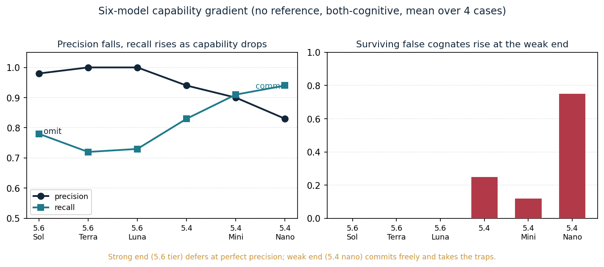
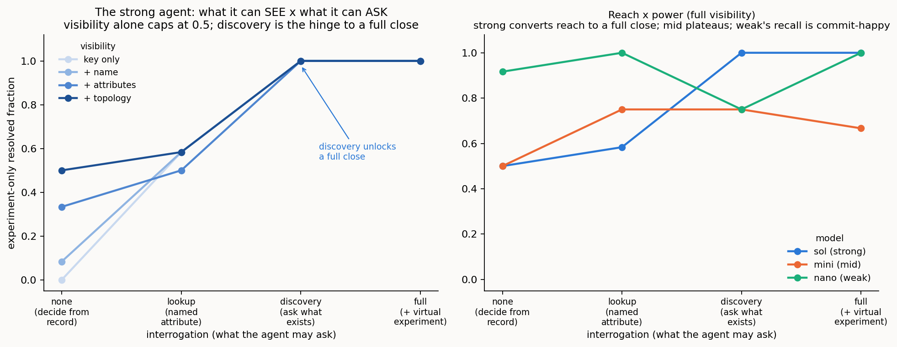
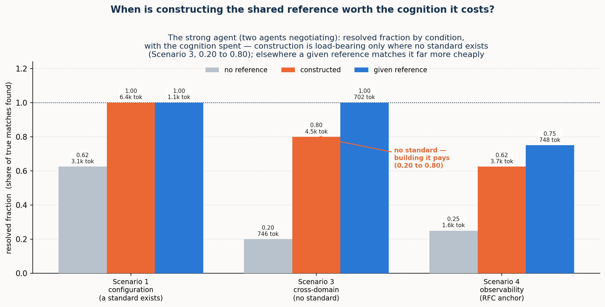
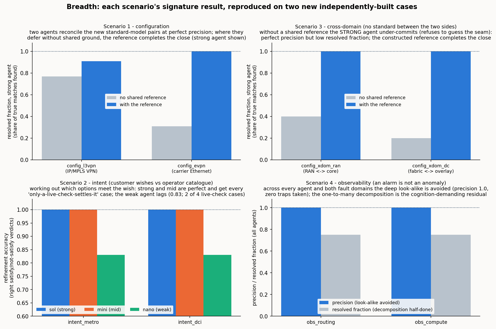

# Ad hoc semantic reconciliation by cognitive agents: a four-setting synthesis

> *Programme abstract: Two software systems that must exchange information rarely share a
> model of the world. The classical answer is to agree a common standard in advance; this
> programme asks whether two systems that can **reason** can instead reconcile their divergent
> models **for the occasion**, ad hoc, machine-to-machine, with no standard settled beforehand.
> Across **four operational settings** in network and service management (configuration, intent,
> cross-domain provisioning, and observability), it builds a measured harness, scores every
> reconciliation against a validated gold standard, and varies one master control: **where the
> cognition sits**, from two live reasoning agents through one inert to both inert. The
> through-line the four settings establish is a single thesis. **It is cognition that completes a
> reconciliation.** Descriptor methods (matching names, then names plus a gloss) carry it to a
> ceiling and stop; where both systems can reason, the remainder is closed autonomously, with no
> agreed model and no human in the loop. A thin, published **reference** can substitute for
> cognition, or supply an inert side the facts it lacks, but its reach ends there: it hands over
> information, never the **authority** to decide, whose value governs or whether a trade-off is
> acceptable. And the **pragmatic** layer (what a reconciled thing is *for*, whether it
> matters, who decides) is the frontier the descriptor methods never reach, decisive for meaning
> and itself bounded by the agent's capability. This document is the synthesis that sits atop the
> four setting reports: it introduces the concepts once, distils each setting to its essentials,
> and gathers the findings so they can be read as one result. The full evidence for any setting
> lives in its own report (1/4–4/4), to which this one points throughout.*

---

# Part I: The idea

## 1. The problem: two models, and no time to standardise

When two software systems must work together but hold different models (of the same domain, or
of adjacent domains that must connect), someone has to reconcile those models. The scope a model
must cover is not fixed, the useful level of abstraction depends on the task, and capable
engineers, working independently, produce different but defensible models of the same network.
The classical remedy is a universal standard agreed ahead of time: everyone adopts one vocabulary,
and the reconciliation is done once, by committee, before the systems ever meet. That remedy is
expensive, slow, and permanently behind the systems it tries to govern.

This programme investigates the alternative that becomes available once the systems on each side
can **reason**. Two such systems need not wait for a standard; they can reconcile their models
**ad hoc**: between themselves, for the task at hand, machine-to-machine. The question is whether
that actually works, how far it reaches, and what (if anything) a small published aid adds to it.
The answer is built empirically, in a harness where the reconciling parties are language-model
agents and every outcome is scored against a validated gold standard, so that the claims rest on
measurement across conditions rather than a single worked demonstration.

## 2. The lift: from a data model to a portable semantic model

The move the whole programme turns on is the **lift**, and it is worth drawing before anything else
(Figure 1).

A system usually holds its content as a **data model**: a schema and its records as they sit in a
database or a controller. That content is already a partial semantic picture, but a fixed one, frozen by the format it uses: a field
named `och_grade` with values `1`, `2`, `3` is legible to the software and engineers built around its
schema, yet says nothing, on its own, to a consumer that was not told what it means; the meaning
lives in a specification and in shared convention, outside the data itself. The **lift** is the move
from that to a **semantic model**: the same content given grounded, explicit meaning, structured as
three parts. First, an **ontology**, which includes its **lexicon**: a schematic layer (the concepts,
their kinds and relations, and the preferred labels and synonyms that name them) and a concrete layer
(the individual instances that populate those concepts). Second, **pragmatics**: the contextual
information a consumer needs (what a thing is for, whose authority governs it, in what context it
holds). Third, **provenance**: who asserted each part, by what method, and how firmly. The lift itself
is a **cognitive act**, helped along by a few **supports** that are aids to that cognition rather than
parts of the model: definitions, worked examples, a canonical example, and an optional link to a
shared reference. Who performs the lift is itself a variable of the study: a live system lifts and
explains itself; an inert one is lifted by whatever cognition reads it. In the benchmark cases that
self-lift is provided as a materialised artefact, so the reconciliation runs over a fixed substrate;
§13.8 lifts that assumption (an agent produces the lift from the schema surface alone) and finds the
reconciliation unchanged where the study leans on it.

*Figure 1. The lift. A data model (schema plus records) is a partial semantic picture, fixed by its format, with much of its meaning left implicit:
in specifications, convention, and the engineers who built around it. The lift is a cognitive act,
aided by a few supports (definitions, worked examples, a canonical example, an optional linked
reference), that turns the data model into an ad hoc semantic model built from three parts: an
ontology including its lexicon (schematic concepts and the concrete instances that populate them),
pragmatics (use, authority, context), and provenance. Being self-describing, the result is
**portable**: any cognitive consumer can pick it up and understand it, with no pre-agreed standard.*

The payload of the picture is the word **portable**. A lifted semantic model is **self-describing**,
and being self-describing is exactly what lets *any* cognitive consumer (this agent, another agent,
a human) pick it up and understand it without a prior agreement. That portability is not a
convenience; it is the precondition for the whole approach. Cognitive consumption of a model (using
it, reasoning over it, reconciling it with another) requires meaning made explicit, and the lift is
how meaning is made explicit on demand rather than by standardisation. Reconciliation is one instance
of cognitive consumption; the settings that follow will also refine an intent against a catalogue,
and read an anomaly for its significance, over the same lifted substrate. Get the lift, and the rest
of the programme is operations over portable semantic models.

One framing is worth making explicit, because it connects this work to a fast-growing body of
practice. The ontology and the individuals that populate it are, together, a **knowledge graph**: the
ontology is its schema (the typed concepts and the relations permitted among them) and the instances
are its assertions (typed individuals and the edges realised among them). The reconciliation
operations that follow divide along the same seam. Aligning the concepts is schema, or ontology,
matching; deciding which individual is which is entity resolution over the graph. This is why the
community's knowledge-graph work for network operations, and the canonical, AI-facing modelling
interfaces now emerging, meet this approach squarely: a lifted semantic model is a knowledge graph a
machine can consume, and a thin shared reference is exactly the kind of interoperable anchor such
graphs and interfaces can bind to. What the semantic model adds beyond the graph is the pragmatic
layer and the provenance base, the facets a bare knowledge graph carries only weakly, and, as the
findings will show, exactly the facets a thin reference cannot supply.

## 3. Reconciliation over lifted models: the operations

Given two lifted models, **reconciliation** aligns them: it works out which concept on one side
denotes the same thing as which concept on the other, fixes the shared attributes so they cannot be
misread, aligns the individuals, and confirms the result (Figure 2). It is not one act but a small
family of **operations**, and naming them once is what lets the findings later be mapped to a precise
*where*:

- **Lift**: data model → semantic model, per side (§2).
- **Reference construction**: find or build the thin shared ground the two sides bind through.
- **Schema binding**: align the concepts themselves, the **lexical** operation (names and synonyms)
  and the **ontological/structural** one (kinds, relations, decomposition).
- **Attribute pinning**: fix the meaning of a shared field, so a *committed payload* rate is not
  read as a *line* rate, a *bound* not as a measured value.
- **Instance co-reference**: decide which individual on one side is which on the other (entity
  resolution over keys, attributes, and topology, sometimes only settled by probing the live system).
- **Verification**: confirm a proposed correspondence, by round-trip, by invariant, by a virtual
  provision-and-read-back, or, where the relation is a refinement, by a satisfaction check.
- **Pragmatic resolution**: settle what the reconciled thing is *for*, whether a degraded offer is
  acceptable, whose realm governs a shared field, whether an anomaly warrants a **page** (an alert
  raised to an on-call human operator).
- **Composition (correlation)**: assemble separately reconciled parts into a composite whole, in
  setting 4, correlating several symptoms into a single incident by following the resource-dependency
  structure.
- **Lifecycle recurrence**: re-reconcile as the live situation changes over time.

*Figure 2. Reconciliation over two lifted models. Correspondences are drawn on grounded evidence and
bound through a thin reference that acts as a flat identity bridge; a look-alike that shares only a
surface word is **rejected** as a false cognate on its kind, attachment, and instances; a concept
with genuinely no counterpart in the other model is **correctly returned as unmatched**, a resolved
outcome, not a gap; and a correspondence the evidence cannot *yet* confirm is left in the **residual**,
referred onward. The reference carries no structure of its own; it is parasitic on the two grounded models it
connects.*

Two features of Figure 2 recur in every setting. The first is the **false cognate**: two concepts
that share a surface word but denote different things, an optical *signal-grade* and a commercial
*service-grade*, a transport *grade* and an IP *grade*, a legacy *alarm* and an NMOP *anomaly*.
Reconciliation must draw the true correspondences *and* refuse the look-alikes, and it refuses them
on grounded, non-lexical evidence (kind, attachment, instances) which a purely lexical matcher,
keying on the shared label, cannot do. The second is the **residual**: the correspondences a pass
does not close. A residual is not an error; it is what a reconciliation honestly *refers onward*
rather than guessing: to further machine cognition where the agents are live to continue, or to a
person where they are not. How large the residual is, and what drives it, is one of the programme's
central measurements.

## 4. The cognition spectrum, and the residual as a shortfall

The master control across all four settings is **where the cognition sits**: the **cognition
spectrum**. It runs from both sides live and interrogable, through one side inert, to both inert:

- **both-cognitive**: each side is a live reasoner, the authority on its own model, able to
  explain itself and answer questions;
- **one-inert**: one side is a mute snapshot exposing only its structure and instances; the live
  side must reconstruct its meaning;
- **both-inert**: neither side can explain itself; a third party reconstructs both from structure
  and data, and can only *propose* candidates for external adjudication.

A structural fact about this spectrum organises every result that follows. In the fully-cognitive
case, resolution of any reconciliation question is total *in principle*, for two reasons that are
themselves functions of live cognition on each side. First, the agents can exchange **unbounded
further information**: each is the live authority on its own model, so whatever is ambiguous the
other can ask about and get an authoritative answer. Second, because reconciliation operates on the
models rather than the live network, the agents can **run decisive experiments in virtual space**:
provision a candidate through a proposed correspondence, operate it, read it back, and check the
invariants. Any question is therefore confirmed, refuted, or authoritatively decided, and nothing
need be left unresolved. Both mechanisms are functions of live cognition, so as cognition recedes
they fall away: with one side inert the live agent can probe but not interrogate or co-design an
experiment; with both inert there is no one to ask and no joint experiment to run. The **residual** a
reconciliation must leave and refer onward is, in exactly this sense, the **shortfall from full
cognition's reach**, and it grows as that reach recedes. It is not a fixed floor the fully-cognitive
case merely reaches; between two fully-cognitive agents there is, in principle, none.

This is worth stating as a finding in its own right. Across the four settings we found no semantic gap
that a sufficiently capable, sufficiently reaching cognition could not close. What remains once two
fully-cognitive agents have exchanged everything they can and run every decisive virtual experiment is
never an *unbridgeable* correspondence: it is a concept with genuinely no counterpart (correctly
returned as unmatched), a fact not yet realised in the running network (an absence in the world, not in
meaning), or a question of *authority* rather than of fact (§5). None of these is a gap cognition is
stuck on, and the first two a human reasoner would leave exactly where a machine does. What varies from
one agent to the next is therefore not the *kind* of cognition but its power and reach, which is
precisely what the capability gradient (§13.2) and the reach study (§13.5) measure.

This is the frame inside which every finding sits, and it carries the programme's central claim.
Lexical and descriptor methods carry a reconciliation to roughly ninety percent (names, then names
plus a gloss) and there such methods have historically stopped, the remainder left to an agreed
standard or to human judgement. What the spectrum shows is that the remainder need not wait for
either: where both systems can reason, the reconciliation completes **autonomously**, and only as
cognition recedes does closing the gap fall back to a reference or a person. **It is cognition that
completes a reconciliation**, and the cognition spectrum is the measure of how far the automation
reaches before it must hand off.

## 5. The thin reference: substitute, supply, and the limit at authority

Against that frame, a thin, published **shared reference** is switched on and off at each point on
the spectrum: as much a probe of what cognition was doing as an object of study in its own right.
The reference is deliberately small: a flat set of entries, each an identity anchor plus a few
descriptive fields (a label and synonyms, a shallow class, a one-line definition, a canonical
example). It has no ontology of its own (giving it one would turn it back into the universal
standard the approach exists to avoid) and its power is coordination, not content: two systems that
bind to the same entry thereby denote the same thing. It is **parasitic** on the two grounded models
it connects, which is precisely why it can be so thin.

What such a reference does, across the settings, resolves into three distinct roles, and keeping
them apart is essential:

- It can **partly substitute for cognition**. For a capable agent on a lexical/structural task, the
  reference does the reasoning's work, collapsing the agent's hidden deliberation by one to two
  orders of magnitude and yielding a perfect, verified reconciliation.
- It can **supply missing information**. Where a side is inert, the reference can hand the reading
  agent facts it can no longer obtain by interrogation (a committed guarantee, a unit, a categorical
  definition) restoring the verification the missing probe would otherwise have done.
- It **cannot supply authority**. Where what is missing is not a fact but a *judgement* (whether a
  degraded offer is acceptable, whose realm governs a contested field) no reference substitutes. A
  reference can tell you what a service guarantees; it cannot tell you whether this customer will
  accept it. Where the gap is information, a thin reference closes it; where the gap is authority,
  only cognition (live, or pre-placed as a policy) closes it.

The reference's value is also **capability-gated** and distributed unevenly along the spectrum. Its
effort benefit peaks with strong, live cognition: a weak agent may not be able to exploit it, and an
inert side can turn the extra material into a burden. Its error-prevention benefit runs the other
way, concentrating where cognition, and therefore verification, is weakest. One anchor, opposite
roles, and (a finding the settings sharpen) a definite **internal structure**: a reference's fields
are not of equal value, and the cheapest useful one is not the cheapest possible one.

## 6. The instrument

Every setting is measured in the same harness. A **case** is two lifted semantic models plus a
gold-standard reconciliation *derived from the models by a script and validated* before any run, so
the gold cannot drift from the models it scores. In the fully-cognitive case the reconciliation is an
**exchange between two live agents**: each holds only its own lifted model and a surface catalogue of
the other's, and they alternate turns: advertising, asking and answering, proposing correspondences,
and **ratifying** the other's proposals about their own concepts (a correspondence is confirmed only
when one side proposes it and the owner accepts it, or both propose it independently), and may run
joint decisive experiments in virtual space. With a side inert the live agent reconstructs the mute
one; with both inert a third party reconstructs both. The harness scores the outcome against the gold
and records both quality and cognitive effort. Quality is measured by
**precision** (of what it proposes, the fraction correct), the **resolved fraction** (of the true
correspondences, the fraction it actually commits, the rest referred to the residual), **surviving
false cognates** (planted traps taken), and the **residual** itself; effort, for a language-model
stack, by **reasoning tokens** (hidden deliberation), total tokens, and latency. Throughout, a
resolved fraction below one is not by itself a failure; it is reach deliberately traded for honesty,
the unconfirmed correspondences referred onward rather than guessed.

The reconciling agents are run over one **model ladder** for the whole programme: three models
spanning a capability range, `gpt-5.6-sol` (**strong**), `gpt-5-mini` (**mid**), and `gpt-5-nano`
(**weak**), referred to as **sol**, **mini**, and **nano**, chosen so the ladder isolates model
strength rather than provider or architecture. The programme's hypotheses are the ones the first
setting states and the others inherit: that cognitive agents can reconcile divergent models ad hoc
(the concept holds); that the placement of cognition governs what a reconciliation achieves, costs,
and can verify; that a thin reference partly substitutes for cognition, capability-dependently, and prevents
errors where cognition is weakest; and that reconciliation work scales linearly with a shared
reference against quadratically without one. What each setting adds is a new operation brought under
test (verification and instances, then pragmatics as a movable policy, then the standard-free bind,
then pragmatics as significance, whether an observation matters at all) against the same frame and
the same instrument.

---

# Part II: The four settings

Each setting takes the same frame to a new operation. The sections below are distilled to a common
rhythm (what is new against the first setting, the case in one paragraph, the operations put under
test, what was proven, and what it means) and each points to its own report for the full evidence.

## 7. Setting 1, Configuration: two standard models of one network

*Full report: [1/4 · Configuration](REPORT_1of4_configuration.md).*

**What it establishes.** This is the founding setting: it puts the whole idea to its first empirical
test and fixes the frame the others inherit. Two independently authored **public standard** models of
one optical transport network (ONF **TAPI** on one side, IETF **TEAS/ACTN** on the other) describe
the same nodes, links, and services, each in its own vocabulary. A TAPI *connectivity-service* is a
TEAS *tunnel*; a TAPI *link-termination-point* looks like a TEAS *tunnel-termination-point* but is a
different thing: a link end, not a trail head. Because both models are public standards the agents
recognise, cognition can lean on that recognition to bridge them, which makes this the cleanest place
to isolate the mechanism.

**Operations under test.** The reconciliation as an **equivalence** (this term *is* that term): the
**lexical** and **ontological/structural** binding, **verification** run as its own step, and
**instance co-reference**, with the **pragmatic** operation left untouched here, deferred to the
later settings. The thin **reference** is the lexical one, switched on and off across the spectrum.

**What was proven.** The concept holds, measured across conditions rather than shown once: cognitive
agents reconcile the two models correctly and ad hoc. Within that, the reference **substitutes for
cognition**: for the strong agent it yields a perfect, verified reconciliation (precision and
resolved fraction of one) at both-cognitive and holds it as a side goes inert, collapsing the hidden
deliberation a single reconstructing agent would otherwise spend by one to two orders of magnitude. The
benefit is **capability-dependent** and not monotonic: for a weak agent the reference can *add* effort
when a side is inert, and the naive "reference helps more as cognition recedes" hypothesis is refuted
*for effort* even as it holds *for correctness*. At both-cognitive the two-agent negotiation itself
holds precision at one and refuses the planted traps through bilateral ratification; the reference's
error-prevention value shows where a single agent must reconstruct an inert side, raising the weaker
agents' precision and pre-empting the cognates they otherwise commit. **Verification** runs as its own
step, keeping only the correspondences it can confirm and referring the rest onward. It rejects the
false cognates that slipped into the proposal, so precision climbs toward one across the spectrum. But
confirming a correspondence draws on live cognition, which the spectrum removes. Without the reference,
as a side goes inert, the verifier can still reject a wrong pairing yet can no longer confirm every
correct one; those unconfirmable-but-correct pairings are deferred to the residual rather than
asserted, so the resolved fraction falls. The reference supplies the missing confirmation, holding the
resolved fraction at one. Reconciliation work scales **linearly** with a shared reference against
**quadratically** without one (verified by construction to N = 12). And two folded sub-studies carry
the point past the schema terms: at the **instance** level the resolvability of same-looking
individuals is budget-limited at full cognition (driven to a full resolve with more probing) but
becomes **structural** once a side goes inert (no budget helps, because the inert side cannot be
interrogated); and the deterministic controls confirm the lift itself is the lever: a reference-blind
matcher seeing only the bare lexical surface resolves about two-thirds of the correspondences and takes
a trap, and it is cognition over the lifted models that closes the rest and refuses the look-alikes.

**What it means.** The founding claim is in hand: cognition completes the reconciliation, a
reference partly substitutes for it, saving cognitive effort and preventing errors, and the spectrum
governs both. Everything after this builds on that frame; setting 1 does not touch pragmatics at all;
that is the thread the remaining three settings pick up.

## 8. Setting 2, Intent: refinement, negotiation, and a service that renegotiates itself

*Full report: [2/4 · Intent](REPORT_2of4_intent.md).*

**What is new.** The first setting reconciled by **equivalence**; this one reconciles a declarative
**intent** against a concrete **realisation** by **refinement**. "Latency below 5 ms" is not equal to
any service on offer; it is a *bound* that a service either clears or does not, and many services may
clear it. Once the relation is refinement, everything the first setting left untouched comes into play at
once.

**The case.** A customer's agent **O** holds an intent (a New York–Frankfurt connection, ≥ 8 Gbit/s,
≤ 5 ms, four-nines, protection not required), every clause a bound. An operator's agent **N** holds a
catalogue of concrete optical services, each with a real bandwidth, latency, availability, protection
scheme, and cost. Neither speaks the other's language; they must work out which realisation
*satisfies* the wish.

**Operations under test.** Verification becomes a **satisfaction** check (you cannot round-trip a
lossy refinement, so you test the chosen realisation against every bound); a genuine two-sided
**negotiation** appears when no service meets every bound (N computes a best-achievable offer, O must
decide accept or reject); the **pragmatic** operation enters for the first time, carried in a small,
portable **movable policy** the customer holds: a priority ordering, hard bounds, an affordability
floor, a flow-class rule; and the whole exchange **recurs across the service's life**.

**What was proven.** The central insight, now measured on a real negotiation: with both agents live,
the reconciliation (negotiation included) completes autonomously (decision accuracy 1.0 for sol and
mini), with no human in the loop. The spectrum gains a new rung that turns out to be the sharpest
result: remove the customer's live judgement, and a **pre-placed movable policy** still closes the
decisions it was authorised for (1.0), while a **mute** customer with no policy cannot: accuracy
falls to zero and the agents correctly **refer all three** decisions onward rather than guess. The
pre-placed policy is a concrete mechanism for **pushing the hand-off boundary**: the customer's
cognition, placed in a portable artefact ahead of time, closes autonomously what a mute description
must refer. The second finding draws the reference's limit: where a side is inert, a published
reference *supplies information* (the strong agent, blind at both-inert, refuses to affirm
satisfaction and scores 0.29; publish the invariant guarantee floor and it has an anchor to check
against, rising to 0.71); but it *cannot supply authority*: at both-inert no reference moves the
negotiation, because what is missing is the customer's judgement itself. The capability gradient is
steep (to reach its decisions the strong agent spent ~150 reasoning tokens, the mid ~860, the weak
~5,400, thirty-five times the strong agent's effort, for lower accuracy), and a four-hop
**lifecycle** (bought, self-healed, referred, restored) is walked correctly end to end by the
strong model (hop accuracy sol 1.0, mini 0.88, nano 0.62).

**What it means.** Cognition completes a negotiation, and the pragmatic operation is now a
measured axis rather than a fixed backdrop. A thin published reference can stand in for the information
an inert side would otherwise supply, but not for the authority to decide. A pre-placed policy is shown
able to carry a party's authority to where a person or live cognitive system would otherwise have to
stand.

## 9. Setting 3, Cross-domain: reconciling with no public standard

*Full report: [3/4 · Cross-domain](REPORT_3of4_cross_domain.md).*

**What is new.** The deliberate complement to the first setting. There, two *different* models faced
each other, but both were **public standards** the agents already knew, so cognition could lean on
recognition. Here that crutch is gone: both models are **home-grown and private**, recognisable to no
one in advance. The operations are the first setting's (lift, bind, a thin reference) but with the
standard removed, the *execution* diverges, and that divergence is the subject.

**The case (Figure 3).** **Meridian**, a home-grown transport OSS, thinks in circuits, bearers,
wavelengths, protection grades. **Cascade**, a home-grown IP/VPN controller, thinks in services,
attachments, VLANs, classes of service. Their worlds touch at exactly one seam: a Cascade service
must ride a Meridian circuit as its underlay. One order across that seam needs five bindings:
circuit↔underlay and hand-off↔attachment (the same object under two names), and three requirements
pinned (a *committed* rate not a line rate, a latency *bound*, protection against a *path* failure).
And one look-alike is refused: both models carry a **grade**, but Meridian's is a transport protection
class and Cascade's an IP class of service. Same word, unrelated meanings, and no standard to consult.

*Figure 3. One order across the Meridian/Cascade seam. Five bindings to make (two renamings and
three pins) and one false cognate, "grade", to reject, across two private vocabularies with nothing
public beneath them. A constructed reference supplies the shared ground; a single descriptive field
in it is enough to unlock a capable agent.*

**Operations under test.** A single, early **schema-binding** pass (deliberately isolated from the
rest of the process) measured across the spectrum with and without the reference the two agents
would themselves **construct**; plus a **reference-field ablation** and the **pragmatic** operation of
authority attribution (whose realm owns each shared field). The instance operation is bracketed, on
the argued grounds that it reproduces the first setting's result.

**What was proven.** The central result is a pair of **mirror-image failures**: the strong and weak
agents failing in opposite ways, and *where* each failure shows depends on how the cognition is
placed. The strong agent will not guess across two foreign vocabularies; it binds only the names that
already coincide (resolved fraction 0.20 at both-cognitive, around 0.4 once a side is inert), at
perfect precision and with no false cognate taken: this is **omission**, deferral not error,
throughout the spectrum. The weak agent's error is **commission** (binding freely and taking the
cross-domain "grade" trap) but it emerges where a *single* agent must reconstruct a side: at the inert
placements its precision never clears 0.83 and falls to 0.57. At both-cognitive the weak agent cannot
bind unilaterally (its partner must ratify) so the negotiation refuses its over-commitments: it
under-resolves (0.40) rather than mis-commits, and the trap does not survive. Commission is real, but
it is a property of a single reconstructing agent, not of two agents negotiating. A single thin
reference remedies the omission: constructed, it lifts the strong agent to a full close and disciplines
the weak agent's precision at the inert placements. Stripping the reference's fields one at a time shows what it must carry: any *single* descriptive field
(a shared label, a class, a definition, or an example) is enough to unlock the strong agent's
commitment (each drives it to a near-perfect close), while a **bare shared identifier with no
description is worse than nothing** (precision 0.50, below the no-reference floor), because the agent
binds by an opaque token and binds wrongly. The reference does not work through the shared *pointer*;
it works through the shared *description*, and even the thinnest description suffices. On the
**pragmatic** axis, the same boundary the intent setting found appears again: the reference reaches
*meaning* but not *authority* (it can pin that a rate is a committed payload, but not whose realm
governs it) and a characteristic "transport owns everything it carries" bias marks the weaker models.

**What it means.** With no public standard beneath two models, cognition still closes, but only once
it has built the shared ground, and **building that ground is the work**. The strong agent's low
reference-absent numbers are not a limit of cognition; they measure the worth of the one step the
study held back (constructing the shared reference) by running the binding without it. Run end
to end (the two agents constructing the shared reference themselves from their models and then binding
through it, with none pre-given) the protocol confirms the reading: the strong agent lifts from a
no-reference resolved fraction of 0.20 to a constructed-reference **0.80**, and to **0.90** when the
agents also run a decisive virtual experiment on the candidates, approaching the reference-given 1.00,
at perfect precision and with no false cognate, so constructing the ground is the work and a capable
agent does it. Even a very thin ground suffices for a capable agent, provided it carries meaning and not
merely a pointer.

## 10. Setting 4, Observability: an alarm is not an anomaly

*Full report: [4/4 · Observability](REPORT_4of4_observability.md).*

**What is new.** The setting where the pragmatic operation moves from the wings to the centre. The
descriptor level (what a thing *is*) is settled by a standard, and the entire operational question
is one of **significance**: whether an observed deviation matters, and how observations compose. It
also carries the programme's deepest false cognate, an **ontological** one.

**The case (Figure 4).** **Agent F**, a legacy fault manager, emits an **alarm**: one object bundling
an event, an undesirable state, a fixed severity, and a static probable-cause. **Agent G**, an IETF
**NMOP** agent, speaks the RFC 9940 ladder, which separates what legacy conflates (event, anomaly,
symptom, fault, alarm, problem, cause, incident) and annotates each anomaly with anomaly-semantics
metadata (a concern score, a confidence score, a plane, a pattern, a lifecycle stage, a season). The
worked example is one live anomaly: a pre-FEC bit-error-rate reading on a wavelength begins to rise.
In the legacy world it fires an alarm and a page; in the NMOP world nothing is decided yet: whether
it warrants a page depends on its concern and confidence and its
context (a maintenance window makes the same deviation expected), and whether it is one incident or
many depends on correlating it, across layers, with the symptoms it causes.

*Figure 4. The overloaded legacy alarm is lifted and **decomposed** one-to-many into the NMOP ladder:
its correct core is the NMOP alarm-State (and the fault it implies), while the trap is the **anomaly**:
an alarm is a State, an anomaly is a deviation, and conflating them is a category error, not a
mislabel. The anomaly-semantics annotations are the lifted content the significance verdict runs on.*

**Operations under test.** Two acts. **Act 1** is a **schema binding** carrying the ontological false
cognate (alarm↔anomaly, which no structural cue separates) and a **one-to-many decomposition** (the
legacy alarm maps to both the NMOP alarm-State and the fault). **Act 2** is pure **pragmatic
resolution and composition**, each run with the anomaly-semantics **ON** and **OFF**: a **verdict**
task (act / watch / suppress for each anomaly under a context) and a **correlation** task (group
cross-layer symptoms into incidents and name each cause).

**What was proven.** Three results complete the arc. First, the **ontological cognate is a clean
three-rung capability gradient**: the strong agent never conflates alarm with anomaly (with or without
the reference); the mid agent conflates them once a side is inert, and the RFC 9940-anchored reference
**rescues it completely** (the cognate vanishes, precision returns to 1.0); the weak agent conflates
them with or without the reference, beyond rescue. The lexicon pins the ontology for the middle of
the ladder, not the bottom. (The honest hard edge of Act 1 is the decomposition: even the strong
agent tends to map the alarm to the alarm-State but miss the fault constituent, so the resolved
fraction sits near 0.75.) Second, in the verdict task the **pragmatics carry the operative meaning**:
with the semantics ON the strong and mid agents suppress correctly during maintenance and the
false-page storm disappears (verdict accuracy 1.0 and 0.83, essentially no false pages); with them OFF
the legacy pipeline pages nearly everything (accuracy 0.17 and 0.08, roughly four and three-and-a-half
false pages); **but the payoff is capability-gated**: handed the identical annotations, the weak
agent barely moves (ON 0.53 vs OFF 0.50). Third, **correlation behaves differently**: given the
resource-dependency map, *every* model (the weak one included) folds an optical degradation and the
IP loss it causes into one correctly rooted incident (perfect partition ON), and without that map
every model fails. The difference is the lesson: correlation's pragmatic is a **structural input** and
even a weak agent applies it; the verdict's pragmatic demands **judgement**, and there capability
decides.

**What it means.** Meaning (what an anomaly *is*, pinned by the reference) and significance (whether it
warrants a page and how it composes, carried by the pragmatics) are **separable, both necessary, and
each gated in its own way**. The pragmatic layer the descriptor methods never reach is real and
decisive, and itself bounded by the agent's capability. The through-line reaches its end: cognition
completes the reconciliation; a thin reference supplies the information it needs and stops at what it
does not; and the pragmatic layer is the frontier, decisive for meaning and gated by capability.

---

# Part III: Synthesis

## 11. What works, and how far

Read as one result, our detailed exploration of the four settings says first the plain thing: **ad hoc reconciliation works**,
largely as laid out, barring a few surprises. Two cognitive agents reconcile independently authored,
divergent models correctly and with no standard agreed in advance: completing an equivalence between
two standard models (setting 1), refining
and negotiating an intent against a catalogue (setting 2), binding across a private domain boundary
once they have built the shared ground (setting 3), and reading an observability world for what its
signals mean (setting 4), measured against a validated gold across the cognition spectrum, not shown
once by hand.

The same exploration says, more sharply, **where the reconciliation needs no help**. At the
fully-cognitive end of the spectrum it completes **autonomously**: no standard agreed in advance, no
human in the loop. For the schema bind the two live agents reach a full close through a shared or
constructed reference, or by running a **decisive virtual experiment** on the candidates they are
unsure of; negotiating alone they defer the hardest correspondences rather than guess, the honest
behaviour, not a failure. And it completes autonomously on the two operations that look least
automatable: a two-sided negotiation (setting 2, decision accuracy 1.0 with both sides live) and the
significance verdict, deciding, for each anomaly, whether to act, watch, or suppress (setting 4,
accuracy 1.0 with the pragmatics on). The fully-cognitive end is, across all four settings, the
automatable end. That is the headline, and everything else in this synthesis is a
qualification of it: how the automation degrades as cognition recedes, what a thin reference buys
back, and where an agent too weak for the task cuts the whole thing off.

And the lift the whole thing runs on is itself agent-performable: an agent asked to lift a side from
its schema surface produces a model that reconciles as the authored one does: identically, for the
capable agent binding through a reference, across all four settings (§13.8).

## 12. The findings, as six theses, and mapped to where they act

The results gather into six theses. Each is stated once here; §13 then reads the evidence behind them
along four cross-cutting axes, drawing the setting reports' own figures and numbers; and §14 lays the
whole out in two tables, so that when a finding says cognition (or a reference, or a pragmatic)
matters "here," the *here* is a named stage of the process, not a vague gesture.

**Thesis 1. It is cognition that completes a reconciliation: descriptor methods carry it most of the way, then reach a ceiling and stop.**
Lexical and descriptor matching carry a reconciliation only so far (setting 1's deterministic controls:
a reference-blind matcher on the bare lexical surface resolves about two-thirds and takes a trap); the
remainder, historically left to a standard or a person, is closed by live cognition instead. This is the
programme's spine, and it holds at every operation the settings put under test. It holds against a
strong classical matcher, not only the plain label baseline: a matcher using labels, synonyms,
definitions, and structure with a 1:1 alignment reaches precision one and refuses the false cognates on
the standard cases, but it cannot close (its resolved fraction stalls at 0.56 to 0.75) and on the
standard-free case it fails like the weak baseline, taking the *grade* cognate, because with two private
vocabularies there is no lexical or structural signal to lean on. The ceiling is real even for a good
descriptor method; cognition is what passes it.

**Thesis 2. The placement of cognition is the master variable: the further it recedes, the more the reconciliation leaves unresolved.**
What a reconciliation can achieve, cost, and verify is governed by where the cognition sits. Between
two live agents, resolution is complete in principle (unbounded interrogation and decisive virtual
experiment) so the residual is, in principle, none; as a side goes inert those mechanisms fall away
and a residual appears, precisely the shortfall from full cognition's reach. The same story holds at
the schema level (setting 1), the instance level (setting 1's budget-limited-becomes-structural
curve), the negotiation (setting 2), and the standard-free bind (setting 3). And it governs one thing
that cuts across all four settings: whether a reconciliation can be **verified to completion**. This is the crux of
the spectrum. With full cognition on both sides, the very mechanisms that close the residual (mutual
interrogation and decisive virtual experiment) also confirm the close, so the agents verify their own
result rather than assert it; as a side goes inert those mechanisms fall away, verification degrades to
a check by satisfaction, and the assurance that the reconciliation is correct weakens with it. Full cognition is therefore not
merely more accurate: it is what makes an ad hoc reconciliation **self-verifying**, and that (not
accuracy alone) is what makes it safe to automate with no standard and no person in the loop.

**Thesis 3. A thin reference partly substitutes for cognition and supplies information, but never provides
the authority to decide.** For a capable agent on a lexical/structural task it substitutes for the reasoning
(setting 1, effort down one-to-two orders, a perfect verified close); where a side is inert it
supplies the facts interrogation no longer can (setting 2, sol 0.29→0.71 with the invariant floor;
setting 4, the RFC 9940 reference rescuing the mid agent's ontology); but where the missing ingredient
is judgement rather than fact, no reference moves it (setting 2's authority gap, setting 3's authority
attribution). Information has a published stand-in; authority does not.

**Thesis 4. A strong agent's failure is omission, a weak agent's is commission, and two-agent negotiation suppresses commission by ratification.** Denied
the ground it needs, a strong agent **defers**: it leaves the unresolved in the residual at perfect
precision (setting 3's under-commitment; setting 2's strong agent refusing to affirm what it cannot
verify). A weak agent's error is **commission** (binding freely and wrongly, taking the false cognate)
but *where* it shows depends on how the cognition is placed. Where a **single** agent must reconstruct a
side, at the inert placements, commission is unchecked: the weak agent takes the traps and its precision
falls. At **both-cognitive**, though, no side binds unilaterally: each proposal must be ratified by the
concept's owner, and that bilateral loop refuses the weak agent's over-commitments. Swept across a
six-model capability ladder at both-cognitive, the negotiation holds precision high and drives surviving
false cognates to zero for all but the weakest model (**the two-agent structure itself doing
verification work**) while resolution is uniformly lower (deferral) and the weakest agents fail by
non-convergence rather than by confident error. So the reference's **correctness value** (pulling right
the bindings that would otherwise go wrong) concentrates where a single weak agent reconstructs, exactly
where negotiation's discipline is unavailable; its **effort value** (the reasoning it saves) peaks
where a single strong agent reconstructs an inert side. One thin artifact, a different benefit at each end
of the spectrum, and at both-cognitive the negotiation supplies much of the discipline itself.

**Thesis 5. The pragmatic layer (what a thing means in context and whether it matters) is the frontier the descriptor methods never reach: decisive and itself gated by cognitive power.** What a reconciled thing is *for*, whether a degraded offer
is acceptable (setting 2), whose realm owns a field (setting 3), whether an anomaly warrants a page
(setting 4), is where the operative meaning lives, and it is beyond the reach of names, glosses, and
references. It is carried by cognition (or by cognition pre-placed as a policy), and its payoff is
realised only by an agent strong enough to carry it, a matter of the agent's power, not of where
cognition is placed: handed identical annotations, the weak agent still cannot produce the verdict
(setting 4). The one exception proves the rule: where a pragmatic is
delivered as a **structural input** rather than a judgement (setting 4's correlation dependency map),
even a weak agent applies it.

**Thesis 6. With a shared reference, reconciliation scales; and its potential fields are not of equal value.** Work
grows linearly in the number of systems with a shared reference against quadratically without one
(setting 1, to N = 12), so the reference's advantage compounds with scale independent of any
per-reconciliation effect. And not every thin reference is equal: a single descriptive field unlocks a
capable agent, but a bare identifier with no description is worse than nothing (setting 3), and a
shallow class tag can actively mislead the weak agent it was meant to help (setting 1's field-by-field
result). A reference is a safety rail carrying *meaning*, not a pointer and not a payload.

## 13. The findings in depth: four readings across the settings

The six theses state *what* was found. This section shows the evidence behind them, drawn from the
setting reports' own figures and numbers, and reads that evidence along four cross-cutting axes: the
**cognitive load** an operation costs, the **model power** the gradient demands, what the **reference**
buys, and what changes with **position on the cognition spectrum**. Each axis cuts across all four settings, and
together they are the detail the one-line theses compress.

### 13.1 Cognitive load: what each operation costs, and who pays

The most consistent number in the programme is what a weak agent costs. To reach the *same* decisions the
weak agent spends one to two orders of magnitude more reasoning than the strong one, in every setting
that measures effort (Figure 5): about **36×** in the intent negotiation (sol ~150 tokens, mini ~860,
nano ~5,400) and about **20×** in the observability verdict (sol ~60, mini ~520, nano ~1,200).
Capability buys economy as much as correctness: a weak agent does not merely make more mistakes, it
burns far more cognition making them.

*Figure 5. Reasoning tokens to reach a decision, per model, in the two settings that measure effort
directly (log scale). The gradient is steep and consistent: the weak agent spends ~20–35× the strong
agent's effort; and, as §11 noted, to reach lower accuracy, not higher.*

The load also depends on the **operation** and on **reference support**. Where the operation is a
lookup and cognition is fully present it is cheap; where it demands search (interrogating a live
oracle to separate look-alike individuals, as in setting 1's instance study) or judgement (weighing a
degraded offer, or an anomaly's concern against its context) it is dear. And for a strong agent a
thin reference is an effort *substitute*: given the anchor, sol's hidden deliberation collapses by one
to two orders of magnitude (Figure 6). But that effort saving is capability- and placement-dependent, and it
can invert: for the weak agent with a side inert, the reference *adds* effort; nano spends roughly
5,500 tokens **more** with the reference than without, straining to reconcile an inert side's meaning
against the extra material. The reference's effort benefit peaks with strong, live cognition and turns
to a burden at the weak, inert corner.

*Figure 6 (setting 1). The strong agent's reasoning tokens with and without the reference, across the
spectrum. Given the anchor, deliberation collapses by one to two orders of magnitude: the reference
doing the reasoning's work.*

### 13.2 Model power: the shape of the capability gradient

Capability does not turn a single dial; it changes the *kind* of failure. The cleanest place to watch
this is **setting 3, the cross-domain bind** (Figure 7): Meridian, a transport OSS, and Cascade, an
IP/VPN controller, are two independently authored private models with **no public standard between
them**, so no ready-made reference exists; the agents must construct the shared ground themselves.
Run that bind with the reference withheld and capability alone decides the outcome. The strong agent
**defers**. Facing two foreign vocabularies with no constructed ground, sol binds only the names that
already coincide and leaves the rest in the residual: a low resolved fraction (0.20 at both-cognitive),
perfect precision, no trap taken. The weak agent's failure is **commission** (binding freely and
wrongly) and it shows where a *single* agent must reconstruct a side: at the inert placements nano's
precision never clears 0.83 and it takes the trap. At both-cognitive the two-agent loop checks it: nano
cannot bind without its partner's ratification, so it under-resolves rather than mis-commits and the trap
does not survive. A single thin constructed reference then lifts the strong agent to a full close and
disciplines the weak agent's precision where it is a lone reconstructor.

*Figure 7 (setting 3). Precision against resolved fraction, reference off (hollow) to on (filled).
Without the constructed reference sol sits top-left (commits little, all of it right) and nano
lower-right (commits much of it wrongly); the reference pulls both to the corner.*

Swept across a six-model ladder on the schema cases at both-cognitive (Figure 8), two-agent negotiation
**compresses** the gradient a lone reconstructing agent would show. Precision does not fall as capability
drops: bilateral ratification holds it high across the whole ladder (roughly 0.9 to 1.0), and surviving
false cognates are driven to zero for every model but the weakest, where about a quarter of the traps
survive. What the negotiation costs is resolution: the resolved fraction is uniformly lower (about 0.4
to 0.7) and rises then dips rather than climbing, because the weakest agents fail by non-convergence,
grinding to the round limit without closing, rather than by confident over-commitment. The structure
itself (each proposal ratified by the concept's owner) supplies the discipline that a reference, or a
stronger cognition, would otherwise have to.

*Figure 8. Precision, resolved fraction, and surviving false cognates across a six-model capability
ladder (two-agent negotiation, no reference, both-cognitive, mean over the four schema cases). Bilateral
ratification holds precision high and suppresses false cognates across almost the whole ladder;
resolution is uniformly lower and non-monotonic, the weakest models failing by non-convergence rather
than by taking the traps.*

Where a standard *can* pin the distinction, capability decides who can use it, a clean three-rung
gradient (Figure 9). On the programme's deepest false cognate, alarm↔anomaly, the strong agent never
conflates the two, with or without the reference (intrinsic mastery); the mid agent conflates them once
a side is inert, and the RFC 9940-anchored reference **rescues it completely** (the cognate's survival
goes 1.00 → 0.00); the weak agent conflates them either way (0.75 with or without, beyond rescue). The
lexicon pins the ontology for the middle of the ladder, not the bottom.

*Figure 9 (setting 4). Survival of the alarm↔anomaly cognate at the inert placements, without and with
the reference. sol never takes it; the reference drives mini to zero; nano barely moves.*

### 13.3 The reference: what it buys, by component and by placement

Not every thin reference is equal, and the difference is measurable. Ablating the reference's
descriptive fields (setting 3, strong agent, opaque identifiers) shows that any *single* field (a
shared label, a class, a definition, or an example) is enough to unlock a full close, while a **bare
shared identifier with no description is worse than nothing** (precision 0.50, below the no-reference
floor): the reference works through shared *description*, never through the pointer. And the same field
can *harm* the agent it was meant to help. This shows up in **setting 1**, the configuration
reconciliation whose look-alike terms are the programme's richest source of false cognates: there a
shallow **class** tag is, for the weak agent, the single worst condition in the programme (Figure 10),
driving cognate survival *above* even the no-reference floor, because a class surface reads as
evidence for the very cognate it should block.

*Figure 10 (setting 1). Surviving false cognates by reference content, per model. The strong agent is
immune (no bar); for the weak agent the lexical field helps most and the shallow class tag actively
hurts: the tallest bar, above the id-only floor.*

The reference's two roles run in opposite directions along the spectrum: its **effort** benefit peaks
with strong, live cognition (§13.1), while its **correctness** benefit concentrates where cognition
(and so verification) is weakest, disciplining the committing agent exactly where it would otherwise
err. And independent of any per-reconciliation effect, a shared reference changes how the work
**scales** with the number of systems. The unit here is one **reconciliation operation**: a single act
of aligning two semantic models, the same operation whose effort §13.1 meters. The question Figure 11
asks is how many such operations it takes to give *N* systems mutual semantic interoperability.
Reconciled pairwise, every system must be aligned with every other, which is N(N−1)/2 operations,
growing as N². Bound instead to one shared reference, each system is reconciled once against the anchor
and any two then interoperate *through* it: N operations, growing linearly. This is a structural count,
not an experimental average: the number of pairings needed to connect N nodes is a property of the
interoperability graph (a full mesh versus a hub-and-spoke), fixed by the topology and exact at every
N, which is why the figure is established by construction to N = 12 rather than sampled. Its standing as
a measure of *real* work rests on two things. The unit is the very operation the programme meters
everywhere else; and the linear branch is licensed by setting 1's own finding that binding to a shared
reference is *correct and composes*, so that reconciling A and B each to the anchor genuinely yields an
A↔B alignment and the mesh can be collapsed to the hub without loss. Per-operation effort (Figures 5 and 6) is then a roughly constant multiplier, so total cognitive load inherits the N-versus-N² split
directly: the count is what decides whether the whole workload grows linearly or quadratically.

*Figure 11 (setting 1, constructed). A **count of reconciliation operations** (the pairings that must be
made) against the number of systems N: bind-once-to-a-shared-reference (~N) versus align-every-pair
(~N²). A structural count established by construction to N = 12, not a measurement of reasoning effort;
contrast Figures 5 and 6, which measure cognitive load directly.*

### 13.4 Position on the cognition spectrum: what degrades, and how

Position on the cognition spectrum is the master variable, and moving along it degrades a reconciliation
in a specific, measured way. This is sharpest in **setting 2**, the intent setting, where a consumer and a provider negotiate an
intent to a workable deal, and the crux is a pragmatic judgement: whether a degraded counter-offer is
acceptable to the customer. Across the cognition spectrum (Figure 12) that decision closes autonomously
while the customer's judgement is present (live at both-cognitive, or **pre-placed as a portable
policy**) and falls to the floor at the mute and both-inert placements, where the correct behaviour is
to refer the decision to a person. The pre-placed policy is the mechanism that holds the line where a mute customer
cannot: cognition placed in a portable artefact ahead of time closes autonomously what a mute
description must hand off.

*Figure 12 (setting 2). Decision accuracy across the cognition spectrum. It holds high while the
customer's judgement is present (live, or pre-placed in a movable policy) and collapses to referral
at consumer-mute and both-inert.*

The same logic reaches down to the **instance** level in **setting 1**. Instance co-reference is
deciding which individual on one side is the same as which on the other. Most pairs are settled from the
models alone, but some are genuine look-alikes (structurally identical devices, or same-named but
distinct services) that the static descriptions simply cannot separate. Telling those apart means
*acting on the live system*: interrogating it, or provisioning something and reading it back. The number
of such live probes the agent is permitted is its **probe budget**.

Whether spending that budget actually resolves the hard cases depends on placement, and Figure 13 shows
why by crossing the two: it sweeps the probe budget (none, bounded, unbounded) at each of two spectrum
placements. At **both-cognitive** the live side is there to be interrogated, so more budget resolves
more: the residual falls to zero at unbounded budget. This is what **budget-limited** means: enough
probing closes it. At **one-inert** the inert side is a static description with nothing live to
interrogate, so the same unbounded budget barely moves the residual (it reaches only 0.08). This is what
**structural** means: no budget can close it.

The two are crossed, not confounded (the identical budget sweep is run at both placements) so the
curves isolate their *interaction*: probing pays off only where cognition is placed to be interrogated.
That is Thesis 2 made concrete on a measured curve. The residual is fixed not by how hard the agent
works but by where the cognition sits: at both-cognitive, effort (budget) buys a complete close; at
one-inert, no effort can, because the thing that would answer the probe is not there to answer it.

*Figure 13 (setting 1). The hardest look-alike individuals, for the strong agent: what fraction gets
resolved as the live-system probe budget is swept from none through bounded to unbounded, at two spectrum
placements. Budget (the x-axis) and placement (the two lines) are crossed, so the curves isolate their
interaction. At **both-cognitive** a live side can be interrogated and the residual is budget-limited:
it drives to zero as probes are spent. At **one-inert** there is nothing live to probe and it is
structural: no budget helps. Same sweep, opposite outcomes, decided by placement, not by effort.*

### 13.5 Reach: how far an agent can see and question

The instance result above raises a question worth separating out. When an agent must *act on the live
system* to settle the hardest cases, what limits how far it gets: how *capable* the agent is, or how much
it is *allowed to see and to ask*? These are not the same thing. A brilliant investigator handed only a
one-line summary cannot do much; a modest one who may interview the witnesses can do a great deal. To
tell the two apart, this reading holds the agent at its strongest and holds liveness at the top (both
systems reasoning), and varies only what the agent is given to work with, along two axes.

The first axis is **what it can see**: how much of each individual's record is exposed to it, from just
an opaque identifier, to that plus a name, plus its attributes, up to the full record including how it
connects to its neighbours (its topology). The second axis is **what it can ask** of the live system:
from nothing at all (decide from the record as given), to asking about a *named* attribute (where the
agent must already know the field name to ask for it), to **discovery** (where it may ask the open
question "what facts do you have?" and be told), up to running a small live experiment. As before, the
measure is the share of the hardest cases settled correctly (the look-alike pairs that are identical on
paper and can be told apart only by questioning the live system, which the study calls the
*experiment-only* cases) reported alongside precision, the share of what the agent commits that is
right.

The result (Figure 14, left panel) is clean, and because precision stays at 1.00 across the whole grid it
is a real gradient, not an artefact of guessing. Seeing more helps, but only up to a point: given no
ability to ask, the agent settles none of the hardest cases when it sees only an identifier, and rises to
just half of them (0.50) even when it can see the entire static record. Static evidence, however
complete, cannot separate twins that differ only in a fact the record does not carry. Being allowed to
ask about a *named* attribute barely improves this: the agent has to know in advance which field to ask
for. The jump is at **discovery**: the moment the agent may ask the open question "what do you have?",
every level of visibility goes straight to a full close (1.00). The decisive reach is not seeing more,
and not even asking more, but being able to ask the question you did not know in advance to ask.

The same access lands differently depending on the agent's power (Figure 14, right panel). Handed
identical access, the strong agent converts it into a perfect close at perfect precision. The mid agent
uses it but plateaus part-way, around 0.67 to 0.75. The weak agent posts high numbers that are not the
same achievement: its precision slips (to 0.97–0.98) and it begins committing look-alikes, so its
apparent resolution is partly indiscriminate binding rather than genuine settlement; read its resolved fraction
without its precision beside it and you would misjudge it, which is the caution the whole study keeps
returning to. Power sets the ceiling that reach can reach.

The lesson is as much a design one as a scientific one. How far ad hoc reconciliation carries is not
fixed by the agents alone; it is set jointly by how capable they are and by how *interrogable* the thing
they meet is: whether the interface on the other side lets a capable agent ask the open questions it
needs to. That is a concrete thing a real deployment would have to provide, and it is exactly what the
carrier and standards-body engagement discussed under scope could help pin down.

*Figure 14 (reach). Left: the strong agent, with liveness held at the top. Each line is one level of
visibility (how much of the record it can see); moving left to right widens what it may ask, from nothing,
through asking a named attribute, to discovery (asking what exists), to a live experiment. The y-axis is
the share of the hardest (experiment-only) cases it settles correctly. Seeing more (higher lines at the
left) caps at one-half; discovery collapses that spread to a full close, at precision 1.00 throughout.
Right: the same left-to-right axis, now one line per agent at full visibility. The strong agent reaches a
perfect close; the mid agent plateaus; the weak agent's high values come with slipping precision (noted
in the text), so they are not the same achievement.*

### 13.6 The economics of the reference: when constructing it is worth the cognition

The cross-domain setting (§9) showed that where no standard exists, a capable agent can *build* the thin
shared reference itself and then bind through it, lifting a stalled reconciliation to a near-complete
close. Building a reference is, however, itself an act of cognition, and that cognition is not free. So a
sharper question follows, and it is the one an operator would actually ask: is it worth building a
reference every time, or only sometimes? To answer it we ran the same reconciliation three ways on each
of the three schema settings, and (this is the new measurement) recorded not just the **close** each
reached but the **cognition each spent**, counting the cost of *constructing* the reference separately
from the cost of *binding* through it. The three ways are: **no reference** (the agents bind with nothing
shared to lean on, the floor); **constructed** (the agents build the reference themselves, then bind,
the standard-free protocol, whose cost we are weighing); and **given reference** (the agents bind through
a small, already-published reference, a standard, the cheap upper bound). Two plain reminders, since they
carry the result: *resolved fraction* is, of the true correspondences that exist, the share the agent finds and
commits, the completeness of the close; and *reasoning tokens* are the model's hidden deliberation, a
direct measure of how hard it worked.

The answer is a rule, not a blanket habit, and it has three parts. **Constructing the reference is
load-bearing only where no standard exists and the agent is capable.** In the cross-domain setting (two
private models, no shared standard) the two agents with no shared reference reach only a fifth of the
true matches (resolved fraction 0.20, because they honestly refuse to guess a seam they cannot be sure
of) and constructing the reference themselves carries them to 0.80, and to 0.90 when they also run a
decisive experiment on the candidates, for a few thousand reasoning tokens of construction. There is no
cheaper route, because there is no standard to bind through; the construction spend is what buys the
close. **Where an effective reference already exists, constructing one is redundant.** In the
configuration and observability settings, binding through the *given* reference reaches the same close
for a fraction of the cognition: the strong agent binds through the given reference to a full close for a
few hundred reasoning tokens, where *constructing* one spends several thousand for no better result.
Building what you already have is wasted effort. **And construction is capability-gated.** A weak agent
cannot build a good reference cheaply: the same non-convergence that makes weak two-agent negotiation
expensive, grinding to the round limit at tens of thousands of tokens, makes weak construction expensive
too, and for a worse close. Handing construction to a weak agent is maximum spend for minimum return.

Two things this sharpens. First, it puts a number on how cheap a *given* reference is for a capable agent
(tens to low hundreds of reasoning tokens to bind through) which is exactly why a pre-agreed standard
is worth so much: someone paid the construction cost once, and everyone binds through it cheaply
thereafter. Second, it keeps one honest caveat in view. "Redundant for this one close" is not
"worthless": a constructed reference is a durable, reusable, auditable artifact, and a standard is simply
a constructed reference that has been *amortised* across everyone who binds through it. So the rule has
two regimes: for a one-off reconciliation between capable live agents, build the reference only where no
standard exists; but at scale, or over time, building it once and keeping it pays even where any single
close did not need it. That, in the end, is the argument for lightweight shared references (constructed
ad hoc when none exists, reused when they do) over either a heavy universal standard agreed in advance or
paying the construction cost afresh on every exchange.

*Figure 15 (the economics of constructing a reference). The strong agent's resolved fraction under three
conditions, no shared reference (grey), a reference the two agents construct themselves (orange), and a
given, already-published reference (blue), across the schema settings, with the reasoning each condition
spent noted on each bar. In Setting 3, where no standard exists, constructing the reference lifts the two
agents from 0.20 to 0.80 (0.90 with a decisive experiment on the candidates) and is the realistic path;
in Settings 1 and 4 a given reference reaches the same close for a fraction of the cognition, so
constructing one is redundant. Construction is capability-gated: a weak agent pays far more to build a
worse reference, as the six-model ladder's non-convergence at the weak end shows.*

### 13.7 The negotiation in the act, and the decisive experiment

The numbers above are outcomes; the process that produces them is itself a result, because it is a window
into machine cognition reconciling. The box below is a verbatim excerpt, lightly trimmed, of two live
agents reconciling the cross-domain seam: Agent A holding only the transport model (the `m.*` concepts),
Agent B only the IP-service model (the `c.*` concepts), each seeing the other only through a surface
catalogue and the answers it volunteers.

> **Without a shared reference — interrogate, then defer.**
> **A → B:** "Is `rate` the guaranteed end-to-end client payload rate, a physical bearer line rate, or an
> IP-service commitment?" … (eight questions, one per concept).
> **B → A:** `m.rate` = "the committed client payload rate guaranteed end to end by the transport
> circuit"; `c.rate` = "the committed information rate guaranteed to customer traffic by the IP service".
> **A proposes, B ratifies — one correspondence:** `c.underlay ↔ m.circuit`, "both denote the transport
> circuit itself." **Accepted.** Everything else — rate, latency, protection, the attachment point — is a
> transport-domain view set against a service-domain view; neither side asserts the pairing without more
> ground, so all are referred onward. *Confirmed 1 of 5; precision 1.00, resolved fraction 0.20.*
>
> **With a thin shared reference — bind through it.** Same interrogation; then, each concept now carrying
> its binding to a shared entry, A proposes five correspondences at confidence 1.00 and B ratifies all
> five: `m.rate ↔ c.rate`, `m.latency ↔ c.latency`, `m.protection ↔ c.protection`,
> `m.handoff ↔ c.attachment`, `m.circuit ↔ c.underlay`. The stated rationale names exactly what the
> reference settled: "Although A represents a measured propagation value and B represents its SLA tier,
> they correspond." *Confirmed 5; precision 1.00, resolved fraction 1.00.*
>
> **Refused in both conditions.** `m.grade ↔ c.grade` is never proposed: a transport quality grade
> (protection and restoration class) is not an IP class of service (scheduling and drop priority). The
> planted false cognate is declined with or without the reference.
>
> *One illustrative run of one case; the rationales are the agents' own stated reasons, presented as such.*

Two things in the box are the programme's claims caught in the act. The interrogation is real, not
asserted: the agents ask and answer about each concept before deciding, and because each is the authority
on its own side a correspondence is confirmed only when one proposes it and the other ratifies. And the
behaviour is honestly conservative: without a shared reference two careful agents confirm only the one
identity they are sure of and defer the rest rather than guess across the transport/service divide, and a
thin shared reference is exactly what lets them bind the pairs they otherwise defer.

Where the agents are unsure, though, they need not defer. At both-cognitive they can run a **decisive
virtual experiment**: provision a candidate correspondence in virtual space, operate it, and read back
whether the invariants a correct translation must preserve still hold, so the question is settled by
operation rather than by argument. The box below is that experiment firing, verbatim, on the
configuration case with no reference.

> **The decisive experiment settles what dialogue defers (configuration, no reference).** Two agents
> reconcile TAPI (`t.*`) with TEAS (`i.*`). Where a candidate is uncertain, an agent provisions it in
> virtual space and reads the verdict back:
> **A:** provision `t.sip ↔ i.ttp`? (does a service-interface point translate to a tunnel-termination
> point?) → **REFUTE [no-correspondence]** — both sides then mark those concepts no-counterpart.
> **A:** provision `t.cs ↔ i.tunnel`? (does the external connectivity-service abstraction translate to
> the tunnel that realises it?) → **CONFIRM [identity]**.
> **A:** provision `t.lpq ↔ i.otnlabel`? → **CONFIRM**; and `t.translink ↔ i.stp` → **CONFIRM**.
> The agents then ratify citing the verdict verbatim — "the decisive experiment confirmed identity" —
> and the reconciliation closes **fully: nine confirmed, precision 1.00, resolved fraction 1.00, four
> experiments spent, no reference**. The correspondences dialogue would have deferred — a service
> abstraction against the tunnel that realises it — are settled by operation, and a look-alike is
> refused the same way. Given that power, two agents reach the reference's close **without a
reference on three of the four schema settings**, and refute a suspected false cognate by operation. The
one exception is the cross-domain seam above: there the correspondences do not exist in either agent's
private model as candidates to test — they live only in a constructed shared frame — so the experiment
settles the candidates the agents can pose but cannot, by itself, surface the ones a construction must
first make visible. **Construction surfaces the candidates; the experiment settles them; a shared
reference amortises both.** That is the completion the fully-cognitive case promises, shown rather than
argued.

### 13.8 The lift, performed by an agent

Everything above runs over *lifted* models, and in the benchmark those lifts are provided as
materialised artefacts (each concept's gloss and worked example, the self-explanation a cognitive side
would volunteer) so the reconciliation runs over a fixed substrate. That leaves a fair question: does
the result depend on the lift being authored in advance, or can an agent perform the lift itself and
does reconciliation hold when it does? One half of this is already exercised elsewhere: at one-inert
and both-inert a live agent reconstructs the mute side's meaning from its structure and instances, with
no volunteered gloss, scored right across the spectrum. What was held fixed is the *self*-lift.

To close it, an agent is given one side's data-model surface alone (its labels, synonyms, kinds,
relations, and instances, with the explanation layer, the reference binding, the other model, and the
gold all withheld) and asked to produce each concept's gloss and worked example. The result is an
agent-lifted model whose explanation layer was generated rather than authored, otherwise identical to
the fixture. Reconciling over it, under the same conditions, and comparing to the fixture lift, measures
whether the lift is agent-performable and whether the reconciliation depends on who performed it.

| setting | model | no-ref: fixture | no-ref: agent-lift | ref: fixture | ref: agent-lift |
|---|---|---|---|---|---|
| configuration (flagship) | strong | 0.56 (1.00) | 0.56 (1.00) | 1.00 (1.00) | 1.00 (1.00) |
| configuration (hard) | strong | 0.83 (1.00) | 0.75 (1.00) | 1.00 (1.00) | 1.00 (1.00) |
| cross-domain | strong | 0.20 (1.00) | 0.00 (0.00) | 1.00 (1.00) | 1.00 (1.00) |
| observability | strong | 0.25 (1.00) | 0.50 (1.00) | 0.75 (1.00) | 0.75 (1.00) |
| configuration (flagship) | mid | 1.00 (0.90) | 0.78 (1.00) | 1.00 (1.00) | 0.78 (1.00) |
| configuration (hard) | mid | 1.00 (0.92) | 0.86 (1.00) | 0.92 (1.00) | 0.92 (0.92) |
| cross-domain | mid | 1.00 (1.00) | 0.80 (0.80)† | 0.80 (1.00) | 1.00 (0.83)† |
| observability | mid | 0.50 (1.00) | 0.75 (1.00) | 0.75 (1.00) | 0.75 (1.00) |

*Resolved fraction (precision in parentheses), fixture lift versus agent-produced lift, at
both-cognitive, with and without the shared reference, on the strong and mid agents. Coverage 1.00
throughout: the agent glossed every concept. †the agent-lift committed one false cognate the fixture
avoided (surviving false cognate = 1); false cognates were zero in every other cell.*

Three things read off it. First, **the lift is always complete** (the agent produced a gloss and
example for every concept on both models at both capability levels) and its **cost is
capability-gated**, like everything else here: the strong agent lifts a side for a few hundred reasoning
tokens, the mid agent for several thousand. Second, **reconciliation over the agent-produced lift lands
in the same regime as over the fixture**, and for the capable agent binding through a reference (the
mainline condition the study leans on) it is **identical across all four settings**. Without a
reference the two track within the reconciliation's own single-trial variance: equal on the flagship, a
little lower on the hard configuration case, higher on observability, with one soft cell at the
cross-domain construct gap where the strong agent's lift led it to commit a pair the fixture deferred.
Third, the divergences that do appear are **the study's own capability-gating, not a new failure**: at
mid capability the agent-lifted cross-domain case slips the very false cognate the strong agent and the
fixture avoid (the weak end taking a look-alike, exactly as it does everywhere) while on the
configuration cases the agent's own glosses make the mid agent *more* conservative, deferring a little
more and holding precision at 1.00.

A smaller point is worth keeping: the agent's glosses overlap the fixture's only weakly in wording (a
lexical fidelity of 0.13 to 0.23), yet reconciliation stays in the same regime: the lift need not
reproduce the authored phrasing to carry the same meaning. So the results do not rest on the lifted
models being pre-authored. Who performs the lift, a materialised fixture or a live agent from the schema
surface, does not change the reconciliation, most cleanly where the study leans on it; producing a good
lift, like consuming one, is gated by cognitive power. What the study still holds fixed is the lift from
*raw schema text* (inferring the ontology's structure, not only its explanation layer) and a cold
start with no instances yet to read; both are natural experiments for real data (§16).

## 14. The maps

The four readings above are the evidence; the two tables below are the index to it. The first locates
every finding on the **cognition spectrum** (the master variable) and the second on the **operation**
it acts on, so that "cognition matters here" always resolves to a named row.

**Table 1: the cognition spectrum, and what happens at each placement.** The rows are the master
variable; the columns say what the reconciliation can do, what it leaves in the residual, and what a
reference can buy, consolidated across all four settings.

| placement | what the reconciliation can do | the residual | what a reference buys |
|---|---|---|---|
| **both-cognitive** | completes **autonomously**: bind (via a shared/constructed reference or a decisive virtual experiment), negotiate, verdict | none once a reference or experiment closes it; dialogue alone defers the hardest | speeds the close and can substitute for reasoning; but the negotiation itself already holds precision and catches the traps |
| **one-inert** | live side reconstructs the mute side; probes gone, so some resolutions turn **structural** | grows: the shortfall appears | supplies missing **information**; rescues the mid agent (ontology, satisfaction) |
| **both-inert** | third party can only **propose** for adjudication; no interrogation, no experiment | largest; every judgement referred onward | supplies information, **not authority**: cannot move a judgement |
| **pre-placed policy** (intent) | closes the decisions the policy was **authorised** for: pushes the hand-off boundary outward | only the un-authorised judgements | policy carries the **authority**; a reference still cannot |

**Table 2: the operations of a reconciliation, and where each was put under test.** The rows are the
process stages of §3; a cell says how the setting exercised that operation, or "—" where it did not.
This is the map for locating any finding on the process: the *here* of "cognition matters here" is a row.

| operation (the *where*) | 1 · Configuration | 2 · Intent | 3 · Cross-domain | 4 · Observability |
|---|---|---|---|---|
| **Lift** | founds it; the lift is the lever (controls: surface ~two-thirds, cognition closes the rest) | reused | reused; both sides private | alarm lifted and **decomposed** |
| **Reference construction** | given (lexical) | given (unit / invariant) | **constructed** end to end: 0.20 → **0.80** (0.90 with a decisive experiment) | given (RFC 9940-anchored) |
| **Schema binding** (lexical, ontological) | equivalence; reference **substitutes** | shared ground for satisfaction | **the measured stage**: omission vs commission | **ontological** cognate; 3-rung gradient |
| **Attribute pinning** | — | bound vs measured metric | committed vs line rate | severity / scores |
| **Instance co-reference** | budget-limited → **structural** | measured (endpoints) | bracketed (reproduces s.1) | measured; reproduces s.1 |
| **Verification** | ratification + decisive experiment; catches cognates, holds precision | by **satisfaction** | downstream of the bind | the verdict carries it |
| **Pragmatic resolution** | left untouched (deferred) | movable **policy**; authority ≠ information | **authority** attribution; reference pins meaning, not authority | **verdict** carries operative meaning; capability-gated |
| **Composition / correlation** | — | — | — | robust with the dependency map (all models) |
| **Lifecycle recurrence** | — | four-hop loop (self-heal, refer, restore) | — | — |
| **Scaling** | linear vs quadratic (N = 12) | — | — | — |

## 15. The surprises

Four results ran against the naive expectation, and they are worth stating as findings rather than
smoothing away.

**A strong agent scoring *lower* is often a strong agent behaving *better*.** Blind at both-inert, the
strong agent refuses to affirm what it cannot verify and scores below the mid agent (setting 2's
satisfaction 0.29 vs 0.71; setting 3's under-commitment). This is not weakness; it is the honest
deferral of Thesis 4, and it is exactly the behaviour a published reference or a live probe converts
into a confident, correct close. A raw accuracy number, read without the precision beside it,
misjudges it.

**A bare shared pointer is worse than no reference at all.** One might expect any shared anchor to
help; setting 3's ablation shows an opaque identifier with no description dropping precision below the
no-reference floor (0.50), because the agent binds by the token and binds wrongly. The reference works
through shared *description*, never through the pointer, and the corollary (setting 1) is that a
shallow *class* tag, the thinnest description, can mislead the weak agent it was meant to help.

**The richer content that raises a weak agent's reach also raises its exposure.** The lifted content
and instances that let an agent find more correspondences also hand a weak agent more surface to
misfire on: its instances turn toxic, over-read as evidence of identity (setting 1's baseline). The
lift is unambiguously the lever and unambiguously safe for the strong agent; for the weak agent it is
double-edged.

**Two operations in the same setting place opposite demands on the agent.** In observability, the
verdict (a judgement over concern, confidence, and context) is sharply capability-gated, while the
correlation (an application of a dependency graph) is robust across the whole ladder. Both resolve
significance from the same pragmatic information and both are decisive, but one demands judgement and
one is a structural input, and that distinction, not the label "pragmatic," predicts whether a weak
agent can do it.

## 16. Scope, threats, and what remains

The claims here are **existential and mechanistic** (*this is how ad hoc reconciliation works, and
here it is working*), not population estimates. Each setting is built around seeded cases, designed to
exercise each mechanism and prove each trap rather than sampled from a distribution, with a small
number of trials; the reported patterns are the ones stable across the model ladder and the treatment
toggles, and the numbers are indicative rather than tight. To guard against any one case being, unknowingly,
chosen to work, each setting is exercised on **three independently-built cases**, not one; the breadth
reading at the end of this section reports that the findings hold across them. The core ladder is three points spanning a
capability range; a six-model sweep at both-cognitive shows how two-agent negotiation shapes the
gradient: bilateral ratification holding precision and suppressing false cognates across the ladder,
resolution lower and non-monotonic (§13.2). Golds are derived
from the models and validated, which removes drift but leaves the modelling choices (including
setting 4's verdict thresholds, stated openly) as authored rather than found. Public standards may
have been seen in training, which could flatter the no-reference conditions; a **relabelled-identity
control** isolates this directly: strip the TAPI/TEAS identity from the flagship case and reasoning
alone reaches a resolved fraction of 0.67 where the recognisable case reaches 1.00, while a shared
reference restores 1.00 either way, so recall of a known standard accounts for part of the recognisable
close but the reasoning is real and a reference substitutes for the recall. The effect relied on
throughout is the *difference* a treatment makes under identical inputs.

Two operations bear noting on how they are measured. Setting 3's schema-binding headline brackets the
reference-construction step, isolating the worth of that step; the full **construct-then-bind**
protocol (the agents building the reference themselves and then closing, with none pre-given) is also
run, and it confirms the thesis in the hardest setting: the strong agent lifts from a no-reference
resolved fraction of 0.20 to a constructed-reference **0.80** (0.90 with a decisive virtual experiment on
the candidates), approaching the reference-given 1.00, at perfect
precision and with no false cognate, so constructing the shared ground works and building it is the work
(§9). And **instance-level co-reference** is measured in settings 2 and 4 as well as setting 1,
reproducing the same budget-limited-then-structural pattern, with a capability gradient in which capable
agents resolve fully where a live side can be interrogated while the weakest agent only partially
resolves. And the **lift** itself is measured as an agent act, not only assumed: an agent producing each
side's explanation from its schema surface reconciles as the authored lift does (§13.8), identically
for the capable agent through a reference, so the results do not rest on the lifted models being
authored in advance. What stays fixed on this axis, and is natural real-data work, is the lift from
*raw schema text* (inferring the ontology's structure, not only its explanation layer) and a **cold
start** with no instances yet populated to read.

**The single-case worry, answered as far as in-house work can.** The sharpest threat to a mechanistic
claim built on one case per setting is that the case was, unknowingly, chosen to work. To test that, two
further cases were built for every setting (deliberately different in domain, vocabulary and traps) and
the same agents were run on them under the same harness, so that three independent cases now stand behind
each setting. The findings reappear on the new cases (Figure 16). In **configuration**, the strong agent
again reconciles two new pairs of standard models on its own, and the thin shared reference again mainly
serves to prevent the weaker agents' errors. In the **cross-domain** setting, the mirror returns on two
new pairs of private, no-standard models: without a shared reference the strong agent under-commits
(perfect precision on what it binds, but low resolved fraction because it refuses to guess the seam), and the
constructed reference completes the close. In **intent**, working out which offers meet a customer's wish
and deciding accept-or-refer under a policy again complete for capable agents, while the multi-hop
service lifecycle again grades with capability. In **observability**, the deep alarm-versus-anomaly
look-alike is again reliably avoided across two new fault domains. This moves each result from "here it
is on one case" to "here it is again on cases built to be different". It does not, and cannot, stand in
for real network data: the same hand built the new cases too, so they test robustness to *variation*, not
*realism*.

*Figure 16 (breadth). One panel per setting. Each shows the setting's signature result on the two new
cases built for it, using the real agents scored against the validated answer key. Setting 1: the weaker
agent's precision (share of committed matches that are correct) recovers to a clean close once the shared
reference is added. Setting 3: the strong agent's resolved fraction (share of true matches found) is low without a
reference (it is refusing to guess) and completes with one. Setting 2: the agents' accuracy at working
out which offers satisfy the wish, high for the strong and mid agents and lower for the weak one. Setting
4: precision stays at 1.0 (the look-alike is never taken) while resolved fraction sits at 0.75 (the one-to-many
decomposition is the residual). The point of the figure is not any single bar but that all four signatures
recur on cases built to differ.*

What remains is therefore genuinely external: larger and more varied cases drawn from real networks, and
the real-data grounding that only carrier and standards-body collaboration can supply.

## 17. In one paragraph

Two systems that can reason do not need a standard agreed in advance to work together; they can lift
their data into portable, self-describing semantic models and reconcile those models ad hoc, for the
occasion. Across four settings (configuration, intent, cross-domain, and observability) that is what
happens: at the fully-cognitive end the reconciliation completes autonomously in every case, negotiations
and significance verdicts included, with no standard and no human. Cognition is what completes it;
descriptor methods carry it most of the way, then stop, and the placement of cognition governs how much
of the remainder is closed by machine and how much is honestly referred onward. A thin published
reference earns its place inside this frame (partly substituting for a capable agent's reasoning,
supplying a live agent the facts it can no longer get from an inert side, and, across many systems,
making the work grow linearly instead of quadratically) but its reach ends at information: it never
provides the authority to decide (whose value governs, whether a trade-off is acceptable), and it must
carry meaning rather than a bare pointer to help at all. And the
pragmatic layer (what a reconciled thing is for, whether it matters, who decides) is the frontier the
descriptor methods never reach: decisive for meaning, carried by cognition or by cognition pre-placed
as a policy, and realised only by an agent capable enough to carry it. That pragmatic layer, and the
question of how capable an agent must be to work in it, are where the next work lies.
