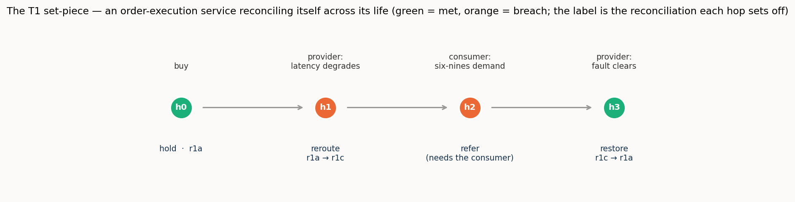

# 2/4 · Reconciling intent with realisation: refinement, negotiation, and a service that renegotiates itself

> *Programme status — the **second of the programme's four operational settings** (intent-based
> service management). The first setting reconciled two structural models of one network by an
> **equivalence**; this one reconciles a declarative **intent** against a concrete **realisation**
> by **refinement**, and so exercises the parts the first setting could not: verification by
> satisfaction, a two-sided **negotiation** when nothing fits exactly, the **pragmatics** of whose
> authority decides, and a service reconciled repeatedly **across its whole life**. Consistent with
> the programme's aim at this stage, the report is written to **explain and illustrate the concept
> in action** and to make plain **what is new against the first setting**, with the measured results
> as confirmation rather than as the whole point.*

## Summary

Two software agents face each other across the boundary between a customer and a network operator.
The customer's agent, **O**, knows only what the customer *wants* — a connection from one site to
another, at least so much bandwidth, no more than so much delay, available to so many nines,
protected or not. The operator's agent, **N**, knows only what it *has* — a catalogue of concrete
optical services, each a discrete client signal carried over a particular route, with a measured
latency, an availability, a protection scheme, and a cost. Neither speaks the other's language, and
neither will adopt the other's model. They must work out, between themselves, which of N's concrete
services *satisfies* O's declared wish.

That last word is the whole difference from the first setting. There, reconciliation was an
**equivalence**: this TAPI term *is* that TEAS term. Here it is a **refinement**: "latency below 5
ms" is not equal to any service N offers — it is a *bound that a service either clears or does not*,
and many different services may clear it. Once the relation is refinement rather than equivalence,
four things follow that the first setting never had to confront, and each is a deliberate object of
this study: verification must be by **satisfaction** (you check the chosen service against every
bound, because you cannot check a lossy refinement by handing the wish back); when no service meets
every bound the agents must **negotiate** a best-achievable offer and someone must **decide** whether
to accept it; that decision turns on **pragmatics** — the customer's priorities, budget, and
authority, which this study carries in a small, portable **policy** the customer's agent holds; and
because a live service's circumstances change, the whole exchange **recurs across the service's
life**, a loop rather than a single hand-off.

We built a harness in which two language-model agents perform this reconciliation over a seeded case
grounded in the first setting's OTN/optical network, and scored every step against a validated gold
standard. The headline is a single, sharp result. **When both agents can reason, the reconciliation
completes autonomously — including the negotiation, with no human in the loop. As cognition recedes,
the negotiated decisions collapse to a residual that must be referred to a person — and a small
pre-placed policy the customer carries *recovers* the part of that residual it was authorised to
decide, closing autonomously what a mute customer would have to hand off.** That is the programme's
central insight — cognition is what completes a reconciliation — now measured on a genuinely
two-sided negotiation, and sharpened by a second finding: a thin published **reference** can supply
an inert agent the *facts* it needs to check satisfaction, but it cannot supply the *authority* to
decide; where the missing ingredient is judgement rather than information, no reference substitutes,
and only cognition closes the gap. Around these, the study shows a clean **capability gradient** —
a strong agent negotiates, verifies, and defers cleanly on a fraction of the effort; a weak one
burns an order of magnitude more reasoning to do less — and it follows one service through a
**four-hop lifecycle**, bought and degraded and rerouted and stretched past what the network can
give and finally restored, as a worked illustration of the concept in motion.

The setting is grounded in the IRTF NMRG Internet-Draft *Dynamic Network-as-a-Service Life-Cycle
Automation Using End-to-End Agent Negotiation* (draft-janz-nmrg-naas-agentic-negotiation; Janz,
Rahimi, and Yu), whose consumer policy-and-wallet agent, agent-to-agent negotiation, and closed-loop
lifecycle renegotiation this study operationalizes and puts to an empirical test.

## 1. The setting: two agents, and what passes between them

Picture the two agents and the one thing they are trying to do.

**Agent O** sits on the customer's side. It holds an **intent**: a statement of what the customer's
workload needs, in the customer's own terms. A concrete example, the one we will follow: *a
connection from the New York floor to Frankfurt, at least 8 Gbit/s, latency at most 5 ms,
availability at least four-nines (0.9999), protection not required.* Every clause is a **bound** — a
predicate over a delivered service, not a service itself.

**Agent N** sits on the operator's side. It holds a **catalogue** of concrete **realisations**: real
Layer-1 services it could provision over the OTN/optical core. Each realisation is a specific thing —
a discrete ODU client signal (ODU0 ≈ 1.25 Gbit/s, ODU2 ≈ 10 Gbit/s, ODU3 ≈ 40 Gbit/s, and so on)
carried on a particular route (a short direct path, or a diverse protected one), and it comes with
the properties that matter to O's bounds: a bandwidth, a latency, an availability, a protection
scheme, and a cost. For the New York–Frankfurt endpoints, say, N can offer a *direct* ODU2 (10
Gbit/s, 3 ms, 0.99995, unprotected, cost 40) or a *diverse protected* ODU2 (10 Gbit/s, but 6 ms,
five-nines, 1+1 protected, cost 70).

What passes between them is a **refinement**. O does not tell N how to build anything, and N does not
adopt O's vocabulary of bounds. N proposes a realisation; the question is whether that realisation
*satisfies* every one of O's bounds. Take O's intent above against N's direct ODU2: 10 ≥ 8 ✓, 3 ms ≤
5 ms ✓, 0.99995 ≥ 0.9999 ✓, protection not required ✓ — the direct service **satisfies** the intent,
and the reconciliation is complete: O's wish is refined down to that concrete service. The diverse
service would also have served on bandwidth and availability but **fails** the latency bound (6 ms >
5 ms); it is not a valid refinement of *this* intent, though it might be of another.

Three consequences of "satisfied by" rather than "equal to" run through everything that follows.

**Verification is by satisfaction, not round-trip.** In the first setting you could check a proposed
equivalence by mapping a term across and back and seeing that you returned to where you began. A
refinement is lossy and one-to-many — "≥ 8 Gbit/s" does not remember that it was met by exactly an
ODU2 — so there is nothing to round-trip. You verify by taking the chosen realisation and testing it,
bound by bound, against the intent. Verification *is* the satisfaction check.

**When nothing fits, the agents must negotiate.** Some intents cannot be met by any single
realisation — the bounds pull against each other, or the catalogue simply lacks a service that clears
them all. Then N computes the **best-achievable** offer (the realisation that gives up only the
least-important bounds) and O must **decide** whether to accept the degraded offer or reject it. This
is a genuine two-sided negotiation, and — the point the setting is built to test — in the
fully-cognitive case it closes with no human in the loop.

**The decision turns on pragmatics, which a portable policy carries.** Whether a degraded offer is
acceptable is not a property of the network; it is a property of the *customer* — which bounds are
sacred, what the customer can afford, how this particular flow should behave when the network
tightens. This study makes that concrete as a small, portable **movable policy** the customer's agent
holds: a priority ordering over the bounds, a set of *hard* (must-hold) bounds, an affordability
floor, and a flow-class rule. The same infeasible intent, decided under two different policies, comes
out differently — and correctly so. That portable policy turns out to be the pivot of the whole
setting, for a reason developed in §3.3.

One concrete illustration of the negotiation, before the method. Consider an intent for a 40-Gbit/s
market-data feed that wants latency ≤ 10 ms, four-nines availability, and protection. N has two
realisations for those endpoints: a direct ODU3 (40 Gbit/s, 8 ms, but only three-nines and
unprotected) and a diverse ODU3 (40 Gbit/s, protected, five-nines, but 12 ms). *Neither satisfies the
intent* — the direct one misses availability and protection, the diverse one misses latency. There is
no equivalence to find; there is only a choice to negotiate. Under a **latency-first** policy the
correct answer is to **reject** — the direct offer's best-achievable degrades availability, which this
policy holds sacred. Under a **resilience-first** policy the correct answer is to **accept the diverse
offer** — it holds availability and protection, giving up only latency, which this policy is willing
to trade. Same intent, same catalogue, opposite decisions, each right for its policy. That is the
setting in miniature: reconciliation here is not a lookup but a judgement, and the judgement is the
customer's.

## 2. Method

### 2.1 The agents, the oracle, and the phases

As in the first setting, the reconciling cognition is played by a reasoning stack — in the
fully-cognitive case, an exchange between two live agents, O and N. The stack runs a **bounded
tool-use loop**: the model is given the intents, the catalogue, and the policy in force, and a small
set of tools that stand for the live capabilities of each side. The provider side, when live, can be
asked to **check the feasibility** of a realisation (does it actually satisfy the bounds, using the
true operational figures rather than the advertised catalogue) and to compute the **best-achievable**
offer. The consumer side, when its judgement is present, can be asked to **consult the policy** —
accept or reject an offer against the hard bounds and affordability floor. In the assurance phase a
**read-operational** tool returns live telemetry. Every tool call is counted; the whole exchange is
captured as a transcript, so a run can be *shown*, not only scored. The tools are deterministic and
read a hidden ground truth the model never sees; their availability follows the cognition placement
(§2.2), which is how the spectrum is imposed.

The reconciliation is exercised in four phases, run by a single command as a launch-and-leave
sequence:

- **Refine-down + satisfaction** — for each intent, choose the realisation to provision and say
  whether it satisfies every bound.
- **Feasibility and the judge (negotiation)** — for each infeasible intent, obtain the
  best-achievable offer and decide accept or reject against the policy in force.
- **Endpoint co-reference** — a supporting step: decide which of O's delivery points and N's access
  points are the same physical entity. This is instance-level co-reference and reuses the machinery
  (and the finding) of the first setting's instance study.
- **Assure-up (the lifecycle)** — walk a service through a multi-hop life, classifying fulfilment and
  renegotiating at each turn.

### 2.2 The cognition spectrum, for intent

The spectrum is the same instrument as in the first setting — both agents live, one inert, both
inert — but the negotiation gives it a new place to bite, and the movable policy gives it a
genuinely new *rung*. The consumer's judgement can be present in two different ways: as a **live**
reasoner in the moment, or **pre-placed** in the portable policy that decides on the customer's behalf
without a live customer present. That distinction splits the middle of the spectrum and is, as it
turns out, exactly where the setting's sharpest result lives. The placements we run are:

- **both-cognitive** — provider live, consumer judgement present; the reconciliation, negotiation
  included, completes autonomously.
- **provider-inert** — N is a static catalogue: no live feasibility, no fresh best-achievable offer.
  O must reason from the advertised catalogue alone.
- **consumer-policy** — the consumer is not a live reasoner, but carries a **pre-placed movable
  policy** that closes the decisions it was authorised for.
- **consumer-mute** — the consumer is a static description with no policy: decisions it cannot settle
  must be **referred onward** to a person.
- **both-inert** — neither side is live; a third party proposes from static evidence and refers every
  acceptance decision.

The **residual** — the reconciliation that cannot be closed and must be handed to a person — is the
measure of what cognition, at each placement, leaves undone.

### 2.3 The case, the policies, and the reference

The case is small and seeded so that every mechanism is exercised and every trap is provable: seven
intents over five endpoint pairs, a catalogue of nine realisations, three movable policies
(latency-first, resilience-first, cost-sensitive), and three lifecycle trajectories (eight hops in
all, one of them the worked set-piece of §3.5). A deterministic
satisfaction–feasibility–policy–fulfilment oracle derives the gold — the satisfying realisations, the
best-achievable offer and correct decision under each policy, the co-reference truth, and the
per-hop lifecycle verdicts — and *validates* it before any run, refusing to proceed unless the
seeded case is internally consistent: that every "experiment-only" intent genuinely needs a live
probe (its advertised and actual figures disagree), that every infeasible intent truly has no
satisfier, and — the check that keeps the pragmatics honest — that the accept/reject decision really
does vary with the policy.

Two of the seven intents are **experiment-only**: their advertised catalogue figures and their true
operational figures disagree, so a purely static agent gets satisfaction wrong and only a live
feasibility probe resolves them. They are the intent-setting analog of the first study's
static-twins-need-a-probe, and they are where the spectrum bites in the refine-down phase.

The **reference** is run as two arms plus a no-reference control, exactly as the design proposed. A
**unit/value-set** arm pins what the units mean, the discrete value hierarchies (ODU rates,
protection classes, availability nines), and — guarding the "nature" trap — the separation of an
expectation-kind bound ("latency ≤ 5 ms") from a realisation-kind metric (a measured latency). An
**invariant** arm publishes the committed guarantee floor per realisation, an anchor a satisfaction
check can evaluate against when a side cannot be probed. What the reference contributes, and where it
stops, is one of the study's findings (§3.3).

### 2.4 Metrics

Correctness is the currency throughout. Refine-down is scored by **satisfaction accuracy** (did the
agent's satisfy/refer verdict match the truth, and did a claimed satisfier really satisfy) and by
**experiment-only correctness**. Negotiation is scored by **decision accuracy** (accept/reject
matching the policy-correct verdict) and by whether the **best-achievable offer** was the right one,
with the **refer rate** tracked alongside as the honest measure of what a placement cannot close.
Endpoint co-reference reuses the first study's precision and resolved fraction. The lifecycle is scored by **hop
accuracy** — fulfilment status, decision, and migration all correct — across the trajectory. Effort
is reported as **reasoning tokens** and **negotiation turns**. The models are the same ladder as the
first setting: a strong model (**sol**, `gpt-5.6-sol`), a mid model (**mini**, `gpt-5-mini`), and a weak one (**nano**, `gpt-5-nano`).

## 3. Results

### 3.1 Refine-down: satisfaction is easy where it can be checked, and the probe is what checks it

With both agents live, refinement is reliable: sol and mini satisfy every intent correctly (accuracy
1.0) and catch both experiment-only intents, using the live feasibility probe to see past the
misleading advertised figures. The spectrum then bites exactly where it should. Once the provider goes
inert — no probe — the experiment-only intents can no longer be caught by any model (they fall to
zero), and accuracy settles at the 0.71 that corresponds to getting the five honest intents right and
the two probe-only ones wrong. The weak model is weak even when the probe is available: nano at
both-cognitive reaches only 0.71 and catches just one of the two experiment-only intents — handed the
mechanism that would resolve them, it does not reliably use it. This is the first face of the
capability gradient: the live probe is necessary, but not sufficient — a model must be strong enough
to reach for it.

One nuance worth stating plainly, because it looks like a defect and is not. Under **full inertness**,
the strong model scores *lower* than the mid model on raw satisfaction accuracy (sol 0.29 vs mini
0.71). That is not sol failing; it is sol *refusing to assert what it cannot verify*. Blind, with no
probe, sol declines to affirm satisfaction and refers the intents onward, where mini trusts the
advertised catalogue and affirms. On the honest intents mini's trust happens to pay; but the
behaviour that scores lower is the more trustworthy one, and §3.3 shows it is exactly the behaviour a
published reference can rescue.

### 3.2 The negotiation, and the policy-recovery: the central insight, measured

The negotiation is where the setting earns its place, and the result is clean enough to read off a
single figure (Figure 1). When both agents can reason, both the strong and mid models decide every
infeasible case correctly (accuracy 1.0) — they obtain the right best-achievable offer and accept or
reject it exactly as the policy dictates, with no human in the loop. Hold the provider live and the
result holds. Then remove the consumer's live judgement, and everything turns on *how* the customer's
authority is present:

- with a **pre-placed movable policy**, the decision still closes — sol and mini stay at 1.0;
- with a **mute** customer and no policy, the decision **cannot** close — accuracy falls to 0.0, and
  the models correctly **refer all three** decisions onward rather than guess.

That contrast is the programme's central insight made visible on a two-sided negotiation. A
reconciliation that needs the customer's judgement completes autonomously exactly to the extent that
the judgement is present — live, or *pre-placed in a portable policy* — and where it is absent the
work is not done wrongly, it is handed to a person. The pre-placed policy is a concrete mechanism for
**pushing the hand-off boundary**: it lets the customer's cognition be present in the reconciliation
without the customer being live in the moment, closing autonomously what a mute description must
refer.

The weak model traces the same shape, more roughly: nano decides correctly with both sides live
(1.0), largely recovers under a pre-placed policy (0.83), and correctly collapses to referral when the
customer is mute (0.06) — the mechanism is robust enough to survive a weak reasoner, even as its
precision frays.

*Figure 1. Decision accuracy across the cognition spectrum. The line holds high while the customer's
judgement is present — live, or pre-placed in a movable policy — and falls to the floor at
consumer-mute and both-inert, where the correct behaviour is to refer the decision to a person. The
pre-placed policy is what holds the line where a mute customer cannot.*

On **pragmatic sensitivity**, the check the whole setting rests on: every model, with both sides live,
applied each policy's accept/reject correctly (accuracy 1.0 under all three policies). The decisions
genuinely track the policy — the 40-Gbit/s intent of §1 that a latency-first policy rejects and a
resilience-first policy accepts is decided each way, correctly, by the same model. The reconciliation
is not reading a fixed answer; it is exercising the customer's judgement as the customer's policy
defines it.

### 3.3 The reference reaches the information gap, and stops at the authority gap

The reference arms give the setting its second, sharper finding — and it took a targeted look at the
inert placements to see it, since with both agents live everything is already at ceiling and the
reference has no room to show.

Where a side is inert, the reference *can* supply missing **information**. The clearest case is the
strong model's caution from §3.1: blind at both-inert, sol refuses to affirm satisfaction and scores
0.29 — but publish the **invariant** reference (the committed guarantee floor), and sol has an anchor
to check satisfaction against without a probe, and rises to **0.71**. The reference saves the
verification the missing probe would otherwise have done. In the negotiation, similarly, the
**unit** reference gives the weak model a modest lift when the provider is inert (nano's decision
accuracy 0.67 → 0.83), steadying an agent that would otherwise mishandle the offer.

But the reference **cannot** supply missing **authority**. At both-inert, *no* reference — unit or
invariant — moves the negotiation decision: every model refers all three cases, with or without a
published anchor. The reason is exact and worth stating carefully. What is missing at both-inert is
not a fact about the network that a reference could publish; it is the *customer's judgement itself* —
the authority to accept a degraded offer. A reference can tell you what a service guarantees; it
cannot tell you whether this customer is willing to live with it. Where the gap is information, a thin
reference closes it; where the gap is authority, only cognition — live, or pre-placed as a policy —
closes it, and the reference stops at the boundary.

This is the programme's central insight seen from a new angle. The first setting showed a thin
reference *substituting for cognition* on a lexical task; this setting shows the limit of that
substitution. The reference reaches as far as the information a reconciliation needs and no further;
the completion of a reconciliation that requires judgement is cognition's alone.

### 3.4 Endpoint co-reference: a supporting step, and the same probing gradient

Deciding which of O's endpoints and N's access points are the same physical entity is instance-level
co-reference, and it reproduces the first study's texture on new data. With both sides live, the
same-site endpoint twins — indistinguishable on their static records — are resolvable only by
interrogating an authoritative fibre-id, and the capability gradient shows in *how* each model gets
there: sol resolves them efficiently (resolved fraction 1.0 on eight probes), nano resolves them by
brute force (resolved fraction 1.0, but twelve probes), and — the honest non-monotonic note familiar
from the first study — mini under-probes, gives up, and leaves the ambiguous pairs in the residual
(resolved fraction 0.6). Once a side
goes inert and the probe is gone, all three collapse to the same 0.6, the twins unresolvable. The
step is supporting, not the headline, but it confirms that the live-probe mechanism and its
capability-dependence carry over intact from the first setting.

### 3.5 The lifecycle, watched: a service that reconciles itself across its life

The setting's most complete illustration is a single service followed through a four-hop life — the
worked set-piece, run and scored like everything else, and reproduced here from the strong model's
actual transcript, which walked all four hops correctly (Figure 2).

*Figure 2. One order-execution service across its life. Each hop is a fresh reconciliation of the same
intent against the network's current reality; the service is migrated, held, or referred as the
policy and the live state dictate.*

The intent is the New York–Frankfurt order-execution service of §1 (≥ 8 Gbit/s, ≤ 5 ms, four-nines),
under a latency-first policy, provisioned initially on the direct ODU2, **r1a**.

**Hop 0 — bought and running.** The agent reads the operational state (latency 3 ms, availability
0.99995), finds every bound met, and holds. Nothing to reconcile; the refinement stands.

**Hop 1 — a degradation, self-remediated.** The direct path's latency has drifted to 6 ms; the agent
reads it, sees the latency bound breached, and must re-reconcile. Here the transcript shows real
judgement, not a lookup: the provider's best-achievable tool points *back at r1a* (whose catalogue
spec is still a healthy 3 ms), but the agent — seeing that r1a is precisely the path that has just
degraded — does not take it. It checks the feasibility of the alternative diverse path **r1c** (4 ms,
five-nines, protected), confirms it satisfies every bound, consults the policy (accept — within the
affordability floor), and migrates the service to r1c. A breach the network could remedy on its own,
remedied autonomously.

**Hop 2 — a demand the network cannot meet, referred.** The consumer now needs six-nines availability
for a critical window. The agent reads the in-service r1c (five-nines) against the tightened intent,
sees the availability bound breached, and looks for a remedy — but no realisation on these endpoints
reaches six-nines. The best-achievable offer still violates a hard bound, the policy will not accept
it, and the agent does the right thing: it **refers the decision to the consumer**. This is the
hand-off boundary in the lifecycle — the point where automation has reached as far as it can and the
customer's own judgement is required.

**Hop 3 — the fault clears, and a restore.** The direct-path degradation lifts. The provider offers to
move the service back to the cheaper r1a; the agent checks that r1a again satisfies the (restored)
intent, consults the policy (accept — cheaper and compliant), and restores the service. The life comes
full circle.

Four hops, four reconciliations of the same intent against a changing reality — bought, self-healed,
handed off, and restored — and the strong model gets all four right. The **capability gradient**
shows here too: hop accuracy on the multi-hop trajectories runs sol 1.0, mini 0.88, and nano 0.62 on
this set-piece, the weak model fraying as the life grows longer and the state it must track
accumulates.

### 3.6 Effort: the strong agent does more with far less

The capability gradient is nowhere clearer than in the cost of the negotiation. To reach its
decisions, the strong model spent on average about **150 reasoning tokens** over fewer than three
turns; the mid model about **860**; the weak model about **5,400** — roughly thirty-five times the
strong model's effort — over more turns, to reach *lower* accuracy. The pattern is the one the first
setting found and this one confirms on a harder task: capability buys not just correctness but
economy; a weak agent does not merely make more mistakes, it spends far more cognition making them.

## 4. Discussion

**What is new against the first setting.** The first setting established that cognitive agents can
reconcile two structural models *ad hoc*, and that a thin lexical reference can substitute for
cognition on that task. This setting moves from equivalence to **refinement**, and in doing so
exercises everything the first could not. Verification became **satisfaction** — checking a chosen
realisation against every bound, the mode the first study named and deferred. A genuine two-sided
**negotiation** appeared — best-achievable offers, accept/reject decisions — and the study showed it
completing autonomously under full cognition and collapsing to referral as cognition recedes.
**Pragmatics** moved from a fixed backdrop to a measured axis, carried by a portable **movable
policy**, and the decisions were shown to track it. And the reconciliation became a **loop across a
service's life**, not a single hand-off. The one component the first setting held fixed and this one
puts to work is exactly the pragmatic one; only the schema-structural machinery is now shared ground.

**The central insight, sharpened twice.** The programme's claim is that cognition is what completes a
reconciliation, and that the fully-cognitive end completes autonomously, with no standard and no
human. This setting sharpens it in two ways that the first could not reach. First, it shows the claim
holding on a *negotiation* — the hardest thing to automate, because it needs both sides' live
participation — and it identifies the **pre-placed policy** as the mechanism that pushes the hand-off
boundary outward: the customer's cognition, placed in a portable artefact ahead of time, closes
autonomously what a mute customer would refer. Second, it draws the **limit** of the thin reference
that was the first setting's protagonist. A reference reaches the *information* a reconciliation
needs — it can hand an inert agent the facts to check satisfaction — but it stops at the *authority*
to decide. Where the missing ingredient is judgement, no reference substitutes; cognition, live or
pre-placed, is the only thing that closes the gap. Information has a published stand-in; authority
does not.

**The honest limits of what was measured.** Two results are worth stating plainly rather than
smoothing over. The hardest lifecycle move for every model was the **voluntary** one — the
cost-sensitive service stepping aside to a cheaper path when *nothing was broken* (hop accuracy 0.5
across all three models on that trajectory). A breach compels a reconciliation; a mere opportunity to
save money does not, and the models default to holding a service that is meeting its bounds. This is
arguably defensible behaviour, but it marks a real edge: proactive, unforced optimisation is harder
for these agents than reactive remediation. And the study is, by design, **illustration-first** — one
seeded case, a modest measured cross-product, a few worked scenarios rather than a large factorial. It
is built to show the concept in action and to establish the mechanisms cleanly, not to characterise
their statistics; the numbers here are consistent and repeatable across trials, but the claim they
support is existential and mechanistic — *this is how it works, and here it is working* — not a
population estimate.

**Where this leaves the programme.** Two of four settings are now complete. Between them they have
exercised the lexical, ontological/structural, and instance-level components of reconciliation, the
verification of a reconciliation, and — new here — its pragmatic component and its extension across a
service's life. The through-line holds and has sharpened: it is cognition that completes a
reconciliation; a thin reference reaches the information gap and no further; and the fully-cognitive
end completes autonomously, the pre-placed policy carrying the customer's authority to exactly where a
person would otherwise have to stand.

## 5. Threats to validity

The case is single and seeded; it is constructed to exercise each mechanism and prove each trap, not
sampled from a population, so the results establish that the mechanisms work and how, not how often
they would work in the wild. The oracle is deterministic and the gold is derived and validated from a
hidden truth, which removes drift but also means the "difficulty" of the case is authored rather than
found. The model ladder is three points, chosen to span a capability range; the gradient is clear but
its shape between the points is not resolved. The measured cross-product is deliberately modest, and
the lifecycle in particular rests on a small number of worked trajectories; the accuracies reported
are stable across the trials run but are illustrations of behaviour, not tight estimates. Finally, the
negotiation and policy are a faithful but simplified rendering of the NMRG draft's richer model —
scarcity-driven pricing, wallets, and multi-party settlement are represented only as far as the
reconciliation question requires, and their fuller dynamics are out of this study's scope.

## 6. Reproducibility

The case builder, the validating gold deriver, the agent stack, the four-phase runner, and the
figure scripts are in the repository, alongside the seeded case and the recorded per-model results and
transcripts. The build, the gold derivation, and the offline tests run with no API and no network; the
staged runs are a single launch-and-leave command, resumable and segmented by phase and model. The
worked set-piece of §3.5 is reproduced verbatim from the recorded transcript.
