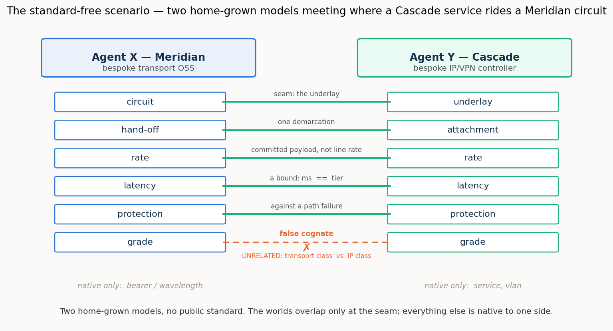

# 3/4 · Reconciling across a domain boundary with no public standard: what a strong agent will not guess, and what a thin reference is worth

> *Programme status — the **third of the programme's four operational settings**
> (cross-domain, standard-free reconciliation). The first setting reconciled two **public
> standard** models of one network; this one reconciles two **home-grown, private** models of
> **adjacent domains** that meet at a single seam, with no public standard beneath either side.
> It exercises the same schema-binding muscles as the first setting, and is written to make plain
> **what changes in execution when the standard is removed** — with the measured results as
> confirmation of a mechanism, not as the whole point. Consistent with the programme's stage, the
> report isolates and explains one stage of the reconciliation; the instance-level and the full
> conversational process are, by design, out of its frame (§2).*

## Summary

Two software agents face each other across the boundary between two networks that must
interwork. **Meridian** is a home-grown transport OSS: it thinks in circuits, bearers,
wavelengths, protection grades. **Cascade** is a home-grown IP/VPN controller: it thinks in
services, attachments, VLANs, classes of service. Their models were written by different teams
for different purposes; neither is a public standard, and neither will adopt the other. Their
worlds touch at exactly one place: a Cascade service must ride a Meridian circuit as its
underlay. Everything a customer's order needs to survive that boundary — the committed rate, the
latency bound, the protection, the identity of the hand-off — has to be reconciled there, with
no shared vocabulary and no standard to appeal to.

This setting is the deliberate complement to the first. There, two *different* models faced each
other too — but both were public standards (TAPI and TEAS) the agents already knew, so cognition
could lean on recognition to bridge them. Here that crutch is gone: both models are bespoke and
recognisable to no one in advance. The first setting's muscles are the same — lift, bind, a thin
reference, the cognition spectrum — but with the standard removed, the *execution* diverges, and
that divergence is the report's subject.

We measured one stage of the reconciliation — the **schema-level binding**, the step that
decides which concept on one side corresponds to which on the other — as an exchange between two
live agents, across the cognition spectrum, with and without the reference the two agents would
construct. The central result concerns what happens without that shared ground. **The strong agent
defers, and where a single agent must reconstruct a side the weak agent over-commits.** The strong
model, facing two foreign vocabularies with no shared ground, will not guess: it binds only the names
that already coincide and leaves the rest in the residual — a low resolved fraction, but perfect
precision and no false cognates. The weak model's error is the opposite — binding freely and taking the
cross-domain "grade" trap at a precision of barely one-half — but it shows at the inert placements,
where a lone agent reconstructs the mute side; at both-cognitive its partner's ratification refuses the
over-bindings, so it under-resolves rather than mis-commits. A single thin reference repays the
deferral: constructed, it lifts the strong agent to a full close and disciplines the weak agent's
precision where it is a lone reconstructor. Ablating the reference field by field shows the ground it supplies is remarkably
thin — **any one** descriptive field (a shared label, a class, a one-line definition, or a
canonical example) is enough to unlock the strong agent's commitment, while a bare shared
identifier with no description is worthless, and even harmful. And a separate axis — **whose
realm owns each shared field** — shows the reference reaching *meaning* but not *authority*: it
settles what a field is, not who governs it.

Read carefully, none of this qualifies the programme's thesis that fully-cognitive agents can
close a reconciliation. What it measures is one early stage of that process, and the worth of the
one step — constructing the shared ground — that the stage was not allowed to take. The
through-line holds and gains a clause: with no public standard beneath two models, cognition
still closes, but only once it has built the shared ground, and **building that ground is the
work**. Run end to end — the two agents constructing the shared reference themselves from their models
and then binding through it, with none pre-given — the protocol bears this out: the strong agent lifts
from a no-reference resolved fraction of 0.20 to a constructed-reference **0.80**, and to **0.90** when
the agents also run a decisive virtual experiment on the candidates, approaching the reference-given
1.00, at perfect precision and with no false cognate. Constructing the ground is the work, and a capable
agent does it. A separate cost study across the schema settings (master report
§13.6) puts a price on that work and locates where it is worth paying: constructing the reference is
load-bearing precisely here, where no standard exists and the agent is capable, and it is cheap for such
an agent (a few hundred extra reasoning tokens over binding with no reference); where a standard already
exists — the configuration and observability settings — binding through the given reference reaches the
same close for a fraction of the cognition, so building one is redundant; and for a weak agent,
construction is capability-gated and its cost explodes for a worse close. In short, build the reference
where there is none to bind through and the agent can build a good one; otherwise use the one that
exists.

The setting is grounded in the demonstration *Non-standard cross-domain provisioning* and in the
programme's wider account of ad-hoc, agent-constructed references.

## 1. The setting: two home-grown models, and the one seam between them

Picture the two agents and the single place their worlds meet (Figure 1).

**Agent X — Meridian** provisions optical transport. Its concepts are a transport engineer's:
a *circuit* carried on a *bearer* (a wavelength), presenting at a *hand-off* to the customer,
with a *rate*, a *latency*, a *protection* scheme, and a *grade*. **Agent Y — Cascade**
provisions IP/VPN services. Its concepts are an IP engineer's: a *service* with an *attachment*
to the customer site, riding an *underlay*, carrying a *VLAN*, with a *rate*, a *latency*, a
*protection* requirement, and a *grade*. The two were built independently; the labels line up
where the domains happen to share a word and diverge everywhere else.

*Figure 1. Two home-grown models, no public standard. Five things must be reconciled where a
Cascade service rides a Meridian circuit; "grade" looks like a sixth but is a trap; and each side
carries native concepts with no counterpart at all.*

Follow one order across the boundary. A customer asks Cascade for a service from its New York
site to its Frankfurt site — call it SVC-42 — committed to 5 Gbit/s, latency no worse than tier
T2 (≤ 8 ms), protected. Cascade cannot deliver that itself; the service must ride a transport
circuit, so Cascade and Meridian must reconcile the order across the seam. Five bindings have to
hold. Meridian's **circuit** is Cascade's **underlay** — the same object, named from two
domains. Meridian's **hand-off** at New York is Cascade's **attachment** there — one demarcation,
two names. And three requirements must be pinned so they cannot be misread across the boundary:
the **rate** is a *committed payload* (5 Gbit/s), not the circuit's 100-Gbit/s bearer *line
rate*; the **latency** is a *bound*, whether written as a number of milliseconds or a named tier;
the **protection** is against a *transport path failure*, a fibre cut, not against some IP event.

And one thing must *not* bind. Both models carry a concept called **grade** — but Meridian's
grade is a transport protection class (a platinum circuit is dual-path protected) and Cascade's
grade is an IP class of service (gold traffic gets a low-latency queue). Same word, unrelated
meanings. Corresponding them would silently mis-provision the service. This is the setting's
false cognate, and because there is no standard to consult and the two concepts share no
structure either, it is nastier than any in-domain trap.

That is the whole reconciliation in one order: five bindings to make, three of them requiring a
pin, one look-alike to reject, across two vocabularies with nothing public beneath them.

## 2. What is on the bench: the schema binding, and the residual it leaves

A full reconciliation between two agents is a staged process. Each side must first *lift* its
implicit model into an explicit one; the two must find or construct a *shared reference* to talk
through; they *bind* their concepts to it; they *pin* the ambiguous requirements; they *co-refer*
the specific endpoints; and they *verify* by a worked provisioning. Cognition is spent across all
of these stages. This study does not run that process end to end, and it makes no claim about
whether the process closes — that two fully-cognitive agents can close a reconciliation is the
programme's thesis, established across the earlier settings and not re-litigated here. What this
study isolates is a single, early stage: the **schema-level binding** — given two already-lifted
models, deciding which concept on one side corresponds to which concept on the other.

We measure that binding as an **exchange between two live agents**: each holds only its own lifted
model and a surface catalogue of the other's, and they alternate turns — asking, answering, proposing
correspondences, and **ratifying** the other's proposals about their own concepts, so a correspondence
is confirmed only when one side proposes it and the owner accepts it. We isolate the binding from the
later stages: in this measurement the agents do not construct the shared reference or verify by a worked
provisioning — those are held to one side so the worth of the reference-construction step can be read
cleanly. The quantity of interest is therefore not only how much they close, but how much they **leave
in the residual**: the correspondences they do not confirm, which pass downstream to the rest of the
process — to further machine cognition where the agents are live to continue, or to a person where they
are not.

Two variables shape the pass. The first is the **cognition spectrum**, exactly as in the first
two settings. At **both-cognitive**, both sides disclose their lift in full — each concept's
gloss and canonical example are present. At **one-inert**, one side is a mute snapshot that
exposes only its structure and instances, so its meaning must be reconstructed. At
**both-inert**, neither side discloses, and the binding rests on structure alone. The second
variable is the **shared reference**: present or absent. Because the reference in this setting is
not adopted from a standard but *constructed by the two agents themselves* — categories proposed,
each fixed by a canonical example both can instantiate, and agreed — the reference-absent
condition is best read not as "the reference was withheld" but as "the reference has not been
constructed *yet*." It brackets the construction step, so that the gap between reference-absent
and reference-present measures precisely what that one step is worth.

One point deserves to be stated plainly, because it is easy to misread. A low result at
both-cognitive with the reference absent is not the fully-cognitive process failing to close: it is two
careful agents declining to guess across two foreign vocabularies without the shared ground they would
themselves construct. They interrogate each other in full and then defer the pairs they cannot be sure
of — honest deferral, not error — leaving the worth of that ground in the residual, precisely where the
reference-construction step recovers it.

**Scope, and a blurry line.** The setting's reconciliation touches several components — lexical,
schema, instance-level co-reference, and pragmatic. This study measures the **schema binding**,
and the line to the others is genuinely blurry at the seam: co-referring the specific demarcation
(which physical hand-off is which logical attachment) is instance-level work; pinning a
requirement (a *committed* rate, not a *line* rate) shades into attribute semantics; the "grade"
trap is as much lexical as schema. We measure the schema binding and say so. The **instance-level
co-reference we bracket**: it is the entity-resolution-by-probing of the first setting's instance
study, it behaves the same way here — the intent setting's endpoint phase, which reused that
machinery, confirmed as much — and re-running it would largely replicate a known result. The
**pragmatic component** — whose realm owns each shared field — we take up separately (§4).

Correctness is the currency: we report the **resolved fraction** (of the true correspondences that
exist, the share the pass finds and commits), **precision** (of the correspondences it commits to, the
share that are correct), surviving false cognates, the residual, and
reasoning effort. The model ladder is the programme's: a strong model (**sol**, `gpt-5.6-sol`), a mid model
(**mini**, `gpt-5-mini`), and a weak one (**nano**, `gpt-5-nano`).

## 3. Results

### 3.1 Without the shared ground, the strong agent defers and the weak one errs

With the reference present, the binding closes cleanly — the strong agent reaches a
resolved fraction of 1.0 at both-cognitive with perfect precision (the mid agent 0.70), and the
deterministic reference reconciler confirms the case is fully resolvable in principle. The finding is what
happens with the reference *absent* — the construction step bracketed out — and it is not the
shape one might expect (Figure 2).

*Figure 2. Resolved fraction against precision, averaged over the spectrum, reference off (hollow)
to on (filled). Without the constructed reference the strong agent sits top-left — it commits
little but everything it commits is right; the weak agent sits lower-right — it commits much of it
wrongly. The reference pulls both toward the top-right corner.*

**The strong agent does not fail; it defers.** Negotiating over the two bespoke models with no shared
reference, sol interrogates the other side in full and then commits only the correspondences whose
surface names already coincide, leaving the foreign-named seam pairs — circuit-to-underlay,
hand-off-to-attachment — in the residual: a resolved fraction of 0.20 at both-cognitive, and around 0.4
once a side goes inert, but with precision at 1.0 and not a single false cognate taken. This is
omission, not error. Faced with two genuinely foreign vocabularies and no shared ground to bind on, the
strong agent declines to guess and hands the unresolved pairs downstream — the fully-cognitive process
deferring honestly, not failing to close.

**The weak agent's failure is commission — but where it shows depends on the placement.** Where a
*single* agent must reconstruct a side, at the inert placements, nano binds freely and takes the
cross-domain "grade" false cognate, its precision never clearing 0.83 and falling to 0.57. At
both-cognitive, though, nano cannot bind without its partner's ratification, so the negotiation refuses
its over-commitments: it under-resolves (0.40) rather than mis-commits, and the trap does not survive.
Commission is confident wrong binding where the strong agent left silence, but it is a property of a
lone reconstructing agent, not of two agents negotiating; mini sits between, closing the seam on its own
at both-cognitive and beginning to slip only as a side goes inert.

So the reference-construction step, when it is skipped, costs the two ends of the capability range
in mirror-image ways: the strong agent's cost is a larger residual — deferral — and the weak
agent's is lower precision — error. And a single thin reference repays both. Constructed, it
lifts sol's binding to a full close, and lifts nano's precision toward 1.0 while
pre-empting the trap; it does double duty, supplying the strong agent the ground it needs to
commit and the weak agent the discipline it needs to be right.

This is the setting's central result, and it is where this case departs from the first setting.
There, the two sides spoke *different* models — but both were **public standards the agents
already knew**: TAPI on one side, TEAS on the other, two distinct standards, each recognisable on
sight. Strong cognition could lean on that public knowledge to bridge them, and bind without an
explicit reference. Here, both models are **home-grown and private**, recognisable to no one in
advance, so there is no public knowledge to lean on; the constructed reference is what gives
cognition the ground to commit. The programme's through-line holds and gains a clause: with no
public standard beneath the two models, cognition still closes — but only once it has built, or
been given, the shared ground, and **building that ground is the work**. What the
reference-absent numbers measure is not a limit of cognition; it is the worth of the one step the
binding pass was not allowed to take.

### 3.2 The mechanism: a thin descriptive toehold, not a shared pointer

If the constructed reference is what lets the strong agent commit, what part of it does the work?
A factorial ablation, at the inert placements and with the reference's identifiers made opaque
(so a concept cannot cheat by reading an entry's *name*), separates the reference into four
descriptive factors — a lexical surface, a class, a definition, and a canonical example — and
turns each on and off. The answer is sharper than "the definitions" or "the examples," and it is
the same for the strong agent whichever single factor is present.

| reference content (strong agent, inert) | resolved fraction | precision | surviving false cognate |
|---|---|---|---|
| none (no reference) | 0.50 | 0.93 | 0.17 |
| a bare shared identifier, no description | 0.40 | 0.50 | 0.00 |
| a shared **label** only | 0.97 | 1.00 | 0.00 |
| a shared **class** only | 1.00 | 1.00 | 0.00 |
| a shared **definition** only | 1.00 | 1.00 | 0.00 |
| a shared **example** only | 1.00 | 1.00 | 0.00 |

Two things stand out. First, **a bare shared identifier is worse than nothing**: given opaque
tokens to match on and no description to say what they mean, the strong agent binds by the token
and binds wrongly — precision falls to 0.50, below the no-reference floor. The reference does not
work through the shared *pointer*. Second, **any single descriptive field is sufficient**: a
shared label, a class, a one-line definition, or a canonical example — each alone lifts the strong
agent to a near-perfect close. They are substitutes, not a stack. The strong agent has the
cognition to bind; what it lacks without the reference is any shared ground *with meaning in it* to
bind on, and it converts even the thinnest such ground — a single descriptive category the two
models can both point at — into a full commitment. The ad-hoc, by-example reference works because
a canonical example is one sufficient form of that ground; but it is the *shared description*,
not the example specifically, that does the unlocking.

The weak agent is a different story, and an honest one: for nano the fields are **not**
interchangeable. A shared label or definition carries most of the precision gain; a shared *class*
alone does nothing (it stays at the no-reference floor); and **no single field fully pre-empts the
cross-domain "grade" cognate** — it keeps surviving a fifth to a half of the time whatever field
is present. The reference helps the weak agent, but where the strong agent needs only a toehold,
the weak agent cannot be fully rescued by one.

### 3.3 Effort: the standard-free bridge is dear for the weak agent

The now-familiar effort gradient is, if anything, steeper here than in the earlier settings.
Reaching its bindings, the strong agent spent a few hundred reasoning tokens; the weak agent spent
several thousand — roughly an order of magnitude more — and, without the reference, spent them to
land at a precision of one-half. Capability buys economy as well as correctness: the standard-free
bridge is cheap for the agent that can build a toehold and dear for the one that cannot.

## 4. The pragmatic axis: the reference reaches meaning, not authority

The binding settles *what* two concepts mean. It does not settle *whose realm owns* a shared
field — and provisioning across a domain boundary is only correct if it does. When a Cascade
service rides a Meridian circuit, the committed rate, the realised latency, the path protection,
and the demarcation are each seen from both domains, and for each there is an authoritative source
of truth: the realm that *realises* the value and whose reading must govern if the two sides
disagree. We measured this directly, asking the agent to attribute each shared field to the
transport realm, the IP realm, or a co-owned "shared," and scoring against the realm that in fact
owns it.

Three things come out, and they are more textured than the binding result. First, **authority
attribution is hard and steeply capability-dependent**: the strong agent gets it about right, the
weak-to-mid models markedly less so, and the characteristic error is a **"transport owns
everything it carries" bias** — attributing to the transport realm fields the IP realm actually
owns (its committed rate, its class of service), simply because transport carries the traffic. The
mid model shows this strongly and also under-recognises "shared," rarely naming the demarcation as
co-owned.

Second, and echoing the intent setting exactly, **the reference reaches meaning but not
authority.** The same reference that unlocked the binding does not cleanly help the authority call;
for the strong agent it slightly *hurt*, its service-oriented phrasing nudging attribution toward
the IP realm. A reference can pin what a field *is* — that a rate is a committed payload, that
protection is against a path failure — but not *whose* it is to govern. Where the missing thing is
information, the thin reference supplies it; where the missing thing is authority, it does not, and
only cognition settles it. That the same boundary appears in two different settings — intent and
cross-domain — is itself worth noting: it is a property of what a reference is, not of one case.

Third, an honest limit of the measurement: one field, the **committed rate**, is genuinely
*contested*. The transport model says it "guarantees" the rate; the IP model says it "commits" it;
both have a claim, and the models split near evenly. We report this as what it is — a field whose
authority is legitimately shared or negotiated rather than cleanly owned — not as agent error. Some
pragmatic questions do not have a single right answer, and saying so is part of measuring them
honestly.

## 5. Discussion

**What is new against the first setting.** The first setting established that cognitive agents can
reconcile two structural models *ad hoc*, and that a thin reference can substitute for cognition on
that task — but there both models were public standards the agents recognised. Removing the
standard changes the *execution* in the way this study set out to find. The reference-blind binding,
which had a comfortable floor when a standard underwrote the vocabulary, loses that floor entirely:
the strong agent will not guess across two private vocabularies and defers instead, and the weak
agent guesses wrongly. The thin reference, which in the first setting mostly *improved* an already
workable binding, here becomes what makes the binding possible at all — and the ablation shows the
ground it must supply is minimal but non-zero and must carry *meaning*: a bare shared pointer will
not do. The pragmatic component, held fixed in the first two settings, we measured here and found to
sit *outside* the reference's reach.

**The thesis, refined not weakened.** It would be easy to read the strong agent's low
reference-absent numbers as "cognition cannot close without help," and it would be wrong. What we
put on the bench was one early stage of the reconciliation — the schema binding — run as a single
pass, with the reference-construction step bracketed out. The strong agent's shortfall in that
condition is deferral: it leaves the unresolved bindings in the residual, precisely for the later
stages (more agent cognition, or a person) to close. The reference-present condition — the ground
already constructed — closes them. So the finding is not a limit of cognition; it is a measurement
of how much the one bracketed step is worth, and to whom the unclosed remainder falls when it is
skipped. The programme's claim that fully-cognitive agents close a reconciliation is untouched;
what this setting adds is that, with no public standard, *constructing the shared ground* is the
pivotal act of the close, and that even a very thin ground suffices for a capable agent.

**Where this leaves the programme.** Three of four settings are complete. Between them they have
worked the lexical, schema, and instance components, verification, the pragmatic component (across
two settings now), and the extension of reconciliation across a service's life. The through-line
holds and has sharpened at each turn: it is cognition that completes a reconciliation; a thin
reference reaches the information a reconciliation needs and stops at the authority it does not
supply; and the fully-cognitive close, standard or no standard, proceeds by building whatever
shared ground the parties lack — a step that is itself an act of cognition, and, this setting shows,
a thin one for an agent strong enough to take it.

## 6. Threats to validity

The case is seeded rather than sampled — built to exercise the mechanism and prove the trap, not drawn
from a population — so it establishes how the standard-free binding behaves and why, not how often.

To check that the one case above was not, unintentionally, built in a way that makes the point come out
right, two further cross-domain cases were constructed from scratch: a private radio-access management
system meeting a private mobile-core controller at the user-plane transport seam (`config_xdom_ran`),
and a private data-centre fabric meeting a private overlay controller at the VLAN-to-VNI seam
(`config_xdom_dc`). Each is a fresh pair of home-grown vocabularies with no shared standard between
them — the hardest of the four settings. The signature finding here is a *mirror*: given no shared
reference, a strong agent *under-commits* — it binds only what it is certain of and refuses to guess
the rest, so of the matches it commits every one is right but it finds only some of the true matches —
while a weaker agent *over-commits*, binding freely and taking a look-alike, so it finds more but
commits wrong ones; a small constructed reference then repairs both — lifting the strong agent's close
and disciplining the weaker agent's precision.
That mirror reappears on both new cases. Without a reference the strong agent holds perfect precision
but finds only 0.40 of the true matches on the RAN-to-core seam and 0.20 on the fabric-to-overlay seam
— correctly declining to guess a seam it cannot be sure of — while the mid agent commits more and gets
some of it wrong (about 0.80 precision and 0.80 resolved fraction on the RAN seam). Adding the
constructed reference takes the strong agent to a full close on the fabric seam and to 0.80 on the
harder RAN seam, and the given reference closes both fully. So "strong agents omit, weak
agents commit, and a thin shared reference fixes both" is a property of the mechanism, not of the one
original case. (All three cases are the same author's hand-built constructions, so this shows
robustness to variation, not yet to real network data — which only carrier collaboration can supply.)

The central measurement is the **single-pass schema binding**, and the reference-absent condition
brackets the construction step rather than running the full construct-then-bind protocol; the full
protocol — the two agents constructing the reference themselves and then closing, with no reference
pre-given — is also run, and it confirms the thesis in this hardest setting: the strong agent lifts
from 0.20 to 0.80, and to 0.90 when the agents also run a decisive virtual experiment. The model ladder is three points spanning a capability range; the mirror is clear
but its shape between the points is not resolved. The pragmatic gold is largely clean but includes
one field (committed rate) whose authority is genuinely contested, reported as such. And the
instance-level co-reference is bracketed, not measured, on the argued grounds that it reproduces the
first setting's result; that argument rests on the intent setting's endpoint phase and on the shared
mechanism, not on a cross-domain instance run.

One further check bears on *who performs the lift* here. These models, like the others, are reconciled
over a materialised lift; re-running with the lift produced by an agent from each side's schema surface
alone leaves the reference-bound close unchanged — the strong agent reaches a full 1.00 through the
constructed or given reference on the agent-produced lift, exactly as on the fixture. The construct gap
is where the agent-lift is most exposed: with no reference at all the strong agent's own glosses led it
to commit one pair at the floor (where the fixture defers, resolving 0.20), and the mid agent took the
*grade* look-alike its fixture avoided — the same weak-end over-commitment the mirror describes, now
visible in the lift as well as in the bind. The full cross-setting table is in the master report
(§13.8).

## 7. Reproducibility

The bespoke cross-domain case (two lifted models, the constructed reference, the derived gold), the
single-pass binding harness and its reference-blind and reference controls, the factorial reference
ablation, and the pragmatics stack and its gold are in the repository, with the recorded per-model
results. The build and the offline checks run with no API and no network; the runs are launch-and-
leave commands, segmented by wave and resumable. The figures are regenerated from the recorded CSVs.
