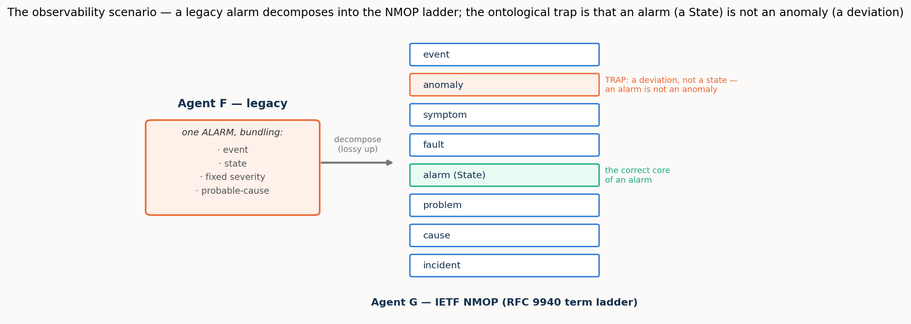
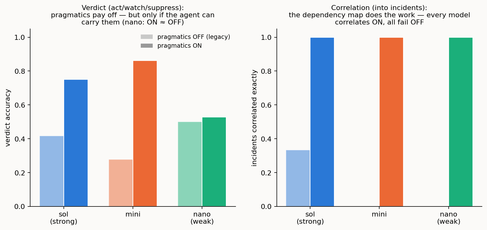

# 4/4 · Reconciling observability: an alarm is not an anomaly, and what a page and an incident really mean

> *Programme status: the **fourth and last of the programme's four operational scenarios**
> (observability). The first three scenarios reconciled structural models, refined a declarative
> intent, and bridged two private domains; this one reconciles two **observability** worlds (a
> legacy fault manager and an IETF NMOP agent) and completes the programme's pragmatics thread.
> Here the pragmatic component, deferred in the first scenario and studied as a movable policy and
> then as authority in the next two, carries the **operative meaning** of what the systems observe:
> whether an anomaly warrants a page, and how separate symptoms are one incident. It is grounded in
> the NMOP work (RFC 9940 terminology, the anomaly-semantics annotation set, and the
> incident-yang correlation model), with the standards grounding kept exact and the scoring falling
> out of a validated deterministic oracle.*

## Summary

Two systems watch the same network and disagree about what they see. **Agent F** is a legacy fault
manager. To it, an *alarm* is a catch-all: an event, an undesirable state, a fixed severity, and a
static probable-cause, all bundled and hard-coded at emission. **Agent G** is an IETF NMOP agent:
it speaks the RFC 9940 term ladder, which separates what legacy conflates (event, anomaly, symptom,
fault, alarm, problem, cause, incident) and annotates each anomaly with the semantic metadata of
the anomaly-semantics draft (a concern score, a confidence score, a network plane, a pattern, a
lifecycle stage, a season). The two must share an understanding of anomalies with no common model.
(Throughout, a **page** is an alert raised to an on-call human operator, the thing a false alarm
wastes and a missed one is measured against.)

The scenario runs in two acts, and the study measures both. **Act 1 reconciles the two models**, a
schema binding, like the earlier scenarios, but carrying the programme's deepest false cognate: a
legacy *alarm* is not an NMOP *anomaly*. RFC 9940 is exact about why: an alarm is *"an undesirable
State … a State in its own right,"* an anomaly is *"an unusual or unexpected event or pattern that
deviates from normal expected behaviour,"* a deviation that may be perfectly benign. The intuition
"something is abnormal" fits both; they are different *kinds of thing*, and conflating them is not a
mislabel but a category error. Act 1 also asks the overloaded legacy alarm to be **decomposed** into
the several NMOP concepts it bundles. **Act 2 runs a live anomaly through**, and lets the pragmatics
decide: a rising pre-FEC BER deviation on a wavelength means nothing *in the data*; whether it
warrants a page depends on its concern and confidence and on its context (a planned maintenance
window makes the same deviation expected), and whether it is one incident or many depends on
correlating it, across layers, with the symptoms it causes.

Three results complete the programme's arc. First, the **ontological cognate is a clean three-rung
capability gradient**: the strong agent never conflates an alarm with an anomaly; the mid agent does,
as cognition recedes, and the RFC 9940-anchored reference **rescues** it; the weak agent conflates
them with or without the reference, beyond rescue. The lexicon pins the ontology for the middle of
the ladder, not the bottom. Second, in Act 2 the **pragmatics carry the operative verdict**: with
the semantics on, the agents suppress correctly during maintenance and the false-page storm
disappears; with them off, the legacy pipeline pages nearly everything, **but the payoff is itself
capability-gated**: handed the same annotations, the weak agent still cannot produce the verdict.
Third, **correlation is different**: given the resource-dependency structure, *every* model (the weak
one included) folds an optical degradation and the IP loss it causes into one incident, and without
that structure every model fails. Where a pragmatic is a *structural input*, even a weak agent applies
it; where it demands *judgement*, only a capable agent can.

So the programme's through-line reaches its end and gains its final clause. Cognition completes a
reconciliation; a thin reference supplies the information a reconciliation needs and stops at what it
does not; and the pragmatic frontier the descriptor methods never reach is real, decisive for
meaning, and itself bounded by capability. Meaning (what an anomaly *is*, pinned by the reference)
and significance (whether it warrants a page and how it correlates, carried by the pragmatics) are
separable, both necessary, and each gated in its own way.

A later round of further experiments (§5) tightens three of these claims by measurement rather
than assertion. The decisive experiment that verifies a correspondence proves genuinely distinct from the
agent's own read-back (they agree on only about 64% of the cases both decide, and every split is the agent
over-passing what the experiment refutes), but its reach recedes exactly where it is most needed, falling
from 11 to 3 to 0 of fourteen proposals as the sides go inert while the agent's solo load rises 3 → 11 →
14. The three operations the study leans on each earn their place in a distinct capability regime:
pragmatic resolution lifts the verdict by +0.33 and +0.58 for the strong and mid models but only +0.03 at
the weak one, attribute pinning is a weak-model compensator (~0 for the strong model, +0.19 for the weak),
and correlation is unconditionally needed. And escalation to the decisive experiment when cheap evidence
is withheld is both capability- and reach-gated: the strong model roughly triples its probing and recovers
(resolved fraction 0.97) where the weak one barely escalates and collapses (0.46), and a probe budget buys almost
nothing where no side is live.

## 1. The scenario: two observability worlds, and one live anomaly

Picture the two agents (Figure 1). **Agent F**, the legacy fault manager, emits an *alarm*: one
object that bundles the event that fired it, the undesirable state it represents, a fixed severity
label (critical / major / minor / warning), and a static X.733 probable-cause code. **Agent G**, the
NMOP agent, does not have that object; it has the RFC 9940 ladder, which pulls those apart into an
event, a fault, an alarm (a *State*), and (concepts legacy has no first-class equivalent for) an
anomaly, a symptom, a problem, a cause established by correlation, and an incident, each anomaly
carrying its anomaly-semantics annotations.

*Figure 1. The overloaded legacy alarm decomposes, one-to-many, into the NMOP ladder. Its correct
core is the NMOP alarm-State (and a fault); the trap is the anomaly, a deviation, not a state. An
alarm is not an anomaly.*

Follow one live anomaly, the study's worked example. A pre-FEC bit-error-rate reading on wavelength
λ1 begins to rise, an *anomaly*, a deviation from normal. In the legacy world this would fire an
alarm and a page. In the NMOP world nothing is decided yet: the anomaly is annotated (a concern
score, a confidence score, a plane, a pattern), and what it *means* is then a pragmatic question.
Is the concern high and the detector confident? Then act. Is a planned maintenance window in effect
on λ1? Then the very same deviation is expected: suppress; a page now would be a false alarm. And
if, moments later, an IP link that rides λ1 shows packet loss, that is not a second, separate page:
it is the *same* incident, the optical degradation being the probable cause of the IP loss, and the
two symptoms correlate into one. The whole difference between an alarm storm and a single, correctly
attributed incident lives in those pragmatic judgements.

## 2. What is on the bench

The scenario runs in two acts, and the study measures each with the machinery it needs.

**Act 1: reconcile the models.** This is a schema binding, and it reuses the harness of the earlier
scenarios unchanged: two lifted models, a constructed reference anchored to the RFC 9940 ladder, and a
gold of correspondences and false cognates, scored across the **cognition spectrum** (both-cognitive,
one-inert, both-inert) with the reference present or absent. Two things make it harder than a plain
binding. The gold correspondences include a **one-to-many decomposition** (the legacy alarm maps to
*both* the NMOP alarm-State and the fault it implies) and the headline false cognate is the
**ontological** one, alarm↔anomaly, which no structural cue separates. A second, supporting phase
co-refers *instances*, which legacy alarm and which NMOP anomaly are the same underlying condition
(by resource and time), reusing the instance machinery; as in the earlier scenarios it reproduces the
first study's behaviour and is not the headline.

**Act 2: run the anomaly, and let the pragmatics decide.** Two tasks, each measured with the
semantics-and-pragmatics turned **ON** and **OFF**, the demonstration's toggle, and the study's
central contrast. The **verdict** task: given a set of anomalies under a context, decide each one's
operative verdict (*act*, *watch*, or *suppress*). With pragmatics ON the agent has the anomaly-
semantics annotations and the context (whether a maintenance window is in effect, whether it is a
workday or a holiday); with pragmatics OFF it has only a legacy alarm view (a severity, no scores,
no context), the legacy pipeline. The **correlation** task: given symptoms across layers with a
resource-dependency map, group them into incidents and name each incident's probable cause; OFF, the
legacy console has no dependencies and reports each symptom as its own page.

**The verdict gold is a deliberate, explicit modelling choice.** The oracle derives *act / watch /
suppress* deterministically: a maintenance window suppresses; an expected seasonal shift in its
season suppresses; otherwise high concern with high confidence acts, moderate concern watches, low
concern suppresses (with thresholds on the anomaly-semantics 0–100 scales). We state the thresholds
openly rather than bury them: they are exactly the kind of operational calibration this scenario
exists to expose, and a concrete artefact for discussion rather than a hidden assumption. The
correlation gold is derived from the resource-dependency graph and time-proximity, with the probable
cause the root symptom (lowest layer, earliest). The derivation refuses to write an inconsistent gold
and proves the pragmatic axis is real: the same anomaly reaches different verdicts under different
contexts.

Correctness is the currency throughout. For Act 1 the measures are **resolved fraction** (of the true
correspondences that exist, the share the agent finds and commits, the rest deferred to the residual),
**precision** (of the correspondences it commits to, the share that are correct), and surviving false
cognates; for Act 2, verdict accuracy and false-page count, and incident-partition and cause accuracy.
The model ladder is the programme's: sol (strong, `gpt-5.6-sol`), mini (mid, `gpt-5-mini`), nano (weak, `gpt-5-nano`).

## 3. Results

### 3.1 Act 1: the ontological cognate is a three-rung capability gradient

An alarm is a State; an anomaly is a deviation. Holding that distinction (the deepest false cognate
the programme has posed) turns out to depend sharply on capability, and it is where the RFC 9940
reference earns its place (Figure 2).

*Figure 2. Survival of the alarm↔anomaly cognate at the inert placements, without and with the
reference. The strong agent never takes it; the reference drives the mid agent's bar to zero; the
weak agent's bar barely moves.*

The **strong** agent never conflates them: surviving cognates zero, with or without the reference,
at every placement. It knows the ontology intrinsically. The **mid** agent takes the cognate once a
side goes inert and no reference is present (precision falls to about 0.69), and the RFC 9940-anchored
reference **rescues it completely**: the cognate vanishes and precision returns to 1.0. This is the
reference doing exactly the job the scenario was built to test: pinning, by definition and canonical
example, the categorical distinction a mid agent otherwise collapses. The **weak** agent takes the
cognate with or without the reference; its survival barely moves when the reference is added. Handed
the standard that separates a state from a deviation, nano cannot use it to hold the two apart.

So the lexicon pins the ontology for the middle of the ladder, not the bottom: intrinsic mastery, then
reference-rescuable, then beyond rescue. (All three agents bind the easy correspondences with perfect
precision; where they fall short of a full close is the **one-to-many decomposition**: even the
strong agent tends to map the legacy alarm to the NMOP alarm-State but miss the fault constituent, so
the resolved fraction sits near 0.75 with the RFC-anchored reference in play (without it the two agents
defer more of the decomposition, to about 0.25, as in the other scenarios). Decomposing an overloaded
concept into its several parts is the honest hard edge of Act 1.)

### 3.2 Act 2, the verdict: the pragmatics collapse the false-page storm, for agents that can carry them

Turn to the live anomaly. With the semantics and pragmatics **ON**, the strong and mid agents reach
the operative verdict and, crucially, stay quiet when they should: in a maintenance window they
suppress correctly (verdict accuracy 1.0 and 0.83) and raise essentially no false pages. With the
pragmatics **OFF** (the legacy pipeline) the same maintenance window is a false-page catastrophe:
accuracy collapses to 0.17 and 0.08, with roughly four and three-and-a-half false pages raised where
the answer was to stay silent (Figure 3, left). This is the legacy alarm storm during planned
maintenance, measured against the context-aware agent that knows the deviation is expected.

*Figure 3. Left: verdict accuracy, pragmatics OFF (pale) vs ON (solid). The strong and mid agents
gain sharply; the weak agent barely moves: ON ≈ OFF. Right: incidents correlated exactly. Every
model correlates with the dependency map and fails without it.*

But the payoff is **capability-gated**, and the weak agent draws the line. Handed the identical
annotations and context, nano shows almost no ON/OFF difference: accuracy 0.53 with pragmatics
versus 0.50 without, and only 0.17 even in the maintenance window it was told about. The pragmatics
are there; nano cannot reason over them to produce the verdict. So "the pragmatics carry the operative
meaning" is true only for an agent capable enough to carry them; below that floor, the annotations
are inert.

### 3.3 Act 2, the correlation: the dependency map turns a storm into an incident, for everyone

Correlation behaves differently, and the contrast is the subtle heart of the scenario (Figure 3,
right). Given the resource-dependency map (that wavelength λ1 underlies the IP link) **every** model,
the weak one included, folds the optical BER symptom and the IP loss it causes into a single incident,
rooted correctly at the optical cause: all three reach a perfect incident partition with pragmatics
ON. Without the dependency map, all three fail: the mid and weak agents fragment every case into
a storm of separate pages, and even the strong agent, which half-infers the correlation from the
symptom labels alone, does not get it right. One correlated incident with the pragmatics; an alarm
storm without.

The difference between the verdict and the correlation is the lesson. The correlation's pragmatic is a
**structural input** (a dependency graph) and applying it is mechanical enough that even a weak agent
succeeds once handed it. The verdict's pragmatic demands **judgement** (weighing concern against
confidence against context) and there capability decides. Both are pragmatics; both are decisive; but
they place very different demands on the agent that must use them.

### 3.4 Effort

The effort gradient is the steepest in the programme: to reach its Act 2 verdicts the strong agent
spent about 60 reasoning tokens, the mid agent about 520, and the weak agent about 1,200: twenty
times the strong agent's effort, to reach a verdict no better than chance on the cases that mattered.
Capability buys economy and correctness together, and the standard-free, pragmatics-laden observability
task exposes the gap most starkly.

## 4. Discussion

**The programme's arc, completed.** Across four scenarios the pragmatic component has moved from the
wings to the centre. In the first scenario it was deferred, and schema structure and a lexical reference
did the work. In the second (intent) it entered as a **movable policy**: the consumer's priorities and
affordability deciding whether a degraded offer is accepted. In the third (standard-free) it was
**authority** (whose realm owns a shared field) and the reference was shown to reach meaning but not
authority. Here, in observability, it carries the **operative meaning**: whether an anomaly warrants a
page, and how symptoms are one incident. The claim the programme has built toward (that pragmatics are
the frontier the descriptor methods never reach) is strongest here, because here the descriptor level
(what an anomaly *is*) is settled and the entire operational question is pragmatic.

**Meaning and significance are separable, and both are needed.** The scenario cleanly divides two things
that a single "meaning" would blur. What an anomaly *is* (a deviation, not a state) is a matter of
ontology, and the RFC 9940 reference pins it (for agents able to use it). Whether an anomaly *matters*
(act, watch, or suppress) and how it *composes* (one incident or many) is a matter of pragmatics, and
the annotations and dependency structure carry it. Strip the ontology and a mid agent conflates an
alarm with an anomaly; strip the pragmatics and even a strong agent floods the console with false pages
and uncorrelated storms. The observability reconciliation needs both, and they are supplied by different
means.

**The pragmatic frontier has a capability floor.** The programme's thesis is that cognition completes a
reconciliation; this scenario adds a boundary condition that the earlier ones only hinted at. The value
of the pragmatics (like the value of the reference on the ontological cognate) is realised only by an
agent capable enough to use them. Below that floor the weak agent cannot hold the ontology even with the
reference, and cannot produce the verdict even with the annotations. What it *can* still do is apply a
structural pragmatic it is handed outright (the correlation dependency map), which is why correlation is
the one Act 2 task robust across the whole ladder. The frontier is real and decisive; it is also gated,
and the gate is capability.

**A note for calibration.** The verdict oracle's thresholds are a modelling choice, stated openly (§2).
The strong and mid agents' imperfect scores on the fine concern/confidence gradations in the non-
maintenance contexts are as much a reflection of where a qualitative judgement meets a numeric threshold
as of any agent shortcoming; the unambiguous, context-driven cases (suppress during maintenance) are
where the ON/OFF contrast is cleanest and least contestable. This is exactly the kind of operational
calibration the anomaly-semantics work exists to standardise, and the study offers it as a concrete
artefact to refine, not a settled answer.

## 5. Further experiments

Three claims this scenario had asserted but not measured invite a direct test: whether
the decisive experiment is genuinely a different check from the agent's own read-back, whether the
three operations the study added but the reference drafts never named each do real work, and whether
the fallback from cheap evidence to an expensive probe is a behaviour or only a design choice. Each was
answered by a targeted experiment. Two consolidate runs already on disk; one (E6) puts both verifiers on
the same proposals and measures their divergence with the gold held back. All three sharpen, rather than
overturn, the picture above, and all three land on the same boundary: the mechanism is real, and its
value is gated.

### 5.1 The decisive experiment is distinct from the read-back, and its reach recedes where it is most needed

The deepest question here was whether the study's two verifiers, the agent reading
the two sides' static records ("assertion" or "negotiation") and the decisive experiment that exercises
the correspondence on the graph and consults no gold, are two checks or one check grounded twice in the
answer key. The experiment (E6) put both on the same fourteen `verify_hard` proposals (eight correct,
six wrong) across the three placements and the model ladder, and measured their mutual divergence
*before* any gold was consulted; gold was used only afterward, to adjudicate the disagreements.

They are genuinely distinct. Where both can decide (eleven of fourteen proposals, at `both_cognitive`)
the agent and the independent experiment agree on only about 64% of them (seven of eleven); the agent's
standalone accuracy is 0.71, the experiment's 1.0. And every divergence points the same way: all four
splits are the agent passing a correspondence the experiment refutes, and in every one the experiment has
the truth (4/4). Reading only static records, the agent cannot see the byte-clean wrong pairs; exercising
the correspondence catches them. The failure is a structural blind spot of record-reading rather than a
weakness capability fixes: the agent-verifier's accuracy sits at ~0.71 across the strong, mid and weak
model alike. (That within-family flatness is itself family-specific, corrected by the cross-family run
reported in the master synthesis; the reach result below is deterministic and unaffected.)

But the better authority recedes exactly as it is most needed. The experiment can act only where a side
is live to be exercised, and its reach falls from 11 to 3 to 0 of the fourteen proposals across
`both_cognitive`, `one_inert`, `both_inert`, while the agent's solo verification load rises 3 → 11 → 14.
At `both_inert` the decisive experiment cannot run at all and every verdict rests on the agent's
assertion, precisely where that assertion is least reliable. So the two verifiers differ not only in what
they conclude but in where they can act. This turns an asserted distinction into a measured one, and names
the honest limit: the gold-independent oracle exists and is used, but a full emulator or twin of a live
side remains future work.

### 5.2 The three added operations each do real work, in three different regimes

A further question is whether the three operations the study leans on but the reference drafts
do not name, attribute pinning, pragmatic resolution, and composition and correlation, are genuine theory
extensions or provisional conveniences. E7 answered by exercising each with an explicit ON/OFF toggle
across the ladder and reading the correctness delta; the deltas rest on small condition counts and are
read as direction-and-tier, not rates.

All three do real work, and none is idle, but each is needed in a different regime. **Pragmatic
resolution** (the act / watch / suppress verdict of §3.2) improves the verdict sharply for the strong and
mid models, +0.33 and +0.58 accuracy, because the context genuinely changes the right action and the
operation captures it; but at the weak model the gain nearly vanishes to +0.03, its off-baseline already
near chance and the pragmatics it is handed unexploitable. It is genuine and capability-gated on the
consuming side, the same floor §3.2 found. **Attribute pinning** is the mirror image: essentially zero for
the strong model (−0.05 resolved fraction, precision held at 1.0), it climbs monotonically as capability falls, to
+0.19 resolved fraction at the weak model. It is a weak-model compensator, earning its place precisely where cognition
is weakest, the role the study assigns the reference. **Composition and correlation** is unconditional:
turn it off and the two weaker models score 0.0 exact partition, unable to group multi-symptom evidence
into incidents at all, while turning it on brings every model to a perfect partition (the strong model
still gains +0.67). This is the clearest needed extension of the three, and matches §3.3's finding that
the dependency structure works for the whole ladder.

So "we added three operations" sharpens to three distinct claims, each backed by an ablation delta:
correlation is an unconditional extension to promote to a named operation, pragmatic resolution is valuable
only above a capability floor, and attribute pinning is a compensating operation most needed at the weak
end. (Correlation is further shown to generalise beyond observability in a companion experiment treated in
the configuration report.)

### 5.3 Escalation to the decisive experiment is capability- and reach-gated

Finally, whether the fallback ordering, from cheap evidence to the more expensive
decisive experiment, is tested. The over-trust form one might first imagine is
impossible in this benchmark (the instance gold is derived so a key cannot lie), so E4′ instead asked the
live question: when the cheap evidence (the key) is withheld, does the agent escalate to the probe, and
does it help? Both are answerable from the instance runs on disk, which record probe counts and resolved fraction per
condition.

Escalation is real but capability-gated. With a live side to probe, withholding the key drives the strong
model to nearly triple its probing (×2.7) and it recovers essentially all the lost resolved fraction, to 0.97; the
mid model escalates less (×1.7) and recovers partially; the weak model barely escalates at all (×1.1),
probing about as much with the key gone as present, and its resolved fraction collapses by a third to 0.46. Knowing
*when* to escalate is itself a skill, not a reflex. And the payoff is reach-gated: where a side is live a
probe budget lifts the strong model from 0.64 to a perfect 1.0 resolved fraction, but where the experiment has no
reach (`one_inert`) the same budget buys almost nothing, three probes spent for zero resolved-fraction gain.

This is the scenario's clearest support for "conservatism, not competence": the weak model's apparent safety
is a refusal to escalate rather than a considered restraint. It converts the fallback ordering from an
asserted design choice into a measured account of when it fires, what it costs, and where it stops helping,
the instance-level echo of the reach limit E6 finds for the verifier.

## 6. Threats to validity

The case is seeded rather than sampled (built to exercise each mechanism and prove each trap, not
drawn from a population), so it establishes how the observability reconciliation behaves and why, not
how often.

To check that the one case above was not, unintentionally, built in a way that makes the point come out
right, the same reconciliation was constructed from scratch in two further trouble domains: IP/routing
faults (`obs_routing`) and compute/server faults (`obs_compute`). The signature finding of this scenario
is that a deep look-alike must be told apart: a legacy *alarm* (a declared bad state) is not the same
kind of thing as an *anomaly* (a statistical deviation that may be perfectly benign), even though both
read as "something looks off"; and, harder still, one overloaded legacy alarm actually corresponds to
*two* modern concepts at once (a state and a fault), a one-to-many split. On both new domains the
finding reappears. Across every agent, strong to weak, and both new fault domains, the alarm-versus-
anomaly look-alike is reliably avoided: of the matches committed, every one is right, and none of
these traps is taken. The residual is exactly the same as in the original: the agents reliably catch
one half of the one-to-many split (finding 0.75 of the true matches) while the second half is the
cognition-demanding step a thin glossary cannot supply. So the headline (the ontological look-alike is
reliably distinguished) holds across fault domains, not just the one it was first shown on. (All three
cases are the same author's constructions, so this demonstrates robustness to variation, not yet to
real operational data.)

The verdict gold rests
on an explicit threshold model, reported as such; different thresholds would move the fine-gradation
scores though not the maintenance-window contrast. The pragmatics-OFF baseline is a stylised legacy
pipeline (page on severity, no correlation), faithful to the legacy pathology but not a specific
product. Trials are few, so single-cell numbers carry noise; the reported patterns are the ones stable
across the model ladder and the ON/OFF toggle. The instance-level alarm/anomaly co-reference is
measured, and reproduces the first study's mechanism (capable agents resolve fully where a live side
can be interrogated and fall to a structural floor once inert, while the weakest agent only partially
resolves) as a supporting result rather than the scenario's headline. And the correlation model is a
resource-dependency-and-time abstraction of the incident-yang correlation, not its full machinery.

Finally, the lift here is agent-performable as well as assumed: re-running with each side's explanation
produced by an agent from its schema surface reconciles as the materialised lift does: equal with the
reference (0.75) and, if anything, a little higher without it (0.75 against the fixture's 0.50 for the
strong agent) at unchanged precision, with no cognate taken (master §13.8).

## 7. Reproducibility

The seeded observability case (both lifted models, the RFC 9940-anchored reference, the annotated
anomalies, the pragmatic contexts, and the cross-layer correlation cases), the verdict and
correlation oracles, the derive-and-validate step, the four-phase runner, and the figure scripts are in
the repository, with the recorded per-model results. The build, the gold derivation, and the offline
tests run with no API and no network; the runs are a single launch-and-leave command, segmented by phase
and model and resumable. The worked contrasts are reproduced from the recorded CSVs.
